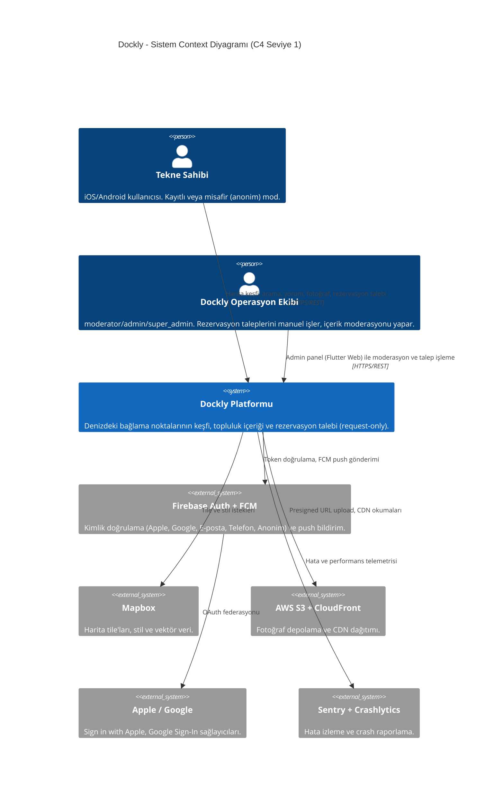
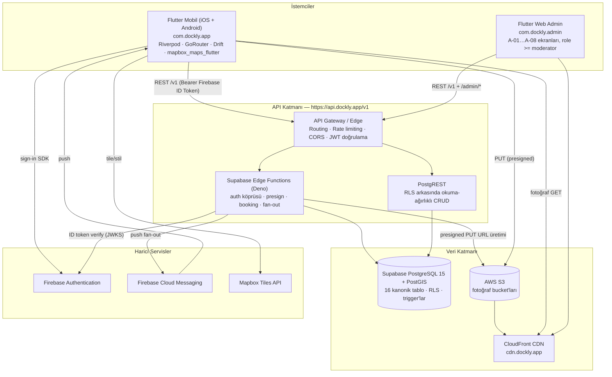
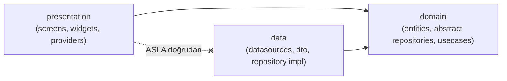
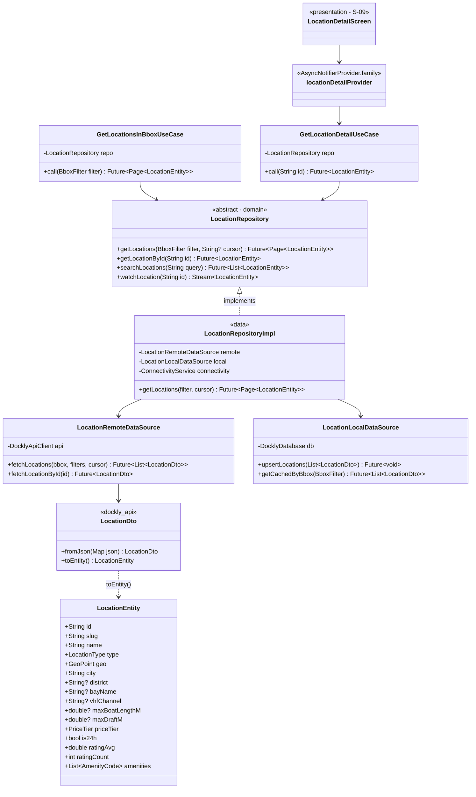
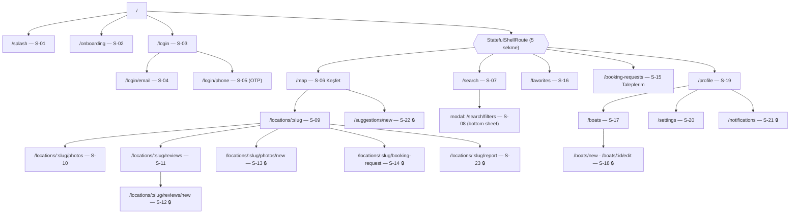
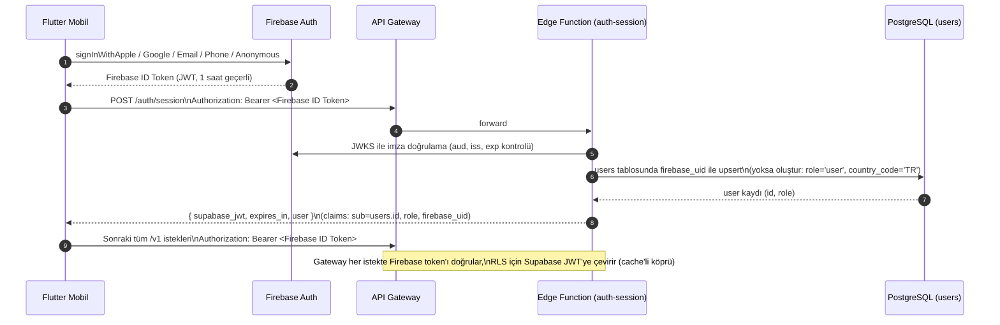
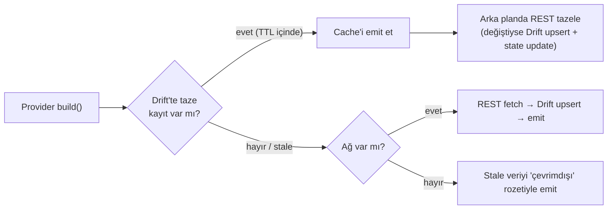
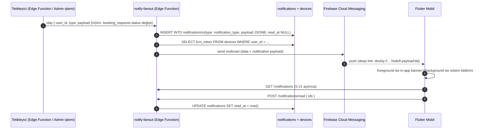

# Dockly — Teknik Mimari Dokümanı

> **Doküman No:** 02 · **Durum:** Onaylı · **Bağlı olduğu kaynak:** [`00-foundation.md`](./00-foundation.md)
> Bu doküman, foundation dokümanındaki adlandırmaları **birebir** kullanır. Çelişki durumunda foundation geçerlidir.

---

## İçindekiler

1. [Amaç ve Kapsam](#1-amaç-ve-kapsam)
2. [Yüksek Seviye Sistem Mimarisi](#2-yüksek-seviye-sistem-mimarisi)
3. [Clean Architecture + Feature-First](#3-clean-architecture--feature-first)
4. [Riverpod State Yönetimi Stratejisi](#4-riverpod-state-yönetimi-stratejisi)
5. [GoRouter Navigasyon Mimarisi](#5-gorouter-navigasyon-mimarisi)
6. [Auth Akışı Mimarisi](#6-auth-akışı-mimarisi)
7. [Offline-First Cache Mimarisi (Drift)](#7-offline-first-cache-mimarisi-drift)
8. [Fotoğraf Yükleme Mimarisi](#8-fotoğraf-yükleme-mimarisi)
9. [Bildirim Mimarisi](#9-bildirim-mimarisi)
10. [Modülerlik Sözleşmesi — Teknik Uygulama](#10-modülerlik-sözleşmesi--teknik-uygulama)
11. [Teknoloji Seçim Gerekçeleri](#11-teknoloji-seçim-gerekçeleri)

---

## 1. Amaç ve Kapsam

Bu doküman Dockly v1'in uçtan uca teknik mimarisini tanımlar: istemciler (Flutter mobil + Flutter Web admin), backend (Supabase + Edge Functions), kimlik (Firebase Authentication), medya (AWS S3 + CloudFront), harita (Mapbox) ve bunların arasındaki tüm akışlar.

**Kapsam dışı (v1 Hard Exclusions — foundation §1):** Yapay zekâ, rota planlama, hava durumu, AIS, Garmin entegrasyonu, marina yönetim paneli, marina hesabı, online ödeme, canlı müsaitlik, gerçek (onaylı) rezervasyon. v1 = **Keşif + Topluluk + Rezervasyon Talebi (request-only)**.

---

## 2. Yüksek Seviye Sistem Mimarisi

### 2.1 C4 — Context Diyagramı



### 2.2 C4 — Container Diyagramı



### 2.3 Bileşen Sorumluluk Özeti

| Bileşen | Sorumluluk | Sorumlu OLMADIĞI |
|---|---|---|
| Flutter Mobil | UI, offline cache (Drift), harita render, form validasyonu | İş kuralı doğrulama (server tekrarlar), yetkilendirme kararı |
| Flutter Web Admin | Moderasyon, lokasyon CRUD, talep işleme (A-01…A-08) | Son kullanıcı akışları |
| API Gateway | Routing, rate limit, CORS, kaba JWT kontrolü | İş mantığı |
| Edge Functions | Auth köprüsü, presign, yazma iş kuralları, fan-out | Basit okuma CRUD (PostgREST'in işi) |
| PostgREST | RLS arkasında filtreli okuma ve basit CRUD | Çok adımlı transaction'lar |
| PostgreSQL + PostGIS | Veri bütünlüğü, geo sorgular, trigger'lar, RLS | Dosya depolama |
| S3 + CloudFront | Fotoğraf byte'ları ve dağıtımı | Metadata (`photos` tablosunda) |

---

## 3. Clean Architecture + Feature-First

### 3.1 Katmanlar ve Bağımlılık Kuralı

Her feature (`auth`, `onboarding`, `boats`, `map`, `search`, `locations`, `booking`, `reviews`, `favorites`, `notifications`, `profile`, `settings`) üç katmandan oluşur:

```
features/<feature>/
├── data/           # datasources, repositories impl, dto
├── domain/         # entities, repositories abstract, usecases
└── presentation/   # screens, widgets, providers
```

**Bağımlılık kuralı (Dependency Rule):** Bağımlılık okları **her zaman içeri**, yani `domain`'e doğru akar.



- `domain` **hiçbir şeye** bağımlı değildir (yalnızca `dockly_core`'a — saf Dart).
- `data`, `domain`'deki abstract repository'yi **implement eder**; DTO ↔ entity dönüşümü burada yapılır.
- `presentation`, yalnızca `domain` usecases/entities ve Riverpod provider'ları görür. Provider, DI ile `data`'daki implementasyonu `domain` arayüzüne bağlar.
- Flutter import'u (`package:flutter/...`) yalnızca `presentation`'da serbesttir; `domain` ve `data` saf Dart kalır.

### 3.2 Örnek Feature Sınıf Diyagramı — `locations`



### 3.3 Feature'lar Arası İzolasyon

- Bir feature başka bir feature'ı **import edemez** (detay: `03-klasor-yapisi.md` §import kuralları).
- Ortak ihtiyaçlar `packages/dockly_core` (domain modelleri, hata tipleri, utils), `packages/dockly_api` (API client, DTO), `packages/dockly_ui` (design system) üzerinden karşılanır.
- Feature'lar arası iletişim yalnızca: (a) GoRouter navigasyonu, (b) `dockly_core`'daki paylaşılan entity'ler, (c) core-level provider'lar (örn. auth state) üzerinden olur.

---

## 4. Riverpod State Yönetimi Stratejisi

Stack: `hooks_riverpod` + `riverpod_generator` (`@riverpod` annotation, code-gen).

### 4.1 Provider Tipleri ve Kullanım Haritası

| Provider tipi | Kullanım | Örnek |
|---|---|---|
| `Provider` | Saf DI: repository, usecase, servis bağlama | `locationRepositoryProvider` |
| `AsyncNotifierProvider` | Sunucu verisi + mutasyon (yaz/oku yaşam döngüsü) | `myBoatsProvider`, `bookingRequestsProvider` |
| `AsyncNotifierProvider.family` | Parametreli sunucu verisi | `locationDetailProvider(locationId)` |
| `NotifierProvider` | Senkron UI/istemci durumu | `mapFilterProvider`, `themeModeProvider` |
| `StreamProvider` | Gerçek zamanlı/reaktif akışlar | `authStateProvider` (Firebase `idTokenChanges`), Drift `watch` sorguları |
| `FutureProvider` | Tek seferlik, mutasyonsuz okumalar | `appSettingsProvider` (feature flag'ler) |

**Kural:** `StateProvider` ve `ChangeNotifierProvider` kullanılmaz; her şey code-gen (`@riverpod`) üzerinden tanımlanır. Global mutable singleton yasaktır.

### 4.2 AsyncValue Kullanımı

Tüm sunucu kaynaklı state `AsyncValue<T>` olarak açığa çıkar; ekranlar üç durumu **her zaman** ele alır:

```dart
ref.watch(locationDetailProvider(id)).when(
  data: (location) => LocationDetailBody(location: location),
  loading: () => const LocationDetailSkeleton(),
  error: (e, st) => DocklyErrorView(error: e, onRetry: () =>
      ref.invalidate(locationDetailProvider(id))),
);
```

Standartlar:
- **Skeleton-first:** `loading` durumunda spinner değil, `dockly_ui`'daki skeleton widget'ları.
- **`AsyncValue.guard`:** Notifier mutasyonlarında try/catch yerine `state = await AsyncValue.guard(...)`.
- **Optimistic update:** `favorites` gibi hafif mutasyonlarda önce local state güncellenir, hata halinde geri alınır (`PUT/DELETE /favorites/{locationId}`).
- **`skipLoadingOnRefresh: true` davranışı:** Pull-to-refresh'te eski veri ekranda kalır (stale-while-revalidate hissi).

### 4.3 Caching ve Invalidation Stratejisi

| Mekanizma | Kullanım |
|---|---|
| `ref.keepAlive()` + zamanlayıcı | Bbox sorguları ve detaylar için 5 dk in-memory TTL; timer dolunca `link.close()` |
| `ref.invalidate(provider)` | Mutasyon sonrası ilgili listeyi tazeleme (örn. yorum yazınca `locationReviewsProvider(id)`) |
| `ref.listen(authStateProvider, ...)` | Logout'ta kullanıcıya özel tüm provider'ların invalidation'ı |
| Drift katmanı (bkz. §7) | Kalıcı cache; provider'lar önce Drift'ten okur, arka planda ağı tazeler |

Katmanlı okuma sırası: **in-memory (Riverpod) → Drift (SQLite) → REST**. Provider `build()` içinde önce local datasource'tan emit eder, ardından remote sonucu geldiğinde state'i günceller (stale-while-revalidate).

---

## 5. GoRouter Navigasyon Mimarisi

### 5.1 Route Ağacı

`StatefulShellRoute.indexedStack` ile 5 sekmeli alt navigasyon (foundation §8): **Keşfet (harita) · Arama · Favoriler · Taleplerim · Profil**.



🔒 = auth guard (misafir kullanıcı yönlendirilir).

### 5.2 Deep Link Şeması

| Link | Hedef |
|---|---|
| `https://dockly.app/l/{slug}` | S-09 Lokasyon Detay (`/locations/:slug`) |
| `https://dockly.app/r/{id}` | S-15 Talep detayı (bildirimden, `booking_status`) |
| `dockly://locations/{slug}` | Custom scheme fallback |

Deep link'ler App Links (Android) / Universal Links (iOS) ile açılır; GoRouter `initialLocation`'a değil, mevcut stack üzerine `push` edilir. Soğuk başlangıçta link, splash → auth kontrolü sonrası `redirect` zinciriyle hedefe taşınır.

### 5.3 Guard'lar ve Misafir Mod Yönlendirmeleri

Global `redirect` fonksiyonu, `authStateProvider`'ı dinleyen bir `Listenable` (`refreshListenable`) ile senkron çalışır:

| Guard | Kural |
|---|---|
| `onboardingGuard` | İlk açılışta `/onboarding`'e; tamamlandıysa atla (`app_settings` yerel bayrağı) |
| `authGuard` | 🔒 route'larda: misafir (Firebase anonymous) veya oturumsuz kullanıcı → `AuthPromptSheet` (bottom sheet) → `/login?next=<hedef>` |
| `adminGuard` (admin_web) | `role >= moderator` değilse `/admin/login`; `/admin/*` tamamı korumalı |

**Misafir mod ilkesi:** Keşif serbesttir — S-06 harita, S-07 arama, S-09 detay, S-10 galeri, S-11 yorum okuma misafire açıktır. Yazma eylemleri (yorum S-12, fotoğraf S-13, talep S-14, favori S-16'ya ekleme, öneri S-22, rapor S-23, tekne S-17/S-18) `authGuard` ile korunur. Giriş sonrası `next` query parametresi ile kullanıcı kaldığı yere döner; Firebase anonim hesap `linkWithCredential` ile kalıcı hesaba yükseltilir (favoriler kaybolmaz).

---

## 6. Auth Akışı Mimarisi

### 6.1 Firebase → Supabase JWT Köprüsü

Kimlik sağlayıcı **Firebase Authentication**'dır (Apple, Google, E-posta, Telefon, Anonim/Misafir). Supabase RLS ise Supabase JWT bekler; köprü `POST /auth/session` Edge Function'ı ile kurulur.



### 6.2 Token Yenileme

- Firebase ID Token ~1 saat geçerlidir; Firebase SDK otomatik yeniler (`idTokenChanges` stream'i → `authStateProvider`).
- API client (Dio, `dockly_api`) interceptor'ı: her istekte güncel token'ı ekler; `401` yanıtında `getIdToken(true)` ile force-refresh yapar ve isteği **bir kez** tekrarlar; ikinci `401`'de oturum düşürülür → `/login`.
- Supabase JWT köprüsü Edge tarafında kısa TTL cache ile tutulur (aynı Firebase token için tekrar doğrulama yapılmaz).
- Anonim → kalıcı hesap yükseltmede `firebase_uid` değişmez (`linkWithCredential`), `users` satırı korunur.

### 6.3 Rol Modeli

`user_role`: `user`, `moderator`, `admin`, `super_admin` (foundation §4). Rol, Supabase JWT claim'ine yazılır; RLS politikaları ve `/admin/*` yetki katmanı bu claim'i okur. Rol değişikliği yalnızca `super_admin` tarafından yapılır ve `audit_logs`'a düşer (detay: `11-backend-mimarisi.md`).

---

## 7. Offline-First Cache Mimarisi (Drift)

### 7.1 Ne Cache'lenir?

Drift (SQLite) şeması, sunucu tablolarının **okuma amaçlı yansımasıdır**:

| Drift tablosu | Kaynak | TTL / Invalidation |
|---|---|---|
| `cached_locations` | `GET /locations` (bbox) + `GET /locations/{id}` | 24 saat; bbox sorgusunda stale-while-revalidate |
| `cached_location_amenities` | detay yanıtındaki amenity listesi | Lokasyonla birlikte |
| `cached_reviews` | `GET /locations/{id}/reviews` ilk sayfa | 1 saat |
| `cached_favorites` | `GET /favorites` | Mutasyonda anında; login'de full sync |
| `cached_boats` | `GET /boats` | Mutasyonda anında |
| `cached_booking_requests` | `GET /booking-requests` | 15 dk + push (`booking_status`) ile invalidate |
| `recently_viewed_local` | Yerel üretilir, `POST /recently-viewed` ile senkron | Kalıcı (son 50) |
| `pending_mutations` | Offline yazma kuyruğu (outbox) | İşlenince silinir |
| `kv_meta` | Sync cursor'ları, son fetch zamanları, onboarding bayrağı | — |

**Cache'lenmeyenler:** `notifications` (her zaman taze), arama sonuçları (yalnızca in-memory), admin verileri.

### 7.2 Invalidation Stratejisi



- **Yazma yolu:** Online ise doğrudan REST → başarıda Drift güncelle. Offline ise `pending_mutations` outbox'ına yaz (yalnızca düşük riskli mutasyonlar: favori ekle/çıkar, recently-viewed). Rezervasyon talebi (S-14) offline **gönderilemez** — kullanıcıya açık hata gösterilir (idempotency ve tarih doğruluğu nedeniyle).
- **Soft delete uyumu:** Sunucudan `deleted_at` dolu gelen kayıtlar Drift'ten fiziksel silinir.
- **Login/logout:** Logout'ta kullanıcıya özel tablolar (`cached_favorites`, `cached_boats`, `cached_booking_requests`, `pending_mutations`) temizlenir; `cached_locations` misafir için de geçerli olduğundan korunur.

### 7.3 Harita Tile Cache

- `mapbox_maps_flutter`'ın yerleşik **TileStore / OfflineManager** mekanizması kullanılır; Dockly ayrı tile cache yazmaz.
- Varsayılan ambient cache: 50 MB (ayarlardan temizlenebilir — S-20).
- v1'de bölge indirme (offline region download) **yoktur**; foundation hard exclusion'larıyla uyumlu şekilde yalnızca gezinilen tile'ların ambient cache'i tutulur.
- Lokasyon pin verisi tile'dan bağımsızdır: `cached_locations` sayesinde harita çevrimdışıyken bile son görülen bbox'taki pin'ler ve detaylar açılabilir.
- Fotoğraflar `cached_network_image` ile disk cache'lenir (CloudFront URL'leri, max 200 MB, LRU).

---

## 8. Fotoğraf Yükleme Mimarisi

### 8.1 Presigned URL Akışı

```mermaid
sequenceDiagram
  autonumber
  participant App as Flutter Mobil (S-13)
  participant GW as API Gateway
  participant EF as Edge Function (photos)
  participant S3 as AWS S3
  participant CF as CloudFront
  participant Admin as Admin Web (A-04)

  App->>App: 1. Client-side compress\n(max 2048px, JPEG q80, EXIF GPS strip)
  App->>GW: POST /photos/presign\n{ owner_type: "location", owner_id, content_type, byte_size }
  GW->>EF: forward (auth + rate limit: 20/saat/kullanıcı)
  EF->>EF: boyut (<10MB) ve MIME (image/jpeg|png|webp) doğrula
  EF->>S3: presigned PUT üret (5 dk geçerli)
  EF-->>App: { upload_url, s3_key, photo_id }
  App->>S3: PUT <upload_url> (binary, retry 3x)
  App->>GW: POST /photos/complete { photo_id }
  GW->>EF: forward
  EF->>EF: S3 HeadObject ile varlık + boyut doğrula
  EF->>EF: photos tablosuna kayıt:\nstatus = 'pending' (moderation_status)
  EF-->>App: { photo: { id, status: "pending" } }
  Note over App: Kullanıcı kendi fotoğrafını "onay bekliyor"\nrozetiyle görür; başkaları görmez (RLS)
  Admin->>GW: A-04 Fotoğraf moderasyon: approve/reject
  GW->>EF: PATCH /admin/photos/{id}
  EF->>EF: status = 'approved' → herkese görünür\n+ new_photo bildirimi (favori kullanıcılara)
  App->>CF: onaylı fotoğraf GET (cdn.dockly.app)
```

### 8.2 Kurallar

- **Client-side compress zorunlu:** uzun kenar 2048px, JPEG kalite 80, hedef < 1.5 MB; EXIF'ten GPS ve kişisel metadata temizlenir (lokasyon fotoğrafında konum zaten `locations.geo`'dan bellidir).
- **S3 key şeması** `11-backend-mimarisi.md` §S3'te tanımlıdır (`photos/locations/{id}/...`, `photos/boats/{id}/...`); istemci key üretmez, Edge Function üretir.
- **Moderation kuyruğu:** Her yeni fotoğraf `moderation_status = 'pending'` doğar; `approved` olana dek yalnızca sahibi ve moderatörler görür (RLS). `rejected` fotoğrafın S3 objesi 30 gün sonra lifecycle ile silinir.
- **Yarım kalan upload:** `presign` alınıp `complete` çağrılmayan kayıtlar background job ile 24 saat sonra temizlenir.
- Thumbnail üretimi v1'de **istemci tarafında** ek bir küçük varyant (512px) yüklenerek çözülür; sunucu tarafı image pipeline v2 konusudur.

---

## 9. Bildirim Mimarisi

İki kanal birlikte çalışır: **FCM push** (anlık) + **`notifications` tablosu** (kalıcı, S-21 ekranının kaynağı). Push kaçsa bile kayıt uygulama içinde durur.



### 9.1 `notification_type` Eşlemesi (foundation §4)

| Tip | Tetikleyici | Deep link hedefi |
|---|---|---|
| `booking_status` | `booking_requests.status` geçişi (`pending → contacted → confirmed / cancelled / expired`) | S-15 talep detayı |
| `new_photo` | Favori lokasyona `approved` fotoğraf eklenmesi | S-10 galeri |
| `new_review` | Favori lokasyona `approved` yorum | S-11 yorumlar |
| `favorite_update` | Favori lokasyonun kritik alan güncellemesi (admin edit) | S-09 detay |
| `system` | Operasyon duyuruları (admin panelden) | Uygulama içi |

### 9.2 Cihaz Yönetimi

- `PUT /devices`: FCM token upsert (cihaz başına tek kayıt; `user_id + device_id` benzersiz).
- Token rotasyonu `onTokenRefresh` ile yakalanır ve tekrar `PUT /devices` çağrılır.
- FCM `UNREGISTERED` hatası dönen token'lar fan-out sırasında `devices`'tan silinir.
- Bildirim tercihleri S-20 Ayarlar'da tip bazında tutulur; fan-out göndermeden önce tercihi kontrol eder.

---

## 10. Modülerlik Sözleşmesi — Teknik Uygulama

Foundation §9'daki gelecek modüllerin **kod yeniden yazılmadan** eklenmesini sağlayan üç mekanizma:

### 10.1 MapLayer Plugin Arayüzü

Harita ekranı (S-06), sabit kodlanmış katmanlar yerine kayıtlı `MapLayer` listesini render eder:

```dart
// packages/dockly_core/lib/src/map/map_layer.dart
abstract class MapLayer {
  String get id;                      // 'locations', 'weather', 'ais', 'route'
  String get featureFlagKey;          // app_settings key'i, örn. 'map_layer_weather'
  Future<void> attach(MapController controller, Ref ref);
  Future<void> detach(MapController controller);
  Widget? buildLegend(BuildContext context);
}
```

- v1'de tek implementasyon: `LocationsMapLayer` (9 `location_type` ikonunun cluster'lı pin katmanı, foundation §7 ikon renkleriyle).
- Hava durumu / AIS / Rota / Garmin (v2+) birer `MapLayer` implementasyonu olarak eklenir; `map` feature'ının koduna dokunulmaz, yalnızca registry'ye kayıt yapılır.

### 10.2 Feature Flag'ler (`app_settings`)

- `app_settings` tablosu (`key`, `value JSONB`) uzaktan yapılandırmanın kaynağıdır; uygulama açılışta `appSettingsProvider` (FutureProvider) ile çeker, Drift `kv_meta`'da cache'ler.
- Konvansiyon: `feature_<modül>` (örn. `feature_payments`), `map_layer_<id>`, `min_supported_version`.
- Flag kapalıysa route guard ilgili ekranı gizler, provider registry ilgili modülü hiç başlatmaz. Böylece yeni modül üretime **karanlık (dark launch)** çıkabilir.

### 10.3 Repository Abstraction ile Genişleme

| Gelecek modül (foundation §9) | v1 hazırlığı — teknik karşılık |
|---|---|
| Canlı rezervasyon | `booking_requests.status` enum'u genişletilebilir; `BookingRepository` arayüzü `availability` sorgularını ekleyecek şekilde versiyonlanır; API `/v1` sabit kalır, `/v2` açılır |
| Online ödeme | `payments` modülü için domain arayüzü boş bırakıldı; tüm para alanları `NUMERIC + currency_code` |
| Hava durumu / AIS / Rota / Garmin | §10.1 MapLayer plugin mimarisi |
| Avrupa / Global | Tüm içerik tablolarında `country_code`; i18n altyapısı (TR+EN hazır, `core/l10n`); ölçüler metrik + birim alanı |
| Marina paneli | `user_role` genişletilebilir; RLS politikaları role-bazlı yazıldı; admin_web shell'i yeni rol için yeni route grubu alır |

---

## 11. Teknoloji Seçim Gerekçeleri

### 11.1 Neden Supabase? (Backend)

| Kriter | **Supabase** ✅ | Firebase (Firestore) | Custom (Node/Go + RDS) |
|---|---|---|---|
| Coğrafi sorgu (bbox, mesafe) | **PostGIS — birinci sınıf** (`geography(Point,4326)`, GIST) | Geohash hack'leri, sınırlı | Mümkün ama tüm altyapı elle |
| İlişkisel model (16 tablo, N-N, FK) | Native SQL, constraint, trigger | Denormalizasyon zorunlu | Native ama yüksek maliyet |
| RLS / satır bazlı güvenlik | Yerleşik, SQL politikaları | Security Rules (ayrı dil) | Elle yazılır |
| Hazır REST + Edge Functions | PostgREST + Deno EF | Cloud Functions | Tümü elle |
| Vendor lock-in | Düşük (standart Postgres, self-host mümkün) | Yüksek | Yok ama ops yükü büyük |
| Maliyet (v1 ölçeği) | Öngörülebilir, düşük | Okuma başına ücret, harita pan'inde patlar | Sunucu + DevOps maliyeti |

**Karar:** Dockly'nin çekirdeği coğrafi-ilişkisel veridir (bbox sorguları, amenity N-N, rating cache trigger'ları). PostGIS bu işin endüstri standardıdır → **Supabase**. Firebase yalnızca en iyi olduğu iki alanda kalır: **Auth** ve **FCM**.

### 11.2 Neden Mapbox? (Harita)

| Kriter | **Mapbox** ✅ | Google Maps | OpenStreetMap (flutter_map) |
|---|---|---|---|
| Denizcilik görünümüne uygun stil özelleştirme | **Tam stil kontrolü** (Studio), koy/deniz odaklı özel stil | Sınırlı stil | Serbest ama tile altyapısı sende |
| Flutter SDK olgunluğu | `mapbox_maps_flutter` resmi, vektör, Metal/GL | `google_maps_flutter` olgun ama stil kısıtlı | Raster ağırlıklı, performans sınırı |
| Offline/ambient tile cache | Yerleşik TileStore | Kısıtlı | Elle |
| Custom pin/cluster (9 location_type ikonu) | Vektör katmanı ile yüksek performans | Marker sınırlı ölçeklenir | Orta |
| Maliyet | Aylık ücretsiz kota + öngörülebilir | Yüksek (SKU bazlı) | Ücretsiz ama barındırma maliyeti |

**Karar:** "Denizcinin her gün açtığı harita uygulaması" konumlandırması (foundation §1) özel harita stili ve akıcı vektör render gerektirir → **Mapbox**.

### 11.3 Neden Riverpod? (State)

| Kriter | **Riverpod** ✅ | Bloc | GetX | Provider |
|---|---|---|---|---|
| Compile-time güvenlik | code-gen ile tam | İyi | Zayıf (runtime DI) | Orta |
| DI + state tek modelde | Evet (Provider = DI) | Ayrı (get_it gerekir) | Karışık | Kısıtlı |
| Async yaşam döngüsü | `AsyncValue`, `family`, auto-dispose yerleşik | Elle state sınıfları | Elle | Elle |
| Test edilebilirlik | `ProviderContainer` + override, widget ağaçsız test | İyi ama törensel | Zayıf | Orta |
| Clean Architecture uyumu | Katman bağlama doğal (§3) | İyi | Anti-pattern'e açık | Orta |
| Boilerplate | Düşük (`@riverpod`) | Yüksek (event/state sınıfları) | Düşük ama disiplinsiz | Orta |

**Karar:** Feature-first + Clean Architecture'da her katmanın DI ile bağlanması ve sunucu verisinin `AsyncValue` yaşam döngüsüyle yönetilmesi gerekir; bunu tek pakette, en az törenle sağlayan **Riverpod**'dur (foundation §2: `hooks_riverpod` + `riverpod_generator`).

### 11.4 Diğer Kanonik Seçimlerin Kısa Gerekçesi

| Seçim | Gerekçe |
|---|---|
| **Firebase Auth** | Apple/Google/E-posta/Telefon/Anonim'i tek SDK'da, OTP altyapısı hazır; Supabase Auth'un telefon+anonim kombinasyonu TR pazarında daha zayıf. Köprü maliyeti (§6) kabul edilebilir. |
| **FCM** | iOS+Android tek push altyapısı, Firebase Auth ile aynı proje; ücretsiz. |
| **S3 + CloudFront** | Supabase Storage yerine: presigned URL esnekliği, lifecycle kuralları, TR kullanıcılarına yakın edge POP'lar, medya maliyet kontrolü. |
| **Drift** | Tip güvenli SQL, `watch()` ile reaktif sorgular (Riverpod `StreamProvider` ile doğal entegrasyon), migration desteği; Hive/Isar'a göre ilişkisel cache'e daha uygun. |
| **GoRouter** | Deep link + guard + `StatefulShellRoute` resmi destekli; Navigator 2.0 karmaşası olmadan bildirim ve Universal Link hedefleme (§5). |
| **Docker** | Edge Function'ların lokal geliştirme paritesi ve admin web build/deploy tekrarlanabilirliği (foundation §2). |

---

## Ek: Mimari Karar Kayıtları (ADR) Dizini

| ADR | Karar | Bölüm |
|---|---|---|
| ADR-001 | Backend: Supabase (PostGIS zorunluluğu) | §11.1 |
| ADR-002 | Kimlik: Firebase Auth + Supabase JWT köprüsü | §6, §11.4 |
| ADR-003 | Harita: Mapbox + MapLayer plugin mimarisi | §10.1, §11.2 |
| ADR-004 | State: Riverpod code-gen, StateProvider yasağı | §4, §11.3 |
| ADR-005 | Offline: Drift yansıma tabloları + outbox; talep formu offline gönderilemez | §7 |
| ADR-006 | Medya: S3 presigned + client-side compress + moderation-first görünürlük | §8 |
| ADR-007 | Bildirim: FCM + `notifications` tablosu çift kanal | §9 |

> Sonraki dokümanlar: klasör yapısı için `03-klasor-yapisi.md`, backend detayı için `11-backend-mimarisi.md`.
