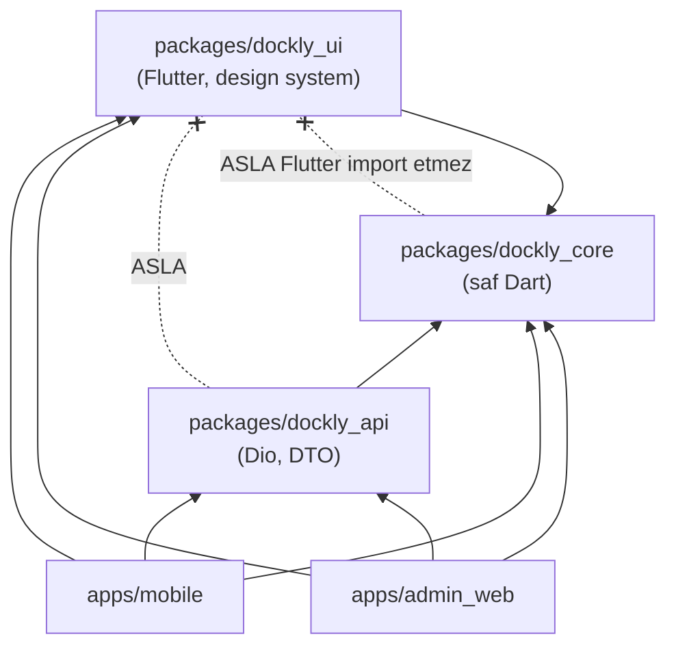
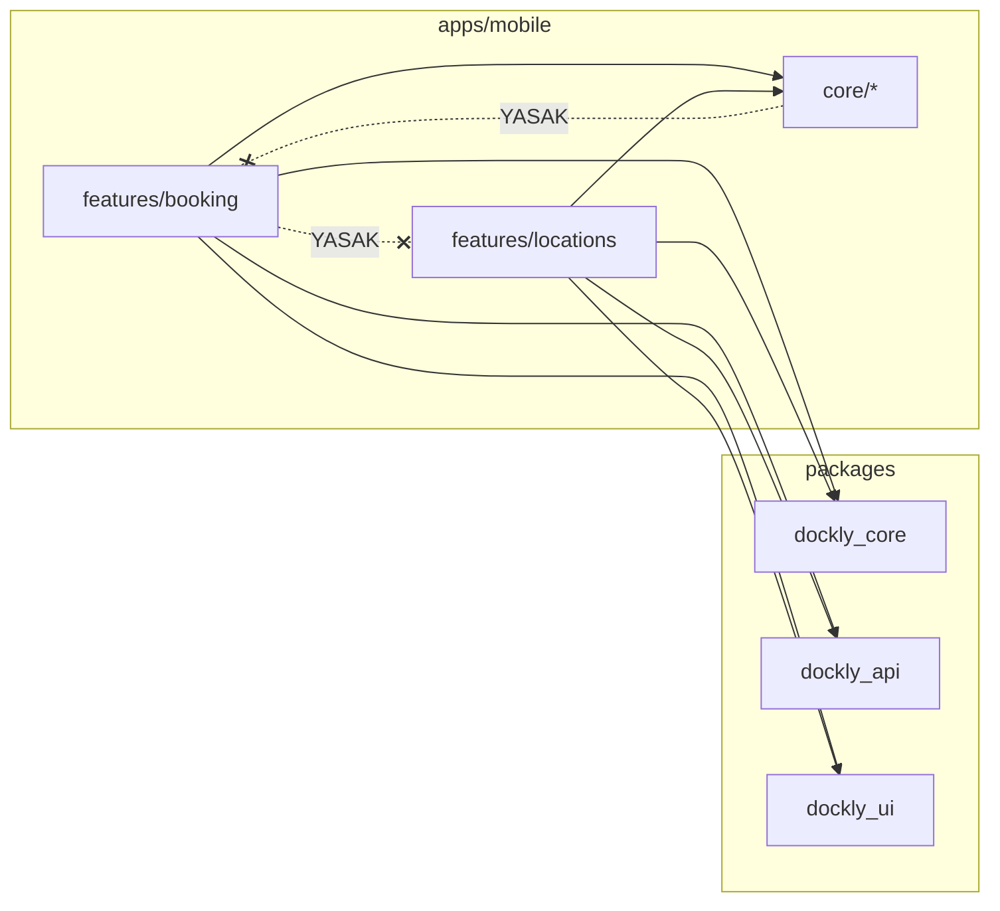

# Dockly — Klasör Yapısı

> **Doküman No:** 03 · **Durum:** Onaylı · **Bağlı olduğu kaynak:** [`00-foundation.md`](./00-foundation.md) (§3 Monorepo yapısı)
> Mimari bağlam için: [`02-teknik-mimari.md`](./02-teknik-mimari.md). Adlandırmalar foundation ile **birebir** tutarlıdır.

---

## İçindekiler

1. [Monorepo Üst Seviye](#1-monorepo-üst-seviye)
2. [apps/mobile — Tam Ağaç](#2-appsmobile--tam-ağaç)
3. [packages/ İç Yapıları](#3-packages-iç-yapıları)
4. [supabase/ Yapısı ve Migration Kuralları](#4-supabase-yapısı-ve-migration-kuralları)
5. [apps/admin_web Yapısı](#5-appsadmin_web-yapısı)
6. [Test Klasör Yapısı](#6-test-klasör-yapısı)
7. [Import Kuralları](#7-import-kuralları)
8. [Dosya Adlandırma Konvansiyonları](#8-dosya-adlandırma-konvansiyonları)
9. [Klasör Sorumluluk Matrisi — "Ne Konur / Ne Konmaz"](#9-klasör-sorumluluk-matrisi)

---

## 1. Monorepo Üst Seviye

Foundation §3'teki kanonik yapı:

```
dockly/
├── apps/
│   ├── mobile/            # Flutter mobil uygulama (com.dockly.app)
│   └── admin_web/         # Flutter Web admin paneli (com.dockly.admin)
├── packages/
│   ├── dockly_core/       # ortak domain modelleri, hata tipleri, utils
│   ├── dockly_api/        # API client (REST), DTO'lar
│   └── dockly_ui/         # design system, tema, ortak widget'lar
├── supabase/
│   ├── migrations/        # SQL migration'lar (sıralı, versiyonlu)
│   ├── functions/         # Edge Functions
│   └── seed/              # seed verisi
├── docs/                  # bu dokümantasyon (00-foundation.md … 20-mvp-gelistirme-plani.md)
├── .github/workflows/     # CI/CD (GitHub Actions)
├── melos.yaml             # monorepo paket yönetimi
├── analysis_options.yaml  # kök lint kuralları (tüm paketler devralır)
└── README.md
```

### Paket Bağımlılık Grafiği



Kurallar: `dockly_core` hiçbir iç pakete bağımlı değildir ve **Flutter import etmez**. `dockly_api` yalnızca `dockly_core`'a bağlıdır. `dockly_ui` yalnızca `dockly_core`'a bağlıdır. Uygulamalar üç paketi de kullanır. `api ↔ ui` arasında bağımlılık yasaktır.

---

## 2. apps/mobile — Tam Ağaç

Feature listesi foundation §3'ten: `auth`, `onboarding`, `boats`, `map`, `search`, `locations`, `booking`, `reviews`, `favorites`, `notifications`, `profile`, `settings`. Core alt modülleri: `router`, `theme`, `network`, `storage`, `analytics`, `l10n`.

```
apps/mobile/
├── android/                          # platform projesi (Gradle, google-services.json ortam bazlı)
├── ios/                              # platform projesi (Xcode, GoogleService-Info.plist ortam bazlı)
├── assets/
│   ├── images/                       # statik görseller (onboarding illüstrasyonları)
│   ├── icons/                        # harita pin SVG'leri (9 location_type ikonu)
│   └── map_styles/                   # Mapbox stil referansları
├── lib/
│   ├── main_dev.dart                 # entry point — dev ortamı
│   ├── main_staging.dart             # entry point — staging ortamı
│   ├── main_prod.dart                # entry point — prod ortamı
│   ├── app.dart                      # DocklyApp widget (MaterialApp.router + ProviderScope)
│   ├── bootstrap.dart                # ortak başlatma: Firebase, Sentry, Drift, ProviderScope
│   │
│   ├── core/
│   │   ├── router/
│   │   │   ├── app_router.dart               # GoRouter tanımı, StatefulShellRoute (5 sekme)
│   │   │   ├── app_routes.dart               # route adı/path sabitleri (tek kaynak)
│   │   │   ├── guards/
│   │   │   │   ├── auth_guard.dart           # misafir → /login?next= yönlendirmesi
│   │   │   │   └── onboarding_guard.dart
│   │   │   └── deep_link_handler.dart        # dockly:// ve https://dockly.app/l/{slug}
│   │   ├── theme/
│   │   │   ├── app_theme.dart                # dockly_ui token'larından ThemeData üretimi
│   │   │   └── theme_mode_provider.dart      # light/dark/system (S-20)
│   │   ├── network/
│   │   │   ├── connectivity_service.dart     # online/offline stream
│   │   │   ├── connectivity_provider.dart
│   │   │   └── api_client_provider.dart      # dockly_api DocklyApiClient DI + token interceptor bağlama
│   │   ├── storage/
│   │   │   ├── database.dart                 # Drift DocklyDatabase tanımı
│   │   │   ├── database_provider.dart
│   │   │   ├── tables/
│   │   │   │   ├── cached_locations_table.dart
│   │   │   │   ├── cached_reviews_table.dart
│   │   │   │   ├── cached_favorites_table.dart
│   │   │   │   ├── cached_boats_table.dart
│   │   │   │   ├── cached_booking_requests_table.dart
│   │   │   │   ├── recently_viewed_local_table.dart
│   │   │   │   ├── pending_mutations_table.dart
│   │   │   │   └── kv_meta_table.dart
│   │   │   └── daos/                         # tablo başına DAO (locations_dao.dart ...)
│   │   ├── analytics/
│   │   │   ├── analytics_service.dart        # ekran/olay izleme arayüzü
│   │   │   └── crash_reporter.dart           # Sentry + Crashlytics köprüsü
│   │   └── l10n/
│   │       ├── app_tr.arb                    # birincil dil
│   │       ├── app_en.arb                    # global hazırlık (foundation §9)
│   │       └── l10n_provider.dart
│   │
│   └── features/
│       ├── auth/                             # S-03, S-04, S-05
│       │   ├── data/
│       │   │   ├── datasources/
│       │   │   │   ├── firebase_auth_datasource.dart    # Apple/Google/E-posta/Telefon/Anonim
│       │   │   │   └── session_remote_datasource.dart   # POST /auth/session (JWT köprüsü)
│       │   │   ├── dto/
│       │   │   │   └── session_dto.dart
│       │   │   └── repositories/
│       │   │       └── auth_repository_impl.dart
│       │   ├── domain/
│       │   │   ├── entities/
│       │   │   │   └── auth_session.dart
│       │   │   ├── repositories/
│       │   │   │   └── auth_repository.dart             # abstract
│       │   │   └── usecases/
│       │   │       ├── sign_in_with_apple_usecase.dart
│       │   │       ├── sign_in_with_google_usecase.dart
│       │   │       ├── sign_in_with_email_usecase.dart
│       │   │       ├── verify_phone_otp_usecase.dart
│       │   │       ├── continue_as_guest_usecase.dart
│       │   │       └── link_guest_account_usecase.dart
│       │   └── presentation/
│       │       ├── providers/
│       │       │   ├── auth_state_provider.dart          # StreamProvider (idTokenChanges)
│       │       │   └── sign_in_controller.dart           # AsyncNotifier
│       │       ├── screens/
│       │       │   ├── login_screen.dart                 # S-03
│       │       │   ├── email_auth_screen.dart            # S-04
│       │       │   └── phone_otp_screen.dart             # S-05
│       │       └── widgets/
│       │           ├── social_sign_in_buttons.dart
│       │           └── auth_prompt_sheet.dart            # misafir yazma eylemi bottom sheet'i
│       │
│       ├── onboarding/                       # S-02 (3 sayfa)
│       │   ├── data/…  domain/…
│       │   └── presentation/
│       │       ├── providers/onboarding_controller.dart
│       │       ├── screens/onboarding_screen.dart
│       │       └── widgets/onboarding_page_indicator.dart
│       │
│       ├── map/                              # S-06 Ana Sayfa — Harita + alt kart sistemi
│       │   ├── data/
│       │   │   ├── datasources/location_pins_remote_datasource.dart   # GET /locations (bbox)
│       │   │   ├── dto/                       # (DTO'lar dockly_api'den re-export edilmez; bkz. §7)
│       │   │   └── repositories/map_repository_impl.dart
│       │   ├── domain/
│       │   │   ├── entities/map_pin.dart
│       │   │   ├── repositories/map_repository.dart
│       │   │   └── usecases/get_pins_in_bbox_usecase.dart
│       │   └── presentation/
│       │       ├── providers/
│       │       │   ├── map_camera_provider.dart          # Notifier (senkron UI state)
│       │       │   ├── map_pins_provider.dart            # AsyncNotifier.family (bbox)
│       │       │   └── map_layer_registry_provider.dart  # MapLayer plugin kayıtları (02 §10.1)
│       │       ├── screens/map_screen.dart               # S-06
│       │       └── widgets/
│       │           ├── location_pin_marker.dart          # 9 location_type ikonu
│       │           ├── location_bottom_card.dart         # alt kart sistemi
│       │           └── map_cluster_layer.dart
│       │
│       ├── search/                           # S-07, S-08
│       │   ├── data/…  domain/…              # search_locations_usecase, apply_filters_usecase
│       │   └── presentation/
│       │       ├── providers/
│       │       │   ├── search_query_provider.dart
│       │       │   └── search_filters_provider.dart      # amenity + location_type + price_tier
│       │       ├── screens/search_screen.dart            # S-07
│       │       └── widgets/filters_bottom_sheet.dart     # S-08
│       │
│       ├── locations/                        # S-09, S-10
│       │   ├── data/
│       │   │   ├── datasources/
│       │   │   │   ├── location_remote_datasource.dart   # GET /locations/{id}
│       │   │   │   └── location_local_datasource.dart    # Drift cached_locations
│       │   │   └── repositories/location_repository_impl.dart
│       │   ├── domain/
│       │   │   ├── entities/                              # (LocationEntity dockly_core'dadır; feature'a özgü VO'lar burada)
│       │   │   ├── repositories/location_repository.dart
│       │   │   └── usecases/
│       │   │       ├── get_location_detail_usecase.dart
│       │   │       └── track_recently_viewed_usecase.dart # POST /recently-viewed
│       │   └── presentation/
│       │       ├── providers/location_detail_provider.dart
│       │       ├── screens/
│       │       │   ├── location_detail_screen.dart        # S-09
│       │       │   └── photo_gallery_screen.dart          # S-10
│       │       └── widgets/
│       │           ├── amenity_chips.dart                 # amenity kodları (foundation §4)
│       │           ├── location_header.dart               # rating_avg, price_tier, vhf_channel
│       │           └── location_action_bar.dart           # ara / talep / favori / yol tarifi
│       │
│       ├── booking/                          # S-14, S-15
│       │   ├── data/…  domain/
│       │   │   └── usecases/
│       │   │       ├── create_booking_request_usecase.dart
│       │   │       ├── cancel_booking_request_usecase.dart    # POST /booking-requests/{id}/cancel
│       │   │       └── get_my_booking_requests_usecase.dart
│       │   └── presentation/
│       │       ├── providers/booking_requests_provider.dart
│       │       ├── screens/
│       │       │   ├── booking_request_form_screen.dart   # S-14
│       │       │   └── my_requests_screen.dart            # S-15 (liste + detay)
│       │       └── widgets/booking_status_badge.dart      # booking_request_status renkleri
│       │
│       ├── reviews/                          # S-11, S-12, S-13, S-22, S-23 (community dahil)
│       │   ├── data/…  domain/
│       │   │   └── usecases/
│       │   │       ├── get_reviews_usecase.dart
│       │   │       ├── submit_review_usecase.dart
│       │   │       ├── upload_photo_usecase.dart          # presign → PUT → complete akışı
│       │   │       ├── suggest_location_usecase.dart      # POST /suggestions (suggestion_type)
│       │   │       └── report_location_usecase.dart       # POST /reports (report_reason)
│       │   └── presentation/
│       │       ├── providers/…
│       │       ├── screens/
│       │       │   ├── reviews_list_screen.dart           # S-11
│       │       │   ├── write_review_screen.dart           # S-12
│       │       │   ├── photo_upload_screen.dart           # S-13
│       │       │   ├── suggest_location_screen.dart       # S-22
│       │       │   └── report_location_screen.dart        # S-23
│       │       └── widgets/
│       │           ├── rating_stars_input.dart
│       │           └── moderation_pending_badge.dart      # moderation_status = pending rozeti
│       │
│       ├── favorites/                        # S-16
│       │   ├── data/…  domain/…              # toggle_favorite_usecase (optimistic)
│       │   └── presentation/
│       │       ├── providers/favorites_provider.dart
│       │       ├── screens/favorites_screen.dart
│       │       └── widgets/favorite_button.dart
│       │
│       ├── boats/                            # S-17, S-18
│       │   ├── data/…  domain/…              # boat_type, engine_type, is_primary kuralları
│       │   └── presentation/
│       │       ├── providers/my_boats_provider.dart
│       │       ├── screens/
│       │       │   ├── boat_list_screen.dart              # S-17
│       │       │   └── boat_edit_screen.dart              # S-18 (ekle/düzenle)
│       │       └── widgets/boat_type_selector.dart
│       │
│       ├── notifications/                    # S-21
│       │   ├── data/…  domain/…              # register_device_usecase (PUT /devices), mark_read_usecase
│       │   └── presentation/
│       │       ├── providers/notifications_provider.dart
│       │       ├── screens/notifications_screen.dart
│       │       └── widgets/notification_tile.dart         # notification_type ikon eşlemesi
│       │
│       ├── profile/                          # S-19
│       │   └── data/… domain/… presentation/…             # GET/PATCH /users/me
│       │
│       └── settings/                         # S-20
│           └── data/… domain/… presentation/…             # tema, dil, bildirim tercihleri, cache temizle
│
├── test/                                     # bkz. §6
├── pubspec.yaml
└── analysis_options.yaml                     # kökten devralır + feature import lint'i
```

> Yukarıda `data/… domain/…` kısaltması, ilgili feature'da aynı üçlü şablonun (datasources/dto/repositories · entities/repositories/usecases · providers/screens/widgets) uygulandığını gösterir. Şablon **her feature'da zorunludur**; boş katman klasörü `.gitkeep` ile tutulur.

---

## 3. packages/ İç Yapıları

### 3.1 packages/dockly_core — Saf Dart Çekirdek

```
packages/dockly_core/
├── lib/
│   ├── dockly_core.dart                  # public API (barrel export)
│   └── src/
│       ├── entities/                     # paylaşılan domain modelleri
│       │   ├── location_entity.dart
│       │   ├── boat_entity.dart
│       │   ├── user_entity.dart
│       │   ├── review_entity.dart
│       │   ├── booking_request_entity.dart
│       │   ├── photo_entity.dart
│       │   └── notification_entity.dart
│       ├── enums/                        # foundation §4 kanonik enum'lar — TEK tanım yeri
│       │   ├── location_type.dart        # 9 tip
│       │   ├── boat_type.dart
│       │   ├── engine_type.dart
│       │   ├── booking_request_status.dart
│       │   ├── price_tier.dart
│       │   ├── moderation_status.dart
│       │   ├── user_role.dart
│       │   ├── suggestion_type.dart
│       │   ├── report_reason.dart
│       │   ├── notification_type.dart
│       │   └── amenity_code.dart         # 15 amenity kodu
│       ├── errors/
│       │   ├── dockly_exception.dart     # sealed hata hiyerarşisi
│       │   ├── network_failure.dart
│       │   ├── auth_failure.dart
│       │   └── validation_failure.dart
│       ├── map/
│       │   └── map_layer.dart            # MapLayer plugin arayüzü (02 §10.1)
│       ├── value_objects/
│       │   ├── geo_point.dart
│       │   ├── bbox_filter.dart
│       │   └── page.dart                 # cursor-based sayfalama sarmalayıcısı
│       └── utils/
│           ├── result.dart               # Result<T, Failure>
│           ├── date_utils.dart
│           └── measurement.dart          # metrik + birim alanı (foundation §9 global hazırlık)
├── test/
└── pubspec.yaml                          # BAĞIMLILIK: yok (yalnızca dart sdk + meta)
```

### 3.2 packages/dockly_api — REST Client + DTO

```
packages/dockly_api/
├── lib/
│   ├── dockly_api.dart
│   └── src/
│       ├── client/
│       │   ├── dockly_api_client.dart    # Dio wrapper, base https://api.dockly.app/v1
│       │   ├── interceptors/
│       │   │   ├── auth_interceptor.dart       # Bearer Firebase ID Token + 401 retry
│       │   │   ├── idempotency_interceptor.dart # POST'lara Idempotency-Key header
│       │   │   └── logging_interceptor.dart
│       │   └── api_exception_mapper.dart # { "error": { code, message, details } } → DocklyException
│       ├── dto/                          # endpoint başına request/response DTO
│       │   ├── location_dto.dart
│       │   ├── review_dto.dart
│       │   ├── boat_dto.dart
│       │   ├── booking_request_dto.dart
│       │   ├── photo_presign_dto.dart
│       │   ├── suggestion_dto.dart
│       │   ├── report_dto.dart
│       │   ├── notification_dto.dart
│       │   ├── device_dto.dart
│       │   └── user_dto.dart
│       └── endpoints/                    # foundation §6 kaynak kökleri birebir
│           ├── auth_endpoints.dart        # POST /auth/session
│           ├── users_endpoints.dart       # GET/PATCH /users/me
│           ├── boats_endpoints.dart
│           ├── locations_endpoints.dart
│           ├── reviews_endpoints.dart
│           ├── photos_endpoints.dart      # /photos/presign, /photos/complete
│           ├── favorites_endpoints.dart
│           ├── recently_viewed_endpoints.dart
│           ├── booking_requests_endpoints.dart
│           ├── suggestions_endpoints.dart
│           ├── notifications_endpoints.dart
│           ├── reports_endpoints.dart
│           ├── devices_endpoints.dart
│           └── admin_endpoints.dart       # /admin/* (yalnızca admin_web kullanır)
├── test/
└── pubspec.yaml                          # BAĞIMLILIK: dockly_core, dio, json_serializable
```

### 3.3 packages/dockly_ui — Design System

```
packages/dockly_ui/
├── lib/
│   ├── dockly_ui.dart
│   └── src/
│       ├── tokens/                       # foundation §7 kanonik token'lar — TEK tanım yeri
│       │   ├── colors.dart               # brand.primary #0C7BDC, accent.turquoise #2EC4B6 ...
│       │   ├── typography.dart           # Display 32/700 … Micro 11/500 (SF Pro / Inter)
│       │   ├── radii.dart                # sm 12, md 16, lg 24, full 999
│       │   ├── spacing.dart              # 4pt grid (4/8/12/16/24/32)
│       │   ├── shadows.dart              # kart gölgesi y=8 blur=24 %8
│       │   └── map_marker_colors.dart    # location_type → renk (private_marina #0C7BDC ...)
│       ├── theme/
│       │   ├── dockly_theme_light.dart
│       │   └── dockly_theme_dark.dart
│       ├── components/
│       │   ├── buttons/  (dockly_button.dart, dockly_icon_button.dart)
│       │   ├── cards/    (dockly_card.dart, glass_card.dart)   # bg.glass, blur 20
│       │   ├── inputs/   (dockly_text_field.dart, dockly_search_bar.dart)
│       │   ├── feedback/ (dockly_snackbar.dart, dockly_error_view.dart, skeleton.dart)
│       │   ├── badges/   (rating_badge.dart, price_tier_badge.dart, status_badge.dart)
│       │   └── sheets/   (dockly_bottom_sheet.dart)
│       └── icons/
│           └── dockly_icons.dart         # ikon font/asset eşlemesi
├── example/                              # widgetbook / storybook önizleme uygulaması
├── test/                                 # golden testler
└── pubspec.yaml                          # BAĞIMLILIK: dockly_core, flutter
```

---

## 4. supabase/ Yapısı ve Migration Kuralları

```
supabase/
├── config.toml                           # supabase CLI proje yapılandırması
├── migrations/
│   ├── 0001_extensions.sql               # postgis, pg_trgm, pgcrypto
│   ├── 0002_enums.sql                    # foundation §4 tüm enum tipleri
│   ├── 0003_users.sql
│   ├── 0004_boats.sql
│   ├── 0005_locations.sql                # geography(Point,4326), GIST index
│   ├── 0006_amenities.sql                # + location_amenities köprü tablosu
│   ├── 0007_photos.sql
│   ├── 0008_reviews.sql                  # UNIQUE(location_id, user_id) WHERE deleted_at IS NULL
│   ├── 0009_favorites_recently_viewed.sql
│   ├── 0010_booking_requests.sql
│   ├── 0011_suggestions_reports.sql
│   ├── 0012_notifications_devices.sql
│   ├── 0013_audit_logs.sql               # aylık partition'a hazır
│   ├── 0014_app_settings.sql
│   ├── 0015_rls_policies.sql
│   ├── 0016_triggers.sql                 # updated_at, rating_avg, audit
│   └── 0017_indexes.sql                  # kanonik index'ler (foundation §5)
├── functions/
│   ├── _shared/                          # ortak Deno modülleri (firebase-verify, cors, errors)
│   ├── auth-session/index.ts             # POST /auth/session
│   ├── photos-presign/index.ts
│   ├── photos-complete/index.ts
│   ├── booking-requests/index.ts
│   ├── notify-fanout/index.ts
│   ├── suggestions/index.ts
│   ├── reports/index.ts
│   ├── devices/index.ts
│   ├── admin/index.ts                    # /admin/* alt router
│   └── jobs/                             # zamanlanmış işler (talep expiry, cleanup)
└── seed/
    ├── seed_amenities.sql                # 15 kanonik amenity
    ├── seed_app_settings.sql             # varsayılan feature flag'ler
    └── seed_locations_dev.sql            # yalnızca dev ortamı örnek verisi
```

### Migration Adlandırma Kuralı

**Format:** `NNNN_aciklama.sql`

- `NNNN`: 4 haneli, sıfır dolgulu, **kesinlikle sıralı** artan numara (`0001`, `0002`, …). Numara atlanmaz, geri alınmaz, yeniden kullanılmaz.
- `aciklama`: küçük harf, Türkçe karakter **kullanılmaz**, kelimeler `_` ile ayrılır, içeriği özetler (`0010_booking_requests.sql`).
- Bir migration **asla düzenlenmez**; düzeltme yeni migration ile yapılır (`0018_fix_locations_capacity.sql`).
- Her migration idempotent yazılır (`IF NOT EXISTS` / `OR REPLACE` uygun yerlerde) ve tek bir mantıksal değişikliği kapsar.
- RLS, trigger ve index değişiklikleri kendi migration'larında izlenir; tablo dosyalarına gömülmez.

---

## 5. apps/admin_web Yapısı

Admin panel aynı mimari şablonu kullanır; feature'lar A-01…A-08 ekranlarına (foundation §8) karşılık gelir:

```
apps/admin_web/
├── web/                                  # index.html, favicon, manifest
├── lib/
│   ├── main_dev.dart / main_staging.dart / main_prod.dart
│   ├── app.dart
│   ├── core/
│   │   ├── router/  (admin_router.dart, admin_guard.dart)   # role >= moderator
│   │   ├── theme/                        # dockly_ui tema + admin yoğun-veri düzeni
│   │   └── network/
│   └── features/
│       ├── dashboard/                    # A-01 Dashboard
│       ├── locations_crud/               # A-02 Lokasyon CRUD (draft/published/archived)
│       ├── amenities/                    # A-03 Kategori/Amenity yönetimi
│       ├── photo_moderation/             # A-04 Fotoğraf moderasyon (pending kuyruğu)
│       ├── review_moderation/            # A-05 Yorum moderasyon
│       ├── booking_ops/                  # A-06 Talepler (pending → contacted → confirmed ...)
│       ├── users_admin/                  # A-07 Kullanıcılar (rol yönetimi, super_admin)
│       └── stats/                        # A-08 İstatistik
├── test/
├── Dockerfile                            # Flutter web build → nginx imajı (foundation §2 Docker)
└── pubspec.yaml
```

Her admin feature'ı da `data/domain/presentation` üçlüsünü uygular. Admin'e özgü DTO'lar `dockly_api`'nin `admin_endpoints.dart` yüzeyini kullanır; mobil uygulama bu yüzeyi **hiç import etmez**.

---

## 6. Test Klasör Yapısı

Test ağacı `lib/` yapısını **aynalar** (mirror convention):

```
apps/mobile/test/
├── core/
│   ├── router/redirect_test.dart             # guard senaryoları (misafir yönlendirme)
│   └── storage/daos/locations_dao_test.dart  # Drift in-memory testleri
├── features/
│   ├── booking/
│   │   ├── data/booking_repository_impl_test.dart
│   │   ├── domain/create_booking_request_usecase_test.dart
│   │   └── presentation/
│   │       ├── booking_requests_provider_test.dart   # ProviderContainer + override
│   │       └── booking_request_form_screen_test.dart # widget test
│   └── <diğer feature'lar aynı şablonla>
├── fixtures/                                 # JSON örnek yanıtlar (dto parse testleri için)
│   ├── location_detail.json
│   └── booking_request_list.json
└── helpers/
    ├── test_container.dart                   # hazır ProviderContainer fabrikası
    ├── fake_repositories.dart
    └── pump_app.dart                         # tema+router+l10n sarmalı widget pump

apps/mobile/integration_test/
├── guest_discovery_flow_test.dart            # misafir: harita → detay → login prompt
├── booking_request_flow_test.dart            # S-06 → S-09 → S-14 → S-15
└── auth_flow_test.dart

packages/dockly_core/test/                    # enum/VO birim testleri
packages/dockly_api/test/                     # DTO parse + interceptor testleri
packages/dockly_ui/test/                      # golden testler (goldens/ alt klasörü)
supabase/tests/                               # pgTAP: RLS politika testleri (11-backend-mimarisi.md)
```

Kurallar: test dosyası adı `<hedef_dosya>_test.dart`; her usecase ve repository impl için birim test zorunlu; her ekran için en az bir widget test; RLS politikaları pgTAP ile test edilir.

---

## 7. Import Kuralları



| # | Kural | Uygulama |
|---|---|---|
| 1 | **Feature'lar birbirini import edemez.** `features/booking`, `features/locations`'tan tek dosya bile alamaz. | `custom_lint` / `import_lint` kuralı CI'da zorlanır |
| 2 | Paylaşım **yalnızca packages üzerinden**: ortak entity → `dockly_core`, ortak DTO/endpoint → `dockly_api`, ortak widget → `dockly_ui`. | "İki feature aynı şeye ihtiyaç duyuyorsa o şey pakete taşınır" refactor kuralı |
| 3 | `core/` feature import edemez; feature'lar `core/`'u import edebilir. | Tek yönlü ok |
| 4 | Katman içi kural: `presentation` → `domain` ✅, `presentation` → `data` ❌, `data` → `domain` ✅, `domain` → hiçbiri. | 02-teknik-mimari.md §3.1 |
| 5 | `domain` ve `data` katmanlarında `package:flutter` import'u yasaktır. | Saf Dart lint |
| 6 | Paket iç dosyalarına derin import yasaktır: `package:dockly_ui/src/...` ❌ — yalnızca barrel (`package:dockly_ui/dockly_ui.dart`) ✅. | `implementation_imports` lint |
| 7 | `dockly_api` DTO'ları `presentation`'a sızamaz; ekranlar yalnızca entity görür. Dönüşüm `data` katmanında (`toEntity()`). | Code review + lint |
| 8 | Mutlak import: aynı paket içinde `package:` öneki kullanılır; `../../` göreli import yasaktır. | `always_use_package_imports` |

---

## 8. Dosya Adlandırma Konvansiyonları

| Tür | Konvansiyon | Örnek |
|---|---|---|
| Dart dosyası | `snake_case.dart` | `location_detail_screen.dart` |
| Ekran | `<ad>_screen.dart` (ekran ID'si dosya başı yorumunda: `// S-09`) | `booking_request_form_screen.dart` |
| Widget | `<ad>.dart` (Screen soneki yok) | `favorite_button.dart` |
| Provider dosyası | `<ad>_provider.dart` / controller ise `<ad>_controller.dart` | `map_pins_provider.dart` |
| UseCase | `<fiil>_<nesne>_usecase.dart`, sınıf `XxxUseCase`, tek public metod `call()` | `create_booking_request_usecase.dart` |
| Abstract repository | `<nesne>_repository.dart` (domain) | `location_repository.dart` |
| Repository impl | `<nesne>_repository_impl.dart` (data) | `location_repository_impl.dart` |
| DataSource | `<nesne>_remote_datasource.dart` / `<nesne>_local_datasource.dart` | `location_local_datasource.dart` |
| DTO | `<nesne>_dto.dart`, sınıf `XxxDto` | `booking_request_dto.dart` |
| Entity | `<nesne>_entity.dart` veya kısa ad (`map_pin.dart`) | `location_entity.dart` |
| Drift tablo | `<coğul_ad>_table.dart` | `cached_locations_table.dart` |
| Test | `<hedef>_test.dart`, `lib/` ağacını aynalar | `create_booking_request_usecase_test.dart` |
| Migration | `NNNN_aciklama.sql` (§4) | `0010_booking_requests.sql` |
| Edge Function | `kebab-case` klasör + `index.ts` | `functions/photos-presign/index.ts` |
| Sınıf/enum | `UpperCamelCase`; enum değerleri foundation §4 kodlarıyla birebir (`snake_case` wire değeri `@JsonValue` ile) | `LocationType.privateMarina` ↔ `"private_marina"` |
| Sabitler | `lowerCamelCase`, `k` öneki yok | `defaultMapZoom` |
| Code-gen çıktıları | `.g.dart`, `.freezed.dart` — commit edilir, elle düzenlenmez | `location_dto.g.dart` |

---

## 9. Klasör Sorumluluk Matrisi

| Klasör | Buraya NE KONUR | Buraya NE KONMAZ |
|---|---|---|
| `features/<f>/domain/entities` | Feature'a özgü saf iş nesneleri, value object'ler | JSON parse kodu, Flutter tipi, DTO |
| `features/<f>/domain/repositories` | Yalnızca abstract sınıf/arayüz | Implementasyon, Dio, Drift |
| `features/<f>/domain/usecases` | Tek sorumluluklu `call()` sınıfları, iş kuralı | UI mantığı, doğrudan API çağrısı |
| `features/<f>/data/datasources` | Remote (API) ve Local (Drift) erişim sınıfları | İş kuralı, entity üretimi dışında mantık |
| `features/<f>/data/dto` | Feature'a özgü DTO/mapper (ortaklar `dockly_api`'de) | Entity tanımı |
| `features/<f>/data/repositories` | Abstract repo implementasyonları, cache orkestasyonu, DTO→entity dönüşümü | Widget, provider |
| `features/<f>/presentation/providers` | Riverpod provider/controller'lar | Doğrudan datasource çağrısı |
| `features/<f>/presentation/screens` | Route'a bağlanan tam sayfa widget'lar (ekran ID'li) | Yeniden kullanılabilir parçalar |
| `features/<f>/presentation/widgets` | Feature'a özel parça widget'lar | Genel widget (→ `dockly_ui`), başka feature'ın widget'ı |
| `core/router` | GoRouter tanımı, guard'lar, deep link | Ekran içeriği |
| `core/storage` | Drift şeması, DAO'lar | Feature iş kuralı |
| `core/network` | Connectivity, API client DI | Endpoint tanımı (→ `dockly_api`) |
| `packages/dockly_core` | Paylaşılan entity/enum/hata/utils — saf Dart | Flutter, Dio, Drift, UI |
| `packages/dockly_api` | API client, interceptor, DTO, endpoint sabitleri | Widget, iş kuralı, cache |
| `packages/dockly_ui` | Token'lar, tema, genel widget'lar, golden testler | API çağrısı, feature mantığı, state |
| `supabase/migrations` | Sıralı, dokunulmaz SQL migration'lar | Seed verisi, ad-hoc script |
| `supabase/functions` | Edge Function'lar + `_shared` modüller | SQL şema değişikliği |
| `supabase/seed` | Referans veri (amenities, app_settings) + dev örnekleri | Prod kullanıcı verisi |
| `docs/` | `NN-ad.md` dokümanları (foundation §10) | Kod, geçici notlar |
| `.github/workflows` | CI/CD pipeline'ları (analyze, test, build, deploy) | Ortam sırları (→ GitHub Secrets) |

> Şüphe durumunda kural: **"Bu dosyayı iki feature isteyecek mi?"** Evet ise `packages/`'a, hayır ise feature içine. **"Bu dosya Flutter'sız derlenmeli mi?"** Evet ise `domain`/`dockly_core`'a.
