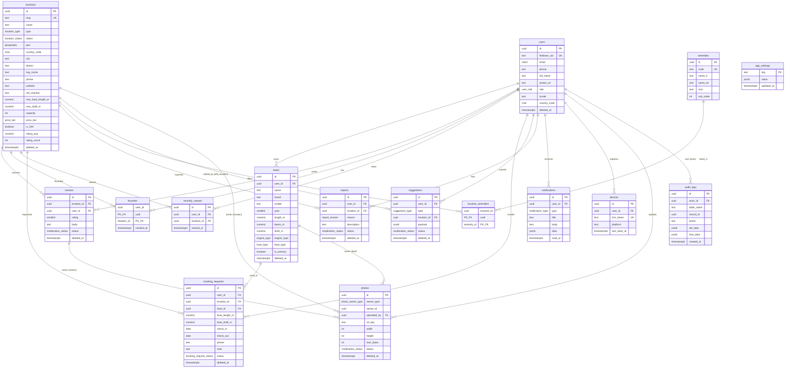

# Dockly — Veritabanı Tasarımı

> ⚠️ **SUPERSEDED (6 Temmuz 2026):** Bu MVP şeması, donmuş kanonik model olan [22-veritabani-mimarisi.md](./22-veritabani-mimarisi.md) (v2.0-FROZEN) tarafından **üstün kılınmıştır**. Çelişki durumunda 22 geçerlidir. Bu doküman migration planı ve SQL örüntüleri için referans olarak korunur; DDL üretimi başladığında v2 modeliyle güncellenecektir.

> Bu doküman [00-foundation.md](./00-foundation.md) dokümanına tabidir. Tablo adları, kolonlar, enum değerleri ve index'ler foundation Bölüm 4 ve 5'ten **birebir** alınmıştır.

**Hedef platform:** Supabase üzerinde PostgreSQL 15 + PostGIS. Migration'lar `supabase/migrations/` altında sıralı ve versiyonludur.

---

## 1. Tasarım İlkeleri

1. **3NF Normalizasyon:** Tüm tablolar en az 3. normal formdadır. Tek bilinçli denormalizasyon: `locations.rating_avg` ve `locations.rating_count` cache kolonlarıdır ve **yalnızca trigger ile** güncellenir (Bölüm 6.2). Uygulama kodu bu kolonlara asla doğrudan yazmaz.
2. **UUID Primary Key:** Tüm tablolarda `id UUID PRIMARY KEY DEFAULT gen_random_uuid()`. Sıralı integer ID kullanılmaz; ID tahmin edilemezliği, çoklu ortam (dev/staging/prod) veri taşıma kolaylığı ve ileride sharding esnekliği sağlar. İstisna: `favorites` bileşik PK kullanır (`user_id + location_id`), foundation Bölüm 5 gereği.
3. **TIMESTAMPTZ her yerde:** Tüm zaman kolonları `TIMESTAMPTZ` (UTC saklanır, istemci yerelleştirir). `DATE` yalnızca takvim günü anlamı taşıyan `booking_requests.check_in / check_out` alanlarında kullanılır.
4. **Soft Delete:** Foundation Bölüm 5 tablosundaki işarete göre `deleted_at TIMESTAMPTZ NULL` kolonu bulunur: `users`, `boats`, `locations`, `photos`, `reviews`, `booking_requests`, `suggestions`, `reports`. Silme = `deleted_at = now()`. Tüm okuma sorguları `WHERE deleted_at IS NULL` filtresi uygular; performans için partial index'ler bu koşulla tanımlanır. `favorites` hard delete; `audit_logs` append-only (silinmez).
5. **Audit:** Tüm tablolarda `created_at TIMESTAMPTZ NOT NULL DEFAULT now()` ve `updated_at TIMESTAMPTZ NOT NULL DEFAULT now()`. `updated_at` trigger ile otomatik güncellenir. Kritik tablolardaki (locations, reviews, photos, booking_requests, users) her INSERT/UPDATE/DELETE `audit_logs` tablosuna trigger ile yazılır.
6. **Avrupa'ya açılım (i18n) hazırlığı:** Tüm içerik tablolarında `country_code CHAR(2)` (ISO 3166-1 alpha-2, v1'de daima `'TR'`). `users.locale` (BCP-47, örn. `tr-TR`, `en-GB`). `amenities` sözlüğünde `name_tr` + `name_en`. Tüm ölçüler metriktir ve kolon adında birim taşır (`length_m`, `draft_m`). Para alanları gelecekte `NUMERIC + currency_code` çifti olarak eklenecektir (foundation Bölüm 9).
7. **Enum'lar veritabanı seviyesinde:** Foundation Bölüm 4'teki tüm enum'lar `CREATE TYPE ... AS ENUM` ile tanımlanır. Uygulama katmanında string sabitleriyle senkron tutulur; yeni değer ekleme `ALTER TYPE ... ADD VALUE` ile geri-alınamaz olduğundan migration kurallarına tabidir (Bölüm 8.2).
8. **Coğrafya:** `locations.geo geography(Point,4326)` — mesafe hesapları metre cinsinden doğru olsun diye `geometry` değil `geography` seçilmiştir. Tüm konum sorguları GIST index üzerinden çalışır.
9. **RLS varsayılan olarak açık:** Tüm tablolarda Row Level Security etkin; erişim yalnızca politikalarla verilir (deny-by-default). Admin yazma işlemleri `service_role` veya `role >= moderator` claim'i üzerinden geçer.
10. **İsimlendirme:** Tablolar çoğul `snake_case`; FK kolonları `<tablo_tekil>_id`; index adları `idx_<tablo>_<kolonlar>[_koşul]`; trigger adları `trg_<tablo>_<amaç>`.

---

## 2. Mermaid ER Diyagramı

Foundation Bölüm 5'teki 16 tablonun tamamı ve ilişkileri:



Not: `photos.owner_id` polimorfik bir referanstır (`owner_type` alanına göre `locations`, `boats` veya `reviews` tablosuna işaret eder); bu nedenle FK constraint yerine trigger ile bütünlük denetlenir (Bölüm 6.4).

---

## 3. Enum Tanımları (CREATE TYPE)

Foundation Bölüm 4'ten birebir. Ek olarak `location_status` (foundation Bölüm 5, kritik kolonlar: `status (draft/published/archived)`) ve polimorfik fotoğraf sahipliği için `photo_owner_type` tanımlanır.

```sql
-- 0002_enums.sql
CREATE TYPE location_type AS ENUM (
  'private_marina', 'municipal_marina', 'municipal_pier', 'guest_mooring',
  'restaurant_pier', 'fuel_pier', 'boat_club', 'mooring_point', 'buoy'
);

CREATE TYPE boat_type AS ENUM (
  'motor_yacht', 'sailboat', 'daily_boat', 'fishing_boat', 'catamaran',
  'gulet', 'superyacht', 'rib', 'other'
);

CREATE TYPE engine_type AS ENUM (
  'inboard_diesel', 'inboard_gasoline', 'outboard', 'sail_aux', 'electric', 'none'
);

CREATE TYPE booking_request_status AS ENUM (
  'pending', 'contacted', 'confirmed', 'cancelled', 'expired'
);

CREATE TYPE price_tier AS ENUM ('free', 'paid', 'unknown');

CREATE TYPE moderation_status AS ENUM ('pending', 'approved', 'rejected');

CREATE TYPE user_role AS ENUM ('user', 'moderator', 'admin', 'super_admin');

CREATE TYPE suggestion_type AS ENUM ('new_location', 'edit_location');

CREATE TYPE report_reason AS ENUM (
  'wrong_info', 'closed_permanently', 'wrong_photo', 'wrong_position', 'other'
);

CREATE TYPE notification_type AS ENUM (
  'booking_status', 'new_photo', 'new_review', 'favorite_update', 'system'
);

-- Foundation Bölüm 5 kritik kolonlar: locations.status (draft/published/archived)
CREATE TYPE location_status AS ENUM ('draft', 'published', 'archived');

-- photos tablosunun polimorfik sahipliği (location/boat/review)
CREATE TYPE photo_owner_type AS ENUM ('location', 'boat', 'review');

-- devices.platform için
CREATE TYPE device_platform AS ENUM ('ios', 'android');
```

---

## 4. Tablo Tanımları (CREATE TABLE)

### 4.1 users

```sql
CREATE TABLE users (
  id            UUID PRIMARY KEY DEFAULT gen_random_uuid(),
  firebase_uid  TEXT NOT NULL,
  email         CITEXT,
  phone         TEXT,
  full_name     TEXT,
  avatar_url    TEXT,
  role          user_role NOT NULL DEFAULT 'user',
  locale        TEXT NOT NULL DEFAULT 'tr-TR',
  country_code  CHAR(2) NOT NULL DEFAULT 'TR',
  is_anonymous  BOOLEAN NOT NULL DEFAULT FALSE,  -- Firebase misafir oturumu
  created_at    TIMESTAMPTZ NOT NULL DEFAULT now(),
  updated_at    TIMESTAMPTZ NOT NULL DEFAULT now(),
  deleted_at    TIMESTAMPTZ,

  CONSTRAINT uq_users_firebase_uid UNIQUE (firebase_uid),
  CONSTRAINT ck_users_email CHECK (email IS NULL OR email ~* '^[^@\s]+@[^@\s]+\.[^@\s]+$'),
  CONSTRAINT ck_users_phone CHECK (phone IS NULL OR phone ~ '^\+[1-9][0-9]{6,14}$'),  -- E.164
  CONSTRAINT ck_users_country_code CHECK (country_code ~ '^[A-Z]{2}$')
);
```

### 4.2 boats

```sql
CREATE TABLE boats (
  id           UUID PRIMARY KEY DEFAULT gen_random_uuid(),
  user_id      UUID NOT NULL REFERENCES users(id) ON DELETE CASCADE,
  name         TEXT NOT NULL,
  brand        TEXT,
  model        TEXT,
  year         SMALLINT,
  length_m     NUMERIC(5,2),
  beam_m       NUMERIC(5,2),
  draft_m      NUMERIC(4,2),
  engine_type  engine_type NOT NULL DEFAULT 'none',
  boat_type    boat_type NOT NULL DEFAULT 'other',
  is_primary   BOOLEAN NOT NULL DEFAULT FALSE,
  created_at   TIMESTAMPTZ NOT NULL DEFAULT now(),
  updated_at   TIMESTAMPTZ NOT NULL DEFAULT now(),
  deleted_at   TIMESTAMPTZ,

  CONSTRAINT ck_boats_name CHECK (char_length(name) BETWEEN 1 AND 100),
  CONSTRAINT ck_boats_year CHECK (year IS NULL OR year BETWEEN 1900 AND 2100),
  CONSTRAINT ck_boats_length CHECK (length_m IS NULL OR length_m > 0 AND length_m <= 200),
  CONSTRAINT ck_boats_beam CHECK (beam_m IS NULL OR beam_m > 0 AND beam_m <= 50),
  CONSTRAINT ck_boats_draft CHECK (draft_m IS NULL OR draft_m > 0 AND draft_m <= 20)
);

-- Kullanıcı başına en fazla 1 aktif birincil tekne
CREATE UNIQUE INDEX uq_boats_primary_per_user
  ON boats (user_id) WHERE is_primary = TRUE AND deleted_at IS NULL;
```

### 4.3 locations

```sql
CREATE TABLE locations (
  id                UUID PRIMARY KEY DEFAULT gen_random_uuid(),
  slug              TEXT NOT NULL,
  name              TEXT NOT NULL,
  type              location_type NOT NULL,
  status            location_status NOT NULL DEFAULT 'draft',
  geo               geography(Point, 4326) NOT NULL,
  country_code      CHAR(2) NOT NULL DEFAULT 'TR',
  city              TEXT NOT NULL,
  district          TEXT,
  bay_name          TEXT,
  description       TEXT,
  phone             TEXT,
  website           TEXT,
  vhf_channel       TEXT,
  max_boat_length_m NUMERIC(5,2),
  max_draft_m       NUMERIC(4,2),
  capacity          INT,
  price_tier        price_tier NOT NULL DEFAULT 'unknown',
  is_24h            BOOLEAN NOT NULL DEFAULT FALSE,
  rating_avg        NUMERIC(3,2) NOT NULL DEFAULT 0,   -- CACHE: trigger günceller
  rating_count      INT NOT NULL DEFAULT 0,            -- CACHE: trigger günceller
  created_at        TIMESTAMPTZ NOT NULL DEFAULT now(),
  updated_at        TIMESTAMPTZ NOT NULL DEFAULT now(),
  deleted_at        TIMESTAMPTZ,

  CONSTRAINT uq_locations_slug UNIQUE (slug),
  CONSTRAINT ck_locations_slug CHECK (slug ~ '^[a-z0-9]+(-[a-z0-9]+)*$'),
  CONSTRAINT ck_locations_name CHECK (char_length(name) BETWEEN 2 AND 150),
  CONSTRAINT ck_locations_country_code CHECK (country_code ~ '^[A-Z]{2}$'),
  CONSTRAINT ck_locations_capacity CHECK (capacity IS NULL OR capacity >= 0),
  CONSTRAINT ck_locations_max_len CHECK (max_boat_length_m IS NULL OR max_boat_length_m > 0),
  CONSTRAINT ck_locations_max_draft CHECK (max_draft_m IS NULL OR max_draft_m > 0),
  CONSTRAINT ck_locations_rating_avg CHECK (rating_avg >= 0 AND rating_avg <= 5),
  CONSTRAINT ck_locations_rating_count CHECK (rating_count >= 0)
);
```

### 4.4 amenities (referans sözlük — soft delete YOK)

```sql
CREATE TABLE amenities (
  id          UUID PRIMARY KEY DEFAULT gen_random_uuid(),
  code        TEXT NOT NULL,          -- foundation Bölüm 4'teki 15 kanonik kod
  name_tr     TEXT NOT NULL,
  name_en     TEXT NOT NULL,          -- Avrupa açılımı hazırlığı
  icon        TEXT,                   -- dockly_ui ikon adı
  sort_order  INT NOT NULL DEFAULT 0,
  is_active   BOOLEAN NOT NULL DEFAULT TRUE,
  created_at  TIMESTAMPTZ NOT NULL DEFAULT now(),
  updated_at  TIMESTAMPTZ NOT NULL DEFAULT now(),

  CONSTRAINT uq_amenities_code UNIQUE (code),
  CONSTRAINT ck_amenities_code CHECK (code ~ '^[a-z0-9_]+$')
);
```

### 4.5 location_amenities (N-N köprü)

```sql
CREATE TABLE location_amenities (
  location_id  UUID NOT NULL REFERENCES locations(id) ON DELETE CASCADE,
  amenity_id   UUID NOT NULL REFERENCES amenities(id) ON DELETE RESTRICT,
  created_at   TIMESTAMPTZ NOT NULL DEFAULT now(),
  updated_at   TIMESTAMPTZ NOT NULL DEFAULT now(),

  PRIMARY KEY (location_id, amenity_id)
);
```

### 4.6 photos (polimorfik sahiplik: location/boat/review)

```sql
CREATE TABLE photos (
  id           UUID PRIMARY KEY DEFAULT gen_random_uuid(),
  owner_type   photo_owner_type NOT NULL,
  owner_id     UUID NOT NULL,                    -- trigger ile doğrulanır (FK yok)
  uploaded_by  UUID NOT NULL REFERENCES users(id) ON DELETE CASCADE,
  s3_key       TEXT NOT NULL,                    -- örn. locations/{id}/{uuid}.jpg
  width        INT,
  height       INT,
  size_bytes   INT,
  content_type TEXT NOT NULL DEFAULT 'image/jpeg',
  status       moderation_status NOT NULL DEFAULT 'pending',
  is_cover     BOOLEAN NOT NULL DEFAULT FALSE,
  created_at   TIMESTAMPTZ NOT NULL DEFAULT now(),
  updated_at   TIMESTAMPTZ NOT NULL DEFAULT now(),
  deleted_at   TIMESTAMPTZ,

  CONSTRAINT uq_photos_s3_key UNIQUE (s3_key),
  CONSTRAINT ck_photos_size CHECK (size_bytes IS NULL OR size_bytes BETWEEN 1 AND 15728640), -- ≤15MB
  CONSTRAINT ck_photos_content_type CHECK (content_type IN ('image/jpeg','image/png','image/webp','image/heic'))
);
```

### 4.7 reviews

```sql
CREATE TABLE reviews (
  id           UUID PRIMARY KEY DEFAULT gen_random_uuid(),
  location_id  UUID NOT NULL REFERENCES locations(id) ON DELETE CASCADE,
  user_id      UUID NOT NULL REFERENCES users(id) ON DELETE CASCADE,
  rating       SMALLINT NOT NULL,
  body         TEXT,
  status       moderation_status NOT NULL DEFAULT 'pending',
  created_at   TIMESTAMPTZ NOT NULL DEFAULT now(),
  updated_at   TIMESTAMPTZ NOT NULL DEFAULT now(),
  deleted_at   TIMESTAMPTZ,

  CONSTRAINT ck_reviews_rating CHECK (rating BETWEEN 1 AND 5),
  CONSTRAINT ck_reviews_body CHECK (body IS NULL OR char_length(body) <= 2000)
);

-- Foundation: aktif kayıt için UNIQUE(location_id, user_id) WHERE deleted_at IS NULL
CREATE UNIQUE INDEX uq_reviews_location_user_active
  ON reviews (location_id, user_id) WHERE deleted_at IS NULL;
```

### 4.8 favorites (bileşik PK, hard delete)

```sql
CREATE TABLE favorites (
  user_id      UUID NOT NULL REFERENCES users(id) ON DELETE CASCADE,
  location_id  UUID NOT NULL REFERENCES locations(id) ON DELETE CASCADE,
  created_at   TIMESTAMPTZ NOT NULL DEFAULT now(),

  PRIMARY KEY (user_id, location_id)
);
```

### 4.9 recently_viewed (upsert semantiği)

```sql
CREATE TABLE recently_viewed (
  id           UUID PRIMARY KEY DEFAULT gen_random_uuid(),
  user_id      UUID NOT NULL REFERENCES users(id) ON DELETE CASCADE,
  location_id  UUID NOT NULL REFERENCES locations(id) ON DELETE CASCADE,
  viewed_at    TIMESTAMPTZ NOT NULL DEFAULT now(),
  created_at   TIMESTAMPTZ NOT NULL DEFAULT now(),
  updated_at   TIMESTAMPTZ NOT NULL DEFAULT now(),

  CONSTRAINT uq_recently_viewed UNIQUE (user_id, location_id)  -- upsert hedefi
);
```

Upsert: `INSERT ... ON CONFLICT (user_id, location_id) DO UPDATE SET viewed_at = now()`. Kullanıcı başına son 50 kayıt tutulur; fazlası günlük cron (Edge Function) ile budanır.

### 4.10 booking_requests

```sql
CREATE TABLE booking_requests (
  id             UUID PRIMARY KEY DEFAULT gen_random_uuid(),
  user_id        UUID NOT NULL REFERENCES users(id) ON DELETE CASCADE,
  location_id    UUID NOT NULL REFERENCES locations(id) ON DELETE RESTRICT,
  boat_id        UUID REFERENCES boats(id) ON DELETE SET NULL,
  boat_length_m  NUMERIC(5,2) NOT NULL,   -- talep anındaki snapshot
  boat_draft_m   NUMERIC(4,2),
  check_in       DATE NOT NULL,
  check_out      DATE NOT NULL,
  phone          TEXT NOT NULL,
  note           TEXT,
  status         booking_request_status NOT NULL DEFAULT 'pending',
  status_note    TEXT,                    -- operasyon ekibi iç notu
  handled_by     UUID REFERENCES users(id) ON DELETE SET NULL,  -- işleyen admin
  created_at     TIMESTAMPTZ NOT NULL DEFAULT now(),
  updated_at     TIMESTAMPTZ NOT NULL DEFAULT now(),
  deleted_at     TIMESTAMPTZ,

  CONSTRAINT ck_booking_dates CHECK (check_out > check_in),
  CONSTRAINT ck_booking_phone CHECK (phone ~ '^\+[1-9][0-9]{6,14}$'),
  CONSTRAINT ck_booking_length CHECK (boat_length_m > 0 AND boat_length_m <= 200),
  CONSTRAINT ck_booking_draft CHECK (boat_draft_m IS NULL OR boat_draft_m > 0),
  CONSTRAINT ck_booking_note CHECK (note IS NULL OR char_length(note) <= 1000)
);
```

Not: `boat_length_m` / `boat_draft_m` tekne profilinden **kopyalanır** (snapshot); tekne sonradan güncellense bile talep tarihi itibarıyla geçerli değer korunur. Durum akışı foundation Bölüm 4: `pending → contacted → confirmed | cancelled | expired`; geçiş kuralları API katmanında da denetlenir.

### 4.11 suggestions

```sql
CREATE TABLE suggestions (
  id           UUID PRIMARY KEY DEFAULT gen_random_uuid(),
  user_id      UUID NOT NULL REFERENCES users(id) ON DELETE CASCADE,
  type         suggestion_type NOT NULL,
  location_id  UUID REFERENCES locations(id) ON DELETE CASCADE,  -- edit_location için zorunlu
  payload      JSONB NOT NULL,           -- önerilen alanlar (yeni nokta ya da düzeltme diff'i)
  status       moderation_status NOT NULL DEFAULT 'pending',
  reviewed_by  UUID REFERENCES users(id) ON DELETE SET NULL,
  created_at   TIMESTAMPTZ NOT NULL DEFAULT now(),
  updated_at   TIMESTAMPTZ NOT NULL DEFAULT now(),
  deleted_at   TIMESTAMPTZ,

  CONSTRAINT ck_suggestions_location CHECK (
    (type = 'edit_location' AND location_id IS NOT NULL) OR
    (type = 'new_location'  AND location_id IS NULL)
  )
);
```

### 4.12 reports

```sql
CREATE TABLE reports (
  id           UUID PRIMARY KEY DEFAULT gen_random_uuid(),
  user_id      UUID NOT NULL REFERENCES users(id) ON DELETE CASCADE,
  location_id  UUID NOT NULL REFERENCES locations(id) ON DELETE CASCADE,
  reason       report_reason NOT NULL,
  description  TEXT,
  status       moderation_status NOT NULL DEFAULT 'pending',
  reviewed_by  UUID REFERENCES users(id) ON DELETE SET NULL,
  created_at   TIMESTAMPTZ NOT NULL DEFAULT now(),
  updated_at   TIMESTAMPTZ NOT NULL DEFAULT now(),
  deleted_at   TIMESTAMPTZ,

  CONSTRAINT ck_reports_description CHECK (description IS NULL OR char_length(description) <= 1000)
);
```

### 4.13 notifications

```sql
CREATE TABLE notifications (
  id          UUID PRIMARY KEY DEFAULT gen_random_uuid(),
  user_id     UUID NOT NULL REFERENCES users(id) ON DELETE CASCADE,
  type        notification_type NOT NULL,
  title       TEXT NOT NULL,
  body        TEXT NOT NULL,
  data        JSONB NOT NULL DEFAULT '{}'::jsonb,  -- deep link parametreleri
  read_at     TIMESTAMPTZ,
  created_at  TIMESTAMPTZ NOT NULL DEFAULT now(),
  updated_at  TIMESTAMPTZ NOT NULL DEFAULT now()
);
```

### 4.14 devices

```sql
CREATE TABLE devices (
  id            UUID PRIMARY KEY DEFAULT gen_random_uuid(),
  user_id       UUID NOT NULL REFERENCES users(id) ON DELETE CASCADE,
  fcm_token     TEXT NOT NULL,
  platform      device_platform NOT NULL,
  app_version   TEXT,
  device_model  TEXT,
  last_seen_at  TIMESTAMPTZ NOT NULL DEFAULT now(),
  created_at    TIMESTAMPTZ NOT NULL DEFAULT now(),
  updated_at    TIMESTAMPTZ NOT NULL DEFAULT now(),

  CONSTRAINT uq_devices_fcm_token UNIQUE (fcm_token)
);
```

### 4.15 audit_logs (append-only, aylık partition'a hazır)

```sql
CREATE TABLE audit_logs (
  id          UUID NOT NULL DEFAULT gen_random_uuid(),
  actor_id    UUID,                    -- NULL = sistem/trigger
  table_name  TEXT NOT NULL,
  record_id   UUID NOT NULL,
  action      TEXT NOT NULL,           -- INSERT | UPDATE | DELETE | SOFT_DELETE
  old_data    JSONB,
  new_data    JSONB,
  ip_address  INET,
  created_at  TIMESTAMPTZ NOT NULL DEFAULT now(),

  PRIMARY KEY (id, created_at),        -- partition anahtarı PK'ye dahil
  CONSTRAINT ck_audit_action CHECK (action IN ('INSERT','UPDATE','DELETE','SOFT_DELETE'))
) PARTITION BY RANGE (created_at);

-- İlk partition'lar (sonrakiler cron ile açılır, Bölüm 10)
CREATE TABLE audit_logs_2026_07 PARTITION OF audit_logs
  FOR VALUES FROM ('2026-07-01') TO ('2026-08-01');
CREATE TABLE audit_logs_2026_08 PARTITION OF audit_logs
  FOR VALUES FROM ('2026-08-01') TO ('2026-09-01');
```

Not: `actor_id` bilerek FK değildir — kullanıcı hard-delete edilse dahi denetim izi bozulmamalıdır; audit append-only'dir ve `updated_at` taşımaz.

### 4.16 app_settings

```sql
CREATE TABLE app_settings (
  key         TEXT PRIMARY KEY,
  value       JSONB NOT NULL,
  description TEXT,
  created_at  TIMESTAMPTZ NOT NULL DEFAULT now(),
  updated_at  TIMESTAMPTZ NOT NULL DEFAULT now(),

  CONSTRAINT ck_app_settings_key CHECK (key ~ '^[a-z0-9_.]+$')
);
```

Örnek anahtarlar: `feature.suggestions_enabled`, `booking.request_expiry_days`, `map.default_center`, `maintenance.banner`.

---

## 5. Index Yapısı

Foundation Bölüm 5'teki kanonik index'ler ★ ile işaretlidir.

| # | Index | Tip | Gerekçe |
|---|---|---|---|
| ★ | `idx_locations_geo ON locations USING GIST (geo)` | GIST | Harita bbox (`ST_Intersects`) ve merkez+yarıçap (`ST_DWithin`) sorgularının ana motoru; geography tipinde mesafeler metre cinsinden doğru. |
| ★ | `idx_locations_name_trgm ON locations USING GIN (name gin_trgm_ops)` | GIN pg_trgm | `q` parametresiyle bulanık ad araması (`ILIKE '%bodrum%'`); typo toleranslı `similarity()` sıralaması. |
| ★ | `idx_locations_city_trgm ON locations USING GIN (city gin_trgm_ops)` | GIN pg_trgm | Şehir/ilçe metin araması; arama ekranı (S-07) şehir sonuçları. |
| ★ | `idx_locations_type_status ON locations (type, status)` | B-tree | Harita tip filtresi + yalnızca `published` gösterimi; admin listelerinde `draft` filtreleme. |
|  | `idx_locations_active ON locations (status) WHERE deleted_at IS NULL` | Partial | Tüm public sorgular `deleted_at IS NULL AND status='published'`; partial index ölü satırları taramaz, boyutu küçük tutar. |
|  | `idx_locations_list_cover ON locations (status, created_at DESC) INCLUDE (name, type, city, rating_avg, rating_count, price_tier) WHERE deleted_at IS NULL` | Covering (partial) | Liste/arama sonuç kartları (`LocationSummary`) heap'e inmeden index-only scan ile döner. |
| ★ | `idx_boats_user ON boats (user_id) WHERE deleted_at IS NULL` | Partial B-tree | FK + "teknelerim" listesi; soft-delete filtresi gömülü. |
| ★ | `idx_photos_owner ON photos (owner_type, owner_id) WHERE deleted_at IS NULL` | Partial B-tree | Lokasyon/tekne/yorum galerisi sorguları; polimorfik sahiplik iki kolonla çözülür. |
|  | `idx_photos_status ON photos (status, created_at) WHERE deleted_at IS NULL` | Partial | Admin moderasyon kuyruğu (`pending` sıralı). |
|  | `idx_photos_uploaded_by ON photos (uploaded_by) WHERE deleted_at IS NULL` | Partial B-tree | FK; kullanıcının yüklemeleri. |
| ★ | `idx_reviews_location_status ON reviews (location_id, status)` | B-tree | Foundation kanonik; detay sayfasında `approved` yorumlar + moderasyon süzgeci. |
|  | `idx_reviews_location_active ON reviews (location_id, created_at DESC) WHERE deleted_at IS NULL AND status = 'approved'` | Partial | Yorum listesi cursor pagination'ı; yalnızca görünür yorumları içerir. |
|  | `idx_reviews_user ON reviews (user_id) WHERE deleted_at IS NULL` | Partial B-tree | FK; "yorumlarım" ve RLS denetimleri. |
| ★ | `uq_reviews_location_user_active` (bkz. 4.7) | Partial UNIQUE | Foundation kuralı: kullanıcı başına lokasyonda 1 aktif yorum. |
| ★ | `idx_booking_requests_status_created ON booking_requests (status, created_at)` | B-tree | Foundation kanonik; admin talep kuyruğu (`pending` FIFO) ve `expired` süpürme cron'u. |
|  | `idx_booking_requests_user ON booking_requests (user_id, created_at DESC) WHERE deleted_at IS NULL` | Partial | "Taleplerim" (S-15) listesi. |
|  | `idx_booking_requests_location ON booking_requests (location_id) WHERE deleted_at IS NULL` | Partial B-tree | FK; lokasyon bazlı operasyon görünümü. |
| ★ | `idx_notifications_user_read ON notifications (user_id, read_at)` | B-tree | Foundation kanonik; okunmamış rozet sayacı (`read_at IS NULL`) ve bildirim listesi. |
|  | `idx_notifications_user_created ON notifications (user_id, created_at DESC)` | B-tree | Bildirim listesi cursor pagination'ı. |
|  | `idx_favorites_location ON favorites (location_id)` | B-tree | FK; PK zaten `(user_id, location_id)` → kullanıcı yönü karşılanır, bu index lokasyon yönünü (favori sayısı) karşılar. |
|  | `idx_recently_viewed_user ON recently_viewed (user_id, viewed_at DESC)` | B-tree | Son görüntülenenler listesi (en yeni üstte). |
|  | `idx_location_amenities_amenity ON location_amenities (amenity_id)` | B-tree | Amenity filtresi ters yön araması; PK ileri yönü karşılar. |
|  | `idx_suggestions_status ON suggestions (status, created_at) WHERE deleted_at IS NULL` | Partial | Admin öneri kuyruğu. |
|  | `idx_suggestions_user ON suggestions (user_id) WHERE deleted_at IS NULL` | Partial B-tree | FK. |
|  | `idx_reports_status ON reports (status, created_at) WHERE deleted_at IS NULL` | Partial | Admin rapor kuyruğu. |
|  | `idx_reports_location ON reports (location_id) WHERE deleted_at IS NULL` | Partial B-tree | FK. |
|  | `idx_devices_user ON devices (user_id)` | B-tree | FK; push gönderiminde kullanıcının cihazları. |
|  | `idx_audit_logs_record ON audit_logs (table_name, record_id, created_at DESC)` | B-tree (her partition'da) | Bir kaydın değişiklik geçmişi. |
|  | `idx_audit_logs_actor ON audit_logs (actor_id, created_at DESC)` | B-tree | Bir kullanıcının/adminin işlemleri. |
|  | `idx_users_email ON users (email) WHERE deleted_at IS NULL` | Partial | E-posta ile arama (admin); CITEXT sayesinde case-insensitive. |

Genel kurallar (foundation): **tüm FK kolonlarına B-tree**, soft-delete'li tablolarda **partial index `WHERE deleted_at IS NULL`**. `CREATE INDEX CONCURRENTLY` prod migration'larında zorunludur.

---

## 6. Trigger'lar

### 6.1 updated_at otomasyonu

```sql
CREATE OR REPLACE FUNCTION fn_set_updated_at() RETURNS trigger AS $$
BEGIN
  NEW.updated_at = now();
  RETURN NEW;
END;
$$ LANGUAGE plpgsql;

-- updated_at taşıyan her tabloya uygulanır (audit_logs ve favorites hariç):
-- users, boats, locations, amenities, location_amenities, photos, reviews,
-- recently_viewed, booking_requests, suggestions, reports, notifications,
-- devices, app_settings
CREATE TRIGGER trg_users_updated_at BEFORE UPDATE ON users
  FOR EACH ROW EXECUTE FUNCTION fn_set_updated_at();
-- ... (diğer tablolar için aynı kalıp, migration 0007'de tamamı)
```

### 6.2 reviews → locations.rating_avg / rating_count cache güncelleme

Yalnızca **`approved` ve silinmemiş** yorumlar ortalamaya girer. INSERT, UPDATE (rating/status/deleted_at değişimi) ve DELETE olaylarında tetiklenir.

```sql
CREATE OR REPLACE FUNCTION fn_refresh_location_rating() RETURNS trigger AS $$
DECLARE
  v_location_id UUID;
BEGIN
  v_location_id := COALESCE(NEW.location_id, OLD.location_id);

  UPDATE locations l SET
    rating_avg = COALESCE(sub.avg_rating, 0),
    rating_count = COALESCE(sub.cnt, 0)
  FROM (
    SELECT ROUND(AVG(rating)::numeric, 2) AS avg_rating, COUNT(*) AS cnt
    FROM reviews
    WHERE location_id = v_location_id
      AND status = 'approved'
      AND deleted_at IS NULL
  ) sub
  WHERE l.id = v_location_id;

  RETURN COALESCE(NEW, OLD);
END;
$$ LANGUAGE plpgsql;

CREATE TRIGGER trg_reviews_rating_cache
  AFTER INSERT OR DELETE OR UPDATE OF rating, status, deleted_at ON reviews
  FOR EACH ROW EXECUTE FUNCTION fn_refresh_location_rating();
```

Tam yeniden hesap (AVG üzerinden) tercih edilmiştir; artımlı sayaç yerine idempotent olduğundan moderasyon durum geçişlerinde (pending→approved→rejected) tutarlılık garantidir.

### 6.3 audit_logs yazımı

```sql
CREATE OR REPLACE FUNCTION fn_write_audit_log() RETURNS trigger AS $$
DECLARE
  v_action TEXT;
BEGIN
  IF TG_OP = 'UPDATE' AND NEW.deleted_at IS NOT NULL AND OLD.deleted_at IS NULL THEN
    v_action := 'SOFT_DELETE';
  ELSE
    v_action := TG_OP;
  END IF;

  INSERT INTO audit_logs (actor_id, table_name, record_id, action, old_data, new_data)
  VALUES (
    NULLIF(current_setting('app.actor_id', true), '')::uuid,  -- Edge Function set eder
    TG_TABLE_NAME,
    COALESCE(NEW.id, OLD.id),
    v_action,
    CASE WHEN TG_OP IN ('UPDATE','DELETE') THEN to_jsonb(OLD) END,
    CASE WHEN TG_OP IN ('INSERT','UPDATE') THEN to_jsonb(NEW) END
  );
  RETURN COALESCE(NEW, OLD);
END;
$$ LANGUAGE plpgsql SECURITY DEFINER;

-- Kritik tablolara bağlanır:
CREATE TRIGGER trg_locations_audit AFTER INSERT OR UPDATE OR DELETE ON locations
  FOR EACH ROW EXECUTE FUNCTION fn_write_audit_log();
-- Aynı kalıp: users, reviews, photos, booking_requests, suggestions, reports, app_settings
```

Edge Function her istek başında `SET LOCAL app.actor_id = '<uuid>'` çalıştırır; böylece trigger aktörü bilir.

### 6.4 photos polimorfik bütünlük denetimi

```sql
CREATE OR REPLACE FUNCTION fn_check_photo_owner() RETURNS trigger AS $$
BEGIN
  IF NEW.owner_type = 'location' AND NOT EXISTS (SELECT 1 FROM locations WHERE id = NEW.owner_id) THEN
    RAISE EXCEPTION 'photo owner location % not found', NEW.owner_id;
  ELSIF NEW.owner_type = 'boat' AND NOT EXISTS (SELECT 1 FROM boats WHERE id = NEW.owner_id) THEN
    RAISE EXCEPTION 'photo owner boat % not found', NEW.owner_id;
  ELSIF NEW.owner_type = 'review' AND NOT EXISTS (SELECT 1 FROM reviews WHERE id = NEW.owner_id) THEN
    RAISE EXCEPTION 'photo owner review % not found', NEW.owner_id;
  END IF;
  RETURN NEW;
END;
$$ LANGUAGE plpgsql;

CREATE TRIGGER trg_photos_owner_check BEFORE INSERT OR UPDATE OF owner_type, owner_id ON photos
  FOR EACH ROW EXECUTE FUNCTION fn_check_photo_owner();
```

### 6.5 booking_requests durum geçiş denetimi

```sql
CREATE OR REPLACE FUNCTION fn_check_booking_transition() RETURNS trigger AS $$
BEGIN
  IF OLD.status = NEW.status THEN RETURN NEW; END IF;
  IF NOT (
    (OLD.status = 'pending'   AND NEW.status IN ('contacted','cancelled','expired')) OR
    (OLD.status = 'contacted' AND NEW.status IN ('confirmed','cancelled','expired'))
  ) THEN
    RAISE EXCEPTION 'invalid booking status transition: % -> %', OLD.status, NEW.status;
  END IF;
  RETURN NEW;
END;
$$ LANGUAGE plpgsql;

CREATE TRIGGER trg_booking_status_transition BEFORE UPDATE OF status ON booking_requests
  FOR EACH ROW EXECUTE FUNCTION fn_check_booking_transition();
```

---

## 7. RLS Politika Özeti (Tablo Bazında)

Tüm tablolarda `ALTER TABLE ... ENABLE ROW LEVEL SECURITY`. `auth.uid()` = Supabase JWT'deki kullanıcı (Firebase köprüsünden). Yardımcı fonksiyon: `fn_current_role()` → `users.role` döner; `is_staff = role IN ('moderator','admin','super_admin')`.

| Tablo | SELECT | INSERT | UPDATE | DELETE |
|---|---|---|---|---|
| `users` | Kendi satırı; staff hepsi | Yalnız Edge (service_role) — `/auth/session` sırasında | Kendi satırı (role/deleted_at hariç kolonlar); staff hepsi | Yok (soft delete UPDATE ile) |
| `boats` | Sahibi (`user_id = auth.uid()`); staff | Sahibi | Sahibi; staff | Yok (soft delete) |
| `locations` | Herkes — **misafir dahil, anon key**: `status='published' AND deleted_at IS NULL`; staff hepsi | Yalnız staff | Yalnız staff | Yalnız staff (soft delete) |
| `amenities` | Herkes (misafir dahil, `is_active=TRUE`) | Yalnız admin | Yalnız admin | Yalnız admin |
| `location_amenities` | Herkes (published lokasyona bağlıysa) | Yalnız staff | Yalnız staff | Yalnız staff |
| `photos` | `status='approved' AND deleted_at IS NULL` herkese; kendi yüklediği her durumda; staff hepsi | Girişli kullanıcı (`uploaded_by = auth.uid()`) | Sahibi yalnız soft delete; staff status/moderasyon | Yok |
| `reviews` | `status='approved' AND deleted_at IS NULL` herkese; kendi yazdığı her durumda; staff hepsi | Girişli kullanıcı (`user_id = auth.uid()`) | Sahibi (body/rating, yeniden `pending`'e düşer); staff status | Yok (soft delete) |
| `favorites` | Sahibi | Sahibi | — | Sahibi (hard delete) |
| `recently_viewed` | Sahibi | Sahibi | Sahibi (upsert) | Sahibi |
| `booking_requests` | Sahibi; staff hepsi | Girişli kullanıcı (anonim/misafir DEĞİL) | Sahibi yalnız cancel; staff durum güncelleme | Yok (soft delete) |
| `suggestions` | Sahibi; staff hepsi | Girişli kullanıcı | Yalnız staff (moderasyon) | Yok (soft delete) |
| `reports` | Sahibi; staff hepsi | Girişli kullanıcı | Yalnız staff | Yok (soft delete) |
| `notifications` | Sahibi | Yalnız service_role (sistem üretir) | Sahibi yalnız `read_at` | Sahibi |
| `devices` | Sahibi | Sahibi | Sahibi | Sahibi |
| `audit_logs` | Yalnız admin/super_admin | Yalnız trigger (SECURITY DEFINER) | Yok | Yok (append-only) |
| `app_settings` | Herkes (public flag'ler view üzerinden); tam tablo yalnız admin | Yalnız super_admin | Yalnız super_admin | Yalnız super_admin |

Misafir (Firebase anonim) kullanıcılar: `locations`, `amenities`, onaylı `photos` ve `reviews` okuyabilir; yazma işlemleri (review, booking, favorite...) tam hesap gerektirir — API katmanı `AUTH_REQUIRED` döner (bkz. 05-api-dokumantasyonu.md).

---

## 8. Migration Planı

### 8.1 supabase/migrations dosya sırası

| Dosya | İçerik |
|---|---|
| `0001_extensions.sql` | `CREATE EXTENSION IF NOT EXISTS postgis; pg_trgm; citext; pgcrypto;` |
| `0002_enums.sql` | Bölüm 3'teki tüm `CREATE TYPE` tanımları |
| `0003_users.sql` | `users` tablosu + index'leri |
| `0004_boats.sql` | `boats` + `uq_boats_primary_per_user` |
| `0005_locations.sql` | `locations`, `amenities`, `location_amenities` + geo/trgm index'leri |
| `0006_content.sql` | `photos`, `reviews`, `favorites`, `recently_viewed` + index'leri |
| `0007_functions_triggers_core.sql` | `fn_set_updated_at` + tüm `updated_at` trigger'ları; `fn_check_photo_owner` |
| `0008_booking.sql` | `booking_requests` + `fn_check_booking_transition` + index'leri |
| `0009_community.sql` | `suggestions`, `reports` + index'leri |
| `0010_notifications_devices.sql` | `notifications`, `devices` + index'leri |
| `0011_audit_logs.sql` | Partitioned `audit_logs` + ilk 2 aylık partition + `fn_write_audit_log` + audit trigger'ları |
| `0012_app_settings.sql` | `app_settings` + başlangıç flag'leri |
| `0013_rating_cache_trigger.sql` | `fn_refresh_location_rating` + `trg_reviews_rating_cache` |
| `0014_rls_policies.sql` | Tüm `ENABLE ROW LEVEL SECURITY` + politika tanımları + `fn_current_role` |
| `0015_seed_amenities.sql` | 15 kanonik amenity kaydı (Bölüm 9.1 — idempotent upsert olduğu için migration'da) |

### 8.2 Migration kuralları

1. **İleri-yalnız (forward-only) ama geri alınabilir tasarım:** Her migration'ın mantıksal tersini yazan bir `-- ROLLBACK:` bloğu dosya sonunda yorum olarak tutulur. Prod'da geri alma yeni bir ileri migration ile yapılır (down dosyası çalıştırılmaz).
2. **Expand-Contract pattern:** Kırıcı şema değişiklikleri üç fazda yapılır:
   - *Expand:* Yeni kolon/tablo eklenir (NULLable veya DEFAULT'lu), eski yapı korunur; kod her ikisine yazar.
   - *Migrate:* Backfill batch'lerle (5.000 satırlık dilimler, `pg_sleep` aralıklı) taşınır; okuma yeni yapıya alınır.
   - *Contract:* En az bir sürüm sonra eski kolon `DROP` edilir (ayrı migration).
3. **Kilit disiplini:** Prod'da `CREATE INDEX CONCURRENTLY` zorunlu; `SET lock_timeout = '5s'; SET statement_timeout = '60s';` her migration başında. `ALTER TABLE ... ADD COLUMN ... DEFAULT` PostgreSQL 15'te metadata-only olduğundan güvenlidir; `NOT NULL` ekleme önce `CHECK ... NOT VALID` + `VALIDATE CONSTRAINT` ile yapılır.
4. **Enum genişletme:** `ALTER TYPE ... ADD VALUE` geri alınamaz; değer eklemeden önce uygulama sürümünün bilinmeyen enum değerine toleranslı olduğu doğrulanır. Enum'dan değer silme YASAK (yerine uygulama seviyesinde deprecate).
5. **Bir migration = bir mantıksal değişiklik.** Migration dosyaları merge edildikten sonra asla düzenlenmez; düzeltme yeni dosyayla gelir.
6. **CI doğrulaması:** GitHub Actions her PR'da boş bir PostgreSQL 15+PostGIS container'ında (Docker) tüm migration zincirini sıfırdan uygular + `supabase db lint` çalıştırır.

---

## 9. Seed Stratejisi

### 9.1 amenities sözlüğü (deterministik, idempotent)

Foundation Bölüm 4'teki 15 kanonik kod. `code` üzerinden upsert:

```sql
INSERT INTO amenities (code, name_tr, name_en, icon, sort_order) VALUES
  ('electricity',       'Elektrik',          'Electricity',        'bolt',          10),
  ('water',             'Su',                'Water',              'droplet',       20),
  ('fuel',              'Yakıt',             'Fuel',               'fuel-pump',     30),
  ('restaurant',        'Restoran',          'Restaurant',         'utensils',      40),
  ('shower',            'Duş',               'Shower',             'shower',        50),
  ('market',            'Market',            'Market',             'basket',        60),
  ('laundry',           'Çamaşırhane',       'Laundry',            'washer',        70),
  ('wifi',              'Wi-Fi',             'Wi-Fi',              'wifi',          80),
  ('security',          'Güvenlik',          'Security',           'shield',        90),
  ('open_24h',          '24 Saat Açık',      'Open 24h',           'clock',        100),
  ('wc',                'WC',                'WC',                 'wc',           110),
  ('pump_out',          'Atık Alım (Pump-out)', 'Pump-out',        'pump',         120),
  ('crane',             'Vinç',              'Crane',              'crane',        130),
  ('travel_lift',       'Travel Lift',       'Travel Lift',        'lift',         140),
  ('technical_service', 'Teknik Servis',     'Technical Service',  'wrench',       150)
ON CONFLICT (code) DO UPDATE
  SET name_tr = EXCLUDED.name_tr, name_en = EXCLUDED.name_en,
      icon = EXCLUDED.icon, sort_order = EXCLUDED.sort_order;
```

### 9.2 İlk lokasyon verisi toplama planı

Hedef: lansmanda TR kıyı şeridinde **~800–1.200 published lokasyon** (`country_code='TR'`).

| Faz | Kaynak | Kapsam | Yöntem |
|---|---|---|---|
| 1 | Resmî marina listeleri (özel + belediye marinaları) | ~120 `private_marina` / `municipal_marina` | Operasyon ekibi tablo şablonu (CSV) → `supabase/seed/locations_batch_*.csv` → import script (Deno) → `status='draft'` |
| 2 | Belediye iskeleleri, yakıt iskeleleri, restoran iskeleleri | ~400 kayıt (Muğla, Aydın, İzmir, Antalya öncelikli) | Saha araştırması + telefon doğrulaması; koordinat Mapbox üzerinde elle işaretlenir |
| 3 | Koy içi bağlama/şamandıra (`mooring_point`, `buoy`, `guest_mooring`) | ~500 kayıt | Denizci topluluğu pilot grubu + `suggestions` akışıyla topluluk katkısı |
| 4 | Zenginleştirme | Tümü | Amenity işaretleme, `max_boat_length_m`/`max_draft_m`, VHF, fotoğraf; tamamlananlar `published`'a çekilir |

Kurallar: her kayıt yayınlanmadan önce **çift kontrol** (ikinci operatör onayı); `slug` üretimi `sehir-ilce-ad` kalıbıyla script'te; koordinat hassasiyeti ±10 m hedeflenir; dev/staging ortamına ayrıca 50 kayıtlık sentetik `seed/dev_locations.sql` yüklenir.

---

## 10. Veri Hacmi Tahminleri ve Partitioning Planı

12 aylık tahmin (varsayım: 30k kayıtlı kullanıcı, 1.200 lokasyon):

| Tablo | Satır (12 ay) | Satır boyutu ort. | Boyut tahmini | Büyüme profili |
|---|---|---|---|---|
| `users` | 30k | 0,5 KB | ~15 MB | Doğrusal, yavaş |
| `boats` | 25k | 0,3 KB | ~8 MB | Kullanıcıya paralel |
| `locations` | 1,5k | 1 KB | ~2 MB | Neredeyse sabit |
| `reviews` | 60k | 0,7 KB | ~42 MB | İçerik büyümesi orta |
| `photos` | 90k | 0,4 KB (metadata; binary S3'te) | ~36 MB | Orta |
| `favorites` | 150k | 0,1 KB | ~15 MB | Orta |
| `recently_viewed` | ≤1,5M (50/kullanıcı cap) | 0,1 KB | ~150 MB | Cap ile sınırlı |
| `booking_requests` | 40k | 0,6 KB | ~24 MB | Sezonluk (Mayıs–Ekim pik) |
| `notifications` | 2M | 0,4 KB | ~800 MB | **En hızlı büyüyen** |
| `audit_logs` | 5M+ | 1,5 KB (JSONB çift kopya) | ~7,5 GB | **En büyük tablo** |
| Diğerleri | <50k | — | <20 MB | İhmal edilebilir |

### 10.1 audit_logs — aylık RANGE partition

- Tablo baştan `PARTITION BY RANGE (created_at)` (Bölüm 4.15). 
- Aylık cron Edge Function (`partition-maintenance`): bir sonraki 2 ayın partition'ını `CREATE TABLE IF NOT EXISTS ... PARTITION OF` ile açar.
- Saklama: **13 ay** sıcak. Daha eskisi `pg_dump --table` ile S3'e (`s3://dockly-archive/audit/`) Parquet/SQL olarak arşivlenir, ardından `DETACH PARTITION CONCURRENTLY` + `DROP TABLE`.
- Partition bazlı index'ler otomatik (partitioned index tanımları ana tabloda).

### 10.2 notifications — arşivleme

- v1'de partition YOK (2M satır PostgreSQL için sorun değil); bunun yerine **saklama politikası**: `read_at IS NOT NULL AND created_at < now() - interval '90 days'` olan satırlar haftalık cron ile `notifications_archive` (aynı şema, index'siz, ayrı tablespace) tablosuna taşınır ve ana tablodan silinir.
- 10M satır/yıl eşiği aşılırsa `notifications` da `created_at` üzerinden aylık partition'a geçirilir (expand-contract ile; API değişmez).

### 10.3 recently_viewed budama

Günlük cron: kullanıcı başına `viewed_at` sırasına göre 50'nin üzerindeki satırlar silinir (window function ile).

---

## 11. Gelecek Modüller için Şema Evrim Planı

Foundation Bölüm 9 sözleşmesine göre v1'de **yer hazırdır, tablo YOKTUR**:

### 11.1 availability (canlı müsaitlik / gerçek rezervasyon)

- Nereye eklenecek: yeni migration `00xx_availability.sql`; `locations`'a FK'li bağımsız tablo. Mevcut hiçbir tablo değişmez.
- Planlanan şema taslağı: `availability(id UUID, location_id FK, date DATE, total_slots INT, available_slots INT, UNIQUE(location_id, date))` + gün bazlı sorgu index'i.
- Hazırlık (v1'de yapılmış): `booking_requests.status` enum'u `ALTER TYPE ADD VALUE` ile genişletilebilir (örn. `approved_by_marina`); `booking_requests` yapısı gerçek rezervasyona evrilebilecek şekilde lokasyon+tarih+tekne snapshot'ı taşır; feature flag `feature.live_availability` `app_settings`'te kapalı olarak tanımlıdır.

### 11.2 payments (online ödeme)

- Nereye eklenecek: yeni migration seti `00xx_payments.sql`; `payments(id UUID, booking_request_id FK, amount NUMERIC(12,2), currency_code CHAR(3), provider TEXT, provider_ref TEXT, status payment_status, ...)` + `payment_events` (append-only, audit_logs kalıbında aylık partition).
- Hazırlık (v1'de yapılmış): tüm para alanı konvansiyonu **`NUMERIC + currency_code`** olarak sabitlenmiştir; `booking_requests.id` ödeme referansı için stabil UUID'dir; domain arayüzü (`payments` modülü) kod tarafında boş bırakılmıştır.

### 11.3 Marina paneli / Avrupa açılımı

- `user_role` enum'una `marina_operator` gibi değerler `ADD VALUE` ile eklenir; RLS politikaları role-bazlı yazıldığından yeni role yalnızca yeni policy eklemek yeterlidir.
- Avrupa: `country_code` tüm içerik tablolarında mevcut; açılımda yalnızca (a) `locations` seed'i, (b) `amenities.name_*` yeni dil kolonları yerine ayrı `amenity_translations(amenity_id, locale, name)` tablosuna expand-contract ile geçiş, (c) API'de `country` filtresi aktive edilir. Şema kırılması yoktur.
- Hava durumu / AIS / rota: veritabanı etkisi yok (harita katmanı plugin mimarisi, istemci tarafı).

### 11.4 Evrim kuralları

1. Yeni modül = yeni tablo(lar) + yeni migration; mevcut tabloya kolon eklemek gerekiyorsa NULLable/DEFAULT'lu.
2. Her yeni modül `app_settings` feature flag'i arkasında açılır (`feature.<modül>_enabled`).
3. API sözleşmesi kırılacaksa `/v2` açılır; `/v1` en az 12 ay yaşatılır.
