# Dockly — Kullanıcı Akışları

> **Doküman No:** 06 · **Sürüm:** 1.0
> **Bağlı olduğu kanonik doküman:** [`00-foundation.md`](./00-foundation.md) — tüm ekran ID'leri (S-01…S-23), enum'lar ve endpoint'ler oradan birebir alınmıştır.
> **Gösterim:** Her akış = amaç → ön koşullar → adım adım anlatım → Mermaid flowchart → edge case'ler.

## Genel İlkeler (tüm akışlar için geçerli)

- **Misafir kuralı:** Okuma serbest; **yazma** eylemleri (yorum, fotoğraf, rezervasyon talebi, favori, öneri, hata bildirimi, bildirim aboneliği) misafirde **kayıt duvarına** (S-03'ün modal varyantı) yönlendirir. Duvar aşıldığında kullanıcı **kaldığı yerden** devam eder.
- **Offline kuralı:** Okuma akışları Drift (SQLite) cache'ten beslenir; cache yoksa boş durum + "Bağlantı yok" bandı. Yazma eylemleri offline'da anlamlı hata verir (`error.code = network_unavailable` yerel eşleniği), sessizce kaybolmaz.
- **Hata formatı:** API hataları `{ "error": { "code", "message", "details" } }`; kullanıcıya yerelleştirilmiş mesaj + "Tekrar dene".
- **Analytics:** Her akışın kritik adımları event üretir (detaylı liste `07-ekran-listesi.md`'de).

---

## Akış 1 — İlk Açılış / Onboarding + Misafir Modu

**Amaç:** Yeni kullanıcıyı 30 saniyede haritaya ulaştırmak; kayıt dayatmadan değeri göstermek.
**Ekranlar:** S-01 → S-02 → S-03 → S-06

### Adımlar
1. Uygulama açılır → **S-01 Splash**: logo, sürüm/oturum kontrolü, `app_settings` feature flag'leri çekilir.
2. Oturum var mı?
   - Var (kayıtlı ya da anonim) → doğrudan **S-06** Ana Sayfa (harita).
   - Yok ve ilk açılış → **S-02 Onboarding** (3 sayfa): (1) "Her bağlama noktası tek haritada", (2) "Topluluk yorumları ve fotoğraflar", (3) "Tek dokunuşla rezervasyon talebi". Her sayfada "Atla".
3. Onboarding sonu → **S-03 Giriş**: Apple / Google / E-posta / Telefon / **"Misafir olarak devam et"**.
4. Misafir seçilirse → Firebase **anonim** oturum açılır → `POST /auth/session` → S-06 harita, kullanıcının konumuna (izin verilirse) odaklanır.
5. Konum izni istenir (haritaya girişte, ön açıklama diyaloğu ile). Reddedilirse harita varsayılan görünüme (Türkiye kıyı hattı) açılır.

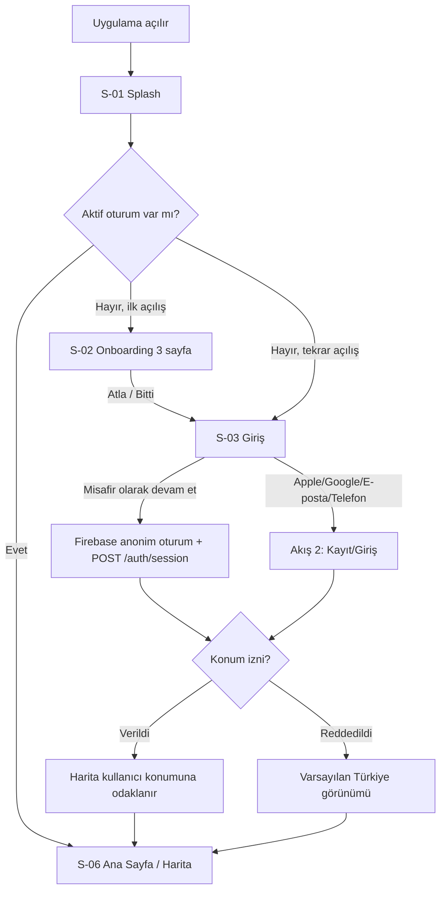

### Edge case'ler
- **Offline ilk açılış:** Splash'te flag'ler çekilemez → varsayılan flag'lerle devam; S-06 boş harita + "Bağlantı yok" bandı; bağlantı gelince otomatik yenile.
- **Anonim oturum açılamadı:** "Misafir girişi şu an yapılamıyor" + tekrar dene; diğer yöntemler açık kalır.
- **Onboarding yarıda kapatıldı:** Bir sonraki açılışta onboarding tekrar gösterilmez, doğrudan S-03.
- **Konum izni "bir kez":** Sonraki oturumda tekrar sorulur; kalıcı red ise ayarlara yönlendiren yumuşak banner.

---

## Akış 2 — Kayıt / Giriş (4 yöntem) + Misafir→Kayıtlı Dönüşüm

**Amaç:** Sürtünmesiz kimlik doğrulama; misafir verisini kaybetmeden hesaba dönüştürme.
**Ekranlar:** S-03, S-04, S-05

### Adımlar
1. **S-03**'te yöntem seçilir:
   - **Apple / Google:** Native OAuth akışı → Firebase credential → başarı.
   - **E-posta (S-04):** E-posta + şifre; yeni kullanıcıysa kayıt, mevcutsa giriş; şifre sıfırlama bağlantısı.
   - **Telefon (S-05):** Telefon girişi → SMS OTP → 6 haneli kod doğrulama; yeniden gönder (60 sn sayaç).
2. Firebase ID Token alınır → `POST /auth/session` → Supabase JWT köprüsü → `users` kaydı yoksa oluşturulur (`firebase_uid`, `email`/`phone`, `locale`, `country_code = TR`).
3. `PUT /devices` ile FCM token kaydı.
4. Profil adı boşsa tek alanlık "Adın ne?" tamamlama adımı (atlanabilir) → S-06.

### Misafir→Kayıtlı dönüşüm
1. Misafir bir **yazma eylemi** dener (ör. favori) → kayıt duvarı modalı: "Devam etmek için hesap oluştur" + 4 yöntem.
2. Seçilen yöntem Firebase **linkWithCredential** ile anonim hesaba bağlanır → **aynı UID korunur**; `recently_viewed`, oturum içi harita durumu ve yarıda kalan eylem kaybolmaz.
3. Dönüşüm sonrası kullanıcı **kaldığı eyleme** geri döner (ör. favori otomatik eklenir, talep formu dolu hâliyle açılır).

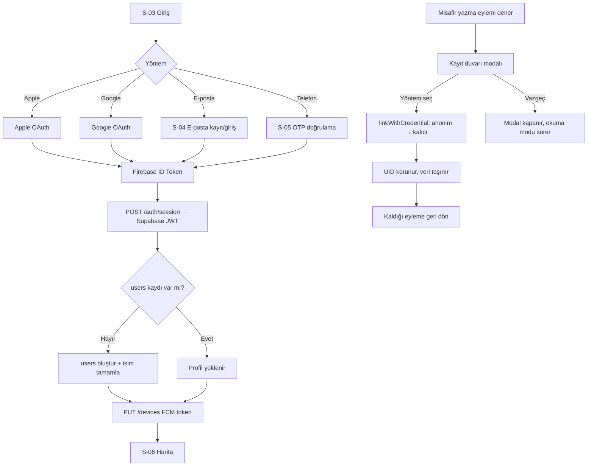

### Edge case'ler
- **OTP gelmedi:** 60 sn sonra yeniden gönder; 3 denemeden sonra "E-posta ile dene" önerisi.
- **Link çakışması:** Misafirin bağlamak istediği Google hesabı zaten başka Dockly hesabına bağlı → "Bu hesap zaten kayıtlı. Onunla giriş yapılsın mı?" — evet ise anonim oturum verisi (yalnızca `recently_viewed`) mümkünse birleştirilir, çakışan veri mevcut hesap lehine çözülür.
- **Apple "e-postamı gizle":** Relay e-posta kabul edilir; profilde maskelenmiş gösterilir.
- **Offline giriş denemesi:** "Giriş için bağlantı gerekli" — misafir olarak cache'te gezinme mümkün kalır.
- **Oturum köprüsü hatası (`/auth/session` 5xx):** Firebase oturumu açık tutulur, köprü arkaplanda tekrar denenir; yazma eylemleri geçici kilitli.

---

## Akış 3 — Tekne Ekleme

**Amaç:** Talep formunu ve uyum filtrelerini besleyen tekne profilini oluşturmak.
**Ekranlar:** S-17 → S-18 · **API:** `POST /boats`

### Adımlar
1. Giriş noktaları: S-19 Profil → "Teknelerim" (S-17); veya S-14 talep formunda "Tekne ekle"; veya kayıt sonrası öneri kartı.
2. **S-17** boşsa empty state: "Henüz tekne eklemedin" + "Tekne ekle" CTA → **S-18**.
3. **S-18** form (foundation `boats` kolonları): `name`*, `boat_type`* (9 seçenek), `brand`, `model`, `year`, `length_m`* , `beam_m`, `draft_m`, `engine_type` (6 seçenek), `is_primary` anahtarı, opsiyonel fotoğraf.
4. Doğrulama: `length_m` 2–200 m aralığı, `year` 1900–güncel; sayısal alanlar `NUMERIC(5,2)` hassasiyetinde.
5. Kaydet → `POST /boats` → ilk tekneyse `is_primary = true` otomatik → S-17 listeye dön, başarı snackbar.

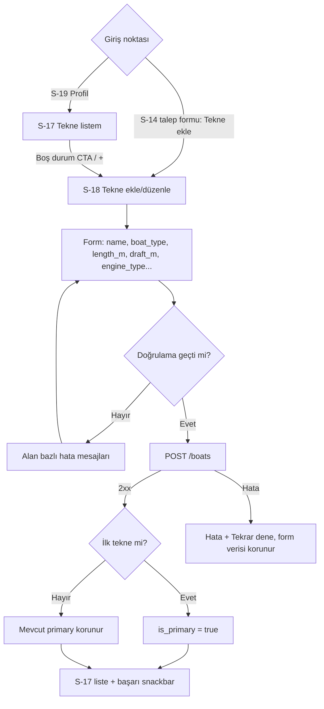

### Edge case'ler
- **Misafir:** S-17/S-18 yazma eylemidir → kayıt duvarı; dönüşüm sonrası form kaldığı yerden.
- **Offline kaydetme:** Form verisi yerelde tutulur, "Bağlantı gelince tekrar deneyin" — otomatik gönderim yapılmaz (v1 sade).
- **Fotoğraf yükleme başarısız, form geçerli:** Tekne fotoğrafsız kaydedilir; foto ayrıca yeniden denenebilir.
- **`is_primary` değişimi:** Yeni tekne primary yapılırsa eskisinin bayrağı sunucuda kaldırılır (tek primary kuralı).
- **Tekne silme:** Soft delete (`deleted_at`); bağlı geçmiş `booking_requests` kayıtları etkilenmez.

---

## Akış 4 — Haritada Keşif (zoom / cluster / pin tap → detay kartı)

**Amaç:** Ürünün kalbi: harita üzerinde gezinerek nokta keşfi.
**Ekranlar:** S-06 · **API:** `GET /locations?bbox=...`

### Adımlar
1. **S-06** açılır: Mapbox haritası, üstte arama çubuğu + filtre rozeti, sağda "konumuma git".
2. Görünür bbox için `GET /locations` (yalnızca `status = published`); sonuçlar Drift cache'e yazılır.
3. **Zoom uzak:** pinler **cluster** balonlarında (sayı ile). Cluster tap → o bölgeye zoom.
4. **Zoom yakın:** tekil pinler, `location_type` başına kanonik ikon/renk (foundation §7).
5. **Pin tap** → alt **detay kartı** (bottom card) yükselir: kapak foto, ad, tip etiketi, `rating_avg` (`rating_count`), `price_tier`, mesafe; aksiyonlar: "Detay" (→ S-09), "Yol tarifi".
6. Kart yatay **swipe**: görünür bölgedeki komşu noktalar arasında gezinme; aktif kartın pini haritada vurgulanır.
7. Harita kaydırılınca kart kapanır ya da yeni bbox verisiyle güncellenir; "Bu bölgede ara" davranışı otomatiktir (debounce'lu).

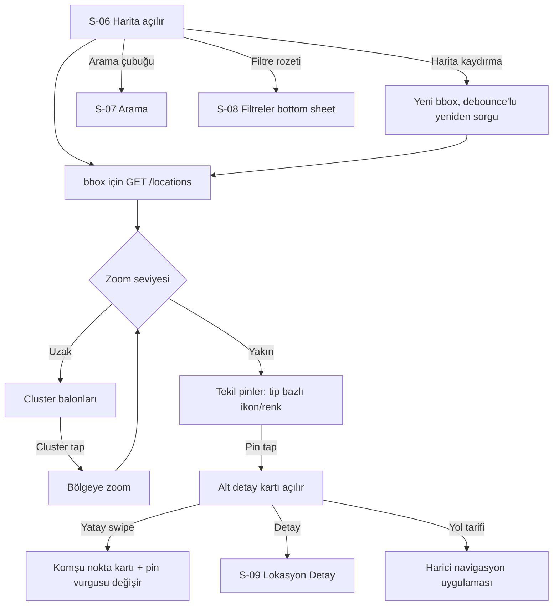

### Edge case'ler
- **Offline:** Cache'teki son bbox verisi gösterilir + "Çevrimdışı — son bilinen veriler" bandı; cache dışı bölgeler boş.
- **Boş bölge:** Pin yok → "Bu bölgede kayıtlı nokta yok" mikro-kartı + "Yeni nokta öner" (S-22) bağlantısı — boş durum içerik üretimine dönüştürülür.
- **Yoğun bölge performansı:** Cluster eşiği zoom'a bağlı; tek seferde çizilen pin sayısı sınırlandırılır.
- **Konum izni yok:** "Konumuma git" düğmesi izin diyaloğunu tetikler; kalıcı redde ayarlara yönlendirir.
- **Misafir:** Bu akışın tamamı misafire açıktır (yalnızca okuma).

---

## Akış 5 — Arama + Filtreleme

**Amaç:** "Adını bildiğim yer" ve "kriterime uyan yerler" ihtiyaçlarını tek yüzeyde çözmek.
**Ekranlar:** S-07, S-08 · **API:** `GET /locations?search=&...filtreler`

### Adımlar
1. Alt sekme "Arama" ya da S-06 arama çubuğu → **S-07**.
2. Boş durum: son aramalar + `recently_viewed` (GET /recently-viewed) + popüler şehirler çipleri.
3. Yazarken (debounce ~300 ms) `GET /locations?search=` — `pg_trgm` sayesinde typo toleranslı; kapsam: marina, iskele, şehir, ilçe, koy (`bay_name`), restoran, yakıt.
4. Sonuç satırı: ikon (tip), ad, şehir/ilçe, puan. Tap → **S-09** (ve `POST /recently-viewed` upsert).
5. **Filtreler:** S-07 veya S-06'dan **S-08 bottom sheet**: `location_type` çoklu seçim (9 tip), 15 amenity çipi, `price_tier`, min. puan, `is_24h`, **tekne uyumu** (primary teknenin `length_m`/`draft_m` değerleri `max_boat_length_m`/`max_draft_m` ile karşılaştırılır).
6. "Sonuçları göster (N)" → sheet kapanır; filtreler hem liste hem harita görünümüne uygulanır; aktif filtre sayısı rozette.

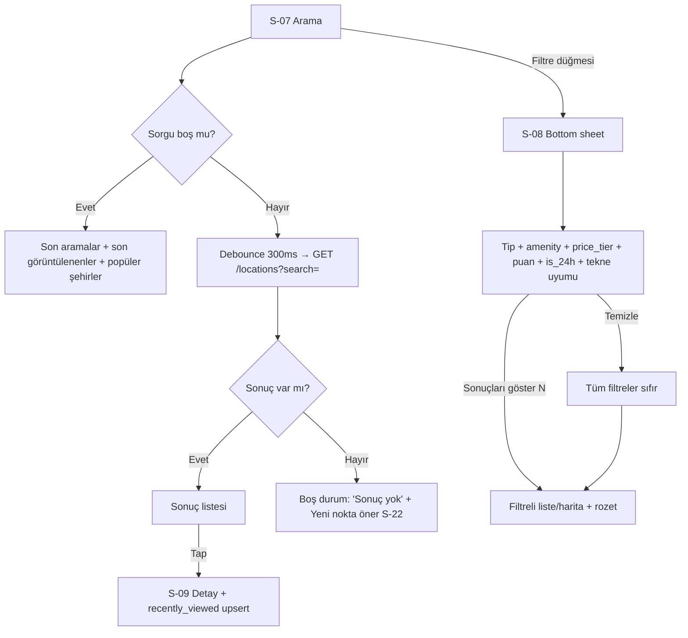

### Edge case'ler
- **Sonuç yok:** Öneriler: yazımı gevşet (trigram zaten toleranslı), filtreleri temizle CTA'sı, S-22 "Yeni nokta öner".
- **Tekne uyumu, tekne yokken:** Filtre kapalı görünür; tap → "Önce tekne ekle" → S-18 (misafirse kayıt duvarı).
- **Offline arama:** Yalnızca cache'teki kayıtlarda yerel arama; sonuç başına "çevrimdışı" rozeti.
- **Aşırı filtre = 0 sonuç:** "N filtre aktif — gevşetmeyi dene" + en kısıtlayıcı filtre önerisi.
- **Misafir:** Arama/filtre tamamen açık; yalnızca `recently_viewed` sunucu kaydı anonim UID üzerinden tutulur.

---

## Akış 6 — Lokasyon Detay İnceleme → Navigasyon Başlatma

**Amaç:** Karar anını desteklemek ve tekneyi fiziksel olarak noktaya ulaştırmak.
**Ekranlar:** S-09, S-10 · **API:** `GET /locations/{id}`

### Adımlar
1. Giriş: S-06 kartı, S-07 sonucu, S-16 favori, S-15 talep detayı ya da bildirim derin bağlantısı → **S-09**.
2. İçerik blokları: foto şeridi (tap → **S-10** tam ekran galeri), başlık + tip + `rating_avg`/`rating_count` + `price_tier`, amenity ızgarası, teknik bilgiler (`capacity`, `max_boat_length_m`, `max_draft_m`, `vhf_channel`, `is_24h`), iletişim (`phone`, `website`), mini konum haritası, yorum önizlemesi (ilk 3 → S-11).
3. Primary tekne varsa **uyum rozeti**: "Teknen (12,5 m / 1,1 m) bu noktaya uygun" ya da uyarı.
4. Aksiyon çubuğu: **Talep bırak** (S-14) · **Yol tarifi** · **Ara** · **Favorile** · üç-nokta menü: Fotoğraf ekle (S-13), Hata bildir (S-23).
5. **Yol tarifi:** platform seçim sayfası (Apple Haritalar / Google Maps; varsa deniz navigasyonu uygulaması) → koordinat (`geo`) harici uygulamaya aktarılır. Dockly rota ÇİZMEZ (Hard Exclusion).

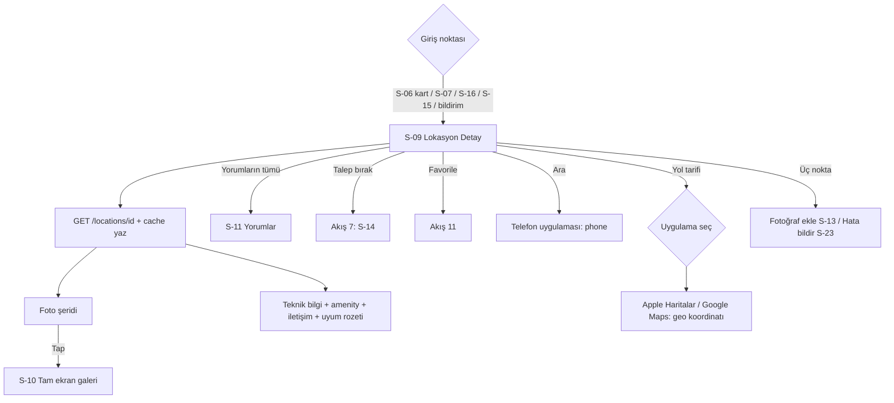

### Edge case'ler
- **Offline:** Daha önce açılmış detay cache'ten gelir; foto galerisi yalnızca cache'lenmiş görsellerle; aksiyonlardan yalnızca "Yol tarifi" (koordinat yerel) çalışır.
- **Telefon/website boş:** İlgili aksiyon gizlenir, "bilgi yok" satırı gösterilmez — sadece mevcut veri çizilir.
- **Fotoğrafsız lokasyon:** Kapakta tip bazlı placeholder illüstrasyon + "İlk fotoğrafı sen ekle" CTA (S-13).
- **Arşivlenmiş lokasyon (`status = archived`) derin bağlantısı:** "Bu nokta artık listelenmiyor" tam sayfa durumu + haritaya dön.
- **Misafir:** Okuma + arama + yol tarifi serbest; Favorile/Talep/Foto/Hata bildir kayıt duvarına gider.

---

## Akış 7 — Rezervasyon Talebi Oluşturma (misafir engeli dahil)

**Amaç:** Keşiften bağlayıcı olmayan talebe köprü. **Request-only** — onay Dockly operasyon ekibince manuel işlenir.
**Ekranlar:** S-09 → S-14 → S-15 · **API:** `POST /booking-requests`

### Adımlar
1. S-09'da "Talep bırak" → kullanıcı **misafirse kayıt duvarı** (Akış 2 dönüşümü); kayıtlıysa doğrudan **S-14**.
2. **S-14 form:**
   - Lokasyon özeti (salt okunur).
   - **Tekne:** kayıtlı teknelerden seçim (`boat_id`, primary önseçili; `boat_length_m`/`boat_draft_m` otomatik dolar) veya "Tekne eklemeden devam" ile manuel boy/su çekimi girişi.
   - **Tarih:** `check_in` / `check_out` (DATE, takvim; `check_out ≥ check_in`).
   - **İletişim:** `phone` (profilden önerilir, düzenlenebilir) · **Not:** `note` (opsiyonel, ör. "elektrik gerekli").
   - Bilgi kutusu: *"Bu bir rezervasyon değildir. Talebin Dockly ekibi tarafından iletilir; durumunu Taleplerim'den izleyebilirsin."*
3. Tekne boyu lokasyon kısıtını aşıyorsa (`boat_length_m > max_boat_length_m` vb.) **engellemeyen uyarı** gösterilir.
4. Gönder → `POST /booking-requests` → kayıt `status = pending`.
5. Başarı ekranı: durum çizelgesi (`pending → contacted → confirmed`) + "Taleplerim'e git" → **S-15**.
6. Sonrası: A-06'da operasyon durumu günceller → FCM `booking_status` bildirimi → Akış 12.
7. Kullanıcı S-15 detayından `POST /booking-requests/{id}/cancel` ile iptal edebilir (yalnızca `pending`/`contacted` iken).

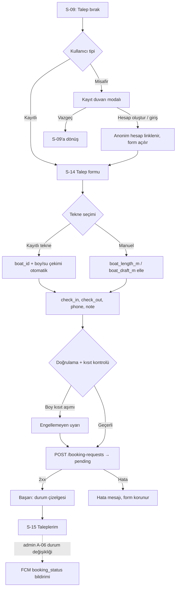

### Edge case'ler
- **Misafir engeli:** Duvardan vazgeçen kullanıcı S-09'a döner; form verisi girilmişse dönüşüm sonrası aynen geri gelir.
- **Offline gönderim:** "Talep gönderilemedi — bağlantı yok"; form verisi ekranda korunur, otomatik kuyruk yok.
- **Geçmiş tarih / ters aralık:** Takvim geçmişi kilitler; `check_out < check_in` alan hatası.
- **Mükerrer talep:** Aynı lokasyon + çakışan tarihte aktif `pending` talep varsa uyarı: "Bu tarihler için bekleyen talebin var" + S-15 bağlantısı.
- **`expired`:** Operasyon işlemeden `check_in` geçerse durum `expired` olur; kullanıcıya `booking_status` bildirimi gider.
- **Teknesiz kullanıcı:** Manuel boy/su çekimi yolu her zaman açık — tekne eklemek talep için zorunlu değildir.

---

## Akış 8 — Yorum + Puan + Fotoğraf Ekleme

**Amaç:** Topluluk içerik döngüsünün ana motoru.
**Ekranlar:** S-11 → S-12, S-13 · **API:** `POST /locations/{id}/reviews`, `POST /photos/presign`, `POST /photos/complete`

### Adımlar
1. Giriş: S-09 "Yorum yaz" ya da S-11 listesindeki CTA → misafirse kayıt duvarı → **S-12**.
2. **S-12:** yıldız `rating` (1–5, zorunlu) → metin `body` (opsiyonel, maks. 2000 karakter) → opsiyonel fotoğraf ekleme (S-13 bileşeni gömülü).
3. Fotoğraf seçilirse: galeri/kamera → istemci tarafı sıkıştırma → `POST /photos/presign` → S3 upload → `POST /photos/complete`.
4. Gönder → `POST /locations/{id}/reviews` → kayıt `moderation_status = pending`.
5. Kullanıcıya: "Yorumun moderasyon sonrası yayınlanacak" — kendi profilinde "onay bekliyor" rozetiyle görünür, başkalarına görünmez.
6. Admin A-05/A-04 onayı → `approved` → herkese görünür, `rating_avg`/`rating_count` trigger ile güncellenir; reddedilirse `rejected` + kullanıcıya nazik bilgilendirme.

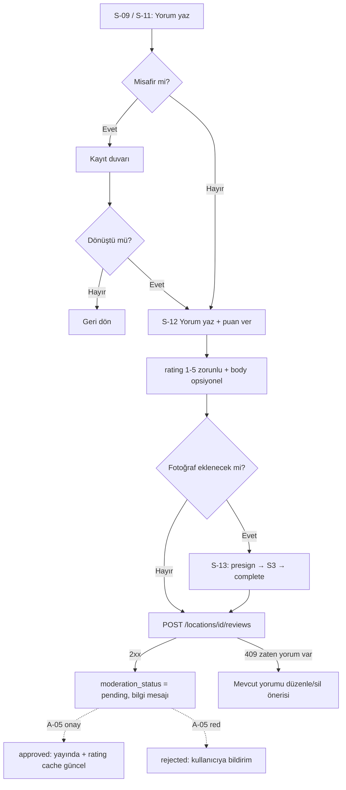

### Edge case'ler
- **Tek aktif yorum kuralı:** `UNIQUE(location_id, user_id) WHERE deleted_at IS NULL` — ikinci deneme 409 döner; UI "Yorumunu güncelle" akışına çevirir (eski yorum soft delete + yeni kayıt).
- **Foto yüklendi, yorum gönderilemedi:** Yorum yeniden denenebilir; tamamlanmamış (complete edilmemiş) foto sunucuda yetim kalır ve periyodik temizlenir.
- **Offline:** Taslak yerelde tutulur, "bağlantı gelince gönder" düğmesi manuel.
- **Uygunsuz içerik:** Yayındaki yorumun üç-nokta menüsünde "Bildir" → `POST /reports` (`report_reason = other`).
- **Puan verip metin yazmama:** Geçerlidir; listede yalnız yıldız olarak görünür.

---

## Akış 9 — Yeni Nokta Önerme

**Amaç:** Uzun kuyruk kapsama açığını toplulukla kapatmak.
**Ekran:** S-22 · **API:** `POST /suggestions` (`suggestion_type = new_location`)

### Adımlar
1. Giriş: haritada boş bölge mikro-kartı, S-07 "sonuç yok" durumu, ya da S-19 Profil → "Katkıda bulun" → misafirse kayıt duvarı → **S-22**.
2. Adım 1 — **Konum:** harita üzerinde pin bırakma (uzun bas / sürükle), "konumumu kullan" kısayolu.
3. Adım 2 — **Bilgiler:** ad*, `location_type`* (9 kanonik tip), şehir/ilçe otomatik (reverse geocode, düzenlenebilir), serbest not, bilinen amenity'ler (çoklu seçim).
4. Adım 3 — **Fotoğraf (opsiyonel):** presign akışıyla 1–5 foto.
5. Gönder → `POST /suggestions` (payload JSONB) → `moderation_status = pending`.
6. Teşekkür ekranı: "Önerin incelemede — sonuçlandığında bildirim alacaksın." Admin A-02 üzerinden yayınlarsa `system` bildirimi gider.

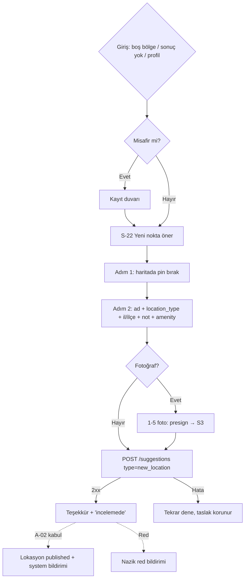

### Edge case'ler
- **Mükerrer öneri:** Pin, mevcut published lokasyonun ~150 m yakınındaysa: "Bunu mu demek istedin?" kartı → mevcutsa S-09'a yönlendir ya da `edit_location` önerisine çevir (`suggestion_type = edit_location`).
- **Denizde/karada saçma pin:** Yalnızca uyarı; kesin engel yok (dalgakıran uçları geocoder'da kara/deniz sınırında olabilir).
- **Offline:** Sihirbaz taslağı yerelde saklanır; gönderim bağlantı ister.
- **Reverse geocode başarısız:** Şehir/ilçe alanları boş bırakılır, elle giriş istenir.

---

## Akış 10 — Hatalı Bilgi Bildirme

**Amaç:** Veri kalitesini toplulukla korumak.
**Ekran:** S-23 · **API:** `POST /reports`

### Adımlar
1. S-09 üç-nokta menü → "Hata bildir" → misafirse kayıt duvarı → **S-23** (bottom sheet/ekran).
2. Neden seçimi (`report_reason`): `wrong_info` (bilgi yanlış), `closed_permanently` (kalıcı kapalı), `wrong_photo` (fotoğraf yanlış), `wrong_position` (konum yanlış), `other`.
3. `wrong_position` seçilirse mini haritada doğru konum pini istenir (opsiyonel); diğerlerinde serbest açıklama alanı.
4. Gönder → `POST /reports` → onay mesajı: "Bildirimin için teşekkürler, ekibimiz inceleyecek."
5. Admin tarafında rapor A-02/A-04 kuyruklarına düşer; çözüm kritik değişiklikse `audit_logs`'a yazılır.

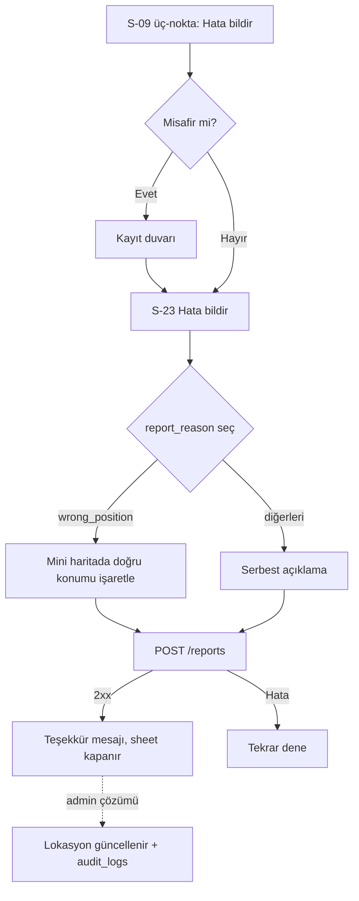

### Edge case'ler
- **Spam koruması:** Aynı kullanıcı + aynı lokasyon + aynı neden için 24 saatte tek aktif rapor; tekrarında "Bildirimin zaten incelemede".
- **Offline:** Gönderim engellenir, açıklama metni korunur.
- **`closed_permanently` yoğunluğu:** Aynı lokasyona kısa sürede ≥3 benzer rapor admin kuyruğunda öncelik rozeti alır (operasyon kuralı).

---

## Akış 11 — Favorilere Ekleme

**Amaç:** Kişisel kısayol listesi; dönüş ziyaretlerinin çapası.
**Ekran:** S-16 · **API:** `PUT/DELETE /favorites/{locationId}`, `GET /favorites`

### Adımlar
1. S-09 (ya da S-06 alt kartı) kalp ikonu → misafirse kayıt duvarı; kayıtlıysa **optimistic** olarak kalp dolar → `PUT /favorites/{locationId}`.
2. Alt sekme **Favoriler** → **S-16**: liste (kapak, ad, tip, puan, şehir) + üstte mini harita görünümü anahtarı.
3. Listeden tap → S-09; satırda swipe ya da kalp → `DELETE /favorites/{locationId}` (hard delete, geri al snackbar'ı ile).
4. Favori lokasyonda önemli güncelleme olursa `favorite_update` bildirimi (Akış 12).

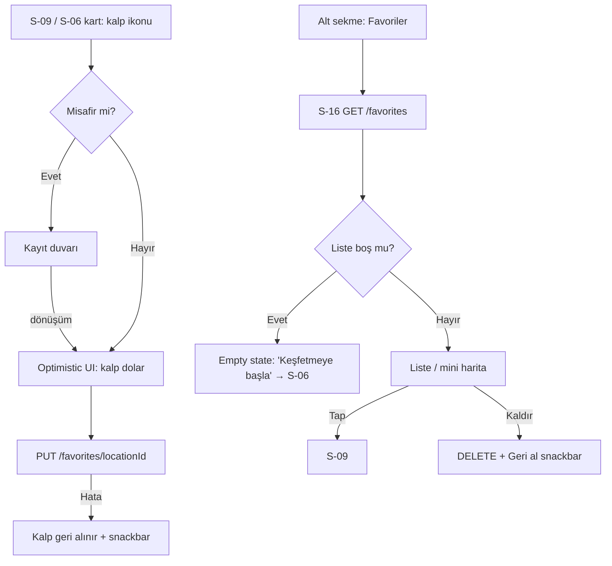

### Edge case'ler
- **Misafir + dönüşüm:** Duvar aşılınca bekleyen favori otomatik eklenir.
- **Offline:** Favori listesi cache'ten okunur; ekleme/çıkarma bağlantı ister (optimistic yapılmaz, çakışma riski).
- **Arşivlenen favori:** Listede soluk + "artık listelenmiyor" etiketi; tap → arşiv tam sayfa durumu; kullanıcı kaldırabilir.
- **Sıralama:** Varsayılan eklenme tarihi (yeni→eski); v1'de başka sıralama yok.

---

## Akış 12 — Bildirim Alma → Talep Durumu Görme

**Amaç:** Talep yaşam döngüsünü ve topluluk etkileşimini kullanıcıya geri beslemek.
**Ekranlar:** S-21, S-15 · **API:** `GET /notifications`, `POST /notifications/read`, `PUT /devices`

### Adımlar
1. Tetik: A-06'da operasyon, talebi `pending → contacted` (ya da `confirmed`/`cancelled`/`expired`) yapar → Edge Function `notifications` kaydı oluşturur + FCM push gönderir (`notification_type = booking_status`).
2. **Uygulama kapalı/arka planda:** Sistem bildirimi → tap → derin bağlantı ile ilgili yüzeye: `booking_status` → **S-15 talep detayı**; `new_photo`/`new_review`/`favorite_update` → **S-09**; `system` → S-21.
3. **Uygulama açıkken:** In-app banner + S-19 Profil'deki zil rozet sayacı artar.
4. **S-21 Bildirimler:** ters kronolojik liste, tip ikonlarıyla; görüntülenenler `POST /notifications/read` ile okundu işaretlenir; tap → ilgili derin bağlantı.
5. **S-15 talep detayı:** durum zaman çizgisi (`pending → contacted → confirmed | cancelled | expired`), lokasyon özeti, tarihler, not; `pending`/`contacted` iken "Talebi iptal et".

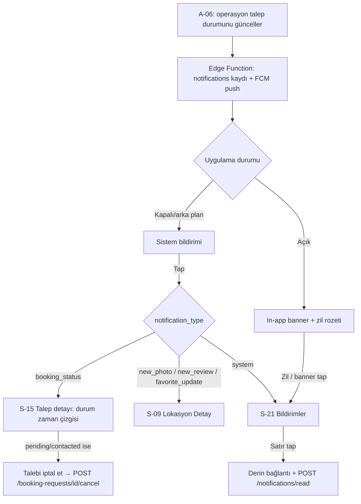

### Edge case'ler
- **Push izni reddedilmiş:** Push gitmez ama in-app `notifications` listesi (S-21) her zaman çalışır; S-20'de "bildirimleri aç" yönlendirmesi.
- **Misafir:** FCM token kaydı yapılır ama v1'de misafire yönelik bildirim üretilmez (talep/favori zaten kayıtlı gerektirir); S-21 misafirde boş durum + kayıt CTA'sı.
- **Silinmiş içeriğe derin bağlantı:** Hedef kayıt yoksa "İçerik artık mevcut değil" durumu + geri.
- **Token yenilenmesi:** FCM token rotate olduğunda `PUT /devices` sessizce günceller; çoklu cihaz desteklenir.
- **Offline'da S-21:** Cache'teki bildirimler okunur; okundu işaretleme bağlantı gelince gönderilir.

---

## Ek: Akışlar Arası Genel Durum Haritası

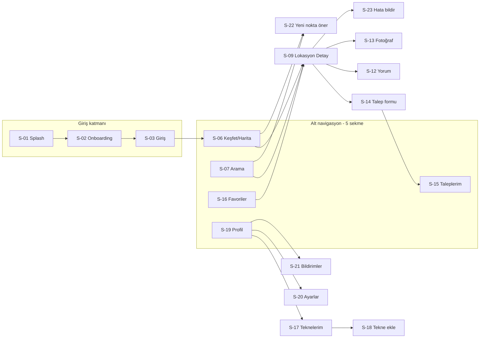

*Ekran bazlı ayrıntılar (bileşenler, boş/hata durumları, analytics event'leri) için: `07-ekran-listesi.md`.*
