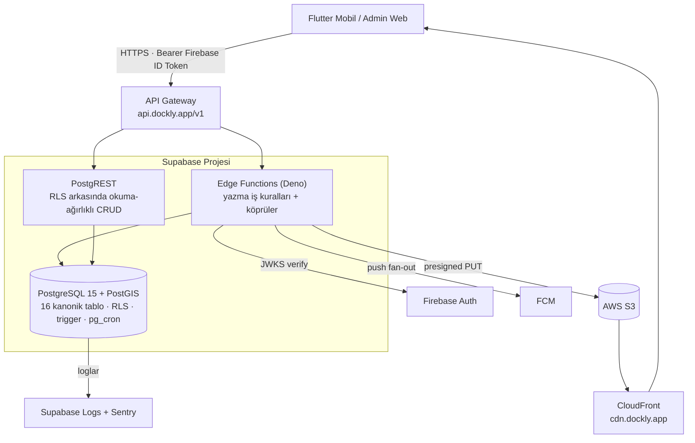
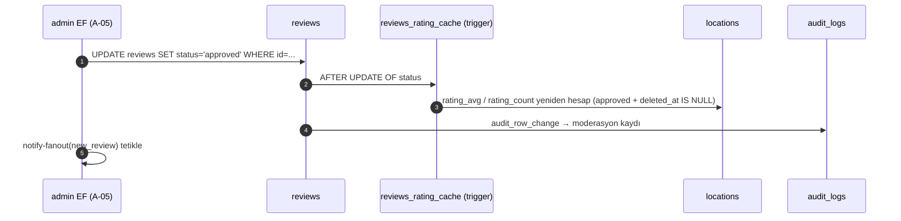
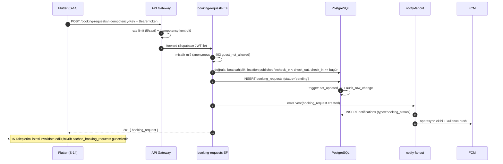

# Dockly — Backend Mimarisi

> **Doküman No:** 11 · **Durum:** Onaylı · **Bağlı olduğu kaynak:** [`00-foundation.md`](./00-foundation.md)
> İlgili dokümanlar: [`02-teknik-mimari.md`](./02-teknik-mimari.md) (sistem geneli), [`03-klasor-yapisi.md`](./03-klasor-yapisi.md) (`supabase/` ağacı). Tablo, enum ve endpoint adları foundation ile **birebir** tutarlıdır.

---

## İçindekiler

1. [Genel Bakış](#1-genel-bakış)
2. [Supabase Bileşenleri](#2-supabase-bileşenleri)
3. [API Gateway Katmanı](#3-api-gateway-katmanı)
4. [Endpoint → Mekanizma Eşlemesi](#4-endpoint--mekanizma-eşlemesi)
5. [Row Level Security (RLS) Stratejisi](#5-row-level-security-rls-stratejisi)
6. [Edge Function Sorumlulukları](#6-edge-function-sorumlulukları)
7. [Veritabanı Trigger'ları](#7-veritabanı-triggerları)
8. [Background Job'lar](#8-background-joblar)
9. [S3 Bucket Yapısı ve CDN Stratejisi](#9-s3-bucket-yapısı-ve-cdn-stratejisi)
10. [Rate Limiting ve Idempotency](#10-rate-limiting-ve-idempotency)
11. [Webhook ve Gelecek Entegrasyon Noktaları](#11-webhook-ve-gelecek-entegrasyon-noktaları)
12. [Ortamlar (dev / staging / prod)](#12-ortamlar-dev--staging--prod)
13. [Docker Kullanımı](#13-docker-kullanımı)

---

## 1. Genel Bakış



Temel ilke: **okuma yolu ince, yazma yolu kalın.** Filtreli okumalar RLS'e güvenerek PostgREST'ten geçer; iş kuralı içeren her yazma bir Edge Function'dan geçer. İstemci hiçbir zaman doğrudan veritabanına yazmaz.

---

## 2. Supabase Bileşenleri

### 2.1 PostgreSQL 15 + PostGIS

- Foundation §5'teki 16 kanonik tablo: `users`, `boats`, `locations`, `amenities`, `location_amenities`, `photos`, `reviews`, `favorites`, `recently_viewed`, `booking_requests`, `suggestions`, `reports`, `notifications`, `devices`, `audit_logs`, `app_settings`.
- Extension'lar (`0001_extensions.sql`): `postgis` (geo), `pg_trgm` (fuzzy arama), `pgcrypto` (`gen_random_uuid()`), `pg_cron` (background job'lar).
- `locations.geo` → `geography(Point,4326)` + GIST index. Bbox sorgusu: `ST_Intersects(geo, ST_MakeEnvelope(...)::geography)`; yakınlık: `ST_DWithin`.
- Arama: `locations(name, city)` üzerinde GIN `pg_trgm` — S-07'nin "marina, iskele, şehir, ilçe, koy, restoran, yakıt" araması `similarity()` + tip filtresiyle çözülür.
- `audit_logs` aylık partition'a hazır tasarlanır (`PARTITION BY RANGE (created_at)` v1'de tek partition, büyüyünce aylık açılır).

### 2.2 PostgREST — Ne İçin KULLANILIR / KULLANILMAZ

| ✅ KULLANILIR | ❌ KULLANILMAZ |
|---|---|
| Filtreli, sayfalı **okumalar**: lokasyon listesi/detay, yorum listesi, favoriler, bildirimler, tekneler, taleplerim | Çok adımlı transaction gerektiren yazmalar (rezervasyon talebi + bildirim) |
| Basit, tek tablo, RLS'in tek başına koruyabildiği **CRUD**: favori ekle/sil, recently_viewed upsert, profil PATCH, tekne CRUD | Harici servis dokunuşları (S3 presign, FCM, Firebase verify) |
| Admin panelin okuma-ağırlıklı listeleri (A-01 dashboard sorguları view üzerinden) | İş kuralı doğrulaması gerektiren yazmalar (yorumda tek-aktif-yorum kuralı dışındaki ek kurallar, talep durum makinesi) |
| RPC olarak açılan salt-okunur SQL fonksiyonları (örn. `locations_in_bbox`) | Rate limit / idempotency gerektiren uçlar (bunlar gateway+EF katmanında) |

Karar kuralı: **"Tek SQL ifadesi + RLS yetmiyorsa Edge Function."**

### 2.3 Edge Functions (Deno)

`supabase/functions/` altındaki kanonik liste (klasör yapısı: `03-klasor-yapisi.md` §4):

| Function | Sorumluluk özeti |
|---|---|
| `auth-session` | Firebase ID token doğrulama → `users` upsert → Supabase JWT köprüsü |
| `photos-presign` | S3 presigned PUT üretimi + kota/MIME kontrolü |
| `photos-complete` | S3 doğrulama + `photos` kaydı (`moderation_status='pending'`) |
| `booking-requests` | Talep oluşturma/iptal durum makinesi + fan-out tetikleme |
| `notify-fanout` | `notifications` insert + `devices` üzerinden FCM multicast |
| `suggestions` | `POST /suggestions` (payload JSONB doğrulama, `suggestion_type`) |
| `reports` | `POST /reports` (`report_reason` doğrulama, spam kontrolü) |
| `devices` | `PUT /devices` FCM token upsert |
| `admin` | `/admin/*` alt router: moderasyon, lokasyon CRUD, talep işleme, rol yönetimi |
| `jobs/*` | Zamanlanmış işler (bkz. §8) — pg_cron → HTTP tetiklemeli |

---

## 3. API Gateway Katmanı

`https://api.dockly.app/v1` tek giriş kapısıdır; istemciler Supabase URL'lerini hiç görmez.

Sorumluluklar:

1. **Routing:** Path'e göre Edge Function veya PostgREST'e yönlendirme (§4 tablosu). PostgREST'e giden isteklerde public query dili dışarı sızmaz; gateway `/locations?bbox=...` gibi temiz parametreleri PostgREST/RPC sözdizimine çevirir.
2. **Kimlik:** `Authorization: Bearer <Firebase ID Token>` kabası doğrulama (imza+exp), Supabase JWT köprüsü cache'i (02 §6).
3. **Rate limiting** ve **idempotency** (§10).
4. **CORS:** Yalnızca `https://admin.dockly.app` ve mobil WebView origin'leri.
5. **Sürümleme:** `/v1` sabit sözleşme; kırıcı değişiklik `/v2` açar (foundation §9 modülerlik).
6. **Hata normalizasyonu:** Tüm hatalar kanonik formata çevrilir: `{ "error": { "code": "string", "message": "string", "details": {} } }`.
7. **Sayfalama sözleşmesi:** cursor-based `?cursor=&limit=` (varsayılan limit 20, max 100); yanıt `{ data: [...], next_cursor: string|null }`.

---

## 4. Endpoint → Mekanizma Eşlemesi

Foundation §6'daki kanonik API yüzeyinin birebir eşlemesi:

| Endpoint (foundation §6) | Mekanizma | Not |
|---|---|---|
| `POST /auth/session` | Edge Function `auth-session` | Firebase→Supabase köprüsü |
| `GET /users/me` | PostgREST | RLS: kendi satırı |
| `PATCH /users/me` | PostgREST | RLS + kolon whitelist (role değiştirilemez) |
| `GET /boats`, `GET /boats/{id}` | PostgREST | RLS: `user_id = auth.uid()` |
| `POST /boats`, `PATCH /boats/{id}` | PostgREST | RLS + CHECK constraint'ler; `is_primary` tekilliği trigger ile |
| `DELETE /boats/{id}` | PostgREST | Soft delete (RLS'li `UPDATE deleted_at`) |
| `GET /locations` (bbox, filtre, arama) | PostgREST **RPC** `locations_in_bbox` | PostGIS + amenity + `location_type` + `price_tier` filtreleri, cursor sayfalama |
| `GET /locations/{id}` | PostgREST | `status='published'` herkese açık |
| `GET /locations/{id}/reviews` | PostgREST | Yalnızca `status='approved'` (+ kendi pending'i) |
| `POST /locations/{id}/reviews` | Edge Function (`admin`/reviews yolu değil; `reviews` mantığı `booking-requests` gibi ayrı handler içinde `suggestions` fonksiyonuyla AYNI DEĞİL — kendi yazma yolu) | Tek aktif yorum kuralı, `moderation_status='pending'`, rating trigger'ı approve'da çalışır |
| `DELETE /reviews/{id}` | PostgREST | Soft delete, RLS: sahibi veya moderator+ |
| `POST /photos/presign` | Edge Function `photos-presign` | S3 dokunuşu |
| `POST /photos/complete` | Edge Function `photos-complete` | HeadObject doğrulama |
| `GET /favorites` | PostgREST | RLS: kendi kayıtları |
| `PUT /favorites/{locationId}` | PostgREST | Upsert; hard delete tablosu |
| `DELETE /favorites/{locationId}` | PostgREST | Hard delete (foundation §5) |
| `GET/POST /recently-viewed` | PostgREST | Upsert RPC (`recently_viewed_upsert`) |
| `GET /booking-requests` | PostgREST | RLS: kendi talepleri |
| `POST /booking-requests` | Edge Function `booking-requests` | Doğrulama + `pending` + fan-out; idempotency zorunlu |
| `POST /booking-requests/{id}/cancel` | Edge Function `booking-requests` | Durum makinesi: yalnızca `pending`/`contacted` → `cancelled` |
| `POST /suggestions` | Edge Function `suggestions` | `payload JSONB` şema doğrulaması |
| `GET /notifications` | PostgREST | RLS: `user_id = auth.uid()` |
| `POST /notifications/read` | PostgREST RPC `notifications_mark_read` | Toplu `read_at` güncelleme |
| `POST /reports` | Edge Function `reports` | `report_reason` + tekrar bildirim kontrolü |
| `PUT /devices` | Edge Function `devices` | FCM token upsert + eski token temizliği |
| `/admin/*` | Edge Function `admin` | `role >= moderator`; her yazma `audit_logs`'a düşer |

---

## 5. Row Level Security (RLS) Stratejisi

Genel ilkeler:

- **Tüm tablolarda RLS açıktır** (`ENABLE ROW LEVEL SECURITY`); politikasız tablo = erişimsiz tablo.
- Supabase JWT claim'leri: `sub` = `users.id`, `role` = `user_role`. Yardımcı SQL fonksiyonları: `auth_user_id()`, `auth_role()`, `is_moderator_or_above()`.
- Soft delete'li tablolarda tüm SELECT politikaları `deleted_at IS NULL` koşulunu içerir.
- Edge Function'lar `service_role` ile çalışır (RLS bypass) ama **her sorguda `user_id` filtresini kod içinde açıkça uygular** — savunma iki katmanlıdır.
- Rol hiyerarşisi (foundation §4): `user < moderator < admin < super_admin`.

### Tablo Bazında Politika Özeti

| Tablo | SELECT | INSERT | UPDATE | DELETE |
|---|---|---|---|---|
| `users` | Kendi satırı; moderator+ tümü | Yalnızca EF (`auth-session`) | Kendi satırı (role/`firebase_uid` hariç kolonlar); rol değişikliği yalnızca super_admin | Soft delete, admin+ |
| `boats` | Sahibi; moderator+ tümü | Sahibi (`user_id = auth_user_id()`) | Sahibi | Soft delete, sahibi |
| `locations` | `status='published'` **herkese açık (anon dahil)**; `draft/archived` yalnızca moderator+ | moderator+ | moderator+ (audit'li) | Soft delete, admin+ |
| `amenities` | Herkese açık (referans tablo) | admin+ | admin+ | admin+ |
| `location_amenities` | Herkese açık (published lokasyonlar üzerinden) | moderator+ | moderator+ | moderator+ |
| `photos` | `moderation_status='approved'` herkes; `pending/rejected` yalnızca sahibi + moderator+ | Sahibi (EF `photos-complete` üzerinden) | Sahibi (caption); moderasyon alanları moderator+ | Soft delete, sahibi veya moderator+ |
| `reviews` | `status='approved'` herkes; kendi `pending` kayıtları; moderator+ tümü | Sahibi; `UNIQUE(location_id, user_id) WHERE deleted_at IS NULL` | Sahibi (yalnızca `pending` iken); moderasyon moderator+ | Soft delete, sahibi veya moderator+ |
| `favorites` | Sahibi | Sahibi | — (yok) | Hard delete, sahibi |
| `recently_viewed` | Sahibi | Sahibi (upsert) | Sahibi | Sahibi |
| `booking_requests` | Sahibi; moderator+ tümü | Sahibi (EF üzerinden) | Durum geçişleri: kullanıcı yalnızca `cancel`; diğer geçişler moderator+ (A-06) | Soft delete, admin+ |
| `suggestions` | Sahibi; moderator+ tümü | Sahibi | moderator+ (durum) | Soft delete, admin+ |
| `reports` | Sahibi; moderator+ tümü | Sahibi | moderator+ | Soft delete, admin+ |
| `notifications` | Sahibi | Yalnızca EF (`notify-fanout`) | Sahibi (yalnızca `read_at`) | — |
| `devices` | Sahibi | Sahibi (EF `devices`) | Sahibi | Sahibi + EF (geçersiz token temizliği) |
| `audit_logs` | admin+ (super_admin tümü) | Yalnızca trigger/EF | — (append-only) | — (append-only) |
| `app_settings` | Herkese açık (`is_public=true` key'ler); tümü admin+ | super_admin | super_admin | super_admin |

**Misafir (anon) erişimi:** Anonim Firebase kullanıcısı da `users` satırı alır ve `user` rolüyle JWT taşır; keşif uçları (`locations`, `amenities`, approved `photos`/`reviews`) böylece hem tam anonim hem misafir oturumda çalışır. Yazma politikaları misafiri engellemez — engelleme istemci `authGuard` + gateway kural katmanındadır; kalıcı hesap şartı aranan uçlarda (`booking-requests`) EF, `firebase.sign_in_provider == 'anonymous'` ise `403 guest_not_allowed` döner.

---

## 6. Edge Function Sorumlulukları

### 6.1 `auth-session` — Auth Köprüsü

1. `Authorization` header'ından Firebase ID token'ı alır; Google JWKS ile imza, `aud`, `iss`, `exp` doğrular.
2. `users` tablosunda `firebase_uid` ile upsert (ilk girişte `role='user'`, `country_code='TR'`, `locale` cihazdan).
3. `sub=users.id`, `role` claim'li kısa ömürlü Supabase JWT üretir; yanıt: `{ supabase_jwt, expires_in, user }`.
4. Soft-delete'li kullanıcı girerse hesap `deleted_at=NULL` ile reaktive edilir ve `audit_logs`'a yazılır.

### 6.2 `photos-presign` / `photos-complete` — Presigned URL

- `presign`: sahiplik doğrulama (`owner_type`: location/boat/review), MIME whitelist (`image/jpeg|png|webp`), boyut < 10 MB, kullanıcı kotası (20 upload/saat), S3 key üretimi (§9 şeması), 5 dk geçerli PUT URL.
- `complete`: `HeadObject` ile obje varlığı+boyut doğrulanır, `photos` satırı `moderation_status='pending'` ile yazılır. `complete` gelmeyen presign kayıtları `jobs/cleanup-uploads` ile 24 saatte temizlenir.

### 6.3 `booking-requests` — Rezervasyon Talebi İşleme

- **Create:** JSON şema + iş kuralı doğrulama (`check_in < check_out`, `check_in >= bugün`, `boat_id` kullanıcıya ait, lokasyon `published`, `boat_length_m <= locations.max_boat_length_m` ise uyarı alanı). Kayıt `status='pending'` doğar; transaction içinde `notify-fanout` tetiklenir (operasyon ekibine `system`, kullanıcıya `booking_status`).
- **Cancel:** Durum makinesi korunur — `pending → contacted → confirmed | cancelled | expired` (foundation §4). Kullanıcı yalnızca `pending`/`contacted` durumundaki kendi talebini `cancelled` yapabilir; `confirmed/expired/cancelled` üzerinde geçiş `409 invalid_status_transition` döner.
- Operasyon geçişleri (`contacted`, `confirmed`) yalnızca `admin` fonksiyonu (A-06 ekranı) üzerinden yapılır; her geçiş `audit_logs` + `booking_status` bildirimi üretir.

### 6.4 `notify-fanout` — Bildirim Fan-out

- Girdi: `{ user_ids[], type: notification_type, payload }`. Adımlar: `notifications` insert (batch) → kullanıcı tercih filtresi (S-20) → `devices` token'larına FCM multicast → `UNREGISTERED` token'ları sil.
- `new_photo` / `new_review` fan-out'u favori sahiplerine gider: `SELECT user_id FROM favorites WHERE location_id = $1`.

### 6.5 Rating Cache ile İlişki

`locations.rating_avg` / `rating_count` **trigger ile** güncellenir (§7); Edge Function'lar bu alanlara asla elle yazmaz. `admin` fonksiyonundaki yorum moderasyonu (approve/reject) yalnızca `reviews.status` değiştirir, trigger gerisini yapar.

### 6.6 `admin` — Yetkili Yüzey

- Tüm handler'lar önce `role >= moderator` kontrolü yapar; rol yönetimi ve `app_settings` yazmaları `super_admin` ister.
- Kapsam: lokasyon CRUD (A-02, `draft→published→archived`), amenity yönetimi (A-03), fotoğraf/yorum moderasyonu (A-04/A-05), talep işleme (A-06), kullanıcı yönetimi (A-07), istatistik view'ları (A-08).
- Her yazma işlemi `audit_logs`'a `{ actor_id, action, entity, entity_id, before, after }` olarak düşer.

---

## 7. Veritabanı Trigger'ları

`0016_triggers.sql` içinde tanımlı kanonik trigger'lar:

| Trigger | Tablo(lar) | Görev |
|---|---|---|
| `set_updated_at` | Tüm tablolar | `BEFORE UPDATE` → `NEW.updated_at = now()` |
| `reviews_rating_cache` | `reviews` → `locations` | `AFTER INSERT OR UPDATE OF status, deleted_at` → ilgili lokasyonun `rating_avg NUMERIC(3,2)` ve `rating_count`'unu yalnızca `status='approved' AND deleted_at IS NULL` kayıtlar üzerinden yeniden hesaplar |
| `audit_row_change` | `locations`, `users`(rol), `booking_requests`(status), `app_settings`, `reviews`/`photos`(moderasyon) | `AFTER INSERT/UPDATE/DELETE` → `audit_logs`'a JSONB `before/after` diff yazar |
| `boats_single_primary` | `boats` | `is_primary=true` yapılan kayıtta kullanıcının diğer teknelerini `is_primary=false` yapar |
| `locations_slug_guard` | `locations` | `slug` normalizasyonu (lowercase, tr karakter dönüşümü) + `UNIQUE` çakışmasında suffix |
| `recently_viewed_cap` | `recently_viewed` | Kullanıcı başına son 50 kaydı tutar, eskisini siler |



---

## 8. Background Job'lar

Zamanlama: **pg_cron** (Postgres içi) → hafif SQL işleri doğrudan, harici dokunuş gerektirenler `net.http_post` ile ilgili `jobs/*` Edge Function'ını çağırır.

| Job | Zamanlama | Görev |
|---|---|---|
| `jobs/expire-booking-requests` | Saatlik | `status IN ('pending','contacted')` ve `check_in < CURRENT_DATE` olan talepleri `expired` yapar; `booking_status` bildirimi fan-out eder |
| `rating_recalc_full` (SQL) | Gecelik 04:00 | Trigger drift'ine karşı tüm `locations.rating_avg/rating_count` tam yeniden hesap (denetim amaçlı; fark bulursa loglar) |
| `jobs/cleanup-uploads` | Gecelik | `complete` edilmemiş 24 saatten eski presign kayıtlarını ve sahipsiz S3 objelerini temizler |
| `audit_partition_maintenance` (SQL) | Aylık | `audit_logs` için gelecek ayın partition'ını açar (foundation §5: aylık partition'a hazır) |
| `jobs/digest-notifications` | Gecelik | Okunmamış bildirim özetini (opsiyonel push) hazırlar; 90 günden eski okunmuş `notifications` kayıtlarını siler |
| `jobs/devices-prune` | Haftalık | 180 gündür güncellenmeyen FCM token'larını siler |

Job ilkeleri: her job **idempotent**tir (iki kez çalışsa aynı sonuç), çalışma kaydı `audit_logs`'a `actor='system'` ile düşer, hata durumunda Sentry'ye event atılır.

---

## 9. S3 Bucket Yapısı ve CDN Stratejisi

### 9.1 Bucket ve Klasörleme

Ortam başına tek bucket: `dockly-media-dev`, `dockly-media-staging`, `dockly-media-prod`.

```
dockly-media-prod/
├── photos/
│   ├── locations/{location_id}/{photo_id}.jpg        # lokasyon fotoğrafları (S-13)
│   ├── locations/{location_id}/{photo_id}_thumb.jpg  # istemci üretimi 512px varyant
│   ├── boats/{boat_id}/{photo_id}.jpg                # tekne fotoğrafları (S-18)
│   ├── reviews/{review_id}/{photo_id}.jpg            # yoruma ekli fotoğraflar (S-12)
│   └── avatars/{user_id}/{photo_id}.jpg              # profil (users.avatar_url)
└── system/
    └── map-icons/                                    # 9 location_type ikonu (statik)
```

Kurallar:

- Key'i **yalnızca `photos-presign` EF üretir**; istemci key seçemez. `photo_id` = `photos.id` (UUID) — tahmin edilemez, enumerate edilemez.
- Bucket **tamamen private**; okuma yalnızca CloudFront OAC (Origin Access Control) üzerinden, yazma yalnızca presigned PUT ile.
- Lifecycle: `rejected` fotoğrafların objeleri 30 gün sonra silinir; soft-delete edilen kayıtların objeleri 90 gün sonra Glacier'a taşınır; multipart yarım upload'lar 7 günde iptal.
- `photos` tablosu tek doğruluk kaynağıdır: `s3_key`, boyutlar, `moderation_status` orada; S3'te metadata aranmaz.

### 9.2 CDN Stratejisi (CloudFront)

- Domain: `cdn.dockly.app` → CloudFront → S3 OAC. İstemciye dönen tüm fotoğraf URL'leri CDN üzerindendir; S3 URL'i asla sızmaz.
- Cache-Control: `public, max-age=31536000, immutable` — key'ler içerik-adresli (UUID) olduğundan invalidation gerekmez; fotoğraf değişimi = yeni key.
- `pending/rejected` fotoğraflar CDN'e **çıkmaz**: API bu durumdaki fotoğraflar için kısa ömürlü (5 dk) CloudFront signed URL üretir (yalnızca sahibi ve moderatörler için).
- TR kullanıcı tabanı için Avrupa edge POP'ları (PriceClass_100 + Frankfurt/Milan) yeterlidir; ölçüm Sentry performance ile izlenir.
- İstemci tarafı: `cached_network_image` disk cache (02 §7.3) CDN'in üzerine ikinci katmandır.

---

## 10. Rate Limiting ve Idempotency

### 10.1 Rate Limiting (Gateway katmanı)

| Kapsam | Limit | Aşımda |
|---|---|---|
| Genel (kullanıcı başına) | 120 istek/dk | `429 rate_limited` + `Retry-After` |
| Anonim IP (auth öncesi + misafir keşif) | 60 istek/dk | `429` |
| `POST /auth/session` | 10/dk/IP | `429` (brute-force koruması) |
| `POST /photos/presign` | 20/saat/kullanıcı | `429 upload_quota_exceeded` |
| `POST /booking-requests` | 5/saat/kullanıcı | `429` |
| `POST /reviews`, `POST /suggestions`, `POST /reports` | 10/gün/kullanıcı | `429` (spam koruması) |
| `/admin/*` | 600/dk/kullanıcı | `429` |

Sayaçlar gateway'de kullanıcı `sub` (yoksa IP) anahtarıyla sliding-window tutulur. Tüm `429` yanıtları kanonik hata formatındadır: `{ "error": { "code": "rate_limited", ... } }`.

### 10.2 Idempotency

- Yan etkili POST uçları (`/booking-requests`, `/photos/complete`, `/suggestions`, `/reports`) **`Idempotency-Key` header'ı** kabul eder; `dockly_api` client'ı bunu otomatik üretir (UUID v4, retry'da aynı kalır).
- Gateway `(user_id, idempotency_key)` çiftini 24 saat saklar; tekrar istekte önceki yanıt aynen döner (`Idempotency-Replayed: true`).
- Veritabanı düzeyinde ikinci savunma: doğal benzersizlikler — `reviews UNIQUE(location_id, user_id) WHERE deleted_at IS NULL`, `favorites (user_id, location_id) PK`, `devices (user_id, device_id)` — çift kayıt oluşumunu constraint ile keser.
- Background job'lar ve fan-out çağrıları da idempotent tasarlanır (§8): `notify-fanout` aynı `(user_id, type, payload_hash)` bildirimini 5 dk penceresinde tekilleştirir.

---

## 11. Webhook ve Gelecek Entegrasyon Noktaları

v1'de dış webhook **yayınlanmaz**; ancak foundation §9 modülerlik sözleşmesine hazırlık olarak iç mimari genişlemeye açık bırakılır:

| Nokta | v1 durumu | Gelecek kullanım |
|---|---|---|
| `events` iç kanalı | EF'ler domain olaylarını (`booking_request.created`, `photo.approved`) tek bir iç `emitEvent()` yardımcıyla üretir; v1'de tek tüketici `notify-fanout` | Canlı rezervasyon, ödeme, marina paneli tüketicileri olay kanalına abone olur |
| `POST /webhooks/payments` (rezerve path) | Route rezerve, `501 not_implemented` | Online ödeme sağlayıcı callback'i (foundation §9: `payments` domain arayüzü boş) |
| `availability` tablosu | Yer ayrıldı, migration yok | Canlı müsaitlik senkronu (`booking_requests.status` genişletilebilir) |
| Harita katman verisi | `MapLayer` istemci arayüzü hazır (02 §10.1) | Hava durumu / AIS / Rota / Garmin sağlayıcı proxy EF'leri |
| `country_code` | Tüm içerik tablolarında mevcut, v1'de `TR` sabit | Avrupa/Global açılım — API sözleşmesi değişmeden |
| API sürümleme | `/v1` dondurulmuş sözleşme | Kırıcı değişiklikler `/v2` altında |

---

## 12. Ortamlar (dev / staging / prod)

| Boyut | dev | staging | prod |
|---|---|---|---|
| Supabase | Lokal (`supabase start`, Docker) veya `dockly-dev` projesi | `dockly-staging` projesi | `dockly-prod` projesi |
| API domain | `http://localhost:54321` / `api.dev.dockly.app` | `api.staging.dockly.app` | `api.dockly.app` |
| Firebase | `dockly-dev` projesi (test telefon numaraları açık) | `dockly-staging` | `dockly-prod` |
| S3/CDN | `dockly-media-dev` / CDN yok (direkt presigned GET) | `dockly-media-staging` + staging CF | `dockly-media-prod` + `cdn.dockly.app` |
| Mapbox token | Dev token (kısıtlı kota) | Staging token | Prod token (bundle-id kısıtlı) |
| Seed | `seed/` tamamı (örnek lokasyonlar dahil) | `seed_amenities` + `seed_app_settings` + anonim kopya veri | Yalnızca `seed_amenities`, `seed_app_settings` |
| Flutter entry | `main_dev.dart` | `main_staging.dart` | `main_prod.dart` |

Kurallar:

- **Migration akışı tek yönlü:** dev'de yazılır → CI, staging'e `supabase db push` uygular → smoke test → prod'a aynı migration seti uygulanır. Prod'a elle SQL çalıştırmak yasaktır.
- Sırlar GitHub Secrets + Supabase secrets'ta tutulur (`FIREBASE_PROJECT_ID`, `S3_ACCESS_KEY`, `FCM_SERVICE_ACCOUNT`); repoda `.env` yalnızca `*.example` olarak bulunur.
- Ortamlar arası veri kopyası yalnızca staging yönünde ve PII anonimleştirilerek yapılır.
- Her ortamın Sentry environment etiketi ayrıdır; Supabase Logs + Crashlytics aynı şekilde ortam-etiketlidir (foundation §2 izleme yığını).

---

## 13. Docker Kullanımı

Foundation §2: *Container — Docker (Edge Function'lar ve admin web build/deploy).*

1. **Lokal geliştirme:** `supabase start`, tüm stack'i (Postgres+PostGIS, PostgREST, Edge Runtime, Studio) Docker Compose ile ayağa kaldırır; geliştirici prod ile aynı Postgres 15 + extension setini kullanır.
2. **Edge Functions:** `supabase/functions/*` lokalde `supabase functions serve` (Deno edge-runtime container'ı) ile test edilir; CI'da aynı imajla integration test koşulur → parite garantisi.
3. **Admin web:** `apps/admin_web/Dockerfile` — çok aşamalı build:
   ```dockerfile
   FROM ghcr.io/cirruslabs/flutter:3.x AS build
   WORKDIR /app
   COPY . .
   RUN flutter build web --release --target lib/main_prod.dart
   FROM nginx:alpine
   COPY --from=build /app/build/web /usr/share/nginx/html
   COPY nginx.conf /etc/nginx/conf.d/default.conf   # SPA fallback + cache header'ları
   ```
   İmaj GitHub Actions'ta build edilir, GHCR'a push'lanır, staging/prod'a tag ile deploy edilir.
4. **CI:** GitHub Actions workflow'ları (`.github/workflows/`) test aşamasında `supabase start` servis container'larını kullanır; pgTAP RLS testleri (`supabase/tests/`) bu container'a karşı koşar.
5. Mobil uygulama build'i Docker'da **yapılmaz** (iOS imzalama gereği); Fastlane + Codemagic/GitHub Actions runner'ları kullanılır (foundation §2 CI/CD).

---

## Ek: Yazma Yolu Uçtan Uca Örnek — Rezervasyon Talebi



> Bu doküman backend'in kanonik referansıdır. Şema detayı migration dosyalarında (`supabase/migrations/`, adlandırma: `03-klasor-yapisi.md` §4), istemci tarafı akışlar `02-teknik-mimari.md`'dedir.
