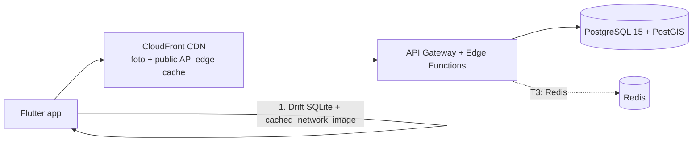

# Dockly — Ölçeklenebilirlik Planı (13)

> Bu doküman [00-foundation.md](00-foundation.md) kanonik temel dokümanına bağlıdır. Teknoloji yığını: Supabase (PostgreSQL 15 + PostGIS, PostgREST, Edge Functions/Deno), Firebase Auth/FCM, AWS S3 + CloudFront, Mapbox, Drift client cache.
> İlke: **erken optimizasyon yok, ama erken ölçüm ve mimari hazırlık var.** v1 kod tabanı, aşağıdaki geçişleri yeniden yazım olmadan kaldıracak şekilde tasarlanır.

---

## 1. Büyüme Senaryoları

### 1.1 Kademeler
| Kademe | Kayıtlı kullanıcı | MAU (tahmin) | Pik eşzamanlı | Lokasyon sayısı | Günlük API isteği |
|---|---|---|---|---|---|
| T1 — Lansman | 10K | 4K | ~300 | ~2.500 (TR kıyıları) | ~1,5M |
| T2 — Büyüme | 100K | 35K | ~3.000 | ~6.000 (TR tam kapsama) | ~15M |
| T3 — Bölgesel | 1M | 300K | ~25.000 | ~40.000 (TR + AB kıyıları) | ~120M |

Varsayımlar: kullanıcı başına oturumda ~40 API çağrısı; okuma/yazma oranı ~50:1 (keşif ağırlıklı ürün); harita ekranı (S-06) trafiğin ~%60'ını üretir.

### 1.2 Sezonluk Yaz Pik'i (Türkiye kıyıları)
- Denizcilik sezonu Mayıs–Ekim; **Temmuz–Ağustos trafiği kış aylarının 6–10 katı.** Hafta içi/hafta sonu farkı 2x; gün içi pik 10:00–13:00 ve 17:00–20:00 (demirleme kararı saatleri).
- Bayram haftaları (özellikle Kurban Bayramı yaza denk geldiğinde) ekstra 2x ani sıçrama.
- Coğrafi yoğunlaşma: Bodrum–Göcek–Fethiye hattı + Çeşme + Ayvalık, isteklerin ~%70'i. Bu, cache hit oranını YÜKSELTİR (aynı bbox'lar, aynı lokasyon detayları) — CDN stratejisi buna göre kurulur (§4).
- Kapasite kuralı: altyapı hedefi = yaz pik tahmini × 2 headroom; sonbaharda ölçek küçültme (Supabase compute tier, replica sayısı) maliyet için planlıdır.
- Sezon öncesi (Nisan) yük testi zorunlu: k6 ile T(n) pik profili + %100 marj senaryosu (bkz. §10).

### 1.3 Ölçekleme Tetikleyicileri (ne zaman harekete geçilir)
| Sinyal | Eşik | Aksiyon |
|---|---|---|
| DB CPU (sustained) | > %60 (7g ort.) | Compute upgrade / replica değerlendir |
| Connection sayısı | > pool'un %70'i | pgBouncer ayarı / pool artır |
| API p95 | > 400ms (3 gün) | Profiling + cache/index çalışması |
| CDN hit oranı (lokasyon listeleri) | < %80 | Cache key/TTL revizyonu |
| S3 + CloudFront aylık maliyet | Bütçe %120 | Varyant/lifecycle gözden geçirme |

---

## 2. Veritabanı Ölçekleme

### 2.1 Connection Pooling (pgBouncer)
- Supabase yerleşik pgBouncer (Supavisor) **transaction mode** kullanılır; PostgREST ve Edge Functions doğrudan DB portuna değil pooler'a bağlanır.
- Edge Functions (Deno) her istekte bağlantı açmaz: supabase-js REST üzerinden gider (bağlantı maliyeti PostgREST'te amorti). Raw SQL gereken fonksiyonlar pooler DSN kullanır, `prepared statements` transaction modda kapalı tutulur.
- Boyutlandırma: T1 pool 40, T2 120, T3 300+ (compute tier ile birlikte). `default_pool_size` ve `max_client_conn` her tier geçişinde yük testiyle doğrulanır.
- İzleme: `pg_stat_activity` bekleyen bağlantı sayısı, pooler queue wait — Supabase Logs → haftalık rapor.

### 2.2 Read Replica Planı
- **T1:** tek primary yeterli (okuma/yazma 50:1 olsa da mutlak hacim düşük).
- **T2:** 1 read replica (aynı bölge). Yönlendirme Edge Function katmanında: `GET /locations`, `GET /locations/{id}`, arama ve yorum listeleri replica'ya; tüm yazmalar + "kendi verini hemen görme" gereken okumalar (`GET /booking-requests` yazım sonrası) primary'ye. Replication lag toleransı: lokasyon içeriği için < 10s kabul edilebilir (içerik admin kaynaklı, yavaş değişir).
- **T3:** 2+ replica + coğrafi replica (AB açılımıyla Frankfurt zaten merkez; gerekirse ikinci bölge read-only). PostgREST'in ayrı bir read-only instance'ı replica DSN ile çalıştırılır.
- Read-your-writes tutarlılığı: yazma yapan istekten sonra 15 sn boyunca o kullanıcının ilgili kaynak okumaları primary'ye sabitlenir (Edge'de kullanıcı bazlı kısa TTL işaret).

### 2.3 PostGIS Sorgu Optimizasyonu
Kritik sorgu: harita bbox sorgusu (`GET /locations?bbox=...&type=...`).
- `locations.geo geography(Point,4326)` üzerinde GIST index (kanonik, foundation §5) + `locations(type, status)` B-tree birleşimi.
- Sorgu kalıbı: `WHERE geo && ST_MakeEnvelope(...)::geography AND status = 'published' AND deleted_at IS NULL AND type = ANY($types)` — `&&` operatörü GIST kullanır; `ST_DWithin` yalnız yarıçap aramalarında ("yakınımdaki" özelliği).
- Sonuç sınırı: bbox başına max 200 satır + zoom'a göre önem sıralaması (`rating_count DESC`), fazlası cluster endpoint'e devredilir (§5.2).
- Kolon diyeti: harita pin'i için dar bir view (`api.map_pins`: id, slug, name, type, lon, lat, price_tier, rating_avg) — geniş satır okumasını engeller, index-only scan'e yaklaşır.
- Bakım: `ANALYZE` autovacuum ayarları `locations` için agresifleştirilir (yaz sezonunda yoğun rating cache güncellemesi); çeyreklik `EXPLAIN (ANALYZE, BUFFERS)` regresyon kontrolü (hedefler 14-performans-plani.md §7'de).

### 2.4 Partitioning — audit_logs Aylık
- `audit_logs` foundation'da "aylık partition'a hazır" işaretli; **T1'de declarative range partitioning devreye alınır** (sonradan dönüştürmek pahalı):
  - `PARTITION BY RANGE (created_at)`; partition adı `audit_logs_y2026m07` biçiminde.
  - `pg_partman` (veya aylık scheduled Edge Function + SQL) ile 3 ay önden partition açılır.
  - Saklama: 24 ay çevrimiçi → S3'e `COPY ... TO` Parquet export → partition `DETACH` + `DROP` (güvenlik planı §9 ile uyumlu).
- Diğer adaylar (T2+ gözden geçirilir): `notifications` (user_id hash veya aylık range — okundu bildirimleri hızla soğur), `recently_viewed` (90 gün TTL, partition yerine planlı DELETE + partial index yeterli).
- Global unique index gereksinimi olmayan tasarım korunur (partition key her zaman `created_at` içerir).

### 2.5 Diğer DB Kalemleri
- Rating cache trigger'ı (`locations.rating_avg/rating_count`) satır kilidi çekişmesi yaratırsa T2'de kuyruklu (debounced) güncellemeye taşınır.
- `pg_trgm` GIN index'i (arama) büyüdükçe `gin_pending_list_limit` ayarı ve gece `gin_clean_pending_list`.
- PITR yedekleme her tier'da açık; restore drill 6 ayda bir (güvenlik planı §10).

---

## 3. API Ölçekleme

### 3.1 Edge Functions Auto-scale
- Supabase Edge Functions (Deno Deploy altyapısı) yatay auto-scale'dir; bizim sorumluluğumuz **soğuk başlatma ve fonksiyon disiplinidir**:
  - Fonksiyon başına bundle küçük tutulur (< 1MB hedef); ağır bağımlılık (image processing) ayrı işleme hattına (S3 event → ayrı worker) taşınır.
  - Global scope'ta yeniden kullanılabilir client'lar (supabase-js, JWKS cache) — istek başına kurulum yok.
  - CPU süresi limiti aşan işler (toplu bildirim, export) senkron API'den çıkarılır → kuyruk (pg-boss / Supabase Queues) + scheduled function.
- API Gateway (`api.dockly.app`): route bazlı timeout (okuma 10s, yazma 30s), retry yalnız idempotent GET'lerde.
- Kapasite testi: fonksiyon başına RPS tavanı sezon öncesi ölçülür; PostgREST yolunun (basit CRUD) Edge fonksiyonuna tercih edildiği yerler belgelenir (PostgREST daha ucuz ölçeklenir).

### 3.2 CDN Cache Stratejisi — Lokasyon Listeleri Edge Cache + SWR
Kanonik strateji: **okuma ağırlıklı, yavaş değişen içerik CDN'de yaşar.**

| İçerik | Cache | TTL | Yenileme |
|---|---|---|---|
| `GET /locations` (bbox grid'e yuvarlanmış + filtre normalize) | CloudFront edge cache | 60s + `stale-while-revalidate=300` | SWR arka planda tazeler |
| `GET /locations/{id}` (public detay) | Edge cache | 300s + SWR 600 | Admin publish → invalidation |
| Cluster endpoint (§5.2) | Edge cache | 120s + SWR 600 | Zamanla dolar |
| `amenities` sözlüğü | Edge cache | 24h | Versiyonlu URL |
| Kullanıcıya özel uçlar (favorites, booking-requests, notifications) | **CACHE YOK** (`Cache-Control: private, no-store`) | — | — |

- **Cache key normalizasyonu:** bbox koordinatları zoom'a göre grid'e yuvarlanır (ör. z12'de 0.02°) — sonsuz key kombinasyonu engellenir, hit oranı yükselir. Filtre parametreleri sıralanıp kanonikleştirilir; `Authorization` header'ı bu public uçlarda cache key'ine DAHİL EDİLMEZ (yanıt kullanıcıdan bağımsızdır).
- **Invalidation:** lokasyon publish/update → Edge Function CloudFront invalidation (path bazlı: `/v1/locations/{id}*`); liste cache'leri kısa TTL ile doğal dolar (aktif invalidation maliyetli, kullanılmaz).
- `ETag` + `If-None-Match` destek: mobil 304 alır, bant genişliği düşer.
- Hedef: T2'de lokasyon okumalarının **%85+ CDN hit** — origin DB yükü buna göre 1/7'ye iner.

---

## 4. Fotoğraf / CDN Hattı

### 4.1 S3 + CloudFront
- Kanonik: fotoğraflar AWS S3 (`dockly-photos-prod`, eu-central-1) + CloudFront. Bucket private, OAC ile servis (güvenlik planı §4.2).
- CloudFront: `Cache-Control: public, max-age=31536000, immutable` — key'ler içerik-adresli (photo_id + variant), asla üzerine yazılmaz; yeni fotoğraf = yeni key. Invalidation ihtiyacı sıfır.
- Fiyat sınıfı: T1'de PriceClass_100 (EU+NA); T3 AB açılımında da yeterli.

### 4.2 Çoklu Boyut Türetme: thumb / medium / full
Upload akışı: `POST /photos/presign` → S3 `PUT` (orijinal, `originals/` prefix'i) → `POST /photos/complete` → asenkron işleme (S3 event → işleme worker'ı):

| Varyant | Boyut | Format | Kullanım |
|---|---|---|---|
| `thumb` | 200px (kısa kenar), q60 | WebP | Liste kartları, galeri grid (S-09, S-16) |
| `medium` | 800px, q75 | WebP | Detay hero, kart carousel |
| `full` | 1600px, q80 | WebP (kaynak korunur) | Tam ekran galeri (S-10) |
| `blurhash` | string | — | Placeholder (photos tablosunda kolon) |

- Orijinal dosya `originals/`'ta tutulur (yeniden türetme için), CDN'e yayınlanmaz; EXIF GPS/PII işleme sırasında temizlenir.
- İşleme tamamlanınca `photos` satırına varyant key'leri + blurhash yazılır; istemci yalnız CDN URL şablonunu bilir.
- T3'te AVIF varyantı eklenir (client `Accept` müzakeresi CloudFront function ile).
- Lifecycle: rejected 30 gün, soft-deleted 90 gün sonra purge; `originals/` 1 yıl sonra S3 Glacier Instant Retrieval.

---

## 5. Harita Ölçekleme

### 5.1 Mapbox Vector Tile'lar
- Taban harita: Mapbox vector tiles (`mapbox_maps_flutter`) — raster'a göre bant genişliği ve istemci performansı avantajı; stil Dockly custom style (marka renkleri, denizcilik vurgusu).
- Mapbox maliyet kontrolü: tile isteği MAU bazlı faturalanır; SDK'nın yerleşik tile cache'i açık (istemci disk cache ~50MB, 14-performans-plani.md §4).
- T2+: Dockly lokasyon pinlerinin kendisi Mapbox tileset olarak DEĞİL, kendi cluster endpoint'imizden beslenir (veri tazeliği ve maliyet kontrolü bizde kalır). Statik katmanlar (koy sınırları vb. gelecek özellik) tileset adayıdır.

### 5.2 Sunucu Tarafı Clustering — Pre-aggregated Cluster Endpoint
Problem: T2+'da bir bbox'ta binlerce pin; istemci tarafı clustering hem ağı hem cihazı yorar.

Çözüm: zoom seviyesine göre **önceden hesaplanmış cluster** endpoint'i:
- `GET /locations/clusters?bbox=&zoom=&type=` (yeni `/v1` ucu; `GET /locations` kanonik davranışı bozulmaz, yüksek zoom'da ham pin'e düşer).
- Sunucu tarafı: zoom < 11 için grid clustering — `ST_SnapToGrid` / geohash prefix bazlı `GROUP BY`; yanıt: `{cell_id, lon, lat (ağırlık merkezi), count, top_types[]}`.
- **Pre-aggregation:** zoom 5–10 için materialized view `map_clusters_z{n}` (lokasyon publish/update'te scheduled refresh, 5 dk'da bir `REFRESH MATERIALIZED VIEW CONCURRENTLY`); lokasyon verisi yavaş değiştiği için tazelik sorunu yok.
- Zoom ≥ 11: canlı bbox sorgusu (§2.3) + max 200 pin; zoom eşiği `app_settings.map.cluster_zoom_threshold` ile ayarlanabilir.
- Yanıtlar CDN'de 120s + SWR cache'lenir (§3.2) — Türkiye kıyı hotspot'larında hit oranı çok yüksek olacaktır.
- İstemci: cluster balonuna dokunma → zoom-in → bir alt seviyenin cache'li yanıtı; akış 14-performans-plani.md §4 ile uyumlu.

---

## 6. Cache Katmanları (Bütünleşik Görünüm)

| Katman | Ne cache'lenir | TTL / geçersizleme | Kademe |
|---|---|---|---|
| **Client — Drift** | `locations` detayları, `amenities`, favoriler, son aramalar, harita pin'leri (son bbox'lar), taslak talepler (offline) | Kayıt başına `fetched_at`; stale-while-revalidate: önce cache göster, arkada tazele; amenities 7 gün | T1'den itibaren |
| **Client — cached_network_image** | Fotoğraf varyantları | Disk cache 200MB LRU | T1 |
| **CDN — CloudFront** | Fotoğraflar (immutable), public API yanıtları (§3.2) | 60s–24h + SWR | T1 |
| **Origin — PostgreSQL** | Materialized view'lar (cluster), `rating_avg` cache kolonları | Refresh/trigger | T1–T2 |
| **Redis (ileride)** | Rate limit sayaçları, idempotency key'leri, sıcak lokasyon detayları, oturum işaretleri (read-your-writes) | saniyeler–saatler | **T2 sonu/T3** |

Redis kararı: T2'ye kadar rate limit ve idempotency Postgres tablolarıyla yaşar (basitlik); Postgres bu tablolar yüzünden yazma darboğazına girdiğinde (ölçüm: bu tabloların IOPS payı > %15) Redis (ElastiCache veya Upstash) devreye alınır. Kod tarafında `RateLimiterStore` / `IdempotencyStore` arayüzleri şimdiden soyutlanır — takas yeniden yazım gerektirmez.

---

## 7. Coğrafi Genişleme Mimarisi

### 7.1 country_code Sharding Hazırlığı
- Foundation §9 gereği tüm içerik tablolarında `country_code` mevcut (`users`, `locations`; v1'de her ikisi `TR`).
- Hazırlık adımları (v1'de yapılır, maliyeti düşük):
  - Tüm lokasyon sorguları `country_code` filtresini parametre olarak taşır (API'de default `TR`); istemci hardcode etmez.
  - Index'ler composite düşünülür: `locations(country_code, type, status)` T2'de eklenir.
  - Seed/migration script'leri country-aware.
- Gelecek sharding seçenekleri (T3+ kararı): (a) tek DB + `country_code` partitioning (`locations` LIST partition), (b) bölge başına ayrı Supabase projesi (TR ve EU) + API Gateway'de coğrafi yönlendirme. **Varsayılan plan (b)** — veri yerleşimi (residency) gereksinimlerini de çözer; `dockly_api` paketi base URL'i yapılandırılabilir olduğundan istemci değişikliği minimaldir.

### 7.2 AB Bölgesi Veri Yerleşimi (Data Residency)
- Mevcut altyapı zaten AB'de (Supabase Frankfurt, S3 eu-central-1) — GDPR açısından avantaj (güvenlik planı §5.5).
- AB açılımında model: **bölgesel hücre (cell) mimarisi** — `eu.api.dockly.app` / `tr.api.dockly.app` (veya gateway'de kullanıcı `country_code` yönlendirmesi); kullanıcı PII'si kayıt bölgesinde kalır, lokasyon içeriği (kamusal veri) bölgeler arası replike edilebilir.
- Firebase Auth global bir servistir; PII minimizasyonu için `users` tablosu bölgesel kalır, Firebase yalnızca kimlik sağlar.
- Çapraz bölge raporlama: gecelik anonim/agregat export → merkezi analitik (PII taşınmaz).

---

## 8. Maliyet Projeksiyonu (Aylık, USD, tahmini)

> Tahminler 2026 liste fiyatlarına ve §1.1 trafik varsayımlarına dayanır; ±%40 sapma payı ile okunmalıdır. Yaz pik ayı için üst bant verilmiştir.

| Kalem | T1 — 10K | T2 — 100K | T3 — 1M |
|---|---|---|---|
| Supabase (compute + DB + Edge Functions + storage) | Pro ~$35–75 | ~$400–900 (büyük compute + 1 replica) | ~$2.500–6.000 (Team/Enterprise, replikalar) |
| Firebase (Auth + FCM + Crashlytics) | ~$0–25 (ücretsiz katman ağırlıklı) | ~$150–400 (phone auth SMS dahil) | ~$1.500–3.500 (SMS ana kalem) |
| AWS S3 + CloudFront (foto depolama + trafik) | ~$20–60 (≈150GB depo, 1TB transfer) | ~$250–600 (≈2TB depo, 10TB transfer) | ~$2.000–5.000 (≈20TB depo, 80TB transfer) |
| Mapbox (MAU bazlı mobil SDK + tiles) | $0 (ücretsiz katman ~25K MAU) | ~$300–800 | ~$3.000–8.000 (hacim anlaşması şart) |
| Sentry + izleme | ~$30 | ~$100–250 | ~$500–1.200 |
| CI/CD (GitHub Actions + Codemagic) | ~$50 | ~$150 | ~$300 |
| **Toplam (yaklaşık)** | **~$150–250** | **~$1.400–3.100** | **~$10.000–24.000** |

Notlar:
- Kullanıcı başına maliyet T1 ~$0,02 → T3 ~$0,015/MAU civarında sabitlenir; en oynak kalemler Mapbox MAU ve Firebase SMS'tir.
- Maliyet kırıcılar: CDN hit oranı %85+ (origin compute'u düşürür), WebP varyantları (transfer -%60), OTP yerine Apple/Google girişini teşvik (SMS maliyeti), Mapbox yıllık commit anlaşması T2 sonunda.
- Bütçe alarmı: AWS Budgets + Supabase spend cap; aylık maliyet raporu finansa otomatik (scheduled function).

---

## 9. Darboğaz Analizi ve Ölçüm Noktaları

### 9.1 Öngörülen Darboğazlar (sıralı)
1. **Harita bbox sorguları (T1–T2):** trafiğin en büyük dilimi. Çözüm zinciri hazır: dar view → CDN edge cache → cluster endpoint → replica. Ölçüm: `pg_stat_statements` top-10, endpoint p95.
2. **DB connection tükenmesi (T2):** pik saatte Edge burst'ü. Çözüm: transaction-mode pooling, PostgREST tercih, pool telemetrisi.
3. **Rating trigger kilit çekişmesi (T2):** popüler lokasyonlarda yoğun yorum. Çözüm: debounced job (§2.5).
4. **Fotoğraf işleme kuyruğu (yaz piki):** upload dalgaları. Çözüm: asenkron worker ölçeği bağımsız, kuyruk derinliği alarmı.
5. **FCM fan-out (T3):** `favorite_update` bildirimleri popüler lokasyonda binlerce cihaza. Çözüm: topic bazlı FCM'e geçiş + batch API.
6. **Arama (pg_trgm) gecikmesi (T3):** sözlük büyüyünce. Çözüm: tsvector hibrit, gerekirse ayrı arama servisi (Meilisearch/Typesense) — repository arayüzü hazır.

### 9.2 Ölçüm Noktaları (SLI'lar)
| Ölçüm | Kaynak | Hedef (SLO) |
|---|---|---|
| API p95 / p99 (endpoint bazlı) | API Gateway logs + Sentry | p95 < 400ms, p99 < 1s |
| DB sorgu süreleri, top query | `pg_stat_statements` | bbox p95 < 80ms |
| Pool bekleme / aktif bağlantı | Supavisor metrics | bekleme ~0 |
| Replication lag | Supabase metrics | < 10s |
| CDN hit oranı (API + foto ayrı) | CloudFront metrics | API %85+, foto %95+ |
| Edge Function hata/soğuk başlangıç oranı | Supabase Logs | hata < %0,5 |
| Kuyruk derinliği (foto işleme, bildirim) | worker metrics | < 5 dk gecikme |
| Uygulama tarafı (soğuk açılış, harita render) | Firebase Performance | bkz. 14-performans-plani.md |
| Aylık maliyet / MAU | fatura raporu | kademe hedefi §8 |

- Dashboard: Grafana (Supabase + CloudWatch + Sentry kaynakları) — "Sezon Paneli" yaz aylarında günlük gözden geçirilir.
- Alarm eşiği felsefesi: SLO'nun %80'inde uyarı (warn), ihlalde sayfa (page).

---

## 10. Yük Testi ve Kapasite Doğrulama
- Araç: k6 (senaryolar repo'da `load/` altında, CI nightly'de küçük profil).
- Senaryolar: (1) harita gezinme (bbox + cluster + detay karışımı), (2) sezon piki karma profil (okuma %95), (3) booking talep dalgası, (4) fotoğraf upload fırtınası, (5) soğuk cache (CDN bypass) origin dayanımı.
- Kabul: hedef kademenin 2x pik RPS'inde SLO'lar ihlalsiz; hata oranı < %0,1.
- Takvim: her Nisan (sezon öncesi) tam tur; her büyük mimari değişiklikte (replica, cluster endpoint, Redis) hedefli tur.
- Sonuçlar `docs/load-reports/` altında tarihli rapor olarak saklanır; regresyonlar backlog'a P1 girer.

---

## 11. Kademe Geçiş Kontrol Listeleri

### T1 → T2 (100K'ya hazırlık)
- [ ] Read replica + Edge yönlendirme devrede, read-your-writes doğrulandı
- [ ] Cluster endpoint + materialized view'lar üretimde, CDN hit %85+
- [ ] `locations(country_code, type, status)` composite index
- [ ] Rating trigger → debounced job kararı verildi (ölçüme göre)
- [ ] Mapbox/Firebase fiyat müzakeresi başlatıldı
- [ ] Yük testi 2x T2 profili geçti

### T2 → T3 (1M'a hazırlık)
- [ ] Redis katmanı (rate limit + idempotency + sıcak cache) devrede
- [ ] Bölgesel hücre kararı (tek DB partition vs. bölge başına proje) ADR olarak yazıldı ve pilot AB hücresi kuruldu
- [ ] FCM topic mimarisine geçiş
- [ ] Arama servisi ayrıştırma değerlendirmesi (p95 ölçümüne göre)
- [ ] `notifications` partitioning kararı
- [ ] Maliyet/MAU hedefi doğrulandı, hacim anlaşmaları imzalandı

Bu doküman her kademe geçişinde ve her sezon sonunda (Kasım retrosu) güncellenir.
