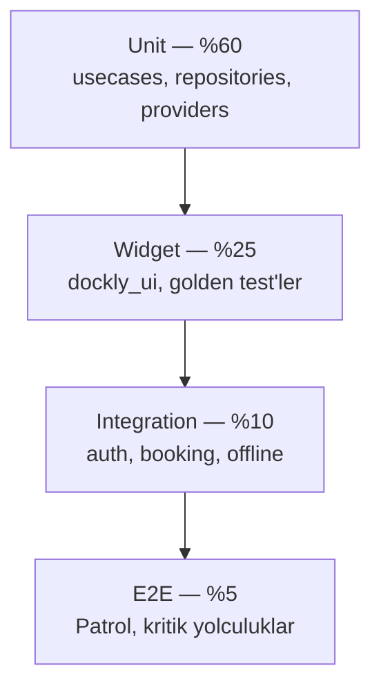
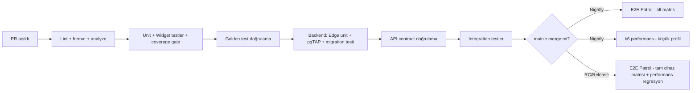

# Dockly — Test Stratejisi (15)

> Bu doküman [00-foundation.md](00-foundation.md) kanonik temel dokümanına bağlıdır. Enum'lar, tablo adları, endpoint'ler, ekran ID'leri (S-xx/A-xx) oradan birebir alınmıştır.
> İlgili dokümanlar: [12-guvenlik-plani.md](12-guvenlik-plani.md) (RLS politikaları §3.2, pgTAP referansı §10 — bu doküman o testlerin somut planını verir), [14-performans-plani.md](14-performans-plani.md) (performans/erişilebilirlik testleri ve CI regresyon testleri burada tekrarlanmadan referanslanır).
> İlke: **Test, özellik tamamlanma kriterinin bir parçasıdır** — test yazılmamış kod "done" sayılmaz (Definition of Done).

---

## 1. Test Piramidi



| Katman | Hedef oran | Ortalama çalışma süresi (CI) | Amaç |
|---|---|---|---|
| Unit | %60 | saniyeler | İş kuralı doğruluğu, hızlı geri bildirim |
| Widget | %25 | saniyeler–1 dk | UI bileşen doğruluğu, görsel regresyon |
| Integration | %10 | dakikalar | Katmanlar arası akış (data↔domain↔presentation, gerçek Drift/mock API) |
| E2E | %5 | dakikalar (cihaz/emülatörde) | Gerçek kullanıcı yolculuğu, gerçek backend'e yakın ortam |

- Piramit oranı `test/` dizin sayımıyla çeyreklik denetlenir (script: `tools/test_pyramid_report.dart`); E2E'nin şişmesi (yavaş, kırılgan) veya unit'in düşmesi (yetersiz temel kapsam) uyarı sinyalidir.
- Kural: yeni bir iş kuralı önce unit testle kanıtlanır; E2E yalnız "uçtan uca çalışıyor mu" sorusuna cevap verir, iş kuralı varyasyonlarını E2E'de test ETMEK YASAK (yavaşlar, kırılganlaşır).

---

## 2. Unit Test Kapsamı

### 2.1 Kapsam Alanları
- **Usecases** (`domain/usecases/*`): her usecase için en az mutlu yol (happy path) + her hata dalı (foundation hata formatı `{error:{code,message,details}}` eşleme dahil) test edilir. Örnek: `SubmitBookingRequestUseCase` → `check_in < check_out` ihlali, `boat_length_m` uygunsuzluğu, misafir kullanıcı reddi (12-guvenlik-plani.md §2.3 kuralı) ayrı test case'leri.
- **Repositories** (impl sınıfları, `data/repositories/*`): DTO↔entity dönüşümü, hata haritalama (network hatası → domain `Failure` tipine), cache-then-network stratejisi (§7'de Drift ile ilişkili akış) mock datasource ile test edilir.
- **Providers** (Riverpod): `ProviderContainer` ile izole test; `select()` kullanımı doğru dar state güncellemesi yaptığını doğrulayan testler (14-performans-plani.md §2.1 pratiğinin doğrulanması); `AsyncValue` durumları (`loading/data/error`) her provider için.
- **Mapper/DTO** (`dockly_api` paketi): JSON↔model serialization/deserialization, eksik/null alan toleransı (backend geriye dönük uyumluluk, foundation §6 `/v1` kırıcı değişiklik yapmama ilkesiyle uyumlu).
- **Domain entity kuralları:** enum geçişleri (`booking_request_status`: `pending → contacted → confirmed | cancelled | expired`, geçersiz geçiş denemesi domain katmanında da reddedilir — savunma derinliği, 12 §3.2 not ile uyumlu).

### 2.2 Araç ve Kurallar (mocktail)
- Mock kütüphanesi: **mocktail** (kod üretimi gerektirmeyen, `Mock`/`Fake` sınıfları elle yazılır veya `mocktail_generator` ile). `mockito` KULLANILMAZ (kod üretim adımı yok, derleme hızı ve bakım kolaylığı için karar — ADR-TEST-01).
- Her repository arayüzü için `Fake` sınıfı `test/fakes/` altında paylaşılır (tekrar yazımı önler); `registerFallbackValue` çağrıları test setup'ında merkezi (`test/setup/mocktail_setup.dart`).
- `verify()` ile yalnız **davranışsal sözleşme** doğrulanır (ör. "iptal usecase'i repository'nin `cancel` metodunu tam olarak 1 kez, doğru ID ile çağırır"); implementasyon detayına aşırı bağlı (over-specified) test YASAK — code review checklist maddesi.
- Zaman bağımlı testler (`check_in >= today` gibi) `clock` paketi ile sabitlenmiş saat kullanır; `DateTime.now()` doğrudan çağrısı test edilebilirlik ihlali sayılır (lint).
- Kapsam çalıştırma: `flutter test --coverage`, `lcov` raporu CI artefaktı; `packages/dockly_core`, `packages/dockly_api` ve her feature'ın `domain/` katmanı ayrı ayrı raporlanır.

---

## 3. Widget Testleri

### 3.1 dockly_ui Component Testleri
- `packages/dockly_ui` içindeki her paylaşılan bileşen (buton, kart, chip, bottom sheet iskeleti, `DocklyNetworkImage` — 14-performans-plani.md §5.2) için:
  - Standart `flutter_test` widget testi: render doğruluğu, etkileşim (tap, uzun basma), durum varyantları (disabled/loading/error).
  - **Golden test** (`golden_toolkit` veya `alchemist`): her bileşen için görsel referans görüntü.
- **Golden test matrisi (zorunlu kombinasyon):**

| Boyut | Değerler |
|---|---|
| Tema | `light`, `dark` (foundation §7 renk token'ları) |
| Text scale | `1.0` (varsayılan), `1.3` (büyük yazı), `2.0` (erişilebilirlik maksimum — iOS/Android sistem ayarı sınırı) |
| Yön (yalnız responsive bileşenlerde) | `portrait`, `tablet genişliği` |

- Bu kombinasyon her bileşen için otomatik üretilir (`goldenTest` yardımcı fonksiyonu `dockly_ui/test/golden_helpers.dart` içinde parametreli `testGoldens` sarmalayıcı) — yeni bileşen eklerken elle 6+ dosya yazmak yerine tek fonksiyon çağrısı yeterli.
- Golden dosyaları `test/goldens/{component}/{theme}_{scale}.png` yolunda saklanır; CI'da `--update-goldens` yalnız onaylı PR'da elle tetiklenir (otomatik güncelleme YASAK — sessiz görsel regresyon riskini önler).
- Font: golden testlerde platform fontu yerine paketlenmiş test fontu (`Ahem` benzeri deterministik font) kullanılır — CI/geliştirici makineleri arası piksel farkını önler.

### 3.2 Feature Widget Testleri
- Her ekran (S-01…S-23) için en az: boş durum (empty state), yükleniyor (loading skeleton), hata durumu (error + retry), dolu durum (happy path) widget testi.
- Riverpod `ProviderScope` override ile sahte veri enjekte edilir; gerçek ağ/DB çağrısı widget testinde YAPILMAZ (bu integration testin işi, §4).
- Erişilebilirlik denetimi widget test seviyesinde de başlar: `flutter_test`'in `SemanticsTester` ile her ekranda buton/görselin semantics label'ı olduğu doğrulanır (14 §... performans değil ama erişilebilirlik testinin ilk katmanı — detay §12).

---

## 4. Integration Testler

`integration_test` paketi ile (gerçek Drift veritabanı — in-memory değil, geçici dosya; API katmanı için `MockWebServer`/wiremock benzeri sahte HTTP sunucu veya Supabase local stack).

### 4.1 Auth Akışı
- Senaryo 1 — Misafir girişi: S-03 → "Misafir olarak devam et" → Firebase Anonymous auth → `POST /auth/session` (sahte sunucu) → köprü JWT alınır → S-06'ya yönlendirme.
- Senaryo 2 — E-posta kayıt: S-04 → e-posta/şifre → doğrulama e-postası bekleme ekranı → (test ortamında Firebase emulator ile) doğrulanmış giriş.
- Senaryo 3 — Telefon OTP: S-05 → kod gönder → yanlış kod (hata mesajı doğrulanır) → doğru kod → başarı.
- Senaryo 4 — Misafir → kayıtlı geçiş: `linkWithCredential` sonrası `firebase_uid`'in korunduğu, `recently_viewed` gibi lokal verinin kaybolmadığı doğrulanır (12-guvenlik-plani.md §2.3 ile uyumlu).
- Senaryo 5 — Token yenileme: 15 dk köprü JWT süresi dolduğunda (test'te süre kısaltılmış sahte config) tek-uçuş (single-flight) yenilemenin çalıştığı, bekleyen isteklerin tekrar oynatıldığı doğrulanır (12 §2.2).

### 4.2 Rezervasyon Talebi Akışı
- S-06 (harita) → pin seç → S-09 (detay) → "Talep Oluştur" → S-14 (form: tekne seç, check-in/out, telefon, not) → gönder → `booking_requests` sahte API'de `pending` olarak oluşur → S-15 (Taleplerim) listesinde görünür.
- Idempotency: aynı `Idempotency-Key` ile iki kez gönderim simülasyonu — sunucudan (sahte) aynı yanıtın döndüğü, ikinci bir kayıt oluşmadığı doğrulanır (12 §6.4 ile hizalı).
- Validasyon: `check_in >= today`, `check_in < check_out`, tekne uzunluğu/draft uygunsuzluk uyarısı (lokasyon `max_boat_length_m`/`max_draft_m` ile karşılaştırma) — form seviyesinde engellenip engellenmediği.
- İptal akışı: S-15 → talep detay → iptal → status `cancelled` → liste güncellenir.

### 4.3 Offline Senaryolar
- Ağ kapalıyken S-06 açılışı: son cache'lenen bbox pinlerinin (Drift `cached_map_pins`, 14-performans-plani.md §7.1) gösterildiği, "çevrimdışı" banner'ının göründüğü doğrulanır.
- Ağ kapalıyken S-14 form doldurma → gönder → `draft_booking_requests` tablosuna düşer → ağ simülasyonu açılır → arka planda otomatik gönderim → `notifications` içinde başarı bildirimi.
- Ağ kesintisi ortasında (istek gönderilmiş, yanıt gelmeden bağlantı düşmüş) — idempotency key sayesinde tekrar bağlanınca kaybolan/duplike talep OLMADIĞI doğrulanır.
- Favori ekleme offline'da optimistic UI güncellemesi + ağ dönünce sunucu senkronu.

---

## 5. E2E — Patrol

**Araç:** [Patrol](https://patrol.leancode.co) (native izinler — konum, kamera/galeri, bildirim — ve gerçek cihaz/emülatör etkileşimi gerektiren senaryolar için `integration_test`'in üstüne native otomasyon katmanı ekler).

### 5.1 Kritik Yolculuklar (Zorunlu Kapsam)
1. **Onboarding → Arama → Detay → Talep** (ana golden path, her release'te koşulur):
   S-01 Splash → S-02 Onboarding (3 sayfa, swipe) → S-03 Giriş (misafir) → S-06 Ana Sayfa harita → S-07 Arama ("Bodrum" yaz) → sonuç seç → S-09 Detay → S-14 (misafir engeli görülür) → kayıt ol (S-04) → geri S-14 → talep gönder → S-15'te talebi gör.
2. **Fotoğraf + yorum akışı:** S-09 → S-12 yorum yaz + puan ver → S-13 fotoğraf yükle (galeriden seçim, Patrol native izin diyalogunu yönetir) → gönderim sonrası "moderasyon bekliyor" durumunun S-09'da görünmesi.
3. **Topluluk önerisi:** S-06 → "Yeni nokta öner" (S-22) → form doldur, konum pin'i haritadan seç → gönder → `suggestions` kaydı oluşur (sahte/staging API'de doğrulama).
4. **Bildirim akışı:** FCM push simülasyonu (Patrol native bildirim tetikleme) → S-21 Bildirimler ekranına gidiş → okundu işaretleme.
5. **Ayarlar/tema/dil:** S-20 → tema değiştir (light/dark anlık uygulanır) → dil değiştir (TR/EN, foundation §9 i18n hazırlığı) → uygulama genelinde tutarlılık kontrolü.

### 5.2 Çalıştırma Politikası
- E2E testler **gerçek cihaz/emülatör matrisinin bir alt kümesinde** (14-performans-plani.md §9.2: Android orta + iOS orta/üst) her release adayında (RC) koşulur; tam matriste yalnız majör release öncesi.
- Backend hedefi: staging Supabase projesi (izole, seed veri — §8) — production'a ASLA E2E yazma isteği gitmez.
- Kırılganlık yönetimi: E2E'de `find.byKey` (semantic/test key) kullanımı zorunlu, metin bazlı bulucu (`find.text`) yalnız içerik doğrulamasında; flaky test 3 üst üste kırmızıysa quarantine listesine alınır (CI'da ayrı, non-blocking suite) ve 1 hafta içinde kök neden bulunur.

---

## 6. Backend Testleri

### 6.1 Edge Function Unit Testleri
- Çalışma zamanı: Deno (foundation §2). Test araç: Deno'nun yerleşik `Deno.test` + `std/testing/asserts`.
- Kapsam: her Edge Function için giriş doğrulama (Zod şeması, 12-guvenlik-plani.md §6.2), yetkilendirme kontrolü (rol/claim kontrolü mock JWT ile), iş kuralı dalları, hata formatı (kanonik `{error:{code,message,details}}`) çıktısı.
- Dış bağımlılıklar (Supabase client, Firebase Admin SDK) test'te mock/stub edilir; gerçek ağ çağrısı unit seviyede YAPILMAZ.
- Örnek: `auth/session` fonksiyonu → geçersiz imza, süresi dolmuş token, `email_verified=false` iken yorum uçlarına erişim reddi (12 §2.1) ayrı test case'leri.

### 6.2 RLS Politika Testleri (pgTAP)
12-guvenlik-plani.md §3.2 ve §10'da atıfta bulunulan pgTAP testlerinin somut planı:
- Her tablo için (foundation §5 kanonik tablo listesi) en az: (a) sahibi olmayan kullanıcının SELECT/UPDATE/DELETE denemesinin reddi, (b) sahibinin kendi kaydına erişebildiği, (c) rol bazlı erişim (moderator/admin/super_admin eşikleri) doğru çalıştığı, (d) `deleted_at`/`status` filtrelerinin (`published`, `approved`) doğru uygulandığı.
- Test kurulumu: `pgtap` extension migration'larda test ortamına yüklenir; her test dosyası (`supabase/tests/rls/{table}.sql`) `BEGIN; SAVEPOINT; ... ROLLBACK;` deseniyle izole çalışır, gerçek veriyi kirletmez.
- Örnek iddia (assertion) deseni:
```sql
SELECT plan(4);
SELECT set_config('request.jwt.claims', json_build_object('sub', :'user_a_id', 'role','user')::text, true);
SELECT throws_ok(
  $$ UPDATE boats SET name = 'hacked' WHERE id = '...user_b_boat_id...' $$,
  'new row violates row-level security policy for table "boats"'
);
SELECT lives_ok(
  $$ UPDATE boats SET name = 'my boat' WHERE id = '...user_a_boat_id...' $$
);
SELECT * FROM finish();
```
- Kapsanan özel kurallar: `booking_requests` status geçiş trigger'ının geçersiz geçişi reddettiği (`pending → confirmed` doğrudan atlaması gibi), `reviews` unique kısıtı (`UNIQUE(location_id, user_id) WHERE deleted_at IS NULL`), `favorites` hard delete davranışı, `audit_logs` üzerinde UPDATE/DELETE'in tamamen imkansız olduğu (REVOKE doğrulaması).
- CI: her migration PR'ında `pg_prove` ile tüm pgTAP suite'i çalıştırılır (12-guvenlik-plani.md §10 tablosundaki "Her migration PR'ı" sıklığıyla birebir); kırmızıysa merge engellenir.

### 6.3 Migration Testleri
- Her migration dosyası (`supabase/migrations/*`) için: (a) temiz veritabanında sırayla uygulanabilirlik (`supabase db reset` CI job'ı), (b) geri alınabilirlik notu (Postgres migration'larda formal `down` script v1'de zorunlu değildir ama yıkıcı değişikliklerde — kolon silme/tip değişimi — açıklayıcı yorum ve önce "expand" sonra "contract" deseni zorunludur), (c) mevcut seed veri (§8) ile migration sonrası veri bütünlüğü kontrolleri (FK, CHECK constraint ihlali yok).
- Büyük tablo migration'ları (ör. `locations` üzerinde yeni NOT NULL kolon) için performans etkisi değerlendirmesi: kilit süresi tahmini, gerekirse `ALTER TABLE ... ADD COLUMN ... DEFAULT NULL` + arka planda backfill deseni (14-performans-plani.md §6.4 DB disiplini ile tutarlı).
- Migration testleri staging'e otomatik uygulanır (CI/CD adımı), production'a yalnız onaylı deploy penceresinde.

### 6.4 API Contract Testleri
- Foundation §6 kanonik API yüzeyi bir **OpenAPI/JSON Schema** sözleşmesiyle tanımlanır (`packages/dockly_api/contract/openapi.yaml`); hem backend (Edge Function yanıtları) hem istemci (DTO'lar) bu sözleşmeye karşı doğrulanır.
- Backend tarafı: her Edge Function yanıtı, CI'da sözleşme şemasına karşı (`ajv`/Zod-to-JSON-Schema) doğrulanır — şema dışı alan veya eksik zorunlu alan CI'ı kırar.
- İstemci tarafı: `dockly_api` DTO testleri (§2.1) aynı sözleşmeden türetilen örnek payload'larla (fixture, §7) çalışır — backend ve istemci "aynı gerçeği" paylaşır, sürüklenme (drift) önlenir.
- Kırıcı değişiklik tespiti: sözleşme dosyasının PR diff'i CI'da otomatik taranır (zorunlu alan silme/tip daraltma → "breaking change" etiketi + manuel onay gerekir, foundation §6 "`/v1` kırıcı değişiklik yapmaz" ilkesinin somutlaşmış hali).

---

## 7. Test Verisi Yönetimi

### 7.1 Fixture'lar
- `packages/dockly_core/test/fixtures/` altında her domain entity için JSON/Dart fixture (ör. `location_fixture.dart` → `publishedMarinaFixture()`, `draftLocationFixture()`, `guestMooringFixture()` — foundation §4 `location_type` çeşitliliğini kapsar).
- Fixture'lar hem unit hem widget hem integration testlerde **tekrar kullanılır** (tek kaynak); ekran başına özel sahte veri yazımı yerine fixture kompozisyonu tercih edilir.
- Sınır durum fixture'ları özel olarak tutulur: puan `rating_count = 0` lokasyon, `price_tier = unknown`, `moderation_status = rejected` fotoğraf, süresi `expired` booking request.

### 7.2 Seed Verisi (Backend)
- `supabase/seed/` (foundation §3 klasör yapısı): staging ve local geliştirme için gerçekçi ama sentetik veri seti — foundation §1.2 sezonluk yoğunlaşma bölgelerini (Bodrum–Göcek–Fethiye, Çeşme, Ayvalık) yansıtan ~200 lokasyon, çeşitli `location_type`/`price_tier` dağılımı, örnek kullanıcılar (her rol: user/moderator/admin/super_admin), örnek `booking_requests` (her status), moderasyon kuyruğunu dolduracak `pending` fotoğraf/yorum.
- Seed script'i idempotent (`ON CONFLICT DO NOTHING`/upsert) — tekrar çalıştırıldığında veri çoğalmaz; CI'da her test suite öncesi temiz seed.
- PII benzeri alanlar (isim, telefon) sentetik/anonim (gerçek kullanıcı verisi ASLA seed'e girmez — KVKK, 12-guvenlik-plani.md §5 ile uyum).
- Beta programı (§11.3) öncesi staging seed'i "gerçekçi hacim" (T1 kademesinin ~%10'u) ile zenginleştirilir, performans testleri (14 §8.4) bu veri setiyle de doğrulanır.

---

## 8. Coverage Hedefleri

| Kapsam | Hedef | Ölçüm |
|---|---|---|
| Genel (tüm mobil kod tabanı — `apps/mobile` + `packages/*`) | **%80** satır kapsamı | `flutter test --coverage` + `lcov` toplamı, CI gate |
| Domain katmanı (`**/domain/**`, usecases + entities) | **%90** | Ayrı `lcov` filtreli rapor (domain en kritik iş kuralı barındırdığı için daha yüksek eşik) |
| `packages/dockly_core`, `packages/dockly_api` | %85 | Paylaşılan altyapı; yüksek yeniden kullanım riski daha sıkı test gerektirir |
| `packages/dockly_ui` | %70 satır + golden test kapsamı %100 (her export edilen public widget en az 1 golden'a sahip) | Karma ölçüm |
| Backend Edge Functions | %80 | Deno coverage (`deno test --coverage`) |
| RLS/pgTAP | Her tablo × her rol kombinasyonu için en az 1 pozitif + 1 negatif test (yüzde değil, kombinasyon tam kapsama) | `pg_prove` özet raporu |

- Coverage düşüşü (PR öncesi/sonrası fark > **-%1** genel, > **-%2** domain) CI'da uyarı; %80/%90 eşiğinin altına düşüş **blocking**.
- Coverage "vanity metric" olarak kullanılmaz: %100 satır kapsamı ama assertion'sız (yalnız çalıştırma) test code review'da reddedilir — her testin en az bir anlamlı `expect`/`verify` içermesi zorunlu (lint destekli kontrol + review checklist).

---

## 9. CI Test Aşamaları



| Aşama | Tetikleyici | Süre hedefi | Blocking mi? |
|---|---|---|---|
| Lint/format/analyze | Her push | < 2 dk | Evet |
| Unit + Widget + coverage gate | Her push | < 6 dk | Evet |
| Golden test | Her push (yalnız değişen bileşenler + tam suite haftalık) | < 4 dk | Evet |
| Edge unit + pgTAP + migration | Backend dosyası değiştiğinde | < 5 dk | Evet |
| API contract | DTO veya OpenAPI dosyası değiştiğinde | < 2 dk | Evet |
| Integration | Her push (etkilenen feature'a göre seçilmiş alt küme) | < 10 dk | Evet |
| E2E (alt matris) | Nightly + RC | < 25 dk | RC'de evet, nightly'de uyarı |
| E2E (tam matris) + performans regresyon (14 §8.4) | Release adayı (RC) | < 60 dk | Evet (release gate) |
| k6 performans (küçük profil) | Nightly | < 15 dk | Uyarı (sezon öncesi tam profil blocking, 14 §8.4) |

- Flaky test politikası: bir test 30 gün içinde %5'ten fazla oranda tutarsız sonuç verirse otomatik "flaky" etiketlenir (CI geçmişi analizi), sorumlu ekibe atanır, quarantine'de non-blocking çalışmaya devam eder ama 2 hafta içinde düzeltilmezse ilgili feature'ın merge'leri yavaşlatılır (eskalasyon).

---

## 10. Manuel QA Süreci

### 10.1 Cihaz Matrisi
14-performans-plani.md §9.2'deki cihaz matrisi manuel QA için de kanoniktir (tek kaynak orada); her release adayında matrisin tamamı, her sprint sonu düzenli build'de en az "orta" sınıf bir Android + bir iOS cihazda smoke test yapılır.

### 10.2 TestFlight / Internal App Sharing
- iOS: her `main` merge sonrası otomatik **TestFlight** internal build (Fastlane, foundation §2 CI/CD); haftalık external TestFlight dağıtımı (dahili ekip + seçili gönüllüler, ~30 kişi).
- Android: **Play Console Internal Testing** track'i her merge sonrası otomatik; **Closed Testing (Beta)** track'i haftalık, `Internal App Sharing` linkleri ad-hoc hızlı paylaşım için (QA/tasarım hızlı önizleme).
- Release adayı (RC) her iki platformda da en az 3 iş günü internal/closed testing'de kalır, sonra production'a aday olur.

### 10.3 Beta Programı — 50 Tekne Sahibi
- Lansman öncesi **gerçek kullanıcı beta programı**: 50 tekne sahibi (foundation §1 hedef kitle B2C ile birebir), coğrafi dağılım foundation/13 §1.2 yoğun bölgeleriyle eşleşecek şekilde seçilir (Bodrum–Göcek–Fethiye ağırlıklı, + Çeşme/Ayvalık + İstanbul/Marmara temsili grup).
- Süre: 4 hafta, 2 haftalık döngülerle build güncellemesi (TestFlight/Play Closed Testing üzerinden).
- Geri bildirim kanalı: uygulama içi "Geri bildirim gönder" (mevcut `POST /reports` altyapısı `other` reason ile genişletilir veya ayrı hafif form) + haftalık kısa anket (NPS benzeri) + 2 odak grubu görüşmesi (start/end).
- Ölçülen sinyaller: gerçek cihazlarda crash-free oranı (Crashlytics), gerçek ağ koşullarında performans bütçeleri (14 §1, gerçek 3G/4G dağılımı laboratuvar simülasyonundan daha değerli veri sağlar), rezervasyon talebi tamamlama oranı (funnel: S-06→S-07→S-09→S-14→submit), en çok karşılaşılan hata/kafa karıştıran akış.
- Çıkış kriteri (go/no-go lansman): crash-free session > %99.5, booking request funnel tamamlama oranı hedefin altında değil, kritik/yüksek şiddette açık bug yok (12 §11 SEV-1/2 karşılığı yok), beta kullanıcı NPS eşiği karşılandı.

### 10.4 Manuel Test Odak Alanları (Otomasyonun Zayıf Olduğu Yerler)
- Gerçek harita etkileşimi hissi (pinch-zoom akıcılığı, gerçek GPS ile konum takibi) — emülatörde simüle edilemeyen duyusal kalite.
- Gerçek kamera/galeri izin akışları (iOS/Android izin diyalog farklılıkları, "bir daha sorma" senaryosu).
- Gerçek push bildirim teslimatı (arka plan/kapalı uygulama durumunda FCM).
- Uluslararası/yerelleştirme görsel kontrolü (TR/EN metin taşması, foundation §7 tipografi ölçeğinde uzun çeviri metinleri).
- Karanlık mod + sistem yazı boyutu büyütme kombinasyonlarının gerçek cihazda gözle kontrolü (golden testin tamamlayıcısı, gerçek ekran parlaklığı/kontrast hissi).

---

## 11. Performans ve Erişilebilirlik Testleri

### 11.1 Performans Testleri (14-performans-plani.md'ye Referans)
- CI regresyon testleri, k6 yük testi, EXPLAIN hedefleri, cihaz matrisi kabul kriterleri **14-performans-plani.md §8.4, §10 ve 13-olceklenebilirlik-plani.md §10**'da tanımlıdır; bu doküman onları tekrar etmez, yalnızca test piramidi ve CI akışına (§9) nasıl entegre olduklarını konumlandırır.
- Release gate: bir RC, §9 tablosundaki "E2E tam matris + performans regresyon" aşamasından geçmeden production'a alınmaz.

### 11.2 Erişilebilirlik Testleri
- **Otomatik:** `flutter_test` `SemanticsTester` + `accessibility_test` benzeri paket ile her ekranda: dokunma hedefi minimum 44x44dp (14 §3.4 sprite dokunma hedefiyle tutarlı), kontrast oranı (foundation §7 renk token'ları WCAG AA hedefiyle kontrol — `text.primary`/`bg.surface` kombinasyonları), semantics label eksikliği (ikon-only butonlarda `Semantics(label:)` zorunlu, lint destekli).
- **Golden test entegrasyonu:** §3.1'deki text scale `2.0` varyantı doğrudan erişilebilirlik regresyon testi işlevi görür — metin taşması, kesilme (clipping) bu senaryoda yakalanır.
- **Manuel:** her RC'de VoiceOver (iOS) ve TalkBack (Android) ile kritik yolculuk (§5.1 madde 1) bir kez elle gezilir; ekran okuyucu sırası mantıklı mı, aksiyon butonları anlaşılır etiketli mi kontrol edilir.
- **Hedef standart:** WCAG 2.1 AA (mobil bağlamda pratik karşılığı — Apple/Google erişilebilirlik kılavuzları); tam sertifikasyon v1 kapsamı dışı ama temel kontroller release gate'in parçası.

---

## 12. Given/When/Then Kabul Kriteri Örnekleri

Kabul kriterleri PR açıklamalarında ve QA test senaryolarında Given/When/Then formatında yazılır; aşağıdakiler foundation'daki iki temel akış (rezervasyon talebi, misafir modu) için referans örneklerdir.

### 12.1 Rezervasyon Talebi (S-14)

**Senaryo 1 — Başarılı talep oluşturma**
```
Given  Kayıtlı ve telefonu doğrulanmış bir kullanıcı S-09 (Lokasyon Detay) ekranındadır
  And  seçilen lokasyon status = 'published' ve en az 1 tekne profili tanımlıdır
When   kullanıcı "Talep Oluştur" butonuna basar, S-14 formunda tekne seçer,
       check_in = yarın, check_out = check_in + 3 gün, telefon ve not girer, gönderir
Then   POST /booking-requests çağrısı 201 döner ve booking_requests.status = 'pending' olur
  And  kullanıcı S-15 (Taleplerim) ekranına yönlendirilir ve yeni talep listenin başında görünür
  And  bir Idempotency-Key header'ı gönderilmiştir ve aynı key ile tekrar istekte
       aynı kayıt döner (yeni satır oluşmaz)
```

**Senaryo 2 — Geçersiz tarih aralığı reddi**
```
Given  Kullanıcı S-14 formundadır
When   check_in alanına bugünden önceki bir tarih girilir
       veya check_out, check_in'den önceki/eşit bir tarih olarak seçilir
Then   "Gönder" butonu devre dışı kalır ve ilgili alanın altında
       anlaşılır bir hata mesajı gösterilir
  And  POST /booking-requests isteği İSTEMCİDEN ASLA GÖNDERİLMEZ
  And  (savunma derinliği) sunucuya doğrudan geçersiz payload gönderilse dahi
       Edge Function 422 + { error: { code: "invalid_date_range", ... } } döner
```

**Senaryo 3 — Aynı lokasyon için tekrarlayan pending talep engeli**
```
Given  Kullanıcının aynı lokasyon + aynı check_in için zaten status='pending' bir talebi vardır
When   kullanıcı aynı lokasyona, aynı check_in tarihiyle ikinci bir talep göndermeye çalışır
Then   sunucu kısmi unique index ihlali nedeniyle 409 Conflict döner
  And  istemci kullanıcıya "Bu tarih için zaten bekleyen bir talebiniz var" mesajını
       ilgili mevcut talebe (S-15 detay) yönlendiren bir aksiyonla birlikte gösterir
```

**Senaryo 4 — Tekne uygunsuzluğu uyarısı (engelleyici değil, bilgilendirici)**
```
Given  Seçilen lokasyonun max_boat_length_m = 15 ve max_draft_m = 2.5 değerleri vardır
  And  kullanıcının seçtiği tekne boat_length_m = 18
When   kullanıcı S-14 formunda bu tekneyi seçer
Then   form, tekne uzunluğunun lokasyon kapasitesini aştığını belirten bir uyarı banner'ı gösterir
  And  kullanıcı yine de talebi göndermeye devam edebilir (v1 kararı: engelleme yok,
       nihai uygunluk kontrolü Dockly operasyon ekibi tarafından manuel yapılır — foundation §4
       booking_request_status akışıyla uyumlu)
```

### 12.2 Misafir Modu

**Senaryo 1 — Misafir keşif erişimi**
```
Given  Uygulama ilk kez açılmış, kullanıcı S-03'te "Misafir olarak devam et" seçmiştir
When   Firebase Anonymous auth ile oturum açılır (is_anonymous = true)
Then   kullanıcı S-06 (harita), S-07 (arama), S-09 (detay), S-11 (yorumlar okuma)
       ekranlarına tam erişebilir
  And  recently_viewed yalnızca lokal Drift'e yazılır, sunucuya senkronlanmaz
       (12-guvenlik-plani.md §2.3 ile uyumlu)
```

**Senaryo 2 — Misafirin kısıtlı aksiyona erişim denemesi**
```
Given  Misafir kullanıcı S-09 (Lokasyon Detay) ekranındadır
When   "Favorilere ekle" veya "Talep Oluştur" butonuna dokunur
Then   yazma isteği (PUT /favorites/{locationId} veya POST /booking-requests)
       İSTEMCİ TARAFINDAN gönderilmez
  And  bunun yerine bir "Devam etmek için kayıt olun" bottom sheet'i açılır,
       birincil aksiyon S-04/S-03'e yönlendirir
  And  (savunma derinliği) is_anonymous=true claim'i taşıyan bir istek doğrudan
       API'ye gönderilse dahi RLS/Edge katmanında 403 döner (12-guvenlik-plani.md §3.2 RLS tablosu)
```

**Senaryo 3 — Misafirden kayıtlıya geçiş veri korunumu**
```
Given  Misafir kullanıcının cihazında 8 adet recently_viewed kaydı ve
       favori eklemeye çalıştığı 1 lokasyon (henüz kaydedilememiş) bulunmaktadır
When   kullanıcı "Kayıt Ol" akışını tamamlar (Apple/Google/E-posta) ve
       linkWithCredential ile misafir kimliği kayıtlı hesaba bağlanır
Then   aynı firebase_uid ve dolayısıyla aynı users.id korunur
  And  8 recently_viewed kaydı kaybolmaz (lokalde zaten vardı, artık ayrıca sunucuya senkronlanır)
  And  kullanıcı, kayıt öncesi eklemeye çalıştığı favoriyi tek dokunuşla
       tamamlayabileceği bir hatırlatma görür (UX iyileştirmesi, engelleyici değil)
```

**Senaryo 4 — Misafir rate limit farkı**
```
Given  Bir IP adresinden gelen istekler misafir (anonim) claim taşımaktadır
When   aynı IP'den 1 dakika içinde 61. GET /locations isteği gelir
       (kanonik limit: anon/misafir 60 istek/dk/IP, 12-guvenlik-plani.md §6.1)
Then   61. istek 429 + Retry-After header'ı ile reddedilir
  And  kayıtlı kullanıcı aynı senaryoda (120 istek/dk/kullanıcı limiti) etkilenmez
```

---

## 13. Roller ve Sorumluluklar

- **QA Lead:** manuel QA süreci (§10), beta programı koordinasyonu, release gate onayı.
- **Mobil Lead:** unit/widget/integration/E2E test altyapısı, coverage gate (§8) mobil tarafı.
- **Backend Lead:** Edge unit, pgTAP, migration, API contract testleri (§6); RLS testlerinde güvenlik ekibiyle (12-guvenlik-plani.md) koordinasyon.
- **CTO:** çeyreklik test stratejisi gözden geçirmesi, coverage/piramit oranı sapmalarının onaylanması, beta programı go/no-go kararı.

Bu doküman her çeyrek, 12-guvenlik-plani.md ve 14-performans-plani.md ile birlikte gözden geçirilir; değişiklikler changelog ile izlenir.
