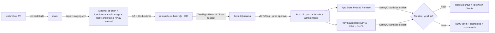

# Dockly — Deployment Stratejisi

> Kanonik referans: `00-foundation.md` (teknoloji yığını §2, monorepo §3, `app_settings` §5).
> Bu doküman; ortamları, mobil/backend/admin dağıtım akışlarını, CI/CD pipeline'ını, sürümlemeyi ve rollback planlarını tanımlar.
> Tarih bağlamı: MVP geliştirme başlangıcı 13 Temmuz 2026, soft launch hedefi 26 Kasım 2026, tam lansman Nisan 2027 (sezon başı).

---

## 0. GÜNCEL DURUM NOTU (ERRATA — 8 Temmuz 2026)

> **Neden bu bölüm var:** Bu planın backend/DB dağıtımı bölümleri (§1, §4) **Supabase + Edge Functions** varsayar. Proje ADR-004 ile **kendi NestJS/Prisma backend'ine + AWS RDS'e** geçti. Ayrıca §3'te tarif edilen 4 CI/CD workflow'undan şu an yalnız biri mevcut. Aşağıdaki tablo gerçek durumu ve hedefi ayırır. Mobil dağıtım, sürümleme, feature-flag ve rollback ilkeleri (§2, §6, §7, §8) planlandığı gibi geçerlidir.

### 0.1 Planlanan → Gerçek / Hedef

| Konu | Dokümanda (planlanan) | Şu anki gerçek | Hedef |
|---|---|---|---|
| Prod veritabanı | Supabase managed | — (henüz prod yok) | **AWS RDS** eu-central-1, PG15+PostGIS, MVP'de Single-AZ (ADR-004) |
| Staging altyapısı | `dockly-staging` Supabase | **Geçici köprü:** Supabase (ücretsiz, yalnız Postgres+PostGIS) + **Render** (Docker web servisi, Redis) | AWS'ye taşınacak (prod'la aynı yığın) |
| Backend deploy (§4) | `supabase db push` + Edge Function deploy | **Prisma migrate** + tek Docker imajı (Render) | AWS'de Docker (ECS/Fargate veya benzeri) + Prisma migrate |
| Migration klasörü | `supabase/migrations/` | `apps/api/prisma/migrations/` (`0001_init`, `0002_rls`) | Aynı |
| CI/CD workflow'ları (§3.1) | `pr-checks`, `deploy-staging`, `release-prod`, `nightly` (4 adet) | **Yalnız `ci.yml`** (lint+test+build+güvenlik taraması: gitleaks, Trivy, Semgrep, license) | Eksik 3 workflow Faz C/D'de eklenecek (denetim bulgusu D3) |
| Fastlane lane'leri (§3.3) | Tanımlı | **Henüz yok** (mobil dağıtım hattı kurulmadı) | Mobil sprint'lerinde |
| PITR / yedek (§4.3) | "PITR prod'da açık, RPO ≤ 2 dk" | **Kurulmadı / kanıtsız** (denetim bulgusu D2) | RDS otomatik yedek + PITR + restore tatbikatı (Faz D) |
| Backup/DR | Supabase yönetimli | Single-AZ (failover yok) | Multi-AZ değerlendirmesi lansman öncesi |

### 0.2 Backend deploy — güncel gerçek akış (staging)
Şu an geçerli olan basitleştirilmiş akış: GitHub push → `ci.yml` (test + güvenlik) yeşil → GitHub'daki depo Render'a bağlı → Render `apps/api` kök dizininden Docker imajını kurar → Prisma migrate + seed. Canlı veritabanı güncellemeleri (Faz 5 verisi) Supabase SQL Editor üzerinden ayrıca uygulanır. §4'teki Supabase/Edge tabanlı ayrıntılı akış **prod hedefi için değil, tarihsel plan olarak** okunmalıdır.

---

## 1. Ortamlar (Environments)

Üç izole ortam vardır. **Hiçbir kaynak (proje, bucket, token) ortamlar arasında paylaşılmaz.**

| Bileşen | dev | staging | prod |
|---|---|---|---|
| Supabase projesi | `dockly-dev` | `dockly-staging` | `dockly-prod` |
| Firebase projesi (Auth + FCM + Crashlytics) | `dockly-dev` | `dockly-staging` | `dockly-prod` |
| AWS S3 bucket (fotoğraflar) | `dockly-photos-dev` | `dockly-photos-staging` | `dockly-photos-prod` |
| CloudFront dağıtımı | `cdn-dev.dockly.app` | `cdn-staging.dockly.app` | `cdn.dockly.app` |
| Mapbox token | dev token (kısıtsız stil, düşük kota) | staging token (bundle-id kısıtlı) | prod token (bundle-id kısıtlı, alarmlı) |
| API base URL | `https://api-dev.dockly.app/v1` | `https://api-staging.dockly.app/v1` | `https://api.dockly.app/v1` |
| Sentry environment | `dev` | `staging` | `production` |
| Mobil uygulama kimliği | `com.dockly.app.dev` | `com.dockly.app.stg` | `com.dockly.app` |
| Admin web | `admin-dev.dockly.app` | `admin-staging.dockly.app` | `admin.dockly.app` |

### 1.1 Ortam ilkeleri

- **dev**: Geliştiricilerin serbest oyun alanı. Migration'lar önce burada koşar; veri her an sıfırlanabilir. Seed verisi `supabase/seed/` klasöründen yüklenir.
- **staging**: Prod'un birebir aynası. Prod'a giden **her** migration ve Edge Function önce staging'de en az 24 saat yaşar. Staging verisi: anonimleştirilmiş prod kopyası + sentetik test verisi. QA ve beta öncesi regresyon burada koşar.
- **prod**: Yalnızca CI üzerinden, tag ile deploy alır. Manuel `supabase db push` prod'a **yasaktır** (break-glass prosedürü hariç, bkz. §9.4).
- Flutter tarafında ortam seçimi `--dart-define=DOCKLY_ENV=dev|staging|prod` ve flavor (Android productFlavor, iOS scheme/xcconfig) ile yapılır. Üç uygulama aynı cihaza yan yana kurulabilir (farklı bundle id, farklı ikon rozeti: DEV/STG etiketi).
- Firebase yapılandırma dosyaları (`google-services.json`, `GoogleService-Info.plist`) flavor başına ayrı klasörde tutulur ve CI'da secret'tan yazılır; repoya **girmez**.

---

## 2. Mobil Dağıtım

### 2.1 iOS — TestFlight → App Store aşamalı yayın

1. **Internal TestFlight** (ekip, ~10 kişi): her `main` merge'inde staging build otomatik yüklenir.
2. **External TestFlight** (beta grubu, 50 tekne sahibi — bkz. `20-mvp-gelistirme-plani.md` §6): release candidate build'leri; Apple Beta Review sonrası davetle dağıtılır.
3. **App Store**: tag (`vX.Y.Z`) ile tetiklenen prod build App Store Review'a gönderilir.
4. Yayın **Phased Release** ile yapılır: Apple'ın 7 günlük otomatik kademesi (%1→%2→%5→%10→%20→%50→%100). Kritik metriklerde bozulma görülürse phased release App Store Connect'ten duraklatılır.
5. İnceleme süresi tamponu: soft launch (26 Kasım 2026) için son prod build en geç **16 Kasım 2026**'da review'a gönderilir.

### 2.2 Android — Internal → Closed → Production staged rollout

1. **Internal testing track**: her `main` merge'inde staging build (dakikalar içinde yayında).
2. **Closed testing track** ("Dockly Beta"): release candidate'lar; beta grubuyla paylaşılır. Google'ın yeni geliştirici hesapları için zorunlu kıldığı kapalı test koşullarını da bu track karşılar.
3. **Production — staged rollout**: `%5 → %20 → %100` kademesi.
   - %5: en az 48 saat bekle; izlenen eşikler: crash-free users ≥ %99.5, ANR < %0.47, S-06 harita açılış başarı oranı.
   - %20: en az 48 saat bekle; aynı eşikler + `POST /booking-requests` hata oranı < %1.
   - %100: metrikler yeşilse tam yayın. Herhangi bir kademede eşik ihlali → rollout durdurulur (halt), düzeltme sürümü hazırlanır.
4. App Bundle (`.aab`) kullanılır; Play App Signing açıktır.

### 2.3 Build kanalları özeti

| Kanal | Ortam | Tetikleyici | Hedef |
|---|---|---|---|
| dev build | dev | manuel / PR | geliştirici cihazı, Firebase App Distribution |
| staging build | staging | `main`'e merge | TestFlight Internal + Play Internal |
| release candidate | staging→prod config | `release/x.y.z` hazırlığı | TestFlight External + Play Closed |
| prod release | prod | `vX.Y.Z` tag | App Store Phased + Play Staged %5→%20→%100 |

---

## 3. CI/CD Pipeline (GitHub Actions + Fastlane)

Workflow dosyaları `.github/workflows/` altındadır (foundation §3). Monorepo'da path-based tetikleme kullanılır (detay: `17-git-branch-stratejisi.md` §8).

### 3.1 Workflow matrisi

| Workflow | Tetik | İşler |
|---|---|---|
| `pr-checks.yml` | PR açıldığında/güncellendiğinde | lint + test + build (değişen path'lere göre) |
| `deploy-staging.yml` | `main`'e merge | staging'e DB migration + Edge Function deploy, staging mobil build, admin web staging deploy |
| `release-prod.yml` | `vX.Y.Z` tag push | prod DB migration + Edge Function deploy, store'lara prod build, admin web prod deploy, changelog/GitHub Release |
| `nightly.yml` | cron (her gece 03:00 TRT) | integration test suite (staging), bağımlılık güvenlik taraması, Drift şema uyum testi |

### 3.2 PR pipeline adımları (`pr-checks.yml`)

```yaml
# özet akış
jobs:
  analyze:
    - melos bootstrap
    - dart format --set-exit-if-changed .
    - flutter analyze (apps/mobile, apps/admin_web, packages/*)
  test:
    - flutter test --coverage (etkilenen paketler)
    - coverage eşiği: packages/dockly_core %85, dockly_api %80
  build:
    - apps/mobile değiştiyse: iOS (no-codesign) + Android debug build
    - apps/admin_web değiştiyse: flutter build web
    - supabase/ değiştiyse: supabase db lint + shadow DB'de migration dry-run
  edge_functions:
    - supabase/functions değiştiyse: deno lint + deno test
```

PR merge koşulu: tüm job'lar yeşil + en az 1 onaylı review (bkz. `17-git-branch-stratejisi.md` §5).

### 3.3 Fastlane lane'leri

`apps/mobile/fastlane/Fastfile` içinde tanımlıdır:

| Lane | Platform | Görev |
|---|---|---|
| `ios internal` | iOS | staging build → TestFlight Internal |
| `ios beta` | iOS | RC build → TestFlight External (Beta Review) |
| `ios release` | iOS | prod build → App Store Review + Phased Release aç |
| `android internal` | Android | staging `.aab` → Play Internal track |
| `android beta` | Android | RC `.aab` → Play Closed track |
| `android release rollout:0.05` | Android | prod `.aab` → Production, %5 staged rollout |
| `android promote rollout:0.20` / `1.0` | Android | mevcut sürümü %20 / %100'e yükselt |
| `bump_build` | ortak | build number'ı CI run number'dan yaz |

### 3.4 Code signing yönetimi

- **iOS**: `fastlane match` (git tabanlı, ayrı private sertifika reposu, passphrase GitHub Secrets'ta). App Store Connect API Key ile kimlik doğrulama (`ASC_KEY_ID`, `ASC_ISSUER_ID`, `ASC_KEY_P8`). Sertifika yenileme sorumlusu: mobil lead; takvim hatırlatması sertifika bitiminden 30 gün önce.
- **Android**: Upload keystore GitHub Secrets'ta base64 (`ANDROID_KEYSTORE_B64`, `ANDROID_KEY_ALIAS`, `ANDROID_KEY_PASSWORD`). Play App Signing sayesinde upload key kaybı telafi edilebilir.
- Signing işlemleri yalnızca CI'da yapılır; geliştirici makinesinde prod imzalama yoktur.

---

## 4. Backend Deploy (Supabase)

### 4.1 Migration akışı

- Tüm şema değişiklikleri `supabase/migrations/` altında sıralı, versiyonlu SQL dosyalarıdır (foundation §3). Elle Studio'dan şema değişikliği **yasaktır**.
- Dosya adı: `YYYYMMDDHHMMSS_kisa_aciklama.sql` (örn. `20260810093000_create_locations.sql`).
- Akış:
  1. Geliştirici lokalde `supabase db diff` ile migration üretir, lokal + dev'de doğrular.
  2. PR'da CI, shadow database'de migration'ları baştan sona koşar (dry-run) + `supabase db lint`.
  3. `main`'e merge → `deploy-staging.yml` içinde `supabase db push --project-ref $STAGING_REF` (access token: `SUPABASE_ACCESS_TOKEN`).
  4. Tag → `release-prod.yml` içinde önce **onay kapısı** (GitHub Environments `production`, en az 1 manuel approval), sonra `supabase db push --project-ref $PROD_REF`.
- Kural: her migration **geri alınabilir** ya da **expand-contract** uyumlu yazılır (bkz. §9.3). Destructive değişiklik (DROP/RENAME) tek başına bir migration'da, ancak tüm istemciler yeni sürüme geçtikten sonra gider.

### 4.2 Edge Function deploy

- `supabase/functions/` altındaki her fonksiyon bağımsız deploy edilir: `supabase functions deploy <name> --project-ref $REF`.
- CI yalnızca değişen fonksiyonları deploy eder (git diff ile tespit).
- Fonksiyon secret'ları `supabase secrets set` ile ortam başına yönetilir (Firebase service account, S3 anahtarı vb.).
- Sözleşme: Edge Function'lar **stateless** ve API `/v1` sözleşmesine (foundation §6) uyumludur; breaking change gerekiyorsa yeni versiyon path'i açılır, `/v1` bozulmaz.

### 4.3 Backend geri alma stratejisi

- **Edge Function**: önceki sürümün deploy'u = geri alma. CI her deploy'da fonksiyon sürüm etiketini artifact olarak saklar; `release-prod.yml` içindeki `rollback-functions` job'ı bir önceki commit'ten yeniden deploy eder.
- **Migration**: ileri-yönlü düzeltme (roll-forward) esastır. Down migration prod'da koşulmaz; bozuk migration için düzeltici yeni migration yazılır. Veri kaybı riski taşıyan durumlarda point-in-time recovery (PITR, prod'da açık; hedef RPO ≤ 2 dk) devrededir.
- Deploy öncesi otomatik kontrol: `pending migration sayısı > 3` ise pipeline uyarı verir (büyük batch'ler bölünür).

---

## 5. Admin Web Deploy (Docker)

- `apps/admin_web` Flutter Web olarak build edilir; foundation §2 gereği dağıtım **Docker image** iledir.
- Dockerfile (özet): stage 1 `flutter build web --release --dart-define=DOCKLY_ENV=...` → stage 2 `nginx:alpine` (SPA fallback + gzip + cache header).
- Image adı: `ghcr.io/dockly/admin-web:<git-sha>` ve `:vX.Y.Z`; registry GitHub Container Registry.
- Deploy: staging'de `main` merge sonrası otomatik; prod'da tag + manuel onay kapısı sonrası hosting'e (container servis) yeni image tag'i verilir. Sağlık kontrolü `/healthz` (nginx static). Geri alma: önceki image tag'ine dönmek (< 2 dk).
- Admin erişimi `role >= moderator` (foundation §4 `user_role`) + admin web IP allow-list (ofis + VPN).

---

## 6. Sürümleme

### 6.1 SemVer + build number

- Sürüm formatı: `MAJOR.MINOR.PATCH+BUILD` (örn. `1.2.0+184`).
  - **MAJOR**: kullanıcı deneyimini kökten değiştiren sürüm (v2 canlı rezervasyon gibi).
  - **MINOR**: yeni özellik (yeni ekran, yeni feature modülü).
  - **PATCH**: hata düzeltme / küçük iyileştirme.
  - **BUILD**: monoton artan tamsayı; CI run number'dan üretilir (`bump_build` lane'i). iOS `CFBundleVersion` ve Android `versionCode` buradan beslenir.
- MVP hedef sürümleri: `0.9.x` (beta, Ekim-Kasım 2026) → `1.0.0` (soft launch, 26 Kasım 2026) → `1.1.0+` (2027 Q1 içerik/topluluk büyütme) → `1.x` tam lansman sürümü (Nisan 2027).
- API sürümü mobil sürümden bağımsızdır: `/v1` (foundation §6).

### 6.2 Changelog otomasyonu

- Conventional Commits (bkz. `17-git-branch-stratejisi.md` §4) temel alınır.
- Tag atıldığında `release-prod.yml`, git-cliff ile `CHANGELOG.md` üretir ve GitHub Release notu olarak yayınlar: `feat` → "Yenilikler", `fix` → "Düzeltmeler", `BREAKING CHANGE` → ayrı uyarı bloğu.
- Store "What's New" metni: changelog'dan PM tarafından kullanıcı diline çevrilir (TR + EN), `fastlane/metadata/` altına commit edilir (bkz. §10).

---

## 7. Feature Flag ile Release Ayrımı (`app_settings`)

- Kaynak: `app_settings` tablosu (foundation §5: `key`, `value JSONB`). Mobil uygulama açılışta + 15 dk'da bir flag'leri çeker, Drift cache'e yazar (offline'da son bilinen değer geçerlidir).
- **Deploy ≠ release** ilkesi: kod store'a çıkar ama özellik flag arkasında kapalı kalabilir; böylece store review beklemeden özellik açılıp kapanabilir.
- Kanonik flag adlandırması: `feature.<modul>.<ozellik>` (modül adları foundation §3'teki feature listesinden).

| Flag | Varsayılan (1.0.0) | Amaç |
|---|---|---|
| `feature.booking.enabled` | `true` | S-14/S-15 rezervasyon talebi akışını aç/kapa (kill-switch) |
| `feature.reviews.photo_upload` | `true` | S-13 fotoğraf yükleme |
| `feature.reviews.suggestions` | `true` | S-22 yeni nokta öner / S-23 hatalı bilgi bildir |
| `feature.map.clustering_v2` | `false` | Yeni cluster algoritması (kademeli açılır) |
| `ops.min_supported_version` | `"1.0.0"` | Force update eşiği (bkz. §9.1) |
| `ops.maintenance_mode` | `false` | Tam bakım modu ekranı |

- Flag değişiklikleri admin panelden (A-01 Dashboard yetkisi, `role >= admin`) yapılır ve `audit_logs`'a yazılır.
- Yaşam döngüsü: bir flag kalıcı %100 açık kaldıktan 2 minor sürüm sonra koddan temizlenir (flag borcu birikmez).

---

## 8. Rollback Planları

### 8.1 Mobil: kill-switch ve force update

- Mobil binary geri çekilemez (store gerçeği); bu yüzden üç savunma hattı vardır:
  1. **Feature kill-switch**: hatalı özellik `app_settings` flag'i ile kapatılır (< 15 dk etki).
  2. **Rollout durdurma**: Android staged rollout halt; iOS phased release pause. Yeni kullanıcıya bozuk sürüm gitmez.
  3. **Force update**: `ops.min_supported_version` yükseltilir; eski sürüm açılışta güncelleme zorunlu ekranı (bypass yok) gösterir. Yumuşak varyant: `ops.recommended_version` → kapatılabilir uyarı.
- Kritik veri bozan istemci hatasında ek olarak ilgili endpoint Edge katmanında sürüm başlığına (`X-Dockly-App-Version`) göre reddedilebilir.

### 8.2 API/Edge rollback

- Önceki fonksiyon sürümünün yeniden deploy'u (bkz. §4.3); hedef MTTR < 30 dk.

### 8.3 DB: expand-contract

Şema değişiklikleri iki fazlıdır; hiçbir sürümde eski istemci kırılmaz:

1. **Expand**: yeni kolon/tablo eklenir (nullable/varsayılanlı), trigger ile çift yazım gerekiyorsa kurulur. Eski ve yeni istemci birlikte çalışır.
2. **Migrate**: veri arka planda taşınır (batch, `updated_at` damgalı).
3. **Contract**: eski kolon, tüm istemciler yeni sürüme geçtikten (store adoption ≥ %95 veya force update sonrası) **en az 2 hafta** sonra ayrı migration'la kaldırılır.

Örnek: `locations.vhf_channel` tip değişikliği → yeni kolon `vhf_channel_v2` (expand) → backfill → API her ikisini dönér → contract.

### 8.4 Rollback tatbikatı

Her çeyrekte bir kez staging'de tatbikat: function rollback + PITR restore + force update senaryosu uçtan uca denenir. İlk tatbikat: Sprint 11 (Aralık 2026, bkz. `19-sprint-plani.md`).

---

## 9. Store Metadata Yönetimi

- Tüm store metadata'sı repoda, koddan geçirilerek yönetilir: `apps/mobile/fastlane/metadata/ios/` ve `.../android/` (başlık, açıklama, anahtar kelimeler, ekran görüntüleri, gizlilik URL'leri; `tr-TR` + `en-US`).
- Değişiklikler normal PR akışından geçer (PM + tasarımcı review); `fastlane deliver` / `supply` ile yüklenir — Store Console'da elle metin düzenleme yasaktır.
- Ekran görüntüleri design system token'larıyla (foundation §7) üretilmiş şablonlardan gelir; 5 sekmeli alt navigasyon (Keşfet · Arama · Favoriler · Taleplerim · Profil) görsellerde birebir yansıtılır.
- Gizlilik beyanları: App Store Privacy Nutrition Labels + Play Data Safety formu; konum, fotoğraf, kimlik verisi kullanımı `01-prd` gizlilik bölümüyle senkron tutulur, her minor sürümde gözden geçirilir.
- Yayın takvimi tamponu: soft launch ve Nisan 2027 tam lansman öncesi metadata donması (freeze) yayından 10 gün önce başlar.

---

## 10. Ortam Değişkenleri ve Secret Yönetimi

### 10.1 İlkeler

- Secret'lar asla repoya girmez; `.env*` dosyaları `.gitignore`'dadır. Repoda yalnızca `\.env.example` (anahtar adları, değersiz) bulunur.
- Tek doğruluk kaynağı: **GitHub Environments** (`dev`, `staging`, `production`) + Environment Secrets. `production` environment'ı manuel approval + yalnızca `vX.Y.Z` tag'lerinden erişilebilir olacak şekilde kısıtlıdır.
- Runtime secret'ları (Edge Functions): `supabase secrets set` ile proje başına. Mobil uygulamaya **hiçbir gizli anahtar gömülmez**; Mapbox public token bundle-id/SHA kısıtlıdır, S3 erişimi yalnızca presigned URL üzerindendir (foundation §6 `POST /photos/presign`).

### 10.2 Secret envanteri (özet)

| Secret | Kapsam | Rotasyon |
|---|---|---|
| `SUPABASE_ACCESS_TOKEN`, `SUPABASE_DB_PASSWORD_*` | CI → Supabase deploy | 90 gün |
| `ASC_KEY_P8`, `ASC_KEY_ID`, `ASC_ISSUER_ID` | iOS upload | yıllık / ihlalde |
| `MATCH_PASSWORD`, match repo deploy key | iOS signing | yıllık |
| `ANDROID_KEYSTORE_B64`, `ANDROID_KEY_PASSWORD` | Android signing | ihlalde (Play App Signing telafisi) |
| `FIREBASE_SERVICE_ACCOUNT_{ENV}` | Auth köprüsü, FCM, App Distribution | 90 gün |
| `AWS_ACCESS_KEY_ID/SECRET_{ENV}` | S3 presign (Edge) | 90 gün |
| `MAPBOX_TOKEN_{ENV}` | harita | ihlalde; kota alarmı açık |
| `SENTRY_AUTH_TOKEN` | sourcemap/dSYM upload | 90 gün |

### 10.3 Erişim ve denetim

- Prod secret'larına erişim: yalnızca CTO + backend lead (2 kişi). Erişimler ve rotasyonlar `audit_logs` disiplinine paralel olarak bir güvenlik defterinde kayıt altındadır.
- Sızıntı prosedürü: ilgili anahtar iptal → rotasyon → etki analizi → gerekiyorsa force update (§9.1). Hedef: iptal ≤ 1 saat.
- Nightly pipeline'da secret tarayıcı (gitleaks) koşar; PR'da da pre-commit hook olarak önerilir.

---

## 11. Deploy Akışı — Uçtan Uca Özet (Mermaid)



---

## 12. Sorumluluklar ve Nöbet

| Rol | Deploy sorumluluğu |
|---|---|
| Backend dev | migration/Edge Function deploy sağlığı, staging doğrulaması |
| Flutter dev'ler (2) | mobil build/signing, store rollout takibi (haftalık dönüşümlü) |
| PM | store metadata, release notu, phased/staged rollout onayı |
| CTO | prod approval kapısı, secret rotasyonu, rollback kararı |

Release günlerinde (tag günü + 48 saat) bir "release captain" (dönüşümlü Flutter dev) Sentry/Crashlytics panosunu izler; eşik ihlalinde §8'i uygular.

---

*Son güncelleme: 6 Temmuz 2026 — Deployment stratejisi MVP dönemi (Temmuz 2026 – Nisan 2027) için bağlayıcıdır; v2 (canlı rezervasyon) öncesi gözden geçirilir.*
