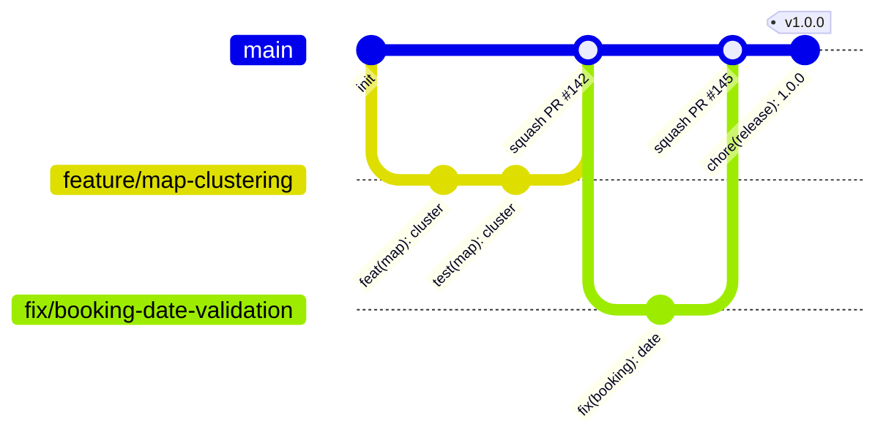

# Dockly — Git Branch Stratejisi

> Kanonik referans: `00-foundation.md` (monorepo §3, feature modülleri §3). CI/CD entegrasyonu: `16-deployment-stratejisi.md`.
> Model: **trunk-based'e yakın GitHub Flow** — tek kalıcı branch (`main`), kısa ömürlü feature branch'leri, tag ile release.

---

## 1. Genel Model



İlkeler:

1. **`main` her zaman yayınlanabilir durumdadır.** Staging'e her merge'de otomatik deploy olur (`deploy-staging.yml`).
2. Branch'ler **kısa ömürlüdür**: hedef ≤ 3 gün, ≤ ~400 satır diff. Büyük iş parçaları dikey dilimlere bölünür; yarım özellik feature flag (`app_settings`, bkz. `16-deployment-stratejisi.md` §7) arkasında merge edilir.
3. Kalıcı ikinci branch (develop vb.) **yoktur**. Release'ler tag'dir; yalnızca yayın stabilizasyonu gerekirse geçici `release/x.y.z` branch'i açılır (bkz. §9).
4. `main`'e doğrudan push kapalıdır; tek yol PR'dır (bot dahil).

---

## 2. Branch Adlandırma Konvansiyonu

Format: `<tip>/<kisa-aciklama-kebab-case>` — küçük harf, Türkçe karakter yok, ≤ 50 karakter. İsteğe bağlı issue eki: `<tip>/DCK-123-kisa-aciklama` (story ID'leri `19-sprint-plani.md`'deki `DCK-xxx` formatındadır).

| Önek | Amaç | Örnek |
|---|---|---|
| `feature/` | Yeni özellik | `feature/DCK-401-map-bbox-loading` |
| `fix/` | Hata düzeltme | `fix/DCK-733-booking-date-validation` |
| `hotfix/` | Prod'daki kritik hata (bkz. §7) | `hotfix/1.0.1-map-crash` |
| `chore/` | Bakım, bağımlılık, CI | `chore/upgrade-riverpod-3` |
| `docs/` | Yalnızca dokümantasyon | `docs/18-roadmap-guncelleme` |
| `refactor/` | Davranış değiştirmeyen yeniden yapılandırma | `refactor/locations-repository-split` |
| `release/` | Geçici yayın stabilizasyonu | `release/1.0.0` |

Kural: branch adındaki modül/feature adları foundation §3'teki kanonik listeden gelir (`map`, `booking`, `reviews`, `favorites`...). `feature/harita-x` gibi Türkçe modül adı **kullanılmaz**.

---

## 3. Commit Konvansiyonu (Conventional Commits)

Format:

```
<tip>(<scope>): <emir kipinde kısa özet, küçük harf, nokta yok>

<opsiyonel gövde: neden + nasıl>

<opsiyonel footer: Refs: DCK-123 / BREAKING CHANGE: ...>
```

### 3.1 Tipler

| Tip | Kullanım |
|---|---|
| `feat` | Kullanıcıya/API'ye görünür yeni davranış |
| `fix` | Hata düzeltme |
| `docs` | Dokümantasyon |
| `refactor` | Davranış değişikliği olmayan kod düzenleme |
| `test` | Test ekleme/düzeltme |
| `chore` | Build, CI, bağımlılık, tooling |
| `perf` | Performans iyileştirme |
| `style` | Format/lint (davranışsız) |

### 3.2 Scope'lar

Scope, monorepo path'inden ve foundation §3 feature modüllerinden türetilir:

- Mobil feature'lar: `auth`, `onboarding`, `boats`, `map`, `search`, `locations`, `booking`, `reviews`, `favorites`, `notifications`, `profile`, `settings`
- Paketler: `core` (dockly_core), `api` (dockly_api), `ui` (dockly_ui)
- Diğer: `admin`, `db` (migrations), `edge` (functions), `ci`, `release`

### 3.3 Örnekler

```
feat(map): bbox tabanlı lokasyon yükleme ve cluster desteği ekle
fix(booking): check_out < check_in doğrulamasını S-14 formuna ekle
feat(reviews): S-12 puan verme akışında moderation_status=pending ata
refactor(api): LocationDto -> domain mapper'ı dockly_core'a taşı
test(search): amenity filtre kombinasyonları için widget test ekle
chore(ci): pr-checks workflow'una supabase db lint job'ı ekle
docs(db): expand-contract örneğini 16-deployment-stratejisi ile hizala
feat(db)!: locations tablosuna vhf_channel_v2 kolonu ekle

BREAKING CHANGE: /v1 yanıtında vhf_channel alanı deprecated.
```

### 3.4 Zorlama

- `commitlint` (husky pre-commit + CI job) konvansiyonu doğrular.
- Squash merge'de **PR başlığı** commit mesajı olur; bu yüzden PR başlığı da Conventional Commits formatındadır ve CI'da lint edilir.
- Changelog otomasyonu bu konvansiyondan beslenir (`16-deployment-stratejisi.md` §6.2).

---

## 4. PR Kuralları

### 4.1 Zorunlu koşullar

1. **En az 1 onaylı review** (code owner'dan). Kritik path'lerde (aşağıda) 2 review.
2. **CI yeşil**: `pr-checks.yml` tüm job'ları (lint + test + build + gerekiyorsa migration dry-run).
3. **Squash merge** — tek merge yöntemi budur; merge commit ve rebase merge repo ayarından kapalıdır. `main` tarihçesi "1 PR = 1 commit" olarak kalır.
4. PR şablonu eksiksiz doldurulur.
5. Branch günceldir (`Require branches to be up to date` açık — merge queue kullanılır).

### 4.2 PR şablonu (`.github/PULL_REQUEST_TEMPLATE.md`)

```markdown
## Ne değişti?
<!-- 2-3 cümle -->

## İlgili story / issue
Refs: DCK-___

## Değişiklik tipi
- [ ] feat  - [ ] fix  - [ ] refactor  - [ ] chore/docs/test

## Kontrol listesi
- [ ] Testler eklendi/güncellendi (DoD gereği)
- [ ] Ekran değişiklikleri için screenshot/video eklendi (S-xx ID'siyle)
- [ ] Migration varsa expand-contract kuralına uygun (16-deployment §8.3)
- [ ] Feature flag gerekiyor mu? (feature.<modul>.<ozellik>)
- [ ] Breaking change YOK / varsa BREAKING CHANGE footer'ı yazıldı
- [ ] i18n: yeni metinler TR+EN eklendi
```

### 4.3 Code owners (`.github/CODEOWNERS`, özet)

```
/supabase/                @dockly/backend
/packages/dockly_api/     @dockly/backend @dockly/mobile
/apps/mobile/             @dockly/mobile
/apps/admin_web/          @dockly/mobile
/packages/dockly_ui/      @dockly/mobile @dockly/design
/.github/workflows/       @dockly/cto
```

2 review gerektiren kritik path'ler: `supabase/migrations/`, `apps/mobile/lib/features/auth/`, `.github/workflows/`, `fastlane/`.

### 4.4 Review görgü kuralları

- İlk review yanıtı hedefi: **4 iş saati** içinde (5 kişilik çekirdek ekipte blokajı önlemek için).
- Review, davranış + test + adlandırma (foundation'a uygunluk: enum/tablo/ekran ID'leri) odaklıdır; format tartışması yok — formatter karar verir.
- "Nitpick" yorumları `nit:` önekiyle işaretlenir, merge'i bloklamaz.

---

## 5. Korumalı Branch Kuralları

`main` için GitHub branch protection:

| Kural | Değer |
|---|---|
| Require a pull request before merging | ✅ (1 approval; kritik path'lerde CODEOWNERS ile 2) |
| Dismiss stale approvals on new commits | ✅ |
| Require status checks | ✅ `analyze`, `test`, `build`, `edge_functions` |
| Require branches to be up to date / merge queue | ✅ |
| Require conversation resolution | ✅ |
| Require signed commits | ✅ |
| Restrict force pushes / deletions | ✅ (herkese kapalı) |
| Bypass | yok (admin dahil; break-glass yalnızca CTO, kayıt altında) |

`release/x.y.z` branch'leri (açıldıklarında) aynı korumayı devralır; ek olarak yalnızca `fix/`, `chore(release)` PR'ları kabul edilir.

Tag koruması: `v*` pattern'i protected tag'dir; yalnızca release captain + CTO tag push edebilir.

---

## 6. Hotfix Akışı

Prod'da kritik hata (crash-free < %99.5, çekirdek akış kırık, güvenlik) tespit edildiğinde:

1. Anlık hafifletme: feature kill-switch / rollout durdurma (`16-deployment-stratejisi.md` §8.1) — kod yazmadan önce kanamayı durdur.
2. `main`'den `hotfix/x.y.(z+1)-kisa-ad` branch'i açılır. (Trunk-based olduğumuz için hotfix de `main`'den çıkar; `main` her zaman yayınlanabilir.)
3. Düzeltme + test; PR normal kurallarla ama **öncelikli review** (hedef: 2 saat içinde merge).
4. Merge sonrası `main`'den `vX.Y.(Z+1)` tag'i atılır → `release-prod.yml` prod'a çıkar (Android %5'ten hızlandırılmış kademe: %20 başlangıç + 24 saat gözlem; iOS expedited review talebi).
5. İstisna — `main`'de henüz yayınlanmamış riskli değişiklik birikmişse: son prod tag'inden geçici `release/x.y.z` branch'i açılır, fix oraya cherry-pick edilir, tag oradan atılır; fix **mutlaka** `main`'e de merge edilir (önce `main`, sonra cherry-pick kuralı).
6. Post-mortem: 3 iş günü içinde, suçlamasız; çıktılar `audit_logs` değil docs/incidents altına.

---

## 7. Monorepo'da Path-Based CI Tetikleme

`pr-checks.yml` ve `deploy-staging.yml`, `dorny/paths-filter` ile değişen path'lere göre job seçer:

| Değişen path | Tetiklenen pipeline parçası |
|---|---|
| `apps/mobile/**` | mobil lint+test+build (iOS no-codesign + Android debug) |
| `apps/admin_web/**` | admin web lint+test+`flutter build web` |
| `packages/dockly_core/**`, `packages/dockly_api/**`, `packages/dockly_ui/**` | paket testleri **+ bağımlı uygulamaların** (mobile, admin_web) build'i — melos bağımlılık grafiğinden çözülür |
| `supabase/migrations/**` | `supabase db lint` + shadow DB dry-run |
| `supabase/functions/**` | deno lint + deno test + (main'de) yalnızca değişen fonksiyonların deploy'u |
| `.github/workflows/**`, `fastlane/**` | workflow lint (actionlint) + 2 review zorunluluğu |
| `docs/**` | yalnızca markdown lint (hızlı yol, build koşmaz) |

Kurallar:

- Paket değişikliği daima yukarı doğru yayılır: `dockly_ui` değişirse hem mobile hem admin_web build edilir.
- `supabase/**` + `apps/mobile/**` birlikte değişmişse her iki hat da koşar; API sözleşme değişikliklerinde `packages/dockly_api` de aynı PR'da güncellenir (tek PR, atomik sözleşme).
- Nightly (`nightly.yml`) path filtresiz tam suite koşar — filtre kaçaklarına karşı güvenlik ağı.

---

## 8. Sürüm Tag'leme

- Format: `vX.Y.Z` (SemVer, `16-deployment-stratejisi.md` §6). Build number tag'de yer almaz; CI üretir.
- Tag **her zaman** `main` üzerindeki (veya §7/5 istisnasında release branch'indeki) yeşil bir commit'e atılır ve imzalıdır (`git tag -s`).
- Tag ataması release captain tarafından yapılır; `release-prod.yml` tag push'unda otomatik başlar, prod environment approval kapısında bekler.
- RC pratiği: store dışı doğrulama için `v1.0.0-rc.1` ön-sürüm tag'leri kullanılabilir; bunlar prod deploy'u değil yalnızca RC build (TestFlight External / Play Closed) tetikler.
- Planlı tag takvimi (bkz. `19-sprint-plani.md`): `v0.9.0-rc.1` → 20 Ekim 2026 (kapalı beta), `v1.0.0` → 17 Kasım 2026 (soft launch build'i; yayın 26 Kasım), `v1.1.0` → Şubat 2027, `v1.2.0` → Nisan 2027 (tam lansman).

---

## 9. Örnek Senaryolar (Adım Adım)

### 9.1 Yeni özellik: haritada amenity filtresi (S-08)

```bash
git checkout main && git pull origin main
git checkout -b feature/DCK-512-filter-bottom-sheet

# ... geliştirme ...
git add apps/mobile/lib/features/search/
git commit -m "feat(search): S-08 filtre bottom sheet iskeletini ekle"
git commit -m "feat(search): amenity kodlarindan filtre chip'leri uret"
git commit -m "test(search): filtre kombinasyon widget testleri"

git push -u origin feature/DCK-512-filter-bottom-sheet
gh pr create --title "feat(search): S-08 filtre bottom sheet (amenity + location_type)" \
  --body-file .github/PULL_REQUEST_TEMPLATE.md
# CI yeşil + 1 review → merge queue → squash merge
# main'e merge → staging'e otomatik deploy → TestFlight Internal build
```

### 9.2 Migration içeren backend değişikliği

```bash
git checkout -b feature/DCK-604-recently-viewed-upsert
supabase db diff -f 20260901101500_recently_viewed_upsert_index
git add supabase/migrations/ supabase/functions/recently-viewed/ packages/dockly_api/
git commit -m "feat(db): recently_viewed icin upsert index ekle"
git commit -m "feat(edge): POST /recently-viewed upsert davranisi"
git commit -m "feat(api): RecentlyViewedDto guncelle"
git push -u origin feature/DCK-604-recently-viewed-upsert
# PR: paths-filter migration dry-run + deno test + mobile build'i birlikte koşturur
# 2 review (supabase/migrations kritik path) → squash merge
```

### 9.3 Prod hotfix: haritada crash

```bash
# 1) Kanamayı durdur: admin panelden feature.map.clustering_v2 -> false (kill-switch)
# 2) Fix branch'i
git checkout main && git pull
git checkout -b hotfix/1.0.1-map-cluster-npe
git commit -m "fix(map): null bbox'ta cluster hesaplamasinda crash'i onle

Refs: DCK-771, Sentry DOCKLY-MOB-4Q2"
git push -u origin hotfix/1.0.1-map-cluster-npe
gh pr create --title "fix(map): null bbox'ta cluster crash'i onle" --label hotfix
# öncelikli review → squash merge
# 3) Release
git checkout main && git pull
git tag -s v1.0.1 -m "hotfix: map cluster crash"
git push origin v1.0.1
# release-prod.yml → prod approval → hızlandırılmış rollout
```

### 9.4 Release stabilizasyonu gerektiğinde (istisna yolu)

```bash
# main'de v1.1.0 sonrası riskli işler birikti, prod'a acil fix lazım:
git checkout -b release/1.1.1 v1.1.0
git cherry-pick <fix-commit-sha>   # fix önce main'e merge edilmişti
git push -u origin release/1.1.1
git tag -s v1.1.1 && git push origin v1.1.1
# yayın sonrası release/1.1.1 silinir; kalıcı branch bırakılmaz
```

### 9.5 Uzun süren özellik: rezervasyon talebi akışı (S-14/S-15)

```bash
# Tek dev branch'te 3 hafta çalışmak YASAK. Dilimleme:
# PR 1: feat(booking): domain modelleri + booking_requests repository arayuzu
# PR 2: feat(booking): S-14 form UI (feature.booking.enabled=false arkasinda)
# PR 3: feat(booking): POST /booking-requests entegrasyonu + hata durumlari
# PR 4: feat(booking): S-15 taleplerim listesi + cancel akisi
# PR 5: chore(booking): feature.booking.enabled=true (staging) + analitik eventleri
# Her PR ≤ 3 gün, main hep yayınlanabilir, özellik flag ile kapalı gider.
```

---

## 10. Özet Kurallar (Ekip Kartı)

1. `main`'den branch al, ≤ 3 günde PR aç, squash merge et.
2. PR başlığın = Conventional Commit; scope'u foundation §3'ten seç.
3. CI yeşil + 1 review (migration/auth/CI'da 2) olmadan merge yok.
4. Yarım özellik flag arkasında merge edilir; branch bekletilmez.
5. Prod'a giden tek yol: `vX.Y.Z` tag + approval. Elle deploy yok.
6. Hotfix de `main`'den çıkar; önce kill-switch, sonra kod.
7. Enum/tablo/ekran ID'lerini asla yeniden icat etme — `00-foundation.md`'den kopyala.

---

*Son güncelleme: 6 Temmuz 2026 — Sprint 0 (13 Temmuz 2026) öncesi tüm ekip tarafından okunmuş olmalıdır.*
