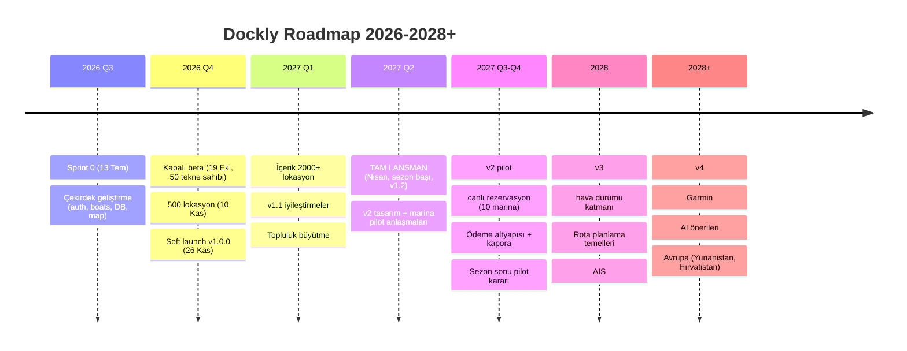
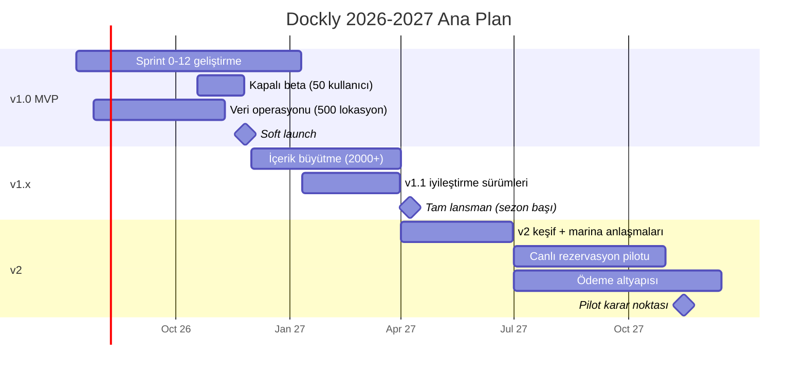

# Dockly — Ürün Roadmap'i (2026–2028+)

> Kanonik referans: `00-foundation.md`. v1 kapsam sınırı foundation §1'deki **Hard Exclusions** listesidir; gelecek modüllerin eklenme mekanizması foundation **§9 Modülerlik Sözleşmesi**'dir.
> Tarih bağlamı: bugün 6 Temmuz 2026. Türkiye'de tekne sezonu **Nisan–Ekim**; tüm faz hedefleri **Nisan 2027 sezon başına tam güçle yetişmek** stratejisine göre kurulmuştur.

---

## 1. Strateji Özeti

- **Kuzey yıldızı**: Dockly, tekne sahibinin her gün açtığı harita uygulamasıdır (Google Maps + TripAdvisor + Booking.com hissi) — rezervasyon uygulaması değil.
- **Sıralama mantığı**: önce **içerik + keşif** (haritada değerli veri), sonra **topluluk** (veriyi canlı tutan döngü), sonra **işlem** (rezervasyon), en son **akıllı katmanlar** (hava, rota, AIS, AI).
- **Sezon takvimi kısıtı**: 2026 sezonu (Nisan–Ekim 2026) geliştirmeye denk gelir; bu yüzden **soft launch bilinçli olarak sezon dışına (26 Kasım 2026)** konur: düşük trafikte öğren, kışın içerik büyüt, **Nisan 2027 sezon açılışında tam lansman** yap.
- v1 müşterisi yalnızca tekne sahipleridir (B2C, `country_code = TR`); marinalar v2 pilotuna kadar müşteri değildir.

---

## 2. Faz Haritası (Özet Tablo)

| Sürüm | Dönem | Tema | Kilit çıktı |
|---|---|---|---|
| **v1.0 MVP** | 2026 Q3–Q4 | Keşif + Topluluk + Rezervasyon Talebi | 26 Kasım 2026 soft launch, ilk 500 lokasyon |
| **v1.x** | 2027 Q1–Q2 başı | İçerik ve topluluk büyütme | 2000+ lokasyon, Nisan 2027 tam lansman |
| **v2** | 2027 Q2–Q4 | Canlı rezervasyon + marina pilotu + ödeme altyapısı | 10 pilot marina, online ödeme temeli |
| **v3** | 2028 | Denizcilik zekâsı temelleri | Hava durumu, rota planlama temelleri, AIS |
| **v4** | 2028+ | Ekosistem + Avrupa | Garmin, yapay zekâ önerileri, Yunanistan + Hırvatistan |

---

## 3. v1.0 — MVP (2026 Q3–Q4)

**Kapsam** (foundation §1): Keşif + Topluluk + Rezervasyon Talebi (request-only). `booking_request_status` akışı `pending → contacted → confirmed | cancelled | expired`; onay Dockly operasyon ekibi tarafından manuel işlenir.

### 3.1 İçerik

- 12 feature modülünün tamamı (foundation §3): `auth`, `onboarding`, `boats`, `map`, `search`, `locations`, `booking`, `reviews`, `favorites`, `notifications`, `profile`, `settings`.
- 23 mobil ekran (S-01…S-23) + admin panel (A-01…A-08).
- 9 `location_type` ile harita keşfi, amenity filtreleri, cursor tabanlı arama.
- Topluluk: yorum+puan (S-11/S-12), fotoğraf yükleme (S-13), yeni nokta önerisi (S-22), hatalı bilgi bildirimi (S-23) — tümü `moderation_status` akışından geçer.
- **Veri hedefi: ilk 500 lokasyon** (yayınlanmış, fotoğraflı, doğrulanmış) — detay: `20-mvp-gelistirme-plani.md` §5.

### 3.2 Takvim

| Kilometre taşı | Tarih |
|---|---|
| Sprint 0 başlangıcı | 13 Temmuz 2026 |
| Kapalı beta (TestFlight External / Play Closed, 50 tekne sahibi) | 19 Ekim 2026 |
| İçerik eşiği: 500 yayınlanmış lokasyon | 10 Kasım 2026 |
| `v1.0.0` build store review'da | 16–17 Kasım 2026 |
| **Soft launch (TR, sessiz yayın)** | **26 Kasım 2026** |
| Soft launch stabilizasyonu + launch hazırlık sprintleri sonu | 10 Ocak 2027 |

### 3.3 v1.0 çıkış (başarı) metrikleri — v1.x'e giriş kriterleri

| Metrik | Eşik |
|---|---|
| Crash-free users | ≥ %99.5 |
| Yayınlanmış lokasyon | ≥ 500 |
| Kayıtlı kullanıcı (soft launch + 6 hafta) | ≥ 2.000 |
| Haftalık aktif kullanıcı (WAU) | ≥ 600 |
| Rezervasyon talebi (toplam) | ≥ 150 |
| Kullanıcı üretimi içerik (yorum+fotoğraf+öneri) | ≥ 500 adet |
| D30 retention | ≥ %15 (sezon dışı toleransıyla) |

---

## 4. v1.x — İyileştirme ve Büyütme (2027 Q1 → Nisan 2027 tam lansman)

**Giriş kriteri**: §3.3 tablosundaki eşiklerin en az 5/7'si tutturulmuş; kritik olanlar (crash-free, 500 lokasyon) zorunlu.

### 4.1 İçerik büyütme: 500 → 2000+ lokasyon

- Kış operasyon dönemi (Aralık 2026 – Mart 2027): veri girişi ekibi ölçeklenir (2 → 4 kişi), Ege+Akdeniz tam kapsama, Marmara+Karadeniz başlangıç.
- Topluluk önerileri (`suggestions`, `suggestion_type: new_location | edit_location`) admin panelde hızlandırılmış moderasyon kuyruğuyla içerik motoruna dönüştürülür.
- Fotoğraf kapsama hedefi: yayınlanmış lokasyonların ≥ %80'inde en az 3 fotoğraf.

### 4.2 Ürün iyileştirmeleri (soft launch öğrenimlerinden)

- Arama/filtre kalitesi (S-07/S-08): sıralama, yazım toleransı (`pg_trgm`), koy adıyla arama iyileştirme.
- Harita performansı: cluster v2 (`feature.map.clustering_v2` flag'i kademeli açılır), offline tile ön-yükleme (Drift cache genişletme).
- Bildirim akışları (`notification_type` tam kullanım: `favorite_update`, `new_photo`).
- Onboarding dönüşüm optimizasyonu; misafir → kayıtlı kullanıcı dönüşümü.

### 4.3 Nisan 2027 tam lansman

- Tarih: **1–15 Nisan 2027** penceresi (sezon açılışı), sürüm `v1.2.0`.
- Pazarlama: marina/koy influencer'ları, yat kulüpleri, Bodrum-Göcek-Fethiye saha etkinlikleri; store featured başvuruları.
- Lansman metrik hedefleri (2027 sezonu sonu, Ekim 2027): 25.000 kayıtlı kullanıcı, 5.000 WAU (sezon içi), 2.500+ lokasyon, aylık 1.500 rezervasyon talebi.

---

## 5. v2 — Canlı Rezervasyon + Marina Entegrasyonu Pilotu (2027)

**Giriş kriterleri**: tam lansman sonrası (Haziran 2027 itibarıyla) WAU ≥ 3.500; aylık rezervasyon talebi ≥ 800; talep→`confirmed` dönüşümü ≥ %35; en az 10 marinadan yazılı pilot ilgisi.

Foundation §9 sözleşmesi gereği bu faz **yeniden yazım gerektirmez**:

- **Canlı rezervasyon**: `booking_requests.status` genişletilir; `availability` tablosu için ayrılan yer devreye alınır. Request-only akış, flag ile (`feature.booking.live`) pilot marinalarla sınırlı açılır.
- **Marina tarafı**: `user_role` genişletilir (marina operatör rolleri); RLS politikaları role-bazlı olduğundan yeni rol eklenmesi politika genişletmesidir. Marina paneli admin_web üzerinde ayrı yetki katmanı olarak başlar.
- **Online ödeme altyapısı**: boş bırakılan `payments` domain arayüzü doldurulur; para alanları zaten `NUMERIC + currency_code`. 2027'de kapsam **altyapı + kapora pilotu** (tam ödeme v2.x'te); PSP seçimi ve PCI kapsam analizi Q3 2027.
- Pilot: 10 marina (Göcek/Bodrum/Fethiye ağırlıklı), Temmuz–Ekim 2027 sezonu içinde canlı; sezon sonunda karar noktası: genişlet / düzelt / geri çek (request-only'ye dönüş her an mümkün — flag).

**v2 çıkış metrikleri**: pilot marinalarda müsaitlik doğruluğu ≥ %90, canlı rezervasyonda tamamlama ≥ %60, marina memnuniyeti (NPS) > 30.

---

## 6. v3 — Denizcilik Zekâsı Temelleri (2028)

**Giriş kriterleri**: v2 pilotu genişletme kararı almış; 50.000+ kayıtlı kullanıcı; sürdürülebilir birim ekonomisi (v2 gelir hattı çalışıyor); harita katmanı plugin mimarisi (MapLayer arayüzü) teknik borçsuz.

- **Hava durumu**: MapLayer plugin'i olarak rüzgâr/dalga/basınç katmanları; lokasyon detayına (S-09) koy bazlı tahmin kartı. Sağlayıcı entegrasyonu Edge Function arkasında soyutlanır.
- **Rota planlama temelleri**: A noktasından B'ye taslak rota, mesafe/süre/yakıt tahmini (`boats` profilindeki `engine_type`, `length_m` verisiyle); navigasyon DEĞİL, planlama aracı.
- **AIS**: canlı gemi trafiği katmanı (üçüncü parti feed), koy yoğunluk göstergesi ("bu koyda şu an ~12 tekne").
- Tümü ayrı MapLayer plugin'leri + feature flag'ler olarak gelir; kapalıyken v1/v2 deneyimi aynen çalışır.

---

## 7. v4 — Ekosistem ve Avrupa (2028+)

**Giriş kriterleri**: v3 katmanlarının benimsenmesi (hava katmanı WAU penetrasyonu ≥ %40); TR pazarında kategori liderliği sinyalleri; Avrupa için içerik operasyonu playbook'unun TR'de kanıtlanmış olması.

- **Garmin entegrasyonu**: chartplotter'a favori/rota gönderimi (foundation §9'daki harita plugin mimarisi üzerinden).
- **Yapay zekâ önerileri**: "bu hafta sonu teknene ve rüzgâra göre en iyi 3 koy" — `boats` profili + favoriler + hava verisi birleşimi; öneri motoru API tarafında, istemci değişikliği minimal.
- **Avrupa açılımı — Yunanistan + Hırvatistan öncelikli**: tüm içerik tablolarında `country_code` zaten mevcut; i18n altyapısı (TR+EN hazır) EL/HR ile genişler; ölçüler zaten metrik. Açılım sırası: Yunanistan (Ege devamlılığı, TR kullanıcılarının mevcut rotası) → Hırvatistan (Adriyatik charter pazarı). Ülke başına yerel veri operasyonu + yerel topluluk yöneticisi modeli.

---

## 8. Tema Bazlı Yol Haritası

| Tema | v1.0 (2026 Q3–Q4) | v1.x (2027 Q1–Q2) | v2 (2027) | v3 (2028) | v4 (2028+) |
|---|---|---|---|---|---|
| **Keşif** | Harita (S-06), 9 location_type, arama+filtre (S-07/S-08), detay (S-09/S-10), 500 lokasyon | 2000+ lokasyon, arama kalitesi, cluster v2, offline iyileştirme | Müsaitlik bilgisiyle zenginleşen keşif | Hava katmanı, AIS yoğunluk, rota temelleri | AI önerileri, çok ülkeli keşif (GR/HR) |
| **Topluluk** | Yorum+puan, fotoğraf, öneri/bildirim akışları (S-11…S-13, S-22/S-23), moderasyon | Topluluk büyütme, katkı rozetleri*, hızlı moderasyon, `favorite_update` bildirimleri | Marina yanıtları (işletme sesi) | Topluluk rota/koy raporları | Çok dilli topluluk, yerel moderatörler |
| **Rezervasyon** | Talep akışı (S-14/S-15), manuel operasyon, `booking_request_status` | Talep operasyonu ölçekleme, SLA'lar, talep dönüşüm optimizasyonu | **Canlı rezervasyon pilotu, availability, ödeme altyapısı + kapora** | Dinamik doluluk sinyalleri | Ülkelerarası rezervasyon, tam online ödeme |
| **Platform** | Monorepo, CI/CD, 3 ortam, feature flag, moderasyon paneli (A-01…A-08) | Analitik derinleşme, growth araçları, performans | `payments` modülü, marina rolleri/RLS genişletme, `/v1` üstüne ekleme | MapLayer plugin'leri, veri sağlayıcı soyutlamaları | Garmin SDK, ML servisleri, çok bölgeli altyapı |

\* Rozet benzeri v1.x adayları soft launch verisiyle önceliklendirilir; kapsam kilidi ilkesi (`20-mvp-gelistirme-plani.md` §2) v1.0 için geçerlidir.

---

## 9. Zaman Çizelgesi (Mermaid)

---

## 10. Faz Geçiş Kapıları (Gate) — Özet

| Kapı | Karar tarihi | Zorunlu kriterler | Karar vericiler |
|---|---|---|---|
| G1: Soft launch onayı | 17 Kasım 2026 | Launch kriterleri (`20-mvp-gelistirme-plani.md` §7): crash-free ≥ %99.5, çekirdek akışlar, 500 lokasyon | CTO + PM |
| G2: Tam lansman onayı | 15 Mart 2027 | §3.3 metrikleri + 2000 lokasyon trendi + soft launch P0/P1 hata sıfır | CTO + PM + kurucular |
| G3: v2 pilot başlatma | Haziran 2027 | §5 giriş kriterleri + 10 marina sözleşmesi | Kurucular |
| G4: v2 genişletme / geri çekme | Kasım 2027 | v2 çıkış metrikleri (§5) | Kurucular |
| G5: v3 yatırımı | 2028 Q1 | §6 giriş kriterleri | Kurucular |
| G6: Avrupa açılımı | v3 sonrası | §7 giriş kriterleri + GR/HR operasyon planı | Yönetim kurulu |

Kapı geçilemezse: faz başlamaz; bir "düzelt ve yeniden değerlendir" sprint bloğu (2–3 sprint) planlanır. Roadmap tarihleri kayar ama **sıralama değişmez**.

---

## 11. Modülerlik Sözleşmesine Bağlılık (foundation §9)

Bu roadmap'in v2–v4 fazları, foundation §9'daki hazırlıklar sayesinde mevcut kod **yeniden yazılmadan** eklenir:

| Roadmap fazı | Foundation §9 dayanağı |
|---|---|
| v2 canlı rezervasyon | `booking_requests.status` genişletilebilir; `availability` tablosu için yer ayrıldı |
| v2 online ödeme | `payments` domain arayüzü boş bırakıldı; `NUMERIC + currency_code` |
| v2 marina paneli | `user_role` genişletilebilir; RLS role-bazlı |
| v3 hava / AIS / rota, v4 Garmin | MapLayer plugin mimarisi |
| v4 Avrupa | `country_code` her içerik tablosunda; i18n TR+EN hazır; metrik ölçüler |

Kural: bir faz, §9'da karşılığı olmayan bir mimari değişiklik gerektirirse, önce foundation güncellenir (ADR süreciyle), sonra roadmap'e alınır.

---

## 12. Roadmap Yönetişimi

- Bu doküman **çeyrek başına bir** gözden geçirilir (Ocak/Nisan/Temmuz/Ekim ilk haftası); ara değişiklikler yalnızca kapı kararlarıyla yapılır.
- "Tarih değil sıra taahhüdü": dış paydaşlara faz sırası taahhüt edilir, tarihler hedeftir. Tek istisna: **Nisan 2027 tam lansman** şirket taahhüdüdür; risk görülürse kapsam kırpılır, tarih korunur.
- Talep kaynakları (beta geri bildirimi, `suggestions`, store yorumları, operasyon ekibi) PM tarafından aylık tema panosunda toplanır; v1.x backlog'u buradan beslenir.
- İlgili dokümanlar: sprint kırılımı → `19-sprint-plani.md`; MVP faz/çıkış kriterleri → `20-mvp-gelistirme-plani.md`; sürüm/dağıtım mekaniği → `16-deployment-stratejisi.md`.

---

*Son güncelleme: 6 Temmuz 2026. Bir sonraki planlı gözden geçirme: 5 Ekim 2026 (Q4 başı).*
