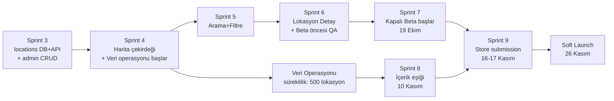
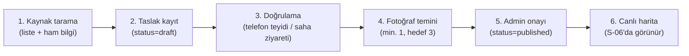

# Dockly — MVP Geliştirme Planı

> Kanonik referans: `00-foundation.md` (§1 Ürün Kimliği, Hard Exclusions). Tarih/faz çerçevesi: `18-roadmap.md`. Sprint kırılımı: `19-sprint-plani.md`. Dağıtım mekaniği: `16-deployment-stratejisi.md`.
> Tarih bağlamı: bugün **6 Temmuz 2026**. Türkiye'de tekne sezonu **Nisan–Ekim**. Hedef: **26 Kasım 2026 soft launch** (bilinçli olarak sezon dışı), **Nisan 2027 tam lansman** (sezon başı, `18-roadmap.md` §4.3'te 1-15 Nisan 2027 penceresi).

---

## 1. MVP Tanımı

Dockly v1.0 MVP, tekne sahibinin **her gün açtığı harita uygulaması** deneyimini üç katmanda kurar (foundation §1, `18-roadmap.md` §1):

1. **Keşif** — harita üzerinde 9 `location_type` ile bağlama noktası keşfi, arama, filtre, detay.
2. **Topluluk** — yorum/puan, fotoğraf, yeni nokta önerisi, hatalı bilgi bildirimi; veriyi canlı tutan geri bildirim döngüsü.
3. **Rezervasyon Talebi (request-only)** — gerçek/onaylı rezervasyon değil; Dockly operasyon ekibi tarafından manuel işlenen bir talep akışı.

MVP'nin başarısı, **işlem hacminden değil, içerik kalitesi ve keşif deneyiminden** ölçülür. "Rezervasyon" kelimesi kullanıcıya yanlış beklenti vermemesi için ürün içi metinlerde bilinçli olarak "talep" ifadesiyle konumlandırılır.

---

## 2. Kapsam Kilidi (Scope Lock)

### 2.1 Kapsam İçi (In-Scope) — foundation'dan birebir

- 12 feature modülü: `auth`, `onboarding`, `boats`, `map`, `search`, `locations`, `booking`, `reviews`, `favorites`, `notifications`, `profile`, `settings`.
- 23 mobil ekran (S-01…S-23) + 8 admin ekranı (A-01…A-08).
- 9 `location_type`, 15 amenity kodu, tüm foundation §4 enum'ları.
- `booking_request_status` akışı: `pending → contacted → confirmed | cancelled | expired` (manuel operasyon).
- Yalnızca Türkiye pazarı (`country_code = TR`), yalnızca B2C (tekne sahipleri).

### 2.2 Hard Exclusions — v1'de KESİNLİKLE OLMAYANLAR (foundation §1)

| Dışlanan | Neden / Ne zaman gelir |
|---|---|
| Yapay zekâ önerileri | v4 (foundation §9, `18-roadmap.md` §7) |
| Rota planlama | v3 temelleri (`18-roadmap.md` §6) |
| Hava durumu | v3 (`18-roadmap.md` §6) |
| AIS (canlı gemi trafiği) | v3 (`18-roadmap.md` §6) |
| Garmin entegrasyonu | v4 (`18-roadmap.md` §7) |
| Marina yönetim paneli / marina hesabı | v2 pilotu (`18-roadmap.md` §5) |
| Online ödeme | v2 altyapı + kapora pilotu (`18-roadmap.md` §5) |
| Canlı müsaitlik | v2 (`availability` tablosu için yer ayrılmış, foundation §9) |
| Gerçek (onaylı) rezervasyon | v2 canlı rezervasyon pilotu |

### 2.3 Kapsam Kilidi Politikası

- Bu listeye **hiçbir istisna** Sprint 0-12 döneminde (13 Temmuz 2026 – 10 Ocak 2027) tanınmaz.
- Kapsam dışı bir talep gelirse (paydaş, beta kullanıcısı, satış): PM tarafından `18-roadmap.md` §12'deki aylık tema panosuna kaydedilir, v1.x veya sonrası için değerlendirilir.
- Foundation'da karşılığı olmayan bir mimari değişiklik önerisi varsa, önce foundation ADR süreciyle güncellenir, ancak ondan sonra plana alınır (`18-roadmap.md` §11 kuralı).
- Kapsam genişletme talebi Sprint Planning'de gündeme gelirse, **varsayılan cevap hayırdır**; onay yalnızca PM + kurucular ortak kararıyla ve yalnızca launch kriterlerini (bkz. §7) tehlikeye atmadığı kanıtlanırsa verilir.

---

## 3. Geliştirme Fazları

MVP dönemi, `19-sprint-plani.md`'deki 13 sprint'i (Sprint 0-12) 7 faza gruplar. Faz sınırları sprint sınırlarıyla örtüşür; her fazın bir **çıkış kriteri** vardır — bir sonraki faz, kriterin karşılanması beklenmeden başlamaz (ancak paralel hazırlık yapılabilir).

### Faz 0 — Hazırlık (Sprint 0, 13-26 Tem 2026)

**Kapsam:** Monorepo, 3 ortam, CI/CD, design system.
**Çıkış kriteri:** CI yeşil; 3 ortamda (dev/staging/prod) canlı Supabase + Firebase projeleri; TestFlight Internal/Play Internal'a build yüklenebiliyor; `dockly_ui` v0.1 hazır.

### Faz 1 — Temel Platform (Sprint 1-3, 27 Tem – 6 Eyl 2026)

**Kapsam:** Auth + Profil, Tekne Profili, DB + API Çekirdek (locations dahil), erken admin CRUD.
**Çıkış kriteri:** 5 giriş yöntemiyle auth çalışıyor; tekne CRUD tam; `locations`/`amenities`/`photos` şeması ve API'si production-ready; veri operasyonu ekibinin lokasyon girebileceği bir admin ekranı var.

### Faz 2 — Keşif Çekirdeği (Sprint 4-6, 7 Eyl – 18 Eki 2026)

**Kapsam:** Harita çekirdeği, arama+filtre, lokasyon detay. **Veri operasyonu bu fazda fiilen başlar ve hızlanır.**
**Çıkış kriteri:** S-06…S-10 uçtan uca çalışıyor; offline fallback var; beta öncesi tam regresyon (Sprint 6) geçildi; veri operasyonu haftalık hedef temposuna oturdu (bkz. §5).

### Faz 3 — Etkileşim (Sprint 7-8, 19 Eki – 15 Kas 2026)

**Kapsam:** Rezervasyon talebi, topluluk (yorum/fotoğraf/öneri/bildirim), **kapalı beta**.
**Çıkış kriteri:** Kapalı beta (50 tekne sahibi) canlı ve aktif kullanımda; **500 lokasyon içerik eşiği** geçildi (10 Kasım); topluluk moderasyon döngüsü çalışıyor.

### Faz 4 — Tamamlama ve Launch (Sprint 9, 16-29 Kas 2026)

**Kapsam:** Favoriler + bildirimler; v1.0.0 store submission; **soft launch**.
**Çıkış kriteri:** v1.0.0 App Store + Play Store'da yayında (26 Kasım); crash-free ve çekirdek akış izleme aktif; launch kriterleri (§7) karşılandı.

### Faz 5 — Operasyon Olgunlaşması (Sprint 10-11, 30 Kas – 27 Ara 2026)

**Kapsam:** Tam admin paneli (A-01…A-08), soft launch stabilizasyonu, UX/performans cilası.
**Çıkış kriteri:** Admin paneli tam işlevsel; soft launch'tan gelen P0/P1 hatalar kapatıldı; beta bulgularının büyük kısmı çözüldü.

### Faz 6 — Launch Hazırlık ve Stabilizasyon Kapanışı (Sprint 12, 28 Ara 2026 – 10 Oca 2027)

**Kapsam:** Metrik değerlendirme, v1.x backlog oluşturma, G2 hazırlığı.
**Çıkış kriteri:** `18-roadmap.md` §3.3'teki v1.0 çıkış metriklerinin durumu raporlanmış; v1.x backlog hazır; **G1 kapı kararı** (17 Kasım 2026, soft launch onayı — zaten Faz 4'te geçildi) sonrası performans G2'ye (15 Mart 2027, tam lansman onayı) doğru izleniyor.

Bu faz sonunda MVP geliştirme planı kapanır; sonraki çalışma `18-roadmap.md` §4 (v1.x) kapsamına devreder.

---

## 4. Kritik Yol Analizi

### 4.1 Genel değerlendirme

MVP'nin kritik yolu **mühendislik değil, harita + veri ekseni**dir. Kod tarafında gecikme esnekliği (paralel çalışma, kapsam kırpma, ekstra mesai) mevcutken, **içerik (500 lokasyon)** insan-yoğun, ölçeklenmesi zor ve dış dünyaya (marina/işletme sahiplerine, saha ziyaretlerine) bağımlı bir iştir. Bu nedenle:

> **Harita çekirdeği (Sprint 4) + veri operasyonu (Sprint 4'ten 10 Kasım'a kadar) MVP'nin en riskli bileşenidir.**

### 4.2 Bağımlılık zinciri

### 4.3 Neden harita + veri en riskli?

| Faktör | Açıklama |
|---|---|
| **İnsan-yoğun iş** | 500 lokasyon toplamak yazılım gibi paralelleştirilemez; kaynak tarama, telefon teyidi, fotoğraf temini fiziksel/zamansal bir süreçtir. |
| **Dış bağımlılık** | Marina/restoran/işletme sahiplerinden bilgi teyidi ve fotoğraf izni almak Dockly'nin kontrolü dışındadır (yanıt hızı değişken). |
| **Geç fark edilme riski** | Kod eksiği Sprint Review'da hemen görülür; veri eksiği ancak haftalık sayaç (DCK-072) takip edilmezse Kasım ortasına kadar fark edilmeyebilir. |
| **Tek yönlü zaman baskısı** | İçerik eşiği (10 Kasım) sabit bir tarihtir; store submission (16-17 Kasım) ve soft launch (26 Kasım) buna bağlıdır — geriye doğru esneme payı sadece ~1 hafta. |
| **Kalite-hacim gerilimi** | Hızlı doldurmak için kalite (doğruluk, fotoğraf) feda edilirse, launch sonrası kullanıcı güveni (rating, retention) zarar görür. |

### 4.4 Azaltım stratejisi

1. Veri operasyonu **Sprint 4'te** (7 Eylül) başlar — içerik eşiğinden **~9 hafta önce**, gecikme tamponu bırakır.
2. Haftalık ilerleme sayacı (DCK-072, Sprint 8) aslında Sprint 4'ten itibaren **manuel takip tablosuyla** başlatılır (dashboard'dan önce de PM Excel/Sheets ile izler).
3. Kritik yol her hafta Veri Operasyonu Senkronu'nda (bkz. `19-sprint-plani.md` §2) gözden geçirilir; 2 hafta üst üste hedefin altına düşülürse escalation (PM → kurucular).
4. Kapsam kırpma önceliği: gerekirse **lokasyon sayısı 500'ün altına** değil, önce **fotoğraf/detay zenginliği** kısılır (ör. minimum 1 fotoğraf yeterli sayılır, hedef 3'ten düşürülür) — bkz. §5.4.
5. Harita tarafında (Sprint 4) performans riski, düşük-orta segment cihazlarda erken test (Sprint 4 ortası) ile azaltılır; clustering v1 basit tutulur, v2 iyileştirmesi Sprint 11'e ve v1.x'e ertelenir.

---

## 5. Veri Operasyonu Planı — İlk 500 Lokasyon

> **Bu, MVP'nin en kritik parçasıdır ve temelde bir mühendislik değil, operasyon işidir.** Aşağıdaki plan bir proje yönetimi/saha operasyonu planıdır.

### 5.1 Hedef ve zaman çizelgesi

- **Hedef:** 10 Kasım 2026'ya kadar **≥ 500 yayınlanmış** (`locations.status = published`), fotoğraflı, doğrulanmış lokasyon.
- **Fiili başlangıç:** Sprint 4, 7 Eylül 2026 (admin CRUD'un Sprint 3'te hazır olmasının ardından).
- **Süre:** 7 Eylül – 10 Kasım = **~9.5 hafta**.
- **Gerekli haftalık tempo:** 500 / 9.5 ≈ **~53 lokasyon/hafta** (yarı zamanlı 1 kişi + PM desteğiyle agresif; bu yüzden §5.2'deki kaynak stratejisi ve §5.6'daki kademeli büyüme önemlidir).

| Dönem | Hafta | Kümülatif hedef | Not |
|---|---|---|---|
| 7-20 Eyl (Sprint 4) | 1-2 | 40 | Pilot + süreç oturtma, düşük hız beklenir |
| 21 Eyl-4 Eki (Sprint 5) | 3-4 | 120 | Tempoya oturma |
| 5-18 Eki (Sprint 6) | 5-6 | 220 | Bodrum-Göcek-Fethiye önceliği tamamlanmaya başlar |
| 19 Eki-1 Kas (Sprint 7) | 7-8 | 360 | Beta kullanıcı önerileri (`suggestions`) devreye girer, hız artar |
| 2-15 Kas (Sprint 8) | 9-9.5 | **500+** | Eşik günü: 10 Kasım |

Bu tempo, tek bir yarı zamanlı veri operasyonu kişisiyle zorlayıcıdır; §5.2'de PM'in doğrudan katkısı ve geçici ek kaynak (kısa süreli stajyer/freelancer) önerisi bulunur.

### 5.2 Kaynaklar (veri toplama girdileri)

1. **Açık kaynak haritalar:** Google Maps işletme kayıtları (marina, restoran iskelesi, yakıt istasyonu), OpenStreetMap deniz POI'leri.
2. **Resmi kayıtlar:** Ulaştırma ve Altyapı Bakanlığı / DHMİ liman-marina listeleri, belediye iskele/liman kayıtları (municipal_marina, municipal_pier).
3. **Turizm/seyahat platformları:** TripAdvisor, Booking.com (marina/restoran girişleri, iletişim bilgisi teyidi için).
4. **Marina/işletme web siteleri ve sosyal medya:** doğrudan iletişim bilgisi, kapasite, hizmetler (amenity).
5. **Saha ziyaretleri:** özellikle Bodrum, Göcek, Fethiye, Marmaris, Datça, Çeşme bölgelerinde fiziksel doğrulama ve fotoğraf çekimi.
6. **Gönüllü/yerel kaptan ağı:** yerel tekne toplulukları (forumlar, Facebook grupları, yat kulüpleri) üzerinden ipucu toplama — PM'in kurduğu ilişkiler.
7. **Topluluk önerileri (`suggestions`):** Sprint 7'den itibaren kapalı beta kullanıcılarından gelen `new_location` önerileri; Sprint 8'den itibaren önemli bir ek kaynak haline gelir.

### 5.3 Bölgesel öncelik sıralaması

1. **1. Öncelik (Sprint 4-6):** Bodrum, Göcek, Fethiye — beta programının odak bölgeleri (bkz. §6), en yüksek tekne yoğunluğu.
2. **2. Öncelik (Sprint 6-7):** Marmaris, Datça, Çeşme, Kaş, Kalkan.
3. **3. Öncelik (Sprint 7-8):** Antalya, Finike, Kemer, Foça, Ayvalık.
4. **4. Öncelik (Sprint 8, tamamlama):** İstanbul/Marmara (sınırlı sayıda, kanıt amaçlı çeşitlilik), diğer Ege/Akdeniz koyları.

Sıralama, beta programı bölgeleriyle (§6) kasıtlı olarak örtüşür: beta kullanıcıları en çok o bölgelerde gezindiği için hem test hem içerik doğrulama aynı anda güçlenir.

### 5.4 Veri girişi süreci (uçtan uca)

1. **Kaynak tarama:** Veri operasyonu, §5.2'deki kaynaklardan ham bilgi toplar (isim, konum, tip, iletişim) — basit bir tabloda (geçici CSV/Sheets) biriktirir.
2. **Taslak kayıt:** Admin panelde (A-02, `locations.status = draft`) kayıt açılır; zorunlu alanlar: `name`, `type`, `geo`, `country_code`, `city`.
3. **Doğrulama:** Telefon ile teyit (numara, çalışma saatleri, `is_24h`, `capacity`, `price_tier`) veya mümkünse saha ziyareti. Konum doğruluğu harita üzerinde görsel kontrolle yapılır (PostGIS koordinat, yanlış konum en sık hata kaynağıdır).
4. **Fotoğraf temini:** Öncelik sırası — (a) işletme kendi fotoğrafını paylaşırsa kullanılır (izinli), (b) saha ziyaretinde çekilen fotoğraf, (c) açık lisanslı/serbest kullanım kaynaklar (dikkatli telif kontrolüyle), (d) hiçbiri yoksa geçici jenerik `location_type` ikonuyla yayınlanır ve fotoğraf sonradan tamamlanır (`photos` eksik kalan kayıt listede işaretlenir).
5. **Admin onayı:** Moderatör rolündeki bir ekip üyesi (PM veya backend dev, Sprint 3'te kurulan yetki katmanıyla) kaydı gözden geçirip `published` durumuna alır.
6. **Canlı harita:** Yayınlanan lokasyon anında S-06'da görünür (bbox tabanlı çekim, Sprint 4 DCK-040).

### 5.5 Doğrulama kriterleri (kalite kapısı)

Bir lokasyon `published` olabilmesi için:

- Konum doğruluğu: harita üzerinde görsel kontrol, ±50m tolerans (koy/kıyı şeridi hizası).
- Tekilleştirme (duplicate) kontrolü: aynı isim/yakın koordinatta mükerrer kayıt olmadığı teyit edilmiş.
- Zorunlu alanlar dolu: `name`, `type`, `geo`, `city`, `district`, en az 1 `amenity` (varsa).
- İletişim bilgisi (`phone` veya `website`) mevcut **veya** "iletişim bilgisi yok" olarak bilinçli işaretlenmiş (guest_mooring/buoy gibi tiplerde normaldir).
- En az 1 fotoğraf (hedef: yayınlanan lokasyonların ≥ %60'ında en az 1, ≥ %30'unda en az 3 — MVP eşiği; `18-roadmap.md` §4.1'deki ≥ %80/3 fotoğraf hedefi v1.x'e aittir).

### 5.6 Ekip ve ölçekleme

- **Sprint 4-12:** 0.5 FTE veri operasyonu (yarı zamanlı) + PM'in haftalık ~4-6 saatlik doğrudan katkısı (özellikle telefon teyidi ve ilişki yönetiminde).
- **Yoğun dönem (Sprint 7-8, Ekim sonu-Kasım ortası):** İçerik eşiğine yetişmek için gerekirse **kısa süreli (4-6 hafta) ek kaynak** (stajyer veya freelance veri girişi) devreye alınır — bütçe onayı PM+kurucular.
- **Aralık 2026 – Mart 2027 (v1.x, `18-roadmap.md` §4.1):** Ekip 2 → 4 kişiye çıkarılır, 2000+ lokasyon hedefiyle Ege+Akdeniz tam kapsama, Marmara+Karadeniz başlangıç.

### 5.7 Riskler (veri operasyonuna özgü)

- İşletmelerin bilgi paylaşmaya isteksiz olması → alternatif kaynak (kamuya açık kayıtlar) ile devam, "iletişim bilgisi teyit edilemedi" etiketiyle yine de yayınlama.
- Fotoğraf telif belirsizliği → yalnızca izinli/kendi çekilen fotoğraflar kullanılır, şüpheli durumda fotoğrafsız yayınlanıp sonradan tamamlanır.
- Sezon dışı (Kasım) saha ziyaretlerinin zorlaşması (hava koşulları, işletmelerin kışlık kapanışı) → saha ziyaretleri ağırlıklı olarak Eylül-Ekim'e (sezon içi) yoğunlaştırılır, Kasım'da ağırlık telefon/uzaktan doğrulamaya kayar.

---

## 6. Beta Programı

### 6.1 Kapsam

- **50 tekne sahibi**, kapalı beta (`19-sprint-plani.md` Sprint 7, DCK-064).
- Coğrafi odak: **Bodrum, Göcek, Fethiye** — Türkiye'nin en yoğun gezi teknesi/yat trafiğine sahip üç bölgesi, aynı zamanda §5.3'teki 1. öncelik veri bölgeleriyle örtüşüyor.
- Dağıtım kanalı: TestFlight External (iOS) + Play Console Closed Testing (Android) — bkz. `16-deployment-stratejisi.md` §2.1-2.2.

### 6.2 Zaman çizelgesi

| Aşama | Tarih |
|---|---|
| Beta katılımcı bulma/davet (yat kulüpleri, marina ilişkileri, sosyal medya) | Eylül – Ekim ortası 2026 (Sprint 4-6 boyunca paralel) |
| Kapalı beta lansmanı | 19 Ekim 2026 (Sprint 7 başlangıcı) |
| Aktif beta kullanımı + haftalık geri bildirim turu | 19 Ekim – 26 Kasım 2026 (Sprint 7-9) |
| Soft launch ile genel kullanıcıya açılma | 26 Kasım 2026 (beta grubu genel kullanıcı tabanına dahil olur) |
| Beta bulgu kapatma (polish sprintleri) | Sprint 10-11 (30 Kasım – 27 Aralık 2026) |

### 6.3 Katılımcı bulma stratejisi

- Bodrum/Göcek/Fethiye yat kulüpleri ve marina yönetimleriyle (müşteri değil ama içerik/tanıtım ortağı olarak) doğrudan temas.
- Yerel tekne sahibi toplulukları (Facebook grupları, forumlar) üzerinden davet.
- PM'in kurucu ağı üzerinden kişisel referanslar (ilk 10-15 kişi için en hızlı yol).
- Davet formunda filtre: gerçek tekne sahibi olmak (foundation'daki B2C hedef kitleye uygunluk), üç bölgeden birinde aktif olmak.

### 6.4 Geri bildirim döngüsü

- Uygulama içi geri bildirim (basit anket, S-20 Ayarlar altına gömülü veya harici form linki).
- Haftalık Beta Geri Bildirim Turu (bkz. `19-sprint-plani.md` §2) — PM+tasarımcı+QA bulguları triaj eder.
- Kritik hatalar (P0/P1) doğrudan aktif sprint'e (varsa buffer, DCK-089 gibi) alınır; P2/P3 backlog'a düşer.
- Beta programı sonu değerlendirmesi: Sprint 11 sonunda (DCK-090) resmi retrospektif.

### 6.5 Beta çıkış kriteri

Beta grubu genel kullanıcıya "sessizce" karışacağı için ayrı bir sonlanma anı yoktur; ancak **soft launch onayı (G1, 17 Kasım 2026)** öncesinde beta'dan gelen P0 hata sayısının **sıfıra** inmiş olması zorunlu launch kriteridir (bkz. §7).

---

## 7. Launch Kriterleri (Go/No-Go — G1 Kapısı)

`18-roadmap.md` §10'daki **G1: Soft launch onayı** kapısı (karar tarihi 17 Kasım 2026, karar vericiler CTO+PM) için zorunlu eşikler:

| Kriter | Eşik | Ölçüm kaynağı |
|---|---|---|
| Crash-free users (7 günlük, staging+internal build) | **≥ %99.5** | Firebase Crashlytics |
| ANR oranı (Android) | **< %0.5** | Play Console Vitals |
| Yayınlanmış lokasyon sayısı | **≥ 500** | `locations` tablosu (`status=published`) |
| Fotoğraf kapsaması | Yayınlananların ≥ %60'ında ≥ 1 fotoğraf | `photos` tablosu join |
| Çekirdek akış tamamlanma oranı — Harita açılış (S-06) | **≥ %95** başarı (hata/timeout olmadan) | Sentry + custom event |
| Çekirdek akış tamamlanma oranı — Arama (S-07) sonuç dönüşü | **≥ %98** | Sentry + custom event |
| Çekirdek akış tamamlanma oranı — Rezervasyon talebi gönderimi (S-14) | **≥ %90** (form açılıştan gönderime) | Custom funnel event |
| Kapalı beta P0 hata sayısı | **0 açık** | İç bug tracker |
| Kapalı beta P1 hata sayısı | **≤ 3 açık**, kritik olmayan | İç bug tracker |
| Apple/Google store review onayı | Alınmış | App Store Connect / Play Console |
| 3 ortam (dev/staging/prod) izolasyonu doğrulanmış | Evet | `16-deployment-stratejisi.md` §1 checklist |

Herhangi bir zorunlu kriter (crash-free, 500 lokasyon, P0=0) karşılanmazsa: soft launch **ertelenir**, `18-roadmap.md` §10 gereği "düzelt ve yeniden değerlendir" bloğu (Sprint 9'a ek 1 hafta veya Sprint 10'un başına kayma) devreye girer. Tarihin kayması durumunda dahi **sıralama** (içerik → beta → launch) değişmez.

---

## 8. Launch Sonrası İlk 90 Gün Planı

90 gün penceresi: **26 Kasım 2026 – ~23 Şubat 2027** (G2 kapı kararından — 15 Mart 2027 — önce tamamlanır).

### Gün 1-14 (26 Kasım – 9 Aralık 2026) — Hypercare

- 7/24 olmasa da yakın izleme: PM + en az 1 dev her gün Crashlytics/Sentry/Play Vitals kontrolü yapar.
- Store yorumlarına 24 saat içinde yanıt.
- P0 hata → aynı gün hotfix süreci (`17-git-branch-stratejisi.md` §7 hotfix branch akışı, `16-deployment-stratejisi.md` rollback prosedürü).
- Günlük mini-metrik raporu (kayıt, WAU, crash-free) PM tarafından paylaşılır.

### Gün 15-30 (10-25 Aralık 2026) — İlk stabilizasyon (Sprint 10 ile örtüşür)

- Admin panelinin tamamlanması (A-01…A-08) — soft launch'tan gelen gerçek moderasyon yüküne göre önceliklendirme.
- İlk kullanıcı davranış analizi: hangi ekranlarda drop-off var, hangi filtreler en çok kullanılıyor.
- Veri operasyonu: içerik kalite taraması (eksik fotoğraf, hatalı bilgi bildirimleri — `reports` tablosu) başlar.

### Gün 31-60 (26 Aralık 2026 – 24 Ocak 2027) — Polish ve içerik büyütmeye geçiş (Sprint 11-12)

- UX/performans cilası (bkz. `19-sprint-plani.md` Sprint 11 story'leri).
- Veri operasyonu ekibi ölçekleme kararı (2→4 kişi) alınır ve işe alım/yerleştirme başlar (`18-roadmap.md` §4.1).
- v1.x backlog'unun ilk taslağı (soft launch öğrenimleri + beta bulguları + store yorumları) PM tarafından hazırlanır.
- D30 retention ilk ölçümü (26 Kasım kohortu için) yapılır ve §9'daki hedefle (≥ %15) karşılaştırılır.

### Gün 61-90 (25 Ocak – 23 Şubat 2027) — v1.x'e geçiş hazırlığı

- G1 sonrası tüm metrikler (`18-roadmap.md` §3.3) resmi olarak raporlanır; 5/7 eşiğinin tutup tutmadığı değerlendirilir (v1.x giriş kriteri).
- İçerik büyütme (500→2000+ lokasyon) hız kazanır; haftalık tempo yeniden planlanır.
- G2 (tam lansman onayı, 15 Mart 2027) için ön hazırlık: pazarlama planı taslağı, store featured başvurusu, marina/yat kulübü etkinlik takvimi (`18-roadmap.md` §4.3).
- Bu 90 günlük planın kapanışıyla MVP geliştirme planı fiilen tamamlanmış olur; devamı `18-roadmap.md` §4 (v1.x) kapsamındadır.

---

## 9. Risk Kaydı

| Risk | Olasılık | Etki | Önlem |
|---|---|---|---|
| 500 lokasyon içerik eşiğine yetişememe | Orta | Yüksek — soft launch tarihini doğrudan öteler | Erken başlangıç (Sprint 4), haftalık sayaç, yoğun dönemde ek geçici kaynak (§5.6), kalite değil hacim önceliği net (§4.4) |
| Apple/Google store review süresinin beklenenden uzun sürmesi | Orta | Yüksek — soft launch tarihini öteler | 16 Kasım'da submission (9-10 günlük tampon), Phased/Staged rollout planı hazır (`16-deployment-stratejisi.md` §2) |
| Google Play yeni geliştirici hesabı kapalı test bekleme süresi | Düşük-Orta | Orta — beta lansmanını (19 Ekim) geciktirebilir | Play Console hesabı Sprint 0'da (Temmuz) açılır, gereksinim erken karşılanır |
| Mapbox/PostGIS performans sorunları (orta segment cihaz, kalabalık harita) | Orta | Orta — kullanıcı deneyimini bozar, launch sonrası retention'ı etkiler | Sprint 4'te erken cihaz testi, basit clustering v1, v2 iyileştirmesi ertelenir |
| Moderasyon yükünün (yorum/fotoğraf/öneri) beta+soft launch ile birikmesi | Orta | Orta — içerik kalitesi ve yayın hızı düşer | Sprint 3'te erken admin CRUD, Sprint 10'da tam moderasyon paneli, gerekirse PM geçici moderatör rolü üstlenir |
| Beta katılımcı bulmakta zorlanma (50 kişi hedefi) | Düşük | Orta — test kapsamı daralır | Çoklu kanal (yat kulübü, forum, kurucu ağı), Eylül'den itibaren erken toplama |
| Fotoğraf telif/izin sorunları | Düşük-Orta | Düşük-Orta — itibar riski | Yalnızca izinli/kendi çekilen fotoğraf politikası, şüpheli durumda fotoğrafsız yayınlama |
| Ekip kapasite kaybı (izin, hastalık, işten ayrılma) — küçük ekip (6 kişi) tek nokta arızasına açık | Düşük-Orta | Yüksek — kritik rollerde (backend dev tek kişi) yedek yok | Kritik bilgi dokümantasyonu (bu doküman seti), pair programming kritik modüllerde, PM'in teknik temel bilgiye sahip olması |
| Sezon dışı (Kasım-Mart) düşük kullanıcı ilgisi/retention | Yüksek (bilinçli kabul edilmiş risk) | Orta — D30 retention hedefi tutmayabilir | Roadmap zaten bunu öngörüyor ("sezon dışı toleransıyla ≥ %15" hedefi, `18-roadmap.md` §3.3); kışın içerik büyütmeye odaklanma stratejisi |
| Tekne sahiplerinin "talep-only" rezervasyona ilgisiz kalması (gerçek rezervasyon bekleme) | Orta | Orta — booking metrikleri (≥150 talep) tutmayabilir | Ürün içi metinlerde net "talep" konumlandırması, beklenti yönetimi, hızlı operasyon yanıtı (SLA) ile güven inşası |
| Kritik yol (harita+veri) üzerinde art arda gecikmeler | Düşük-Orta | Yüksek — tüm takvim kayar | Haftalık kritik yol gözden geçirmesi (§4.4), erken escalation eşiği (2 hafta) |
| RLS/güvenlik yapılandırma hatası (rol bazlı erişim) | Düşük | Yüksek — veri sızıntısı/yetkisiz erişim | Sprint 1/3'te RLS testleri, staging'de 24 saat zorunlu bekleme (`16-deployment-stratejisi.md` §1.1) |

---

## 10. Başarı Metrikleri ve Ölçüm Planı

### 10.1 Kuzey yıldızı metrik

**Haftalık aktif kullanıcı (WAU) başına harita açılışı + arama sayısı** — Dockly'nin "her gün açılan harita uygulaması" konumlandırmasının doğrudan kanıtı. Diğer tüm metrikler bunu destekler.

### 10.2 v1.0 çıkış metrikleri (soft launch + 6 hafta, `18-roadmap.md` §3.3 ile birebir)

| Metrik | Eşik |
|---|---|
| Crash-free users | ≥ %99.5 |
| Yayınlanmış lokasyon | ≥ 500 |
| Kayıtlı kullanıcı | ≥ 2.000 |
| Haftalık aktif kullanıcı (WAU) | ≥ 600 |
| Rezervasyon talebi (toplam) | ≥ 150 |
| Kullanıcı üretimi içerik (yorum+fotoğraf+öneri) | ≥ 500 adet |
| D30 retention | ≥ %15 (sezon dışı toleransıyla) |

### 10.3 Ölçüm altyapısı (instrumentation)

- **Firebase Analytics**: kullanıcı demografisi, ekran görüntüleme, temel funnel.
- **Custom event'ler** (Sentry breadcrumb + Firebase Analytics event, foundation §2 izleme yığınına uygun): `map_opened`, `search_performed`, `location_detail_viewed`, `booking_request_submitted`, `review_submitted`, `photo_uploaded`, `favorite_added`, `suggestion_submitted`.
- **Supabase Logs + audit_logs tablosu**: backend işlem hacmi, admin aksiyonları.
- **Crashlytics + Sentry**: crash-free oranı, hata izleme (mobil + Edge Functions).
- **Play Console Vitals / App Store Connect Analytics**: ANR, store review skorları, install/uninstall.

### 10.4 Ölçüm kadansı (cadence)

| Rapor | Sıklık | Sahip | Alıcı |
|---|---|---|---|
| Günlük mini-metrik (crash-free, WAU, yeni kayıt) | Günlük (yalnızca ilk 30 gün, hypercare) | PM | Ekip |
| Haftalık ürün metrikleri (funnel, içerik büyümesi) | Haftalık | PM | Ekip + kurucular |
| Aylık steering raporu (v1.0 çıkış metrikleri durumu) | Aylık | PM | Kurucular |
| Kapı kararı raporu (G1, G2) | Kapı tarihinde | PM + CTO | Kurucular |

### 10.5 Metriklerin faz geçişleriyle ilişkisi

Bu doküman §7'deki launch kriterleri **G1** kapısını besler; §10.2'deki v1.0 çıkış metrikleri ise **v1.x giriş kriterini** (`18-roadmap.md` §4, "en az 5/7 eşik") besler. İki metrik seti birbirinin devamıdır: G1 kısa vadeli teknik/operasyonel hazırlığı, v1.0 çıkış metrikleri orta vadeli ürün-pazar uyumunu ölçer.

---

## 11. Bu Doküman ile Diğer Dokümanların İlişkisi

- Kapsam tanımı ve Hard Exclusions → `00-foundation.md` §1 (birebir).
- Faz tarihleri ve sprint numaraları → `19-sprint-plani.md` ile birebir tutarlı (Sprint 0-12, 13 Temmuz 2026 – 10 Ocak 2027).
- Kilometre taşları (kapalı beta 19 Ekim, içerik eşiği 10 Kasım, soft launch 26 Kasım, stabilizasyon sonu 10 Ocak 2027) → `18-roadmap.md` §3.2 ile birebir.
- Store submission/rollout mekaniği → `16-deployment-stratejisi.md`.
- Branch/hotfix süreçleri → `17-git-branch-stratejisi.md`.
- v1.x ve sonrası (500→2000+ lokasyon, Nisan 2027 tam lansman, v2 canlı rezervasyon) → `18-roadmap.md` §4-§7.

---

*Son güncelleme: 6 Temmuz 2026. Bu doküman, G1 kapı kararı (17 Kasım 2026) ve MVP dönemi kapanışı (10 Ocak 2027) sonrasında gözden geçirilir; sonraki sürüm v1.x kapsamına göre güncellenir.*
