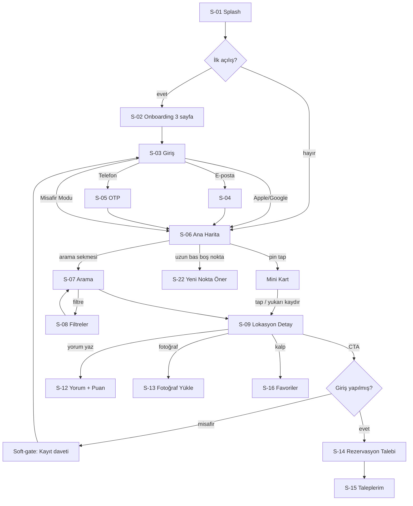

# Dockly — Ekran Tasarımları ve UX Spesifikasyonu (Product Design Spec)

> Bu doküman, Dockly'nin **tüm ekranlarının** ekran-ekran ürün tasarımıdır: amaç, wireframe, butonlar, animasyonlar, sayfa geçişleri, bottom navigation ve arama deneyimi.
> Ekran ID'leri, renk/tipografi token'ları ve enum'lar `00-foundation.md`'den birebir alınmıştır. Kod içermez; geliştirme öncesi tasarım sözleşmesidir.

---

## 1. Tasarım Prensipleri (Apple Seviyesi UX Anayasası)

1. **Harita her şeydir.** Uygulama bir haritanın üzerine kurulmuş hisseder; hiçbir ekran kullanıcıyı haritadan 2 dokunuştan fazla uzaklaştırmaz.
2. **Rezervasyon bir özellik, kimlik değil.** CTA'lar davetkârdır ama uygulama asla "satın al" baskısı kurmaz.
3. **Tek el kuralı.** Tüm birincil aksiyonlar ekranın alt %60'ında (thumb zone) yaşar. Üst bölge yalnızca içerik ve bağlam içindir.
4. **İçerik krom'dan önce.** Bar'lar, buton'lar ve panel'ler glassmorphism ile içeriğin *üzerinde yüzer*; içeriği asla boğmaz.
5. **Hız algısı.** Hiçbir geçiş 400ms'i aşmaz; veri beklerken her zaman skeleton veya önceki içerik gösterilir, asla boş beyaz ekran gösterilmez.
6. **Kesintisiz süreklilik.** Pin → kart → detay geçişi tek bir fiziksel nesnenin büyümesi gibi hisseder (hero/shared-element transition).
7. **Misafir asla duvara çarpmaz.** Misafir kullanıcı her yeri gezebilir; yalnızca *yazma* aksiyonlarında nazik bir kayıt daveti (soft-gate bottom sheet) görür.
8. **Geri alınabilirlik.** Yıkıcı aksiyonlar (tekne silme, talep iptali) onay ister; favori gibi hafif aksiyonlar anında olur + toast ile geri alınabilir.
9. **Işık ve derinlik.** Dark mode birinci sınıf vatandaştır; denizde gece kullanım senaryosu (düşük parlaklık, yüksek kontrast pin'ler) tasarımın parçasıdır.
10. **Yazı tonu:** Kısa, samimi denizci dili. "Rezervasyon Talebi Gönder" — "Hemen satın al" değil. Hata mesajları suçlamaz, yol gösterir.

### Animasyon Token'ları (tüm ekranlarda ortak)
| Token | Değer | Kullanım |
|---|---|---|
| `motion.fast` | 150ms, easeOut | buton press, chip seçimi, ikon durum değişimi |
| `motion.normal` | 250ms, easeInOutCubic | sayfa geçişi, bottom sheet snap, kart genişleme |
| `motion.slow` | 400ms, spring (damping 0.85) | hero transition, harita kamera uçuşu bitişi |
| `motion.map` | 600–900ms, exponential easeOut | harita zoom/fly-to (Mapbox camera) |
| Basılı ölçek | scale 0.97, 150ms | tüm dokunulabilir kartlar |
| Stagger | 40ms/öğe, max 6 öğe | liste ve kart rayı ilk yüklemesi |

---

## 2. Bilgi Mimarisi ve Bottom Navigation

### Bottom Navigation (5 sekme — glass bar)
Bar: 64pt yükseklik + safe area, `bg.glass` (blur 20), üstte 0.5pt hairline. Seçili ikon `brand.primary` dolgulu + etiket; seçili olmayan outline + `text.secondary`. Sekme değişimi: ikon 150ms scale-bounce (0.9→1.0), sayfa **cross-fade 200ms** (yatay slide DEĞİL — sekmeler kardeştir, hiyerarşi yoktur).

| Sekme | İkon | Ekran | Not |
|---|---|---|---|
| **Keşfet** | pusula | S-06 Harita | varsayılan sekme, uygulama buraya açılır |
| **Arama** | büyüteç | S-07 | tam ekran arama deneyimi |
| **Favoriler** | kalp | S-16 | favoriler + kaydedilenler + son görüntülenenler |
| **Taleplerim** | çapa/belge | S-15 | rezervasyon talepleri |
| **Profil** | kişi | S-19 | profil, tekneler, ayarlar |

Kurallar: Sekme state'i korunur (Keşfet'te zoom yaptıysan, geri döndüğünde aynı kameradasın). Aynı sekmeye ikinci dokunuş = köke dön / haritada kullanıcı konumuna dön. Klavye açıkken bar gizlenir (200ms slide-down). Detay sayfaları (S-09 vd.) bottom bar'ın ÜZERİNE push edilir; bar detayda görünmez → haritaya dönünce geri gelir.

### Navigasyon Geçiş Sistemi (sayfa geçişleri)
| Geçiş | Desen | Süre |
|---|---|---|
| Sekme ↔ sekme | cross-fade | 200ms |
| Liste/pin → Detay (S-09) | **hero transition**: kartın görseli detay hero'suna morph olur, kalan içerik alttan fade-slide | 400ms spring |
| Detay → Galeri (S-10) | görsel tam ekrana genişler (interactive: pinch ile de girilir) | 300ms |
| Form ekranları (S-12, S-14, S-18, S-22, S-23) | modal bottom sheet (büyük form: tam ekran modal, aşağı sürükleyerek kapanır) | 250ms |
| Auth (S-03→S-04/S-05) | yatay push (iOS varsayılan), edge-swipe geri | 250ms |
| Soft-gate (misafir daveti) | %45 yükseklik bottom sheet | 250ms |
| Tüm push'larda | iOS edge-swipe back + Android predictive back destekli | — |

---

## 3. Uçtan Uca Kullanıcı Akışı (Ana Harita)



---

## 4. Ekran Ekran Tasarım

> Wireframe gösterimi: `▢` görsel, `●` pin/ikon, `[ ]` buton, `⌕` arama, `♡/♥` favori, `⋯` menü, `≡` liste, `⌂` glass panel. Tüm ölçüler pt.

---

### S-01 · Splash
**Amaç:** Marka anı + oturum/konum ön-yükleme. Maks. 1.5s; işler bitmeden logo animasyonu kesilmez, bitince direkt haritaya akar.

```
┌──────────────────────────┐
│                          │
│                          │
│          ◗ Dockly        │   ← logo: dalga çizgisi çizilir (600ms path draw),
│   "Denizdeki her nokta"  │      sonra 200ms fade-in slogan
│                          │
│                          │
│        (yükleme yok,     │   ← spinner YOK; gecikirse logo altında
│     sessiz ön-yükleme)   │      3 nokta nabız animasyonu (800ms sonra)
└──────────────────────────┘
```
**Geçiş:** Logo, harita yüklenirken ekranın ortasından sol-üst app-bar konumuna küçülerek uçar (400ms spring) → harita altından kart rayı yükselir. Kullanıcı "uygulama açıldı" değil, "harita ortaya çıktı" hisseder.

---

### S-02 · Onboarding (3 sayfa)
**Amaç:** 3 vaatte değeri anlat, izinleri bağlamıyla iste. Atlanabilir.

```
┌──────────────────────────┐
│                 [Atla]   │
│   ▢▢▢▢▢▢▢▢▢▢▢▢▢▢▢▢▢     │  ← tam kanama illüstrasyon/harita videosu
│   ▢   (harita sahnesi) ▢ │     sayfa 1: "Türkiye'nin tüm bağlama
│   ▢▢▢▢▢▢▢▢▢▢▢▢▢▢▢▢▢     │     noktaları tek haritada"
│                          │     sayfa 2: "Denizcilerden gerçek yorumlar"
│   Başlık (Title1)        │     sayfa 3: "Yerini ayırt, telaşsız demirle"
│   Açıklama 2 satır       │
│        ● ○ ○             │  ← page indicator (genişleyen hap animasyonu)
│  [        Devam        ] │  ← primary, 56pt, radius lg
└──────────────────────────┘
```
**Butonlar:** `Devam` (son sayfada `Başlayalım`), `Atla` (text button, sağ üst).
**Animasyon:** Sayfalar arası parallax (illüstrasyon 0.5x hızda kayar); indicator hap genişlemesi 250ms. Konum izni burada İSTENMEZ — ilk kez haritada "Konumum" butonuna basınca bağlamıyla istenir (Apple pattern).

---

### S-03 · Giriş
**Amaç:** Sürtünmesiz giriş; misafir modu eşit saygınlıkta bir seçenek.

```
┌──────────────────────────┐
│        (kapat ✕)         │  ← soft-gate'ten gelindiyse
│      ◗ Dockly            │
│  "Hoş geldin, kaptan."   │
│                          │
│ [  Apple ile devam et  ] │  ← siyah/beyaz (HIG kurallı), 52pt
│ [ Google ile devam et  ] │
│ [ E-posta ile devam et ] │  → S-04 (yatay push)
│ [ Telefon ile devam et ] │  → S-05
│ ──────── veya ────────   │
│    Misafir olarak gez →  │  ← text button, küçümsenmemiş ama ikincil
│                          │
│  KVKK & Koşullar metni   │  ← Micro, link'li
└──────────────────────────┘
```
**Animasyon:** Butonlar 40ms stagger ile alttan fade-slide; basılınca 0.97 scale. Social login sırasında buton içi inline spinner (buton yer değiştirmez).
**Edge:** Giriş hatası → buton altında kırmızı Callout satırı + hafif shake (2×4px, 300ms); asla alert dialog açılmaz.

---

### S-04 · E-posta ile Kayıt/Giriş
**Amaç:** Tek akışta kayıt+giriş (e-posta girilince devamı otomatik ayrışır).

```
┌──────────────────────────┐
│ ←  E-posta ile devam     │
│                          │
│  E-posta                 │
│  [ feridun@ornek.com   ] │  ← DocklyTextField, focus'ta border brand.primary
│  Şifre                   │
│  [ ••••••••        👁 ] │
│                          │
│  Şifremi unuttum →       │
│                          │
│ [       Devam et       ] │  ← klavye üstüne yapışık (sticky), disabled→enabled
└──────────────────────────┘      renk geçişi 150ms
```
**Animasyon:** Alan hatasında alan altında mesaj fade-in + alan 1 kez hafif shake. Başarıda buton check ikonuna morph (150ms) → haritaya geçiş.

---

### S-05 · Telefon Doğrulama (OTP)
**Amaç:** Türkiye'de en yaygın yöntem; 2 adım tek ekranda akar.

```
┌──────────────────────────┐
│ ←  Telefonla devam       │
│  Telefon numarası        │
│  [ +90 | 5__ ___ __ __ ] │  ← otomatik maske
│ [     Kod gönder       ] │
│  — kod gönderilince —    │
│   ▢  ▢  ▢  ▢  ▢  ▢       │  ← 6 haneli OTP kutuları, SMS autofill
│  Tekrar gönder (00:45)   │  ← geri sayım, bitince aktif text button
└──────────────────────────┘
```
**Animasyon:** "Kod gönder" sonrası telefon alanı yukarı kayar, OTP kutuları 40ms stagger ile gelir. Her hane girişinde kutu 150ms scale-pop; hepsi doğruysa kutular yeşile döner → otomatik ilerler (buton beklemez). Hatalı kodda kutular kırmızı + shake + otomatik temizlenir.

---
### S-06 · Ana Sayfa — Harita + Kart Sistemi (uygulamanın kalbi)
**Amaç:** Denizcinin her gün açtığı ekran. Tam ekran premium harita + Apple Maps benzeri alttan kart sistemi. Keşif buradan başlar, her şey buraya döner.

```
┌──────────────────────────┐
│ ⌂[ ⌕ Marina, koy, şehir ]│ ← glass arama hapı (dokununca S-07'ye morph)
│   [Marina][İskele][Yakıt]│ ← yatay filtre chip rayı (glass, kaydırılabilir)
│                          │
│        ●        ●        │
│    ●       ⑤             │ ← pin'ler location_type renkli;
│         ●      ●         │   cluster'lar sayılı yumuşak daire
│              ▲konumum    │
│                    ⌂[◎]  │ ← sağ alt: konumum butonu (glass daire)
│                    ⌂[≡]  │ ← liste görünümü toggle
│╔════════════════════════╗│
│║ ── (tutamaç çizgisi)   ║│ ← BOTTOM SHEET — peek durumu (~140pt)
│║ Yakındaki Marinalar    ║│
│║ ▢▢▢  ▢▢▢  ▢▢▢  →      ║│ ← yatay kart rayı (16:10 görsel kartlar)
│╚════════════════════════╝│
│ [Keşfet][Arama][♡][⚓][👤]│ ← bottom nav (glass)
└──────────────────────────┘
```

**Bottom sheet'in 3 durumu** (snap noktaları, spring 400ms):
1. **Peek (140pt):** Tutamaç + tek kart rayı ("Yakındaki Marinalar"). Harita tam hakim.
2. **Half (%45):** Tüm kart rayları dikey akışta: *Yakındaki · Popüler · En Yüksek Puanlılar · Yeni Eklenenler · Son Görüntülenenler · Favoriler*. Harita üstte nefes almaya devam eder; kamera, sheet'in kapatmadığı alana göre otomatik offset'lenir.
3. **Full (%92):** Liste modu; üstte mini harita şeridi kalır (dokununca peek'e döner).

**Kart rayı davranışı:** Her ray başlığı + "Tümü →". Kartlarda: görsel, tip ikonu + tip etiketi, ad, mesafe (deniz mili), ★puan (rating_count ile), 1 satır amenity ikon dizisi, ♡. Karta dokunma → S-09 hero transition. Kartı yatay kaydırırken haritada karşılık gelen pin hafifçe büyür (bağlam bağı).

**Pin etkileşimi:**
- Pin tap → pin 150ms pop (1.0→1.3) + haritada hafif kamera kayması + alttan **mini kart** çıkar (sheet peek'in yerini alır): görsel şeridi, ad, tip, ★, mesafe, `[Detay]` `[Yol Tarifi]` `♡`.
- Mini karttan yukarı kaydırma veya tap → S-09.
- Cluster tap → kamera o kümeye uçar (motion.map 600ms, exponential easeOut), cluster çözülürken pin'ler 40ms stagger ile *saçılır* (scale 0→1 spring).
- Boş noktaya uzun basma (600ms) → haptic + "Buraya nokta öner" balonu → S-22.

**Harita davranış kuralları:** Pan/zoom sırasında ağ isteği atılmaz; kamera durunca 300ms debounce ile viewport (bbox) sorgusu. Yeni pin'ler fade+scale ile belirir (asla ekran "zıplamaz"). Zoom < 9'da yalnız cluster; zoom ≥ 12'de pin + kısa etiket; zoom ≥ 14'te pin + ad etiketi. Dark mode'da özel gece harita stili (deniz koyu lacivert, pin'ler yüksek kontrast).

**Butonlar:** Arama hapı, filtre chip'leri (aktifken dolgulu + sayaç: "Filtreler ·2"), konumum (◎ — ilk basışta izin bağlamıyla istenir), liste toggle, mini kart CTA'ları.
**Boş/edge durumlar:** Konum izni yok → harita Türkiye geneline açılır, "Yakındaki" rayı yerine "Popüler" öne geçer. Offline → son cache'lenen pin'ler soluk gösterilir + üstte ince "Çevrimdışı" bandı.

---

### S-07 · Arama (Search Deneyimi — deep dive)
**Amaç:** "Aklımdaki yeri 3 saniyede bulayım." Marina, iskele, şehir, ilçe, koy, restoran, yakıt — tek kutudan.

```
┌──────────────────────────┐
│ [⌕ Göcek___________  ✕ ] │ ← otomatik focus + klavye; hap S-06'dan
│                          │   morph olarak gelir (400ms hero)
│  SONUÇLAR                │
│  ● Göcek (Bölge)       → │ ← bölge sonucu: haritayı oraya uçurur
│  ● D-Marin Göcek       → │   tip ikonu + ad + şehir + ★4.8
│  ● Göcek Belediye İsk. → │
│  ● Skopea Marina       → │
│ ─────────────────────    │
│  — boşken —              │
│  SON ARAMALAR   Temizle  │
│  ⌕ Fethiye   ⌕ yakıt     │
│  KEŞFET                  │
│  (Koylar)(Yakıt)(Restoran│ ← öneri chip'leri: kategori kısayolları
│  (Belediye İskeleleri)   │
└──────────────────────────┘
```

**Arama kuralları:**
- **Anında arama:** 2+ karakter, 250ms debounce, önceki istek iptal edilir. Sonuçlar geldikçe liste diff-animate olur (fade, zıplama yok).
- **Sonuç sıralaması:** tam ad eşleşmesi > başlangıç eşleşmesi > pg_trgm bulanık eşleşme; eşitlikte kullanıcıya yakınlık. Yazım hatası toleransı ("gocek" → Göcek).
- **Sonuç tipleri karışık listede:** lokasyonlar (tip ikonlu) + bölgeler (şehir/ilçe/koy — "Bölge" rozetli). Bölge seçilirse arama kapanır, harita oraya uçar ve o bölgenin pin'leri vurgulanır.
- **Kategori araması:** "yakıt" yazınca hem adında yakıt geçenler hem `fuel_pier` tipi önerilir ("Yakıt İskeleleri — kategori" satırı en üstte).
- **Boş sonuç:** "Burayı biz de bilmiyoruz 🙂 Yeni nokta önermek ister misin?" + `[Nokta Öner]` (S-22'ye köprü — arama, veri büyütme motorudur).
- **Boş durum (hiç yazılmamış):** Son aramalar (maks 8) + keşfet chip'leri + "Yakınında: ..." 3 hızlı öneri.
- Her sonucun sağında kalp değil `→` var; favorilik detayda yapılır (liste sade kalır).

**Animasyon:** S-06'daki arama hapı, S-07'nin arama çubuğuna **morph** olur (shared element, 400ms); arka plan harita blur'lanarak koyulaşır. Kapatma (✕ veya aşağı çekme) aynı morph'un tersi. Sonuç satırına dokunuş → satır kısa flash + S-09'a push (bölge ise haritaya dönüş uçuşu).

---

### S-08 · Filtreler (Bottom Sheet)
**Amaç:** Tekneme uygun yer bul. Filtre bir form değil, oyuncak gibi hissetmeli.

```
┌──────────────────────────┐
│ ══ Filtreler      Sıfırla│ ← %85 bottom sheet, glass zemin
│                          │
│ TEKNEM                   │
│ [⛵ Poyraz (12.4m) ▾] ⓘ  │ ← tekne seçici: seçilince boy+draft
│ ☑ Tekneme uygun yerler   │   filtreleri otomatik dolar
│                          │
│ BOYUTLAR                 │
│ Maks. tekne boyu  ──●── 15m
│ Draft             ──●── 2.5m
│                          │
│ TİP                      │
│ (Özel Marina)(Bel. Marina│ ← 9 location_type chip'i, çoklu seçim
│ (İskele)(Şamandıra)...   │
│                          │
│ HİZMETLER                │
│ (⚡Elektrik)(💧Su)(⛽Yakıt│ ← amenity chip'leri: electricity, water,
│ (🍽Restoran)(🚿Duş)(🛒Mkt│   fuel, restaurant, shower, market,
│ (🧺Çamaşır)(📶WiFi)      │   laundry, wifi, security, open_24h
│ (🕐24 Saat)(🛡Güvenlik)  │
│ ÜCRET                    │
│ (Ücretsiz)(Ücretli)(Hepsi│ ← segmented control (price_tier)
│                          │
│ [  47 sonucu göster    ] │ ← canlı sayaç — her değişimde günceller
└──────────────────────────┘
```

**Davranış:**
- **Canlı sonuç sayacı:** her filtre değişiminde buton metni animasyonlu sayar ("47 → 12 sonucu göster", 250ms count animasyonu). Kullanıcı asla "0 sonuç" sürprizi yaşamaz; 0 olursa buton "Sonuç yok — Draft'ı gevşet" önerisine dönüşür.
- **"Tekneme uygun" akıllı anahtarı:** kullanıcının birincil teknesinin boy+draft'ını `max_boat_length_m` / `max_draft_m` alanlarıyla karşılaştırır; açıkken slider'lar kilitli-önerili durumda gösterilir.
- Chip seçimi: 150ms dolgu animasyonu + hafif haptic. Slider: değer balonu parmakla birlikte hareket eder.
- Uygulanan filtreler S-06'da chip rayında görünür ("Filtreler ·3" + tek tek kaldırılabilir mini chip'ler).
- Sıfırla → tüm chip'ler 40ms stagger ile boşalır (tatmin edici "temizleme" hissi).
- Misafir de filtre kullanabilir (tekne seçici yerine manuel boy/draft girişi gösterilir).

---
### S-09 · Lokasyon Detay
**Amaç:** Bir bağlama noktası hakkında karar vermek için gereken her şey — tek scroll'da. Booking.com bilgi derinliği, Apple sadeliği.

```
┌──────────────────────────┐
│ ▢▢▢▢▢▢▢▢▢▢▢▢▢▢▢▢▢▢▢     │ ← HERO görsel (kartın görselinden morph),
│ ▢  ‹    1/12   ♡  ⤴  ▢  │   parallax 0.4x; üstte glass geri/favori/paylaş
│ ▢▢▢▢▢▢▢▢▢▢▢▢▢▢▢▢▢▢▢     │   yatay kaydırma = galeri önizleme
│ ⌂──────────────────────  │ ← içerik kartı hero'nun üstüne radius lg ile biner
│  ÖZEL MARİNA             │ ← tip rozeti (tip rengiyle)
│  D-Marin Göcek           │ ← Title1
│  ★ 4.8 (214) · Göcek     │ ← puana dokun → S-11
│  [🧭 Yol Tarifi][📞 Ara] │ ← hızlı aksiyon hapları (glass)
│  [🌐 Web]   [⤴ Paylaş]   │
│ ─ TEKNENE UYGUNLUK ─     │
│  ⛵ Poyraz (12.4m/1.9m)  │ ← kullanıcının teknesiyle canlı kıyas:
│  ✓ Boy uygun (maks 40m)  │   yeşil ✓ / kırmızı ✕ satırları
│  ✓ Draft uygun (5m)      │
│ ─ HİZMETLER ─            │
│  ⚡ 💧 ⛽ 🍽 🚿 📶 🕐 🛡  │ ← amenity ızgarası (etiketli), fazlası
│         Tümü (14) →      │   expand ile açılır
│ ─ FOTOĞRAFLAR ─          │
│  ▢▢ ▢▢ ▢▢ ▢▢  Tümü →     │ → S-10
│ ─ YORUMLAR (214) ─       │
│  ▢ "Rüzgârda bile..."    │ ← 2 öne çıkan yorum kartı → S-11
│  [ Yorum yaz ]           │
│ ─ KONUM ─                │
│  ▢▢ mini harita ▢▢       │ ← statik snapshot; dokununca S-06'ya döner
│  Göcek, Fethiye/Muğla    │
│  ⚠ Hata bildir           │ → S-23
│╔════════════════════════╗│
│║[Rezervasyon Talebi Gönder]│ ← STICKY CTA (glass bar, 56pt) — scroll
│╚════════════════════════╝│   boyunca hep görünür
└──────────────────────────┘
```

**Scroll koreografisi:** Hero parallax; içerik kartı hero'nun üzerine binerek yükselir. %30 scroll sonrası üstte glass mini başlık çubuğu belirir (ad + ★, fade-in 200ms). Sticky CTA ilk 400ms'de alttan yaylanarak girer; scroll aşağı hızlıysa incelir (48pt), durunca geri kalınlaşır — içeriğe saygı, ama hep erişilebilir.
**Butonlar:** Yol Tarifi (Apple/Google Maps seçim sheet'i), Ara (tel:), Web, Paylaş (OS share sheet + derin bağlantı `dockly.app/l/{slug}`), ♡ (anında dolar + minik konfeti-nabız 300ms; misafirse soft-gate), Yorum yaz → S-12, Tümü → S-10/S-11, Hata bildir → S-23, **Rezervasyon Talebi Gönder** → S-14 (misafirse soft-gate).
**Edge:** Fotoğrafsız lokasyon → tip rengine boyanmış degrade hero + büyük tip ikonu (asla kırık görsel yok). `municipal_pier` gibi telefonu olmayan yerlerde Ara hapı görünmez (boş yer bırakılmaz, haplar akar). Kapanmış/arşivlenmiş yer → üstte amber bilgi bandı.

---

### S-10 · Fotoğraf Galerisi (tam ekran)
**Amaç:** Denizciler yeri fotoğraftan tanır; galeri hızlı, dokunsal, kayıpsız.

```
┌──────────────────────────┐
│  ✕            3 / 24     │
│                          │
│   ▢▢▢▢▢▢▢▢▢▢▢▢▢▢▢       │ ← tam ekran görsel; pinch-zoom,
│   ▢▢▢▢▢▢▢▢▢▢▢▢▢▢▢       │   çift-tap 2x zoom, yatay swipe
│                          │
│  📷 Ahmet K. · Eyl 2026  │ ← katkı sahibi (topluluk fotoğrafı ise)
│  ▫▫▪▫▫▫▫▫▫▫              │ ← küçük thumb şeridi (alt)
└──────────────────────────┘
```
**Animasyon:** Detaydaki karodan tam ekrana genişleme (300ms); **aşağı sürükle-kapat**: görsel parmakla küçülür, arka plan şeffaflaşır, bırakınca geldiği karoya geri yaylanır (interactive dismissal — iOS Photos hissi). Swipe'ta komşu görseller önceden yüklenir.

---

### S-11 · Yorumlar
**Amaç:** Güven inşası. Gerçek denizci deneyimi, filtrelenebilir.

```
┌──────────────────────────┐
│ ‹  Yorumlar (214)        │
│  ★ 4.8   ▂▃▅▇█           │ ← özet: ortalama + 5→1 yıldız dağılım
│  (En yeni ▾)(★5)(★1)(📷) │   çubukları (dolum animasyonlu 400ms)
│ ─────────────────────    │
│  ⌂ Ahmet K.  ★★★★★  Eyl  │
│  "Rüzgârda bile sakin,   │
│   personel yardımcı..."  │
│   ▢ ▢ (yorum fotoları)   │ ← dokununca S-10
│   👍 Faydalı (12)  ⋯     │ ← ⋯: bildir/paylaş
│ ─────────────────────    │
│ [       Yorum yaz      ] │ ← sticky alt buton
└──────────────────────────┘
```
**Davranış:** Sonsuz scroll (cursor); satırlar 40ms stagger fade. Filtre chip'leri anında uygular. Kendi yorumun en üstte "Senin yorumun" rozetiyle + Düzenle/Sil.

---

### S-12 · Yorum Yaz + Puan Ver (modal)
**Amaç:** 30 saniyede dürüst yorum. Zorunlu alan minimumu: sadece puan.

```
┌──────────────────────────┐
│ ✕  D-Marin Göcek         │
│                          │
│      ☆ ☆ ☆ ☆ ☆           │ ← büyük yıldızlar; dokun/kaydır ile seç,
│    "Nasıldı, kaptan?"    │   her yıldız 150ms pop + haptic tick
│                          │
│  [ Deneyimini yaz...   ] │ ← çok satırlı, placeholder soruları
│  [ + 📷 Fotoğraf ekle  ] │   dönüşümlü ("Bağlama kolay mıydı?")
│   ▢ ▢ ▢                  │ ← seçilen fotolar, ✕ ile çıkarılır
│                          │
│ [       Gönder         ] │ ← puan seçilince aktifleşir
└──────────────────────────┘
```
**Gönderim:** Buton → inline spinner → check morph → sheet kapanır → detayda "Yorumun moderasyonda ✓" toast (moderation_status=pending şeffaflığı). Taslak otomatik saklanır (yanlışlıkla kapatma affedilir: "Taslağı sakla / Sil").

---

### S-13 · Fotoğraf Yükle
**Amaç:** Topluluğun içerik motoru; sürtünme sıfıra yakın.
Akış: Kaynak seçimi (kamera/galeri, OS picker) → çoklu seçim (maks 10) → önizleme ızgarası → `[Yükle]`. Her karo üzerinde dairesel upload progress'i; arka planda sürer (kullanıcı ekrandan çıkabilir), bitince bildirim. Hata alan karo "tekrar dene" ikonuyla işaretlenir. Yüklenen fotoğraf pending rozetiyle kullanıcıya hemen görünür, onaylanınca herkese açılır.

---

### S-14 · Rezervasyon Talebi Formu
**Amaç:** v1'in tek "işlem" ekranı. Bir rezervasyon değil, **kibar bir talep**: beklenti baştan doğru kurulur.

```
┌──────────────────────────┐
│ ✕  Rezervasyon Talebi    │
│  D-Marin Göcek           │ ← bağlam kartı (görsel + ad + ★)
│  ⓘ Bu bir talep — marina │ ← ince bilgi bandı: dürüst beklenti
│    onayı sonradan gelir  │
│                          │
│  TEKNE                   │
│  [⛵ Poyraz ▾]           │ ← tekne seçici; boy/draft OTOMATİK dolar
│  Boy [12.4m] Draft [1.9m]│ ← düzenlenebilir (charter senaryosu)
│  ✓ Bu marinaya uygun     │ ← canlı uygunluk kontrolü
│                          │
│  TARİHLER                │
│  [Giriş 12 Eyl][Çıkış 14]│ ← takvim sheet; çıkış<giriş engellenir,
│  2 gece                  │   gece sayısı canlı yazılır
│  İLETİŞİM                │
│  [ +90 5__ ]  (kayıtlıdan│
│  [ Not (ör. elektrik    ]│   önceden dolu)
│  [  ihtiyacı, geliş saati]│
│                          │
│ [    Talebi Gönder     ] │
└──────────────────────────┘
```
**Gönderim sonrası:** Tam ekran başarı anı — çapa ikonu çizilir (path draw 600ms) + "Talebin iletildi, kaptan!" + durum adımları (Gönderildi ✓ → İletişime geçilecek → Sonuç) → `[Taleplerimi Gör]` → S-15. Bu an uygulamanın en "ödüllendirici" mikroanıdır.
**Edge:** Tekne yoksa inline "önce teknemi ekle" kartı (S-18'e modal, dönüşte form korunur). Boy uygunsuzsa gönderim engellenmez, amber uyarı: "Teknen belirtilen maksimuma yakın/üzerinde — nota yaz." Misafir → soft-gate.

---

### S-15 · Taleplerim
**Amaç:** Taleplerin tek bakışta durumu; belirsizlik kaygısını yönetir.

```
┌──────────────────────────┐
│  Taleplerim              │
│  (Aktif)(Geçmiş)         │ ← segmented control
│ ─────────────────────    │
│ ⌂ ▢ D-Marin Göcek        │
│    12–14 Eyl · Poyraz    │
│    ●● Beklemede          │ ← durum hapı: pending amber /
│ ⌂ ▢ Yalıkavak Marina     │   contacted mavi / confirmed yeşil /
│    3–5 Ağu · Poyraz      │   cancelled gri / expired soluk
│    ●● Onaylandı ✓        │
└──────────────────────────┘
```
**Detay (push):** durum zaman çizelgesi (dikey adımlar, aktif adım nabız animasyonlu), talep özeti, marina kartı, `[Talebi İptal Et]` (onay sheet'li), `[Marinayı Ara]`. Durum değişimi push notification → buradan derin bağlantıyla açılır; değişen satır 600ms yumuşak highlight ile parlar.
**Boş durum:** çapa illüstrasyonu + "Henüz talebin yok. Haritada keşfe çık →" `[Keşfet]`.

---
### S-16 · Favoriler
**Amaç:** Denizcinin kişisel atlası: favoriler, kaydedilenler, son bakılanlar.

```
┌──────────────────────────┐
│  Favoriler               │
│  (Favoriler)(Son Görünt.)│ ← segmented control
│  [Harita ⌖]              │ ← favorileri haritada gör (S-06'ya
│ ─────────────────────    │   filtreli dönüş: sadece favoriler)
│ ⌂ ▢ D-Marin Göcek   ♥    │
│    Özel Marina · ★4.8    │
│ ⌂ ▢ Kaş Setur       ♥    │
│    Özel Marina · ★4.7    │
└──────────────────────────┘
```
**Davranış:** ♥'e dokun → satır 250ms'de sola kayarak silinir + "Favorilerden çıkarıldı — Geri Al" toast (5sn). Satır swipe: sola = kaldır, sağa = yol tarifi. "Son Görüntülenenler" otomatik, maks 50, silinebilir. Boş durum: kalp illüstrasyonu + "Beğendiğin koyları kalple işaretle" `[Keşfete başla]`. Misafirde favoriler cihazda tutulur; kayıt olursa hesaba taşınır ("Favorilerin hesabına aktarıldı ✓").

---

### S-17 · Tekne Listem & S-18 · Tekne Ekle/Düzenle
**S-17 Amaç:** Teknelerim; birincil tekne filtre ve talep formlarını besler.

```
┌──────────────────────────┐
│ ‹  Teknelerim        [+] │
│ ⌂ ▢ ⛵ Poyraz  (Birincil)│ ← kart: foto, ad, marka/model,
│    Beneteau 40 · 12.4m   │   boy · uzun bas = sırala
│ ⌂ ▢ 🚤 Martı             │   swipe sola = sil (onaylı)
│    Sea Ray · 8.2m        │   tap = S-18 düzenle
└──────────────────────────┘
```

**S-18 Amaç:** Tekne formu — teknik ama sıcak. Tek sayfa, mantıksal gruplar:
`[📷 Fotoğraf ekle]` (büyük dairesel alan, dokununca picker) → Ad → Tekne Tipi (9 tip görsel ızgara: ikon+etiket, seçim 150ms pop) → Marka/Model/Yıl → Boyutlar (Uzunluk/Genişlik/Draft — m, ondalık klavye, aralık validasyonu) → Motor Tipi (chip'ler). `[Kaydet]` sticky. İlk tekne kaydında mini kutlama ("Poyraz filona katıldı ⛵") + otomatik birincil işaretlenir. Boş liste durumu (S-17): "Teknen daha güzel gösterir seni" + `[İlk teknemi ekle]`.

---

### S-19 · Profil & S-20 · Ayarlar
**S-19 Amaç:** Kimlik + katkı geçmişi + kısayollar.

```
┌──────────────────────────┐
│      ⌂ (avatar)          │
│      Feridun K.          │
│  12 yorum · 34 foto ·    │ ← katkı sayaçları (topluluk kimliği)
│      3 öneri             │
│ ─────────────────────    │
│  ⛵ Teknelerim         → │
│  ♡ Favorilerim         → │
│  ⚓ Taleplerim          → │
│  🔔 Bildirimler        → │
│  ⚙ Ayarlar             → │
│  📍 Önerdiğim Noktalar  → │
└──────────────────────────┘
```
**Misafir hali:** avatar yerine "Merhaba, misafir kaptan" + değer önerili `[Hesap oluştur]` kartı (favorilerin/taleplerin cihazda kalacağı dürüstçe söylenir).

**S-20 Ayarlar:** Görünüm (Sistem/Açık/Koyu — seçim anında tüm uygulama 250ms cross-fade ile tema değiştirir; "denemesi keyifli" ayar), Dil (TR/EN), Bildirim tercihleri (notification_type başına anahtar: talep durumu / yeni fotoğraf / yeni yorum / favori güncellemesi), Birimler (metre/feet), Hesap (e-posta/telefon, şifre, çıkış), Yasal (KVKK, koşullar), Hesabı sil (iki adımlı onay, kırmızı, en altta).

---

### S-21 · Bildirimler
**Amaç:** Uygulama içi bildirim merkezi; push'ların kalıcı kopyası.

```
┌──────────────────────────┐
│ ‹  Bildirimler  Tümü ✓   │
│  BUGÜN                   │
│  ⌂ ⚓ Talebin güncellendi │ ← tip ikonu + başlık + zaman;
│    D-Marin: İletişime    │   okunmamışta sol kenarda brand nokta
│    geçildi · 2s önce     │   tap → ilgili ekrana derin bağlantı
│  DÜN                     │
│  ⌂ 📷 Kaş Setur'a 3 yeni │
│    fotoğraf eklendi      │
└──────────────────────────┘
```
Okunmamışlar hafif ton farkıyla; görünür olunca 600ms'de sessizce "okundu"ya yumuşar. Boş durum: martı illüstrasyonu + "Şimdilik sakin sular".

---

### S-22 · Yeni Nokta Öner & S-23 · Hatalı Bilgi Bildir
**S-22 Amaç:** Topluluğun harita büyütme motoru. Giriş: haritada uzun basma (koordinat hazır gelir) veya arama boş sonucu veya profil.
Akış (3 adım, üstte ilerleme noktaları): ① Konum — tam ekran haritada sürüklenebilir pin ("Pin'i iskelenin üstüne bırak") ② Bilgi — ad + tip (9 location_type ızgarası) + opsiyonel amenity'ler ③ Fotoğraf (ops.) + gönder. Başarı: "Teşekkürler kaptan! Ekibimiz doğrulayınca haritada." + katkı sayacı +1 animasyonu. (suggestion_type=new_location, moderasyona düşer.)

**S-23 Amaç:** Veri güveni. Detaydan girilir; tek ekran: neden chip'leri (`Bilgi yanlış · Kalıcı kapalı · Fotoğraf hatalı · Konum hatalı · Diğer` = report_reason) + opsiyonel açıklama + `[Gönder]`. Gönderim 1 dokunuş + onay toast'ı — şikâyet etmek zahmetsiz olmalı.

---

## 5. Kesişen (Cross-cutting) UX Desenleri

### Soft-Gate (Misafir → Kayıt daveti)
Yazma aksiyonlarında (♡, yorum, talep, öneri) %45 bottom sheet: aksiyona özel başlık ("Favorilerini kaydetmek için hesap gerekli"), Apple/Google hızlı giriş + "E-posta/Telefon" + "Şimdi değil". Kapatılınca kullanıcı kaldığı yerde kalır; giriş yaparsa **niyet hatırlanır** (girişten sonra o favori otomatik eklenir / talep formu geri açılır). Asla tam ekran zorlama, asla tekrar tekrar sorma (oturum başına 1 hatırlatma).

### Boş Durumlar & Skeleton
Her liste ekranının özel illüstrasyonlu boş durumu + tek CTA'sı vardır (yukarıda ekran ekran verildi). Yüklemede içerik iskeleti (shimmer 1.2s döngü) gerçek yerleşimin aynısıdır — içerik gelince zıplama olmaz. Görseller blur-hash placeholder'dan netleşir (200ms).

### Haptic Haritası
| An | Haptic |
|---|---|
| Pin/cluster tap, chip seçimi | selection (hafif tick) |
| Bottom sheet snap | light impact |
| Favori ekleme, yıldız seçimi | medium impact |
| Talep gönderildi, tekne eklendi | success notification |
| Hata (form, OTP) | error notification |
| Haritada uzun basma (nokta öner) | heavy impact |

### Dark Mode Davranışı
Tema anahtarı sistemi izler (S-20'den kilitlenebilir). Harita stili temayla birlikte değişir (gece stili). Glass panel'ler dark'ta `rgba(20,28,43,0.72)`; pin kontrastı gece stili üzerinde test edilmiş ayrı palet varyantı kullanır. Görsellerin üstündeki metinler her iki temada da degrade scrim ile korunur.

### Erişilebilirlik
Dynamic Type ×1.4'e kadar kırılmadan; tüm dokunma hedefleri ≥ 44pt; kontrast AA; VoiceOver/TalkBack için pin'ler "D-Marin Göcek, özel marina, 4.8 yıldız, 2 deniz mili" gibi anlamlı etiketler; "hareketi azalt" açıkken hero/parallax yerine cross-fade.

---

## 6. Ekran → Doküman İzlenebilirliği

| İhtiyaç | Doküman |
|---|---|
| Ekran envanteri + analytics event'leri | `07-ekran-listesi.md` |
| Akış diyagramlarının tamamı | `06-kullanici-akislari.md` |
| Token'lar (renk/tip/motion) | `09-design-system.md` |
| Component API'leri | `10-component-library.md` |
| Bu doküman | etkileşim + wireframe sözleşmesi |

*Doküman sonu — 21-ekran-tasarimlari.md*
