# Dockly — Veritabanı Mimarisi v2 (Lead Database Architect Edition)

> 🧊 **STATUS: FROZEN — v2.0 · 6 Temmuz 2026**
> Bu veri modeli donduruldu. §9'daki 10 geliştirmenin tamamı modele işlenmiştir (aşağıdaki değişiklik kaydına bakınız). Bundan sonraki her değişiklik yalnızca ADR (Architecture Decision Record) + PR onayı ile yapılır. API mimarisi (`23-api-mimarisi.md`) bu donmuş modelin üzerine tasarlanır; **SQL migration / DDL üretimi API mimarisi onaylanana kadar başlamaz.**
>
> **v2.0 değişiklik kaydı (PRD iyileştirmeleri → model):** ① `locations.depth_min_m/depth_max_m` ② `geo.water_bodies` + `locations.water_body_id` ③ `catalog.opening_seasons` ④ `rating_dimensions` + `community.review_ratings` ⑤ `booking.reservation_request_events` ⑥ `anchorage_details.protection_n/s/e/w + holding_type` ⑦ `amenities` / `services` ayrı sözlükler ⑧ `reservation_requests.boat_name/boat_length_m/boat_draft_m` snapshot ⑨ misafir→kayıtlı birleşme kuralı (`users.firebase_uid` sabit, §5.1) ⑩ VHF dahil tüm kanallar `location_contacts`'ta.

> **Kapsam:** Bu doküman `04-veritabani-tasarimi.md`'nin (MVP şeması) üzerine kurulan, 5–10 yıllık büyümeyi ve uluslararası genişlemeyi hedefleyen **kanonik veri mimarisidir**. Çelişki durumunda bu doküman geçerlidir; `00-foundation.md` §5'e "v2 şeması için bkz. 22" notu düşülmüştür.
> **İlke:** MVP için değil, milyonlarca kullanıcı ve yüz binlerce lokasyon için tasarla — ama v1'de yalnızca ihtiyaç duyulan tabloları *oluştur*. Genişleme, mevcut tabloları değiştirmeden yeni tablo/şema ekleyerek yapılır.

---

## 1. Mimari Kararlar ve Gerekçeleri

### 1.1 Platform
**PostgreSQL 15+ / PostGIS 3.4+ (Supabase üzerinde).**
Gerekçe: coğrafi sorgular (bbox, yarıçap, ileride poligon/rota) birinci sınıf ihtiyaç → PostGIS endüstri standardı. JSONB, partitioning, tsvector/pg_trgm, RLS ve mantıksal replikasyon; 1M+ kullanıcıya kadar dikey+read-replica ile, sonrasında bölgesel cluster'larla ölçeklenir.

### 1.2 Kimlik: UUID v7
Tüm PK'ler `UUID`, üretim **UUIDv7** (zaman sıralı).
Gerekçe: (a) çoklu bölge/çoklu yazar geleceğinde çakışmasız kimlik, (b) istemci tarafında offline kayıt üretimi, (c) URL'lerde tahmin edilemezlik. **v4 değil v7**: rastgele UUID'ler B-tree index'lerde yazma amplifikasyonu yaratır; v7 zaman sıralı olduğu için index locality korunur (milyonlarca satırda fark kritiktir). İstisna: `audit_logs` ve ileride event tabloları `BIGINT GENERATED ALWAYS AS IDENTITY` (append-only, yüksek hacim, sıralı tarama).

### 1.3 Supertype/Subtype: Tek `locations` tablosu + detay tabloları
Talep edilen "Marinas, Municipality Marinas, Municipality Piers, Restaurant Docks, Fuel Docks, Mooring Areas, Anchorages" için **ayrı tablolar AÇILMAZ**. Hepsi tek `locations` süper-tipinde yaşar; tip `location_types` lookup'ına FK'dir; tipe özgü alanlar **class-table-inheritance** deseniyle 1:1 detay tablolarına konur (`marina_details`, `fuel_dock_details`, `restaurant_dock_details`, `anchorage_details`).
Gerekçe: Haritanın tek sorgusu "viewport'taki TÜM noktalar"dır — 9 tabloya UNION atan bir model hem yavaş hem bakımı imkânsızdır. Ortak davranış (foto, yorum, favori, talep) süper-tipe FK ile bir kez modellenir; 10. tip (ör. "kuru marina") eklemek = lookup'a 1 satır + gerekirse 1 detay tablosu, **sıfır migration mevcut tablolarda**.

### 1.4 Enum vs Lookup Politikası
| Tür | Mekanizma | Neden |
|---|---|---|
| **İş akışı durumları** (`moderation_status`, `reservation_request_status`, `location_status`, `report_status`) | PostgreSQL `ENUM` | Kod ile sıkı bağlı, nadiren değişir, state machine'dir; DB seviyesinde geçersiz durum imkânsız olmalı |
| **İş sözlükleri** (`location_types`, `boat_types`, `engine_types`, `amenities`, `services`, `rating_dimensions`, `roles`, `currencies`, `contact_types`*) | **Lookup tablosu** | Büyür, çevrilir (i18n), admin panelden yönetilir, ikon/renk/sıra gibi meta taşır. Enum'da yeni değer = migration; lookup'ta = INSERT |

\* `contact_type` sınırlı ve koda bağlı olduğundan enum'da tutulur (bkz. §5.7). Foundation'daki `boat_type`, `engine_type`, `location_type` enum'ları bu dokümanla **lookup tablosuna terfi etmiştir** (v1 migration'ında böyle doğar).

### 1.5 Soft Delete + Audit
- İçerik ve işlem tablolarında `deleted_at TIMESTAMPTZ NULL` (+ `deleted_by`). Aktif satır sorguları partial index ile (`WHERE deleted_at IS NULL`) tam hızda kalır.
- Köprü/log tabloları hard delete veya append-only (favori geri eklenebilir; log asla silinmez).
- KVKK "silme hakkı": kullanıcı silindiğinde `users` soft-delete + PII kolonları anonimleştirilir (`email → NULL`, `full_name → 'Silinmiş Kullanıcı'`); içerik (yorum/fotoğraf) anonim sahiple yaşamaya devam eder — topluluk değeri korunur, kişisel veri gider.
- `audit_logs` tüm yazma işlemlerinin kim/ne/önce/sonra kaydını tutar (bkz. §5.10), aylık RANGE partition.

### 1.6 Çoklu Dil (i18n) Stratejisi
`name_tr`, `name_en` gibi kolonlar **yasaktır** (dil eklemek = migration → ölçeklenmez).
Desen: çevrilebilir her varlık için `<entity>_i18n (entity_id, locale, alan...)`, PK `(entity_id, locale)`.
- Ana tablodaki `name/description` **kaynak dil** (v1'de TR) değeridir → JOIN'siz hızlı okuma; istemci locale'i için i18n tablosuna LEFT JOIN + fallback.
- v1'de oluşturulanlar: `location_i18n`, `location_type_i18n`, `amenity_i18n`, `service_i18n`, `boat_type_i18n`, `rating_dimension_i18n`. `locale` formatı BCP-47 (`tr`, `en`, `de`, `el`, `hr`).

### 1.7 Coğrafya: Hiyerarşik `admin_areas` (Cities/Districts/Regions cevabı)
Ayrı `regions`, `cities`, `districts` tabloları yerine **tek öz-referanslı hiyerarşi**: `countries` → `admin_areas (level: region | province | district)`.
Gerekçe: Türkiye (bölge→il→ilçe) ile Yunanistan/Hırvatistan'ın farklı idari yapıları aynı şemaya oturur; yeni ülke = seed verisi, migration değil. Denizciler idari sınır değil **koy** ile düşünür → ayrıca `water_bodies` (koy/körfez/boğaz) varlığı (PRD'de eksikti, bkz. §9).

### 1.8 Para ve Ölçü Standartları
- Para asla FLOAT değil: `NUMERIC(12,2) <alan>_amount` + `char(3) <alan>_currency_code FK → currencies`. `currencies` lookup'ı v1'de kurulur (TRY/EUR/USD seed) — ödeme modülü geldiğinde şema hazır.
- Ölçüler metrik + birim son ekiyle: `length_m NUMERIC(5,2)`, `capacity_tons`. İmperial dönüşüm sunum katmanının işidir (DB tek gerçek tutar).

### 1.9 Şema (namespace) Organizasyonu — Modülerlik
Tek veritabanı, mantıksal PostgreSQL şemaları:
| Şema | İçerik | v1 |
|---|---|---|
| `identity` | users, user_profiles, user_settings, roles, user_devices | ✅ |
| `geo` | countries, admin_areas, water_bodies | ✅ |
| `catalog` | locations + detay/lookup/i18n/contact/hours | ✅ |
| `community` | reviews, media, favorites, suggestions, reports, contributions, moderation | ✅ |
| `booking` | reservation_requests (+ ileride reservations, availability) | ✅ |
| `messaging` | notifications, preferences | ✅ |
| `ops` | audit_logs, app_settings, moderation_tasks | ✅ |
| `billing` | payments, subscriptions, invoices | 🔮 v2+ |
| `intel` | ai_recommendations, analytics agregaları | 🔮 v3+ |
| `nav` | routes, weather_cache, ais | 🔮 v3+ |

Gerekçe: modül sınırları DB'de görünür olur; yetkilendirme (GRANT) şema bazında yönetilir; gelecek modüller mevcut şemalara dokunmadan eklenir. (Supabase/PostgREST'te `public` yerine şema expose ayarı yapılır; sadeleşme gerekirse v1'de fiziksel tek şema + isim önekleriyle başlanabilir — mantıksal model değişmez.)

### 1.10 İsimlendirme Standartları
Tablolar çoğul `snake_case` (`reservation_requests`); kolonlar tekil; PK her zaman `id`; FK `<varlık>_id` (rol farklıysa `handled_by_user_id`); boolean `is_/has_`; zaman `_at`; tarih `_on`; sayaç cache `_count`; i18n tabloları `_i18n`; köprü tabloları alfabetik iki isim (`location_amenities`); index `ix_<tablo>_<kolonlar>`, unique `ux_`, FK constraint `fk_`, check `ck_`.

---

## 2. ER Diagram (Ana Varlıklar)

```mermaid
erDiagram
    users ||--|| user_profiles : "1:1"
    users ||--|| user_settings : "1:1"
    users ||--o{ user_devices : has
    roles ||--o{ users : grants
    users ||--o{ boats : owns
    boat_types ||--o{ boats : classifies
    engine_types ||--o{ boats : powers

    countries ||--o{ admin_areas : contains
    admin_areas ||--o{ admin_areas : "parent"
    countries ||--o{ locations : hosts
    admin_areas ||--o{ locations : locates
    water_bodies ||--o{ locations : "koy/körfez"

    location_types ||--o{ locations : classifies
    locations ||--o| marina_details : "1:0..1"
    locations ||--o| fuel_dock_details : "1:0..1"
    locations ||--o| restaurant_dock_details : "1:0..1"
    locations ||--o| anchorage_details : "1:0..1"
    locations ||--o{ location_i18n : translates
    locations ||--o{ location_contacts : reaches
    locations ||--o{ operating_hours : opens
    locations ||--o{ opening_seasons : "sezon"
    amenities ||--o{ location_amenities : ""
    locations ||--o{ location_amenities : offers
    services ||--o{ location_services : ""
    locations ||--o{ location_services : provides

    media ||--o{ location_media : ""
    locations ||--o{ location_media : gallery
    media ||--o{ review_media : ""
    media ||--o{ boat_media : ""
    users ||--o{ media : uploads

    users ||--o{ reviews : writes
    locations ||--o{ reviews : receives
    reviews ||--o{ review_ratings : "boyutlu puan"
    rating_dimensions ||--o{ review_ratings : ""
    reviews ||--o{ review_reactions : "faydalı"
    users ||--o{ favorites : saves
    locations ||--o{ favorites : ""
    users ||--o{ recently_viewed : views

    users ||--o{ reservation_requests : submits
    locations ||--o{ reservation_requests : "talep alır"
    boats ||--o{ reservation_requests : "tekneyle"
    reservation_requests ||--o{ reservation_request_events : history

    users ||--o{ suggested_locations : proposes
    users ||--o{ location_reports : flags
    locations ||--o{ location_reports : ""
    users ||--o{ contribution_events : earns
    moderation_tasks }o--|| users : "assigned/decided"

    users ||--o{ notifications : receives
    users ||--o{ notification_preferences : tunes
    users ||--o{ audit_logs : acts
    currencies ||--o{ countries : "varsayılan"
```

*(Okunabilirlik için i18n tablolarının tamamı ve `app_settings` diyagram dışıdır; katalog §5'te eksiksizdir.)*

---
## 3. Enum Yapıları (yalnızca iş akışı durumları)

| Enum | Değerler | Kullanan |
|---|---|---|
| `user_status` | `active, suspended, deleted` | users |
| `location_status` | `draft, pending_review, published, archived` | locations |
| `moderation_status` | `pending, approved, rejected` | media, reviews, suggested_locations |
| `moderation_entity` | `media, review, suggested_location, location_report` | moderation_tasks |
| `reservation_request_status` | `pending, contacted, confirmed, cancelled_by_user, cancelled_by_ops, expired` | reservation_requests |
| `report_reason` | `wrong_info, closed_permanently, wrong_photo, wrong_position, duplicate, other` | location_reports |
| `report_status` | `open, in_review, resolved, rejected` | location_reports |
| `contact_type` | `phone, whatsapp, email, website, vhf, instagram, facebook` | location_contacts |
| `media_type` | `photo, video, logo, document` | media |
| `price_tier` | `free, paid, unknown` | locations |
| `actor_type` | `user, admin, system` | audit_logs, reservation_request_events |
| `notification_type` | `booking_status, new_photo, new_review, favorite_update, moderation_result, system` | notifications, notification_preferences |
| `admin_area_level` | `region, province, district` | admin_areas |
| `water_body_type` | `bay, cove, gulf, strait, channel` | water_bodies |
| `contribution_type` | `review_created, photo_approved, suggestion_approved, report_confirmed` | contribution_events |

Not: `cancelled` ikiye ayrıldı (`_by_user` / `_by_ops`) — operasyon metriği ve ileride marina SLA'sı için kimin iptal ettiği kritik bilgidir (foundation'a göre iyileştirme).

## 4. Lookup Tabloları (ortak yapı)

Ortak kolonlar: `id SMALLINT PK` (lookup'lar küçüktür; SMALLINT FK'leri milyonlarca satırda yer kazandırır), `code TEXT UNIQUE NOT NULL` (koddaki sabit — asla değişmez), `sort_order SMALLINT`, `is_active BOOLEAN DEFAULT true`, `created_at/updated_at`. Görünen adlar `_i18n` tablosunda.

| Tablo | Ek kolonlar | Seed (v1) |
|---|---|---|
| `location_types` | `icon_key TEXT`, `color_hex CHAR(7)`, `supports_reservation BOOL` | foundation §4'teki 9 tip (private_marina … buoy) |
| `boat_types` | `icon_key` | motor_yacht, sailboat, daily_boat, fishing_boat, catamaran, gulet, superyacht, rib, other |
| `engine_types` | — | inboard_diesel, inboard_gasoline, outboard, sail_aux, electric, none |
| `amenities` | `icon_key`, `category TEXT` (utility/comfort/food/safety) | electricity, water, fuel, restaurant, shower, market, laundry, wifi, security, open_24h, wc, pump_out, crane, travel_lift, technical_service |
| `services` | `icon_key` | palamar (mooring_assist), teknik servis, vinç, kışlama (winter_storage), yıkama, dalgıç |
| `rating_dimensions` | — | shelter (korunaklılık), staff, facilities, value_for_money, cleanliness |
| `roles` | `permissions JSONB` | user, moderator, admin, super_admin |
| `currencies` | `char(3) code`, `symbol`, `decimal_digits` | TRY, EUR, USD |

`amenities` vs `services` ayrımı: amenity **tesiste var/yok** olan imkândır (filtrelenir); service **operasyonel/ücretli hizmettir** (detay sayfasında listelenir, ileride fiyatlanır). PRD ikisini tek listede veriyordu — normalize edilerek ayrıldı (bkz. §9).

---

## 5. Tablo Kataloğu (tüm kolonlar, tipler, kısıtlar)

Ortak: her tabloda `created_at TIMESTAMPTZ NOT NULL DEFAULT now()`, `updated_at TIMESTAMPTZ NOT NULL DEFAULT now()` (trigger ile); soft-delete'li tablolarda `deleted_at TIMESTAMPTZ NULL`, `deleted_by UUID NULL REFERENCES users(id)`. Bunlar aşağıda tekrarlanmaz.

### 5.1 `identity.users` — kimlik çekirdeği (soft delete ✅)
| Kolon | Tip | Kısıt | Açıklama |
|---|---|---|---|
| id | UUID | PK, v7 | |
| firebase_uid | TEXT | UNIQUE, NOT NULL | Auth köprüsü; misafir→kayıtlı geçişte sabit kalır |
| email | CITEXT | UNIQUE NULLS NOT DISTINCT değil → partial `ux_users_email WHERE deleted_at IS NULL` | CITEXT: büyük/küçük harf duyarsız eşsizlik |
| email_verified_at | TIMESTAMPTZ | NULL | boolean değil timestamp — *ne zaman* bilgisi bedava |
| phone | TEXT | partial UNIQUE | E.164 formatı, CHECK regex |
| phone_verified_at | TIMESTAMPTZ | NULL | |
| role_id | SMALLINT | FK roles, DEFAULT user | |
| status | user_status | NOT NULL DEFAULT active | |
| locale | TEXT | NOT NULL DEFAULT 'tr' | BCP-47 |
| country_code | CHAR(2) | FK countries, DEFAULT 'TR' | pazar segmentasyonu |
| is_guest | BOOLEAN | NOT NULL DEFAULT false | anonim Firebase hesabı |
| last_sign_in_at | TIMESTAMPTZ | NULL | |

Karar: auth verisi ile profil ayrıldı (aşağıda) — `users` dar kalır (her istekte okunur, hot table), profil geniş ve seyrek okunur. PII anonimleştirme silmede yalnız bu tabloyu ve `user_profiles`'ı hedefler.

### 5.2 `identity.user_profiles` — 1:1 profil
| Kolon | Tip | Kısıt | Açıklama |
|---|---|---|---|
| user_id | UUID | PK, FK users ON DELETE CASCADE | 1:1 |
| display_name | TEXT | NOT NULL | toplulukta görünen ad |
| full_name | TEXT | NULL | |
| avatar_media_id | UUID | FK media | |
| bio | TEXT | NULL, CHECK ≤ 500 | |
| home_port_location_id | UUID | FK locations | "ana limanım" — kişiselleştirme tohumu |
| experience_years | SMALLINT | NULL | ileride AI önerileri sinyali |

### 5.3 `identity.user_settings` — 1:1 tercihler
`user_id UUID PK/FK` · `theme TEXT CHECK (system/light/dark)` · `units TEXT CHECK (metric/imperial) DEFAULT metric` · `marketing_consent_at TIMESTAMPTZ NULL` · `terms_accepted_at TIMESTAMPTZ NOT NULL` · `privacy_accepted_at TIMESTAMPTZ NOT NULL` — KVKK rıza kayıtları timestamp'lidir (ispat yükü).

### 5.4 `identity.user_devices`
`id UUID PK` · `user_id FK NOT NULL` · `fcm_token TEXT UNIQUE NOT NULL` · `platform TEXT CHECK (ios/android)` · `app_version TEXT` · `os_version TEXT` · `locale TEXT` · `last_seen_at TIMESTAMPTZ` — token rotasyonunda UPSERT; 90 gün görülmeyen cihazlar arşivlenir (push maliyeti kontrolü).

### 5.5 `geo.countries` / `geo.admin_areas` / `geo.water_bodies`
**countries:** `code CHAR(2) PK (ISO-3166-1)` · `iso3 CHAR(3) UNIQUE` · `name TEXT` (İng. referans) · `default_currency_code CHAR(3) FK currencies` · `default_locale TEXT` · `phone_prefix TEXT` · `is_active BOOL DEFAULT false` — v1'de yalnız TR aktif; Avrupa açılımı = satırı aktifleştir + seed.

**admin_areas:** `id UUID PK` · `country_code FK NOT NULL` · `parent_id UUID FK admin_areas` (self) · `level admin_area_level NOT NULL` · `name TEXT NOT NULL` · `slug TEXT` · `centroid geography(Point,4326)` · UNIQUE `(country_code, level, slug)` · CHECK: region'ın parent'ı NULL, district'in parent'ı province.
TR seed: 7 bölge → 81 il → ~970 ilçe. `_i18n`: `admin_area_i18n(admin_area_id, locale, name)`.

**water_bodies:** `id UUID PK` · `country_code FK` · `type water_body_type` · `name TEXT` · `slug TEXT UNIQUE` · `centroid geography(Point)` · `boundary geography(Polygon) NULL` — koylar (Göcek, Kandil...) arama ve keşfin birinci sınıf varlığı; boundary ileride "bu koydaki tüm noktalar" poligon sorgusu için.

### 5.6 `catalog.locations` — süper-tip (soft delete ✅)
| Kolon | Tip | Kısıt | Açıklama |
|---|---|---|---|
| id | UUID | PK v7 | |
| slug | TEXT | UNIQUE NOT NULL | URL/derin bağlantı: `dockly.app/l/{slug}` |
| location_type_id | SMALLINT | FK location_types NOT NULL | |
| status | location_status | NOT NULL DEFAULT draft | yayın akışı |
| country_code | CHAR(2) | FK NOT NULL | *bilinçli denormalizasyon*: admin_area üzerinden türetilebilir ama her sorguda JOIN yerine burada; trigger tutarlılığı korur |
| admin_area_id | UUID | FK admin_areas (district) | |
| water_body_id | UUID | FK water_bodies NULL | |
| name | TEXT | NOT NULL | kaynak dil |
| description | TEXT | NULL | kaynak dil |
| position | geography(Point,4326) | NOT NULL | tek gerçek koordinat ("Coordinates" modülünün cevabı — ayrı tablo ANTI-pattern'dir: 1:1 zorunlu veri ayrılmaz) |
| max_boat_length_m | NUMERIC(5,2) | CHECK > 0 | |
| max_draft_m | NUMERIC(4,2) | CHECK > 0 | |
| depth_min_m / depth_max_m | NUMERIC(4,2) | CHECK max ≥ min | PRD'de eksikti — denizci için kritik (§9) |
| capacity | INTEGER | NULL | bağlama kapasitesi |
| price_tier | price_tier | DEFAULT unknown | |
| is_24h | BOOLEAN | DEFAULT false | |
| cover_media_id | UUID | FK media | hero görsel |
| rating_avg | NUMERIC(3,2) | DEFAULT NULL | cache — trigger ile (yalnız approved yorumlar) |
| rating_count | INTEGER | NOT NULL DEFAULT 0 | cache |
| review_count / photo_count | INTEGER | DEFAULT 0 | liste rozetleri için cache |
| search_text | tsvector | GENERATED (name + description + koy/il adı) | tam metin arama |
| verified_at / verified_by | TIMESTAMPTZ / UUID | NULL | Dockly ekibi doğrulaması ("✓ doğrulanmış" rozeti) |
| source | TEXT | CHECK (ops_entry, user_suggestion, import) | veri kökeni — kalite analizi |
| created_by | UUID | FK users | |

### 5.6.1 Alt-tip detay tabloları (hepsi `location_id UUID PK/FK ON DELETE CASCADE`)
| Tablo | Kolonlar | Not |
|---|---|---|
| `marina_details` | `berth_count INT` · `vhf_channel TEXT` · `has_blue_flag BOOL` · `travel_lift_capacity_tons NUMERIC(6,1)` · `crane_capacity_tons` · `winter_storage BOOL` | private_marina, municipal_marina, boat_club |
| `fuel_dock_details` | `has_diesel BOOL` · `has_gasoline BOOL` · `has_adblue BOOL` · `min_depth_m NUMERIC(4,2)` · `payment_note TEXT` | fuel_pier |
| `restaurant_dock_details` | `cuisine TEXT` · `berth_count_free INT` · `min_spend_policy TEXT` · `reservation_recommended BOOL` | restaurant_pier — "yemek yersen bağlama bedava" Ege/Akdeniz gerçeği modele girdi |
| `anchorage_details` | `holding_type TEXT CHECK (sand/mud/weed/rock/mixed)` · `protection_n/protection_s/protection_e/protection_w SMALLINT CHECK 0-5` · `swell_exposure TEXT` · `is_free BOOL DEFAULT true` | mooring_point, buoy, guest_mooring — rüzgâr yönüne göre korunaklılık: rakiplerden farklılaşma noktası |

CHECK tutarlılığı uygulama+trigger ile: detay satırı yalnız uygun `location_type` için eklenebilir.

### 5.7 İletişim, saat, sezon
**`catalog.location_contacts`:** `id UUID PK` · `location_id FK NOT NULL` · `contact_type contact_type NOT NULL` · `value TEXT NOT NULL` · `label TEXT` · `is_primary BOOL` · `is_verified BOOL` · UNIQUE `(location_id, contact_type, value)`.
Gerekçe ("Contact Information" cevabı): `phone`,`website` kolonları yerine satır bazlı — bir marinanın 2 telefonu + VHF 72 + WhatsApp'ı tek desende; yeni kanal (Instagram) = enum değeri, kolon değil.

**`catalog.operating_hours`:** `id UUID PK` · `location_id FK` · `day_of_week SMALLINT CHECK 0–6` · `opens_at TIME` · `closes_at TIME` · `is_closed BOOL` · UNIQUE `(location_id, day_of_week, opens_at)` — aynı güne çift vardiya desteklenir (öğle arası kapanan yakıt iskelesi).

**`catalog.opening_seasons`:** `id UUID PK` · `location_id FK` · `opens_on_month/opens_on_day SMALLINT` · `closes_on_month/closes_on_day SMALLINT` · `note TEXT` — yıldan bağımsız sezon (her yıl 15 Mayıs–15 Ekim). Restoran iskeleleri ve belediye şamandıraları için kritik; PRD'de yoktu (§9).

### 5.8 Köprüler
`catalog.location_amenities (location_id FK, amenity_id FK, note TEXT, PK(location_id, amenity_id))` · `catalog.location_services (location_id, service_id, price_note TEXT, PK aynı)` — M:N normalize; amenity dizisi kolonu (array) bilinçli reddedildi: FK bütünlüğü + i18n + admin yönetimi lookup'ta.

---
### 5.9 Medya, Topluluk, Tekneler, Rezervasyon, Bildirim

**`community.media`** (soft delete ✅) — dosya kütüğü ("Photos" + "Media" cevabı: tek kütük, kullanım link tablolarında):
| Kolon | Tip | Kısıt |
|---|---|---|
| id | UUID PK v7 | |
| media_type | media_type | NOT NULL DEFAULT photo |
| uploader_user_id | UUID FK users | NULL (ops importunda system) |
| storage_key | TEXT UNIQUE NOT NULL | S3 anahtarı: `media/{yyyy}/{mm}/{uuid}.webp` |
| mime_type | TEXT NOT NULL | CHECK whitelist |
| width / height / size_bytes | INT | CHECK > 0 |
| blurhash | TEXT | LQIP placeholder |
| taken_at | TIMESTAMPTZ NULL | EXIF |
| moderation_status | moderation_status | NOT NULL DEFAULT pending |

Kullanım köprüleri: **`location_media`** `(location_id, media_id, sort_order SMALLINT, is_cover BOOL, PK(location_id, media_id))` · **`review_media`** `(review_id, media_id, sort_order)` · **`boat_media`** `(boat_id, media_id, is_cover)`.
Gerekçe: polymorphic `entity_type/entity_id` çifti FK bütünlüğünü öldürür; typed köprüler hem bütünlük hem "bir medya birden çok yerde" (yorum fotoğrafının lokasyon galerisine terfisi) esnekliği verir.

**`identity.boats`** (soft delete ✅): `id UUID PK` · `owner_user_id FK NOT NULL` · `name TEXT NOT NULL` · `boat_type_id SMALLINT FK NOT NULL` · `brand TEXT` · `model TEXT` · `build_year SMALLINT CHECK 1900–now+1` · `length_m NUMERIC(5,2) NOT NULL CHECK 1–200` · `beam_m NUMERIC(4,2)` · `draft_m NUMERIC(4,2)` · `engine_type_id SMALLINT FK` · `flag_country_code CHAR(2) FK` · `registration_no TEXT` · `is_primary BOOL` · partial UNIQUE `ux_boats_primary (owner_user_id) WHERE is_primary AND deleted_at IS NULL` — tek birincil tekne DB garantisi.

**`community.reviews`** (soft delete ✅): `id UUID PK` · `location_id FK NOT NULL` · `user_id FK NOT NULL` · `boat_id FK NULL` (hangi tekneyle — bağlam güveni) · `overall_rating SMALLINT NOT NULL CHECK 1–5` · `title TEXT` · `body TEXT CHECK ≤ 4000` · `visited_on DATE NULL` · `status moderation_status DEFAULT pending` · `helpful_count INT DEFAULT 0` (cache) · partial UNIQUE `(location_id, user_id) WHERE deleted_at IS NULL` — kullanıcı başına tek aktif yorum, güncelleme = düzenleme.

**`community.review_ratings`** ("Ratings" cevabı — çok boyutlu puan): `review_id FK` · `dimension_id SMALLINT FK rating_dimensions` · `score SMALLINT CHECK 1–5` · PK `(review_id, dimension_id)`. Genel puan reviews'ta (zorunlu), boyutlar opsiyonel — Booking.com derinliği, TripAdvisor sadeliği.

**`community.review_reactions`:** `review_id FK` · `user_id FK` · `reaction TEXT CHECK ('helpful')` · PK `(review_id, user_id, reaction)` — "faydalı" tekilliği DB'de; sayaç trigger'la cache'e.

**`community.favorites`:** `user_id FK` · `location_id FK` · `created_at` · PK `(user_id, location_id)` — hard delete (geri eklenebilir; geçmişi audit tutar).
**`community.recently_viewed`:** `user_id` · `location_id` · `last_viewed_at` · `view_count INT DEFAULT 1` · PK `(user_id, location_id)` UPSERT; kullanıcı başına son 50 satır scheduled job ile budanır.

**`community.suggested_locations`** (soft delete ✅): `id UUID PK` · `user_id FK` · `name TEXT NOT NULL` · `location_type_id FK` · `position geography(Point) NOT NULL` · `note TEXT` · `status moderation_status` · `reviewed_by UUID FK` · `reviewed_at` · `created_location_id UUID FK locations NULL` — onaylanınca doğan lokasyona bağ: katkı ↔ sonuç izlenebilirliği ("User Contributions"un yarısı).

**`community.location_reports`:** `id UUID PK` · `user_id FK` · `location_id FK NOT NULL` · `reason report_reason NOT NULL` · `message TEXT` · `status report_status DEFAULT open` · `resolved_by / resolved_at` · `resolution_note TEXT`.

**`community.contribution_events`** (append-only): `id BIGINT IDENTITY PK` · `user_id FK` · `type contribution_type` · `entity_type TEXT` · `entity_id UUID` · `points SMALLINT DEFAULT 0` · `created_at` — profil sayaçları + gelecekteki rozet/gamification bunun üstünde; ham olaylar asla kaybolmaz.

**`ops.moderation_tasks`** ("Moderation" cevabı — iş akışı katmanı): `id UUID PK` · `entity_type moderation_entity` · `entity_id UUID` · `status moderation_status DEFAULT pending` · `assigned_to_user_id FK NULL` · `decided_by_user_id FK` · `decided_at` · `decision_note TEXT` · UNIQUE `(entity_type, entity_id)`. Varlıktaki `moderation_status` *sonucu*, bu tablo *süreci* tutar (kuyruk, atama, SLA ölçümü).

**`booking.reservation_requests`** (soft delete ✅):
| Kolon | Tip | Kısıt |
|---|---|---|
| id | UUID PK v7 | |
| user_id / location_id | UUID FK NOT NULL | |
| boat_id | UUID FK NULL | snapshot alanları asıl gerçek |
| boat_name / boat_length_m / boat_draft_m | TEXT / NUMERIC | NOT NULL — **snapshot**: tekne sonradan değişse/silinse talep tarihsel gerçeğini korur |
| check_in_on / check_out_on | DATE NOT NULL | CHECK `check_out_on > check_in_on`, CHECK `check_in_on ≥ CURRENT_DATE` (insert'te) |
| contact_phone | TEXT NOT NULL | E.164 |
| note | TEXT CHECK ≤ 1000 | |
| status | reservation_request_status | DEFAULT pending |
| handled_by_user_id | UUID FK NULL | ops sahibi |
| expires_at | TIMESTAMPTZ | job: geçmiş check_in → expired |

**`booking.reservation_request_events`** (append-only durum geçmişi): `id BIGINT IDENTITY` · `request_id FK` · `from_status/to_status` · `actor_type actor_type` · `actor_user_id` · `note` · `created_at` — SLA ("pending→contacted kaç saat?") ve v2 marina entegrasyonunun temeli; PRD'de yoktu (§9).

**`messaging.notifications`:** `id UUID PK` · `user_id FK NOT NULL` · `type notification_type` · `title TEXT` · `body TEXT` · `data JSONB` (deep-link payload) · `read_at TIMESTAMPTZ NULL` · `pushed_at TIMESTAMPTZ NULL` · `created_at` — 90 günden eskiler arşiv tablosuna taşınır; ileride aylık partition.
**`messaging.notification_preferences`:** `user_id FK` · `type notification_type` · `push_enabled BOOL` · `email_enabled BOOL` · PK `(user_id, type)` — kanal×tip matrisi normalize.

### 5.10 `ops.audit_logs` ("Activity Logs" cevabı) — append-only, aylık RANGE partition
`id BIGINT IDENTITY` · `occurred_at TIMESTAMPTZ NOT NULL` (partition key) · `actor_type actor_type` · `actor_user_id UUID NULL` · `action TEXT` (`location.update`, `review.approve`...) · `entity_type TEXT` · `entity_id UUID` · `old_values JSONB` · `new_values JSONB` · `ip INET` · `user_agent TEXT` · `request_id UUID` (istek korelasyonu).
Ayrım: **audit** (kim neyi değiştirdi — burada, 7 yıl saklanır) ≠ **analytics** (kim neye baktı — Firebase/BigQuery'de; DB'yi ekran görüntüleme olaylarıyla şişirmek anti-pattern).
**`ops.app_settings`:** `key TEXT PK` · `value JSONB` · `description` · `updated_by` — feature flag'ler.

---

## 6. Index Stratejisi

| Index | Tablo | Gerekçe |
|---|---|---|
| `GIST (position)` | locations | bbox/yarıçap — haritanın ana sorgusu |
| `GIN (search_text)` + `GIN (name gin_trgm_ops)` | locations | tam metin + yazım hatası toleranslı arama |
| `ix (location_type_id, status) WHERE deleted_at IS NULL` | locations | tip filtresi partial — yalnız canlı satırlar |
| `ix (admin_area_id)`, `ix (water_body_id)`, `ix (country_code, status)` | locations | bölge/koy/ülke listeleri |
| `ix (rating_avg DESC) WHERE status='published' AND deleted_at IS NULL` | locations | "En Yüksek Puanlılar" rayı |
| `ix (created_at DESC) WHERE status='published'` | locations | "Yeni Eklenenler" rayı |
| `ix (location_id, status, created_at DESC)` | reviews | detay sayfası yorum listesi (covering'e yakın) |
| `ix (user_id, created_at DESC)` | reviews, reservation_requests, notifications | "benim ..." ekranları |
| `ix (status, created_at)` | reservation_requests, moderation_tasks, location_reports | ops kuyrukları |
| `ux (user_id) WHERE is_primary...` | boats | tek birincil tekne |
| `ix (user_id, read_at) WHERE read_at IS NULL` | notifications | rozet sayacı — partial, minik |
| `ix (entity_type, entity_id)` | audit_logs (her partition) | varlık geçmişi |
| Tüm FK kolonları | tümü | JOIN + CASCADE performansı (Postgres FK'ye otomatik index atmaz) |

Politika: index yalnız ölçülmüş sorgu deseni için eklenir; her yazma index başına maliyet öder. Sprint başına `pg_stat_user_indexes` ile kullanılmayan index tasfiyesi.

## 7. Normalizasyon Açıklaması
- **1NF:** Tekrarlı grup yok — telefonlar `location_contacts` satırları, amenity'ler köprü tablosu (array/CSV kolon yok).
- **2NF:** Bileşik anahtarlı tablolarda kısmi bağımlılık yok (`location_amenities.note` tam anahtara bağlı).
- **3NF/BCNF:** Geçişli bağımlılık yok — il adı lokasyonda değil `admin_areas`'ta; para birimi ülkede; tip meta verisi (ikon/renk) `location_types`'ta.
- **Bilinçli denormalizasyonlar (hepsi trigger-korumalı cache):** `locations.rating_avg/rating_count/review_count/photo_count` (her kart gösteriminde COUNT atılamaz), `locations.country_code` (her harita sorgusunda admin_areas JOIN'i pahalı), `reviews.helpful_count`, `reservation_requests.boat_*` (snapshot — normalizasyon değil *tarihsel doğruluk* gereği). Kural: cache kolonları tek yazarlıdır (trigger), uygulama asla elle yazmaz.

## 8. Genişleme Planı (gelecek modüller — v1'de tablo YOK, yer VAR)

| Modül | Eklenecek yapı | v1'deki hazırlık |
|---|---|---|
| Online rezervasyon | `booking.berths`, `booking.availability_slots`, `booking.reservations` (request FK'si ile) | request/event ayrımı, `location_types.supports_reservation`, durum makinesi |
| Online ödeme | `billing.payments`, `payment_intents`, `invoices`, `refunds` | `currencies` seed'li; para deseni `_amount + _currency_code` standart |
| Premium üyelik | `billing.plans`, `subscriptions`, `entitlements` | `roles.permissions JSONB`; RLS role-bazlı |
| Çoklu para birimi | `billing.exchange_rates (base, quote, rate, as_of)` | currencies hazır |
| Çoklu dil | yeni locale = `_i18n` INSERT | i18n altyapısı v1'de canlı (TR kaynak) |
| Avrupa genişlemesi | `countries.is_active=true` + admin_areas/water_bodies seed; veri yerleşimi gerekirse ülke bazlı partition/bölgesel replica | country_code her içerik tablosunda; UUID v7 çakışmasız |
| AI önerileri | `intel.recommendations`, `user_embeddings` (pgvector) | davranış hammaddesi: favorites, recently_viewed, contribution_events |
| Hava durumu | `nav.weather_cache (geohash, ts, payload)` — TTL'li dış veri | ayrı şema; çekirdeğe FK yok |
| Rota planlama | `nav.routes`, `route_waypoints (seq, position)` | PostGIS LineString desteği hazır |
| AIS / Garmin | `nav.ais_snapshots`, `identity.integration_accounts (provider, tokens)` | boats.registration_no/MMSI alanı genişletilebilir |
| Reklam | `billing.ad_campaigns`, `ad_placements`, `ad_impressions` (partition) | audit/analytics ayrımı sayesinde çekirdek kirlenmez |
| Analitik | olay akışı DB dışına (BigQuery/ClickHouse); DB'de yalnız agrega | §5.10'daki ayrım ilkesi |
| Push bildirimleri | mevcut `messaging.*` yeterli; hacimde partition | user_devices + preferences hazır |
| API erişim yönetimi | `ops.api_clients`, `api_keys (hash, scopes, rate_limit)` | şema izolasyonu |

Kural: yeni modül **yeni şema/tablo** ekler, mevcut tabloya kolon eklemek expand-contract migration'la ve yalnız NULL-able başlar.

## 9. PRD'de Tespit Edilen Eksikler ve Önerilen İyileştirmeler
1. **Derinlik bilgisi yok** — draft filtresi var ama `depth_min/max_m` yoktu; demirlemede kritik. → locations'a eklendi.
2. **Koy birinci sınıf varlık değildi** — arama "koy" vaat ediyor ama model şehir/ilçe biliyordu. → `water_bodies`.
3. **Sezonluk çalışma yoktu** — Ege restoran iskelelerinin yarısı Ekim'de kapanır; "açık göründü, gittim, kapalıydı" en büyük güven kırıcı. → `opening_seasons`.
4. **Tek boyutlu puan** — korunaklılık/personel/fiyat ayrımı rakip farklılaştırıcısı. → `rating_dimensions` + `review_ratings`.
5. **Talep durum geçmişi yoktu** — SLA ölçülemezdi. → `reservation_request_events`.
6. **Rüzgâr korunaklılığı** (anchorage_details.protection_*) — hiçbir Türk rakipte yok; topluluk verisiyle doldurulacak altın alan.
7. **Amenity/Service karışıktı** → iki sözlük.
8. **Tekne snapshot'ı** — talepte tekne FK'si yetmez (tekne silinirse talep anlamsızlaşır). → snapshot kolonları.
9. **Misafir→kayıtlı birleşme** — PRD misafir modu vaat ediyor ama veri geçişini tanımlamıyordu. → `firebase_uid` sabit kalır (anonymous link), cihazdaki favoriler ilk girişte UPSERT.
10. **VHF kanalı** yalnız marinaya özgü değil → `location_contacts.vhf` her tipe açık.

## 10. Bir Sonraki Adımlar
Migration sırası ve SQL DDL üretimi `04-veritabani-tasarimi.md` migration planına bu v2 modeli işlenerek yapılır (0001 extensions → 0002 enums → 0003 lookups+i18n → 0004 geo → 0005 identity → 0006 catalog → 0007 community → 0008 booking/messaging/ops → 0009 index'ler → 0010 trigger'lar → seed). RLS politikaları tablo kataloğundaki sahiplik kolonlarına (`user_id`, `owner_user_id`) bağlanır; detay `11-backend-mimarisi.md`.

*Doküman sonu — 22-veritabani-mimarisi.md · Lead Database Architect imzasıyla, 6 Temmuz 2026.*
