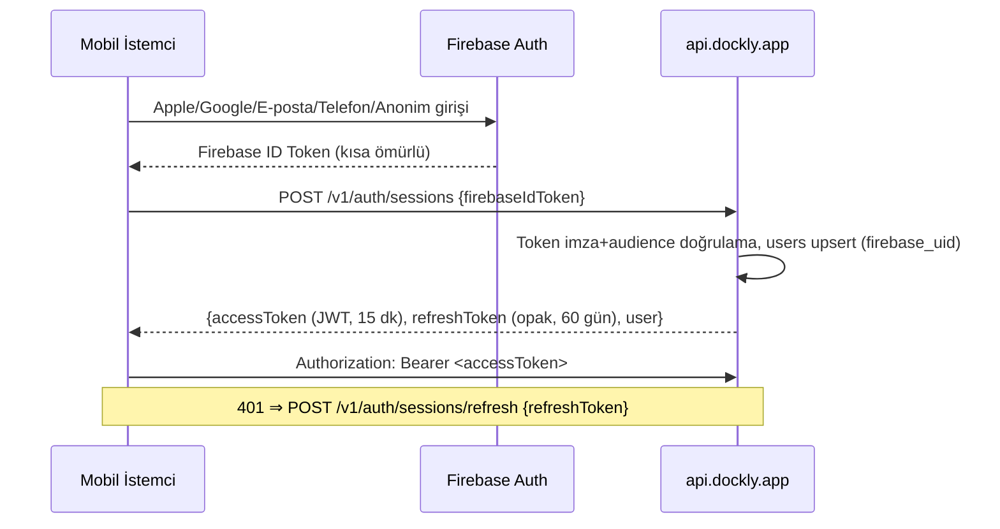
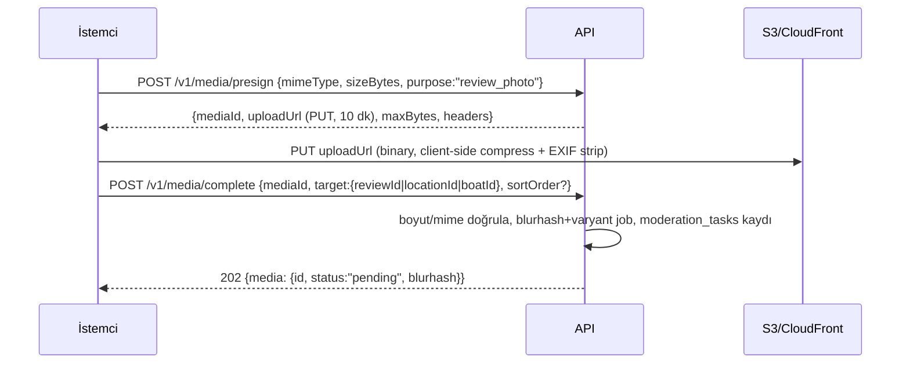

# Dockly — API Mimarisi (Lead API Architect / Principal Backend Architect Edition)

> **Girdi sözleşmeleri (değiştirilemez):** PRD (`01`), UX (`21`), Veri Modeli 🧊 **v2.0-FROZEN** (`22`). Bu doküman o üçüne sadıktır; onları değiştirmez. Kaynak adları, alanlar ve enum değerleri donmuş modelden türetilmiştir.
> **Statü:** v1.0-DRAFT → onaylandığında FROZEN olur ve DDL + OpenAPI üretimi başlar. Kod içermez; **sözleşme** içerir.

---

## 1. REST API Standartları

| Konu | Standart | Gerekçe |
|---|---|---|
| Stil | Kaynak odaklı REST, JSON | Mobil ekiple en düşük sürtünme; GraphQL v1 için reddedildi (tek istemci, sorgu esnekliği ihtiyacı düşük, cache/CDN REST'te bedava) |
| Base URL | `https://api.dockly.app/v1` | Tek gateway; Edge Functions + PostgREST iç detaydır, sözleşmeye sızmaz |
| JSON adlandırma | `camelCase` (DB `snake_case` → DTO katmanında eşlenir) | Dart/istemci konvansiyonu; DB adlandırması iç detaydır |
| ID'ler | UUID (v7), string olarak | Donmuş model §1.2 |
| Zaman | RFC 3339 / ISO-8601 UTC (`2026-07-06T14:30:00Z`); salt tarih alanları `YYYY-MM-DD` (`checkInOn`) | `_at`/`_on` ayrımı DTO'da da korunur |
| Para | `{ "amount": "1250.00", "currencyCode": "TRY" }` — string amount | float hatası yasak; v2 ödeme modülüne hazır |
| Ölçü | Metrik, alan adında birim: `lengthM`, `draftM`, `distanceNm` | Donmuş model §1.8 |
| HTTP metotları | GET (okuma, yan etkisiz) · POST (oluşturma/aksiyon) · PATCH (kısmi güncelleme, JSON Merge Patch RFC 7386) · PUT (idempotent upsert: favori, cihaz) · DELETE (soft delete tetikler) | PUT/DELETE idempotent — mobil retry güvenliği |
| Durum kodları | 200, 201 (+`Location` header), 202 (async moderasyon), 204, 304, 400, 401, 403, 404, 409, 410, 422, 429, 5xx | 422 = validasyon; 409 = durum çakışması (ör. iptal edilmiş talebi iptal etme) |
| Zarf yok | Liste yanıtları `{ "data": [...], "pagination": {...} }`; tekil yanıtlar çıplak nesne | Öngörülebilirlik; meta yalnız listede gerekir |
| Alan seçimi | `?fields=id,name,ratingAvg` (sparse fieldset, opsiyonel) | Harita gibi yüksek hacimli uçlarda bant genişliği |
| Boş/null | Alan yoksa `null` döner, gizlenmez; boş liste `[]` | İstemci tip güvenliği |
| İstek kimliği | Her yanıtta `X-Request-Id` (UUID) | Destek/log korelasyonu |
| Sıkıştırma | `br` > `gzip`; min 1 KB | Mobil veri tasarrufu |

## 2. API Versiyonlama Stratejisi
- **Major:** URI'de (`/v1`, `/v2`). Kırıcı değişiklik = yeni major; `/v1` en az 24 ay yaşar.
- **Minor (kırıcı olmayan):** Aynı major içinde yalnız **eklemeli** değişiklik: yeni alan, yeni endpoint, yeni enum değeri. Sözleşme kuralı: *istemciler bilinmeyen alanları ve enum değerlerini yok saymak zorundadır* (donmuş modeldeki lookup büyüme stratejisiyle uyumlu — yeni `locationType` istemciyi kırmaz, bilinmeyen tip `other` ikonu ile çizilir).
- **Kullanımdan kaldırma:** `Deprecation: true` + `Sunset: <RFC3339>` + `Link: <migration-doc>; rel="deprecation"` başlıkları; store'daki eski uygulamalar için minimum 12 ay pencere + uygulama içi force-update mekanizması (bkz. `16-deployment`).
- Mobil gerçeği: web'in aksine istemciler yıllarca güncellenmez → *asla* alan anlamı değiştirilmez, alan silinmez; yanlış tasarlanan alan yenisiyle yan yana yaşar.

## 3. Authentication (JWT + Refresh + Apple + Google + Telefon + Misafir)

### 3.1 Akış — Federated kimlik Firebase'de, oturum Dockly'de

Gerekçe: Apple/Google/OTP karmaşası Firebase'e devredilir (çözülmüş problem); **yetkilendirme ve oturum ömrü Dockly kontrolündedir** — Firebase token'ı doğrudan API'ye taşınmaz, tek uçta değiştirilir. Böylece ileride Firebase'den çıkış (ör. kendi OTP'miz) istemci sözleşmesini değiştirmez.

### 3.2 Token sözleşmesi
| Token | Biçim | Ömür | Saklama (istemci) |
|---|---|---|---|
| Access | JWT (RS256, `kid` ile anahtar rotasyonu) | 15 dk | bellek |
| Refresh | Opak (DB'de hash'li, `identity.user_sessions`*) | 60 gün, **rotating**: her kullanımda yenisi verilir, eskisi iptal; yeniden kullanım tespiti → tüm aile iptal (token theft koruması) | Keychain/Keystore |

\* Donmuş modele tablo eklenmez; `user_sessions` refresh token deposu **identity şemasının işletim tablosu** olarak DDL fazında ADR-001 ile eklenecektir (model değişikliği değil, oturum altyapısı — donmuş içerik tablolarına dokunmaz).

JWT claims: `sub` (users.id) · `role` (roles.code) · `guest` (bool) · `locale` · `iat/exp/jti` · `ver` (token şema versiyonu). PII (e-posta/isim) claim'e **konmaz**.

### 3.3 Misafir modu
Firebase anonymous → normal oturum, `guest=true`. Misafir→kayıtlı: Firebase account-link ile `firebase_uid` sabit kalır; `POST /v1/auth/sessions` aynı `users` satırını yükseltir (`is_guest=false`) — cihazdaki favoriler `PUT /v1/favorites/{locationId}` upsert'leriyle taşınır (UX §soft-gate "niyet hatırlama" sözleşmesi).

### 3.4 Auth endpoint'leri
| Method | Path | Auth | Açıklama |
|---|---|---|---|
| POST | `/v1/auth/sessions` | Firebase ID token (body) | Oturum aç/üret (kayıt+giriş+misafir tek uç) |
| POST | `/v1/auth/sessions/refresh` | refresh token (body) | Rotating refresh |
| DELETE | `/v1/auth/sessions` | Bearer | Çıkış (refresh ailesi iptal) |
| DELETE | `/v1/auth/sessions/all` | Bearer | Tüm cihazlardan çıkış |

## 4. Authorization — Roller ve Yetkilendirme

### 4.1 Rol matrisi (roles lookup: `user < moderator < admin < super_admin`)
| Yetenek | anonim* | guest | user | moderator | admin | super_admin |
|---|---|---|---|---|---|---|
| Yayınlanmış lokasyon/yorum/foto okuma | ✅ | ✅ | ✅ | ✅ | ✅ | ✅ |
| Favori, son görüntülenen | — | cihazda | ✅ | ✅ | ✅ | ✅ |
| Yorum/foto/öneri/rapor yazma | — | ❌ (soft-gate) | ✅ | ✅ | ✅ | ✅ |
| Rezervasyon talebi | — | ❌ (soft-gate) | ✅ | ✅ | ✅ | ✅ |
| Moderasyon kararları (`/admin/moderation`) | — | — | — | ✅ | ✅ | ✅ |
| Lokasyon CRUD, talep işleme | — | — | — | — | ✅ | ✅ |
| Kullanıcı yönetimi, rol atama, ayarlar | — | — | — | — | — | ✅ |

\* Anonim (token'sız) erişim yalnız `GET /locations*` ve lookup uçlarına, agresif cache + düşük rate limit ile — derin bağlantı `dockly.app/l/{slug}` önizlemeleri için.

### 4.2 Uygulama katmanları
1. **Gateway:** JWT imza/exp kontrolü, rol → route eşlemesi (`/admin/*` ⇒ role ≥ moderator).
2. **RLS (savunma derinliği):** JWT claim'leri Postgres oturumuna geçer; `user_id = auth.uid()` sahiplik politikaları (`boats.owner_user_id`, `reservation_requests.user_id`...), `locations` yalnız `status='published' AND deleted_at IS NULL` anonim okumaya açık. API katmanı delinse bile veri sızmaz.
3. **Nesne düzeyi kural örnekleri:** Yorum sahibi kendi yorumunu PATCH/DELETE edebilir; moderator başkasınınkini yalnız `/admin/moderation` üzerinden karara bağlar (audit'e doğru aktörle düşmesi için).

## 5. Hata Yönetimi — RFC 9457 Problem Details (7807'nin halefi)
`Content-Type: application/problem+json`; her hata gövdesi:
```json
{
  "type": "https://api.dockly.app/problems/validation-error",
  "title": "Doğrulama hatası",
  "status": 422,
  "detail": "checkOutOn, checkInOn'dan sonra olmalıdır.",
  "instance": "/v1/reservation-requests",
  "requestId": "0197f3a2-...",
  "errors": [ { "field": "checkOutOn", "code": "date_order", "message": "Çıkış tarihi girişten sonra olmalı" } ]
}
```
`title/detail` istemcinin `Accept-Language`'ına göre yerelleşir; **`type` URI'si ve `errors[].code` makine sözleşmesidir** (istemci mesajı değil kodu eşler).

### Problem type kataloğu (çekirdek)
| type (…/problems/) | status | Ne zaman |
|---|---|---|
| `invalid-token` / `token-expired` | 401 | İmza/exp; istemci refresh dener |
| `guest-not-allowed` | 403 | Misafir yazma denemesi → istemci soft-gate açar (UX sözleşmesi) |
| `forbidden` | 403 | Rol/sahiplik ihlali |
| `not-found` | 404 | Kaynak yok *veya soft-deleted* (varlık sızdırılmaz) |
| `conflict-state` | 409 | Geçersiz durum geçişi (iptal edilmişi iptal) |
| `duplicate-review` | 409 | Aynı lokasyona ikinci aktif yorum (DB partial unique yansıması) |
| `validation-error` | 422 | Alan hataları `errors[]` ile |
| `rate-limited` | 429 | `Retry-After` header zorunlu |
| `payload-too-large` | 413 | Medya limiti |
| `internal` | 500 | Detay sızdırılmaz, `requestId` ile izlenir |

## 6. Rate Limiting
- Standart: draft **RateLimit header'ları** — her yanıtta `RateLimit-Limit`, `RateLimit-Remaining`, `RateLimit-Reset`; 429'da `Retry-After`.
- Anahtar: kimlikliyse `sub`, değilse IP; gateway'de token bucket (Redis/Upstash), rota sınıfına göre:

| Rota sınıfı | Limit (user) | Limit (anonim) | Gerekçe |
|---|---|---|---|
| `GET /locations*` (harita/arama) | 120/dk | 30/dk | Pan/zoom patlamalarını debounce'la birlikte karşılar |
| Yazma uçları (yorum, talep, öneri) | 20/dk + günlük tavan (ör. 10 talep/gün) | — | Spam/abuse |
| `POST /media/presign` | 30/saat | — | Depolama maliyeti |
| `/auth/*` | 10/dk/IP | 10/dk/IP | Credential stuffing |
| `/admin/*` | 300/dk | — | Panel verimliliği |

- Uygulama davranışı sözleşmesi: 429 alan istemci exponential backoff + jitter uygular; harita katmanı istekleri birleştirir.

## 7. Çoklu Dil (Accept-Language)
- İstek: `Accept-Language: tr` (BCP-47; `q` ağırlıkları desteklenir). Yanıt: `Content-Language` + `Vary: Accept-Language` (CDN doğru cache'ler).
- Çözüm zinciri (donmuş model §1.6): istenen locale `_i18n` → kaynak dil (ana tablo, TR) → `en`. Çevrilebilir alanlar DTO'da tek alan olarak döner (`name`, `description`) — istemci dil mantığı bilmez.
- Lookup sözlükleri (`/location-types`, `/amenities`...) yerelleşmiş `label` + sabit `code` döndürür; istemci **code**'a göre davranır, label'ı basar.
- Hata mesajları (§5) ve bildirim içerikleri aynı zincirle yerelleşir; kullanıcının kalıcı tercihi `users.locale` (push için kaynak).

---
## 8. Kaynak (Resource) Yapısı

Donmuş modelin şema→kaynak izdüşümü (URL'ler çoğul, kebab-case):

```
/v1
├── auth/sessions
├── users/me                        (profil + ayarlar + tercihler)
├── boats                           (kullanıcının tekneleri)
├── geo/countries · geo/admin-areas · geo/water-bodies
├── catalog: location-types · amenities · services · boat-types · engine-types · rating-dimensions
├── locations                       (süper-tip; harita/arama/nearby/detay)
│   ├── {id}/reviews
│   ├── {id}/media
│   └── {id}/reservation-requests → (yazma /reservation-requests altında)
├── reviews/{id} (+ /reactions)
├── media (presign/complete)
├── favorites · recently-viewed
├── reservation-requests
├── suggested-locations · location-reports
├── notifications · notification-preferences · devices
└── admin/… (ayrı yüzey, §14)
```

İlke: **URL hiyerarşisi sahiplik hiyerarşisidir** — yorum lokasyona aittir (`/locations/{id}/reviews` ile listelenir) ama kendi kimliğiyle de adreslenir (`/reviews/{id}`), derin bağlantı ve moderasyon bunu kullanır.

## 9. Sorgu Konvansiyonları

### 9.1 Cursor Pagination (tüm listelerde, offset YASAK)
`?limit=20&cursor=eyJ2IjoxLCJrIjpb...`
- Cursor **opak**tır: base64(imzalı `{v, k:[sıralama anahtarı değerleri], d}`); istemci içini yorumlayamaz — sıralama şeması değişse de eski cursor'lar `410 Gone` ile reddedilip baştan başlatılır.
- Yanıt: `"pagination": { "nextCursor": "…", "hasMore": true }` (önceki sayfa yok — mobil sonsuz scroll tek yönlüdür; gerekirse `prevCursor` eklemeli olarak gelir).
- Gerekçe: offset milyonuncu satırda `O(n)` tarar ve kayan veri altında satır atlar/tekrarlar; keyset sabit maliyetlidir (`22` §6'daki bileşik index'ler tam bunun için).

### 9.2 Filtreleme (locations)
Tekrarlı param = OR, farklı param = AND:
`?type=private_marina&type=municipal_marina&amenity=electricity&amenity=water&maxBoatLengthGte=12.4&maxDraftGte=1.9&priceTier=paid&is24h=true&ratingGte=4&waterBodyId=…&adminAreaId=…&openOn=2026-09-12`
- `amenity` semantiği: verilenlerin **hepsi** olmalı (filtre UX'i "aradıklarımın hepsi olsun" der).
- `maxBoatLengthGte=12.4` = "12.4 m tekne sığar" (locations.max_boat_length_m ≥ 12.4) — "Tekneme uygun" anahtarının sözleşmesi (S-08).
- `openOn`: opening_seasons + operating_hours kesişimi — "gittiğimde açık mı?" (PRD iyileştirme ③'ün API karşılığı).

### 9.3 Arama
`GET /v1/locations?q=gocek` — `search_text` (tsvector) + `pg_trgm` bulanık eşleşme; diakritik duyarsız (gocek=Göcek).
`GET /v1/search/suggest?q=goc&limit=10` — S-07 anlık arama ucu: karışık sonuç (lokasyon + bölge + koy + kategori), tip ayrımlı hafif DTO; 250ms debounce istemcide, sonuç CDN'de 60 sn cache'lenir.

### 9.4 Sıralama
`?sort=-ratingAvg,name` (çoklu anahtar, `-` = DESC). İzinli alanlar endpoint başına beyaz listedir: locations → `ratingAvg, reviewCount, createdAt, distance` (distance yalnız nearby/center bağlamında), reviews → `createdAt, helpfulCount, rating`. Varsayılanlar: arama → relevance, nearby → distance, ana ray'lar → bölüm tanımına göre (S-06).

### 9.5 Harita — Bounding Box
`GET /v1/locations?bbox=27.10,36.55,28.35,37.05&zoom=11&type=…` (`minLon,minLat,maxLon,maxLat`)
- `zoom < 12` ⇒ yanıt **cluster modu**: `{ "clusters": [{"position":…, "count": 34, "bbox":…}], "locations": [] }` — sunucu tarafı pre-aggregated clustering (`13-olceklenebilirlik` kararı); istemci cluster'a dokununca dönen `bbox` ile yeniden sorgular (S-06 kamera uçuşu).
- `zoom ≥ 12` ⇒ `LocationPin` DTO listesi (minimum alan seti).
- Kurallar: bbox alanı > 5°×5° ⇒ 422 (`bbox-too-large`); sonuç tavanı 500 pin, aşarsa `"truncated": true` + istemci zoom teşviki. Koordinat kuantalama (bbox %1 grid'e yuvarlanır) → CDN cache hit oranı artar.

### 9.6 Yakınımdakiler (nearby)
`GET /v1/locations/nearby?lat=36.75&lon=28.93&radiusNm=10&type=fuel_pier&limit=20`
- Sıralama her zaman mesafe; her öğede `distanceNm` (deniz mili — denizci birimi, PRD dili).
- PostGIS `ST_DWithin(geography)` + GIST; `radiusNm` tavanı 50 nm. "Yakındaki Marinalar" rayının (S-06) ucudur.

## 10. Endpoint Kataloğu (istemci yüzeyi)

| # | Method | Path | Auth | Açıklama |
|---|---|---|---|---|
| 1 | POST | `/auth/sessions` | Firebase token | Oturum aç (tüm sağlayıcılar + misafir) |
| 2 | POST | `/auth/sessions/refresh` | refresh | Token yenile (rotating) |
| 3 | DELETE | `/auth/sessions[/all]` | Bearer | Çıkış / tüm cihazlar |
| 4 | GET/PATCH | `/users/me` | Bearer | Profil+ayarlar oku/güncelle (JSON Merge Patch) |
| 5 | DELETE | `/users/me` | Bearer | Hesap silme (soft + anonimleştirme, 202) |
| 6 | GET | `/users/me/contributions` | Bearer | Katkı sayaçları/geçmişi (contribution_events) |
| 7 | GET/POST | `/boats` · GET/PATCH/DELETE `/boats/{id}` | Bearer | Tekne CRUD (owner-only, RLS) |
| 8 | GET | `/location-types`, `/amenities`, `/services`, `/boat-types`, `/engine-types`, `/rating-dimensions` | Anon | Lookup sözlükleri (yerelleşmiş, uzun cache) |
| 9 | GET | `/geo/countries`, `/geo/admin-areas?countryCode&level&parentId`, `/geo/water-bodies?q` | Anon | Coğrafya referansı |
| 10 | GET | `/locations` | Anon | bbox/filtre/arama/sıralama (§9) |
| 11 | GET | `/locations/nearby` | Anon | §9.6 |
| 12 | GET | `/locations/{idOrSlug}` | Anon | Detay (LocationDetail; slug derin bağlantı için) |
| 13 | GET | `/locations/{id}/media` | Anon | Galeri (approved; cursor) |
| 14 | GET | `/locations/{id}/reviews?sort&ratingEq&hasMedia` | Anon | Yorumlar + özet dağılım (`meta.ratingHistogram`) |
| 15 | GET | `/search/suggest?q` | Anon | Anlık arama (S-07) |
| 16 | GET | `/collections/home?lat&lon` | Anon/Bearer | S-06 kart rayları tek istekte: nearby/popular/topRated/new (+kimlikliyse recent/favorites) — 6 ayrı istek yerine 1 (mobil batching) |
| 17 | POST | `/locations/{id}/reviews` | user | Yorum+puan(+boyutlar) oluştur → 202, `pending` |
| 18 | PATCH/DELETE | `/reviews/{id}` | sahibi | Düzenle (yeniden moderasyona düşer) / soft delete |
| 19 | PUT/DELETE | `/reviews/{id}/reactions/helpful` | user | Faydalı işaretle/geri al (idempotent) |
| 20 | POST | `/media/presign` | user | Yükleme bileti (S3 presigned PUT) |
| 21 | POST | `/media/complete` | user | Yükleme onayı → 202 moderasyon; hedefe bağlama (locationId/reviewId/boatId) |
| 22 | GET | `/favorites` · PUT/DELETE `/favorites/{locationId}` | user | İdempotent favori (misafir birleşme upsert'i dahil) |
| 23 | GET/POST | `/recently-viewed` | user | Son görüntülenen (POST upsert) |
| 24 | GET/POST | `/reservation-requests` | user | Taleplerim / yeni talep (Idempotency-Key zorunlu) |
| 25 | GET | `/reservation-requests/{id}` | sahibi | Detay + `events[]` durum geçmişi (S-15 zaman çizelgesi) |
| 26 | POST | `/reservation-requests/{id}/cancel` | sahibi | İptal (→ `cancelled_by_user`; 409 kuralları) |
| 27 | POST | `/suggested-locations` | user | Yeni nokta önerisi (S-22) → 202 |
| 28 | POST | `/location-reports` | user | Hata bildirimi (S-23) |
| 29 | GET | `/notifications` · POST `/notifications/read` | user | Liste / toplu okundu (`{ids}` veya `{before}`) |
| 30 | GET/PUT | `/notification-preferences` | user | Tip×kanal matrisi |
| 31 | PUT/DELETE | `/devices/{fcmToken}` | Bearer | FCM kayıt (misafir dahil) |

## 11. DTO Sözleşmeleri (çekirdek)

### 11.1 `LocationPin` (harita — minimum bayt)
```json
{ "id": "0197…", "name": "D-Marin Göcek", "type": "private_marina",
  "position": { "lat": 36.7512, "lon": 28.9384 },
  "ratingAvg": 4.8, "priceTier": "paid" }
```

### 11.2 `LocationSummary` (kartlar/listeler)
Pin + `slug`, `coverMedia {url, blurhash}`, `ratingCount`, `city`, `waterBodyName`, `distanceNm?`, `amenityCodes[:6]`, `isFavorite?` (kimlikliyse).

### 11.3 `LocationDetail` (S-09)
```json
{
  "id": "…", "slug": "d-marin-gocek", "type": "private_marina", "status": "published",
  "name": "D-Marin Göcek", "description": "…",
  "position": {"lat":36.7512,"lon":28.9384},
  "geo": { "countryCode":"TR", "adminArea": {"id":"…","name":"Fethiye","province":"Muğla"},
           "waterBody": {"id":"…","name":"Göcek Körfezi","type":"gulf"} },
  "dimensions": { "maxBoatLengthM":40.0, "maxDraftM":5.0, "depthMinM":3.0, "depthMaxM":12.0, "capacity":380 },
  "priceTier":"paid", "is24h":true, "verifiedAt":"2026-08-01T…",
  "rating": { "avg":4.8, "count":214,
              "dimensions":[{"code":"shelter","avg":4.9},{"code":"staff","avg":4.7}] },
  "amenities":[{"code":"electricity","label":"Elektrik","category":"utility"}, …],
  "services":[{"code":"mooring_assist","label":"Palamar"}, …],
  "contacts":[{"type":"phone","value":"+90252…","isPrimary":true},{"type":"vhf","value":"72"}],
  "hours":[{"dayOfWeek":1,"opensAt":"08:00","closesAt":"22:00"}],
  "seasons":[{"opensOn":"05-01","closesOn":"10-31"}],
  "typeDetails": { "kind":"marina", "berthCount":380, "vhfChannel":"72",
                   "hasBlueFlag":true, "travelLiftCapacityTons":100.0 },
  "media": { "cover":{"url":"…","blurhash":"…"}, "count":24 },
  "userContext": { "isFavorite":true, "myBoatFit":{"lengthOk":true,"draftOk":true} },
  "counts": { "reviews":214, "photos":24 }
}
```
Kritik kararlar: **`typeDetails` discriminated union** (`kind`: marina/fuelDock/restaurantDock/anchorage — donmuş modelin alt-tip tabloları; anchorage'da `protectionN/S/E/W`, `holdingType` döner). **`userContext`** kimlikli isteklerde hesaplanır (S-09 "Teknene Uygunluk" bloğu sunucuda tek gerçek olarak), anonimde `null` — cache ayrımı için bu blok `Vary` edilmez, ayrı hafif uçtan da alınabilir (`?include=userContext`).

### 11.4 Review / ReservationRequest (özet)
`Review`: `id, user {id, displayName, avatar, boatTypeCode?}, rating, ratings[{code,score}], title, body, visitedOn, media[], helpfulCount, myReaction?, status*, createdAt` (*sahibine görünür).
`ReservationRequestCreate` (istek): `locationId, boatId?, boatName, boatLengthM, boatDraftM, checkInOn, checkOutOn, contactPhone, note?` — snapshot alanları istemciden **açık** gelir (tekne seçilince önden doldurulur ama düzenlenebilir; charter senaryosu, UX S-14).
`ReservationRequest` (yanıt): + `status, statusChangedAt, location {summary}, events[{fromStatus,toStatus,actorType,createdAt}]`.

---
## 12. Medya Yükleme Akışı (iki fazlı, S3 presigned)

Kararlar: binary asla API'den akmaz (maliyet+gecikme); `purpose` kota ve moderasyon sınıfını belirler; `complete` gelmeyen presign 24 saatte çöp toplanır; varyantlar (thumb/medium/full, WebP) asenkron üretilir ve DTO'larda `url` her zaman varyant CDN URL'idir; **EXIF GPS sunucuda da silinir** (kullanıcı mahremiyeti — evinin koordinatı fotoğrafta gitmesin).

## 13. Alt Sistem Sözleşmeleri
- **Yorum (17-19):** oluşturma 202 + `pending` döner; istemci "moderasyonda" rozetiyle iyimser gösterir (UX S-12). Onay/ret `moderation_result` bildirimiyle kapanır. `duplicate-review` 409'u istemciyi düzenleme moduna yönlendirir.
- **Favoriler (22):** `PUT` idempotent — çevrimdışı kuyruklanan tekrar denemeler güvenli; yanıt `204`. Toplu senkron (misafir birleşmesi): art arda PUT'lar; sunucu `created_at`'i korur.
- **Rezervasyon talebi (24-26):** `POST` **`Idempotency-Key` header'ı zorunlu** (çift dokunuş/retry çift talep yaratamaz; anahtar 24 saat saklanır, aynı anahtar aynı yanıtı döner). Durum makinesi geçişleri yalnız sunucuda; istemci `events[]`'i S-15 zaman çizelgesine basar. Kurallar: aktif (pending/contacted) talep varken aynı lokasyon+tarih aralığına ikinci talep ⇒ 409 `duplicate-request`.
- **Bildirimler (29-31):** liste cursor'lı; `POST /notifications/read` toplu (`{before}` = "tümünü okundu"). Push data payload'ı `{type, deepLink:"dockly://reservation-requests/{id}"}` — S-21 derin bağlantı sözleşmesi. Cihaz kaydı `PUT /devices/{fcmToken}` idempotent, misafirde de çalışır (talep durumu misafire de push'lanabilir → hesap yükseltmede devralınır).

## 14. Admin ve Moderasyon API'leri (`/v1/admin/*`, role ≥ moderator; ayrı OpenAPI dosyası)
| Method | Path | Rol | Açıklama |
|---|---|---|---|
| GET | `/admin/moderation/tasks?entityType&status&assignedTo` | mod | Kuyruk (moderation_tasks; SLA alanlarıyla) |
| POST | `/admin/moderation/tasks/{id}/claim` · `/decide {decision, note}` | mod | Üstlen / karar (approve→varlık `approved` + contribution_event; reject→gerekçe bildirimi) |
| GET/POST | `/admin/locations` · GET/PATCH/DELETE `/admin/locations/{id}` | admin | Tam CRUD (draft→published yayın akışı; PATCH'ler audit'e diff'li düşer) |
| POST | `/admin/locations/{id}/publish` · `/archive` | admin | Durum geçişleri açık uçlarla (PATCH ile durum değiştirmek yasak — audit netliği) |
| GET/PATCH | `/admin/suggested-locations/{id}` + `/approve {locationDraft}` | mod | Öneri → lokasyon dönüşümü (created_location_id bağlanır) |
| GET/POST | `/admin/reservation-requests?status` · `{id}/transition {toStatus, note}` | admin | Ops talep işleme; geçişler reservation_request_events'e |
| GET/PATCH | `/admin/reports/{id}` | mod | Hata bildirimi çözümleme |
| GET/PATCH | `/admin/users?q&role&status` · `{id}` (suspend/role) | admin/super | Kullanıcı yönetimi (rol atama yalnız super_admin) |
| GET/PUT | `/admin/lookups/{amenities|services|location-types}` (+i18n) | admin | Sözlük yönetimi |
| GET | `/admin/stats/overview?from&to` | admin | Dashboard agregaları (A-01) |
| GET/PUT | `/admin/settings` | super | app_settings / feature flags |
| GET | `/admin/audit-logs?entityType&entityId&actor` | admin | Varlık geçmişi görüntüleme |

Admin yüzey farkları: sayfa bazlı meta zenginleştirme (`meta.totalCount` — ops küçük veri, COUNT kabul edilir), `status` filtreleri her durumu görür (istemci yüzeyi yalnız `published`/`approved` görür), her yazma `X-Admin-Reason` header'ı ile gerekçe alabilir (audit'e işlenir).

## 15. OpenAPI 3.1 / Swagger Tasarımı
- **Spec-first:** `api/openapi/dockly-v1.yaml` (istemci) + `dockly-admin-v1.yaml` — sözleşme koddan üretilmez, kod sözleşmeden doğrulanır (CI contract test: örnek istek/yanıtlar spec'e karşı valide edilir; Dart DTO'ları + Edge Function router iskeleti spec'ten üretilir).
- 3.1 nedenleri: tam JSON Schema uyumu → `typeDetails` discriminated union (`oneOf` + `discriminator: kind`), `examples`, webhook tanımları (v2 hazırlığı).
- Organizasyon: `tags` = kaynak grupları; `components/schemas` DTO adlarıyla birebir (`LocationDetail`, `Problem`, `Pagination`); tüm hatalar `Problem` şemasına `$ref`; güvenlik şeması `bearerAuth (JWT)`.
- Yayın: dahili geliştirici portalında Swagger UI + Redoc (staging'de canlı "try it"); spec dosyası API versiyonuyla tag'lenir.

## 16. Güvenlik (OWASP API Top-10 eşlemesi)
| Risk | Önlem |
|---|---|
| BOLA (nesne yetkisi) | Sahiplik her katmanda: gateway kural + RLS (`user_id=auth.uid()`); ID tahmini UUIDv7 + 404 (varlık sızdırmaz) |
| Broken auth | §3: kısa access, rotating refresh + reuse detection, RS256 anahtar rotasyonu (`kid`), Firebase audience pinning |
| Aşırı veri ifşası | DTO beyaz listeleri (asla `SELECT *` yansıması); `status` sahibi olmayan yanıtlarda yok; PII yalnız `/users/me` |
| Kaynak tüketimi | §6 rate limit + bbox/radius/limit tavanları + medya boyut/mime kısıtı + istek gövdesi ≤ 1 MB |
| SSRF/injection | Parametrik sorgular, URL alan doğrulaması (website http/https), tsvector/trgm aramada raw SQL yok |
| Toplu atama | PATCH alan beyaz listesi (role, status, rating_avg gibi alanlar istemciden asla) |
| Loglama eksikliği | §18 + auth olayları (başarısız giriş, refresh reuse) güvenlik kanalına |
| TLS | TLS 1.2+ zorunlu, HSTS; mobilde certificate pinning (`12-guvenlik` kararıyla uyumlu) |

## 17. Performans ve Cache Stratejisi
**Hedefler (14-performans ile hizalı):** p50 < 120ms, p95 < 400ms (gateway ölçümü); harita bbox p95 < 250ms.
| Katman | Politika |
|---|---|
| CDN (CloudFront) | Anonim GET'ler: lookup'lar `max-age=86400, s-maxage=604800, stale-while-revalidate`; `search/suggest` 60s; bbox (kuantalanmış, §9.5) 120s + SWR; detay 300s, yayın/moderasyon olaylarında path invalidation |
| HTTP doğrulama | Tüm GET'lerde `ETag` (içerik hash) → `304`; mobil Drift cache'i `If-None-Match` ile tazelenir (offline-first sözleşmesi) |
| Kimlikli yanıtlar | `Cache-Control: private, no-store` varsayılan; `userContext` ayrıştırması (§11.3) sayesinde detay gövdesi anonim cache'ten gelir + kişisel blok ayrı hafif istekle birleşir |
| Uygulama içi | Rating/histogram agregaları DB cache kolonlarından (donmuş model §7 trigger'ları) — okuma yolunda COUNT yok |
| DB | Keyset+partial+GIST index sözleşmesi (`22` §6); bbox sorgu planı EXPLAIN bütçesi CI'da regresyon testi |
| Payload | `LocationPin` ≤ ~120 bayt/öğe hedefi; br sıkıştırma; `fields` sparse fieldset; `collections/home` ile istek birleştirme |

## 18. Logging & Monitoring
- **Log biçimi:** JSON structured — `ts, level, requestId, route, method, status, durationMs, sub (hash'li), role, ip (trunc /24), userAgent, problemType?`; gövde/PII loglanmaz (KVKK). `requestId` yanıt header'ı = destek bileti korelasyonu; `audit_logs` (iş katmanı) ile `request_id` üzerinden bağlanır.
- **Metrikler (RED):** rota bazında rate/error/duration histogramları; iş metrikleri: talep oluşturma oranı, moderasyon SLA (pending yaşı), arama boş-sonuç oranı (veri boşluğu sinyali → veri ops beslemesi).
- **SLO'lar:** availability 99.9%/ay (istemci yüzeyi), p95 < 400ms; error budget yakımında release freeze (`16-deployment` kuralı).
- **Alarmlar:** 5xx oranı > %1 (5 dk), auth hata patlaması (credential stuffing), 429 anomalisi, moderasyon kuyruğu yaşı > 24s, Sentry release-health.
- **İzleme dağılımı:** Sentry (hata+trace), Supabase/pg metrics (yavaş sorgu, index kullanımı), CloudWatch (S3/CDN), uptime probe (synthetic bbox sorgusu — gerçek kullanıcı yolu).

## 19. Genişleme Noktaları (AI · Ödeme · Hava Durumu · Rota · +)
Kural: yeni modül = **yeni kaynak kökü + yeni tag + eklemeli DTO alanları**; mevcut uç davranışı değişmez (bkz. donmuş model §8 ile birebir eşleşir).
| Modül | API izdüşümü | v1'de atılmış temel |
|---|---|---|
| Canlı rezervasyon | `/locations/{id}/availability`, `POST /reservations` (request'ten dönüşüm: `requestId` bağı) | Talep/rezervasyon ayrımı, durum makinesi + events deseni, Idempotency-Key altyapısı |
| Online ödeme | `/payments`, `/payment-intents` + **webhooks** (`payment.succeeded`) — OpenAPI 3.1 webhook tanımları hazır | Para DTO standardı (§1), 202+async desen |
| AI önerileri | `/recommendations/home`, `/recommendations/similar/{locationId}` | `collections/home` zaten öneri-şekilli — AI arkada değişir, sözleşme sabit kalır (istemci güncellemesi gerekmez) |
| Hava durumu | `/weather?lat&lon&at` (TTL'li proxy, ayrı rate sınıfı) | nav şeması izolasyonu; harita katmanı plugin sözleşmesi (02 §MapLayer) |
| Rota planlama | `/routes` CRUD + `/routes/{id}/waypoints` | PostGIS LineString; `distanceNm` birim standardı |
| AIS/Garmin | `/integrations/{provider}/link`, veri okuma uçları | `integration_accounts` planı; OAuth bağlama deseni auth köprüsüyle aynı |
| Premium | `/subscriptions`; yanıtlarda eklemeli `entitlements[]` claim'i | JWT `ver` alanı — claim şeması evrilebilir |
| Çoklu para/dil | Mevcut `Accept-Language` + para DTO'su otomatik taşır | — |
| API erişim yönetimi (3P) | `/partner/v1` ayrı yüzey + API key + scope'lar | Gateway katmanı; istemci sözleşmesi etkilenmez |

## 20. Onay Kapısı
Bu sözleşme onaylandığında: (1) OpenAPI 3.1 dosyaları yazılır, (2) DDL/migration üretimi başlar (`22` §10 sırası), (3) Dart DTO codegen + contract test CI'a bağlanır. Değişiklik yönetimi: FROZEN sonrası ADR + PR.

*Doküman sonu — 23-api-mimarisi.md · Lead API Architect & Principal Backend Architect · 6 Temmuz 2026.*
